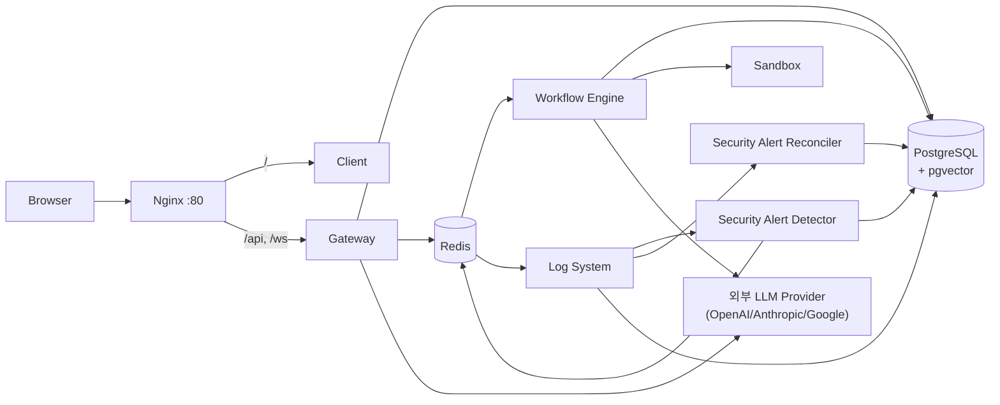

# Architecture

Status: Draft
시스템 구조, 인증 방식, 배포 구조, 외부 연동을 정의한다. 권한/감사 결정의 근거는 [decisions/](decisions/README.md)의 ADR을 따르고, 테이블 상세는 [data_model.md](data_model.md)를 따른다. 여러 도메인에 걸친 business lifecycle, retention과 비동기 작업 소유권은 [operational_lifecycle.md](operational_lifecycle.md)에서 함께 비교한다.

## 1. 시스템 구조

### 논리 서비스

| 구성요소 | 위치 | 책임 |
| --- | --- | --- |
| Client | `apps/client/` | Next.js. Workflow 편집, 설정, RBAC/observability UI |
| Gateway | `apps/gateway/` | FastAPI. 인증된 API 진입점과 resource permission enforcement 경계 |
| Workflow Engine | `apps/workflow_engine/` | Celery worker. Workflow 실행과 node runtime |
| Log System | `apps/log_system/` | Celery worker. audit outbox 전달과 trace/log 계열 비동기 처리 |
| Sandbox | `apps/sandbox/` | NSJail 기반 격리 코드 실행 |
| Shared | `apps/shared/` | DB model, schema, 공통 service(permissions, llm_client, tracing/audit) |
| PostgreSQL | 컨테이너/chart | pgvector 포함 영속 저장소 |
| Redis | 컨테이너/chart | Celery broker/result, Pub/Sub, Accepted target의 fail-open 내부 cache. ADR-0063의 Agent Builder intent cache는 현재 미구현이고 feature flag 기본 비활성이며 cache 전용 URL이 없을 때 Celery Redis로 자동 fallback하지 않는다. `NODE_ENV=production|staging` serving은 전용 URL, HMAC/bounded config와 외부 운영 evidence 확인 후 운영자가 설정한 readiness attestation을 요구한다. 런타임은 별도 evidence 저장소를 조회하지 않는다. 실제 instance/secret wiring/용량·eviction/장애·monitoring·rollback rollout은 후속 운영 범위다. |

Audit Outbox rollout 4에서 Shared `record_audit()`은 audit event id와 직렬화된 payload를 한 번 만들고 PostgreSQL `audit_event_outbox`에만 저장한다. 요청 경로에서 Redis/Celery `audit.record` 발행은 제거됐다. Caller DB session을 받은 producer는 business transaction에 row를 함께 추가하고, session이 없는 legacy producer는 짧은 독립 transaction을 사용한다. Log System worker는 Beat가 30초마다 깨우며 due row를 `FOR UPDATE SKIP LOCKED`로 lease한다. 같은 id의 `AuditLog`를 멱등 저장하고 Outbox 성공 상태와 한 transaction으로 commit하며, 실패는 최대 5회 재시도한 뒤 dead-letter 처리한다. 배포 전 이미 broker에 들어간 메시지를 소진하기 위한 `audit.record` consumer만 호환성 task로 유지한다.

다만 모든 audit가 비동기인 것은 아니다. 권한·membership·Security Alert lifecycle처럼 business mutation의 성공과 canonical audit의 동시 보존이 보안 계약인 경로는 같은 DB transaction에 `audit_logs` row를 직접 기록한다. 일반 event의 `audit_event_outbox`와 transaction-bound canonical audit은 서로 대체하는 구현이 아니라, 실패 원자성 요구가 다른 두 producer 계약이다. 비동기 notification이나 후속 분석 실패는 이미 commit된 보안 판단을 되돌리지 않는다.

Workflow 관련 audit는 JSONB correlation만 사용하지 않고 nullable indexed `workflow_run_id`/`workflow_node_run_id` FK로 실행 기록과 연결한다. 기존 metadata 값은 실제 참조 row가 확인된 경우에만 typed 컬럼으로 backfill하며 Run/NodeRun 삭제 시 AuditLog는 유지하고 FK만 NULL로 만든다.

관리자 AuditLog 목록은 `(occurred_at, id)` 인덱스와 opaque cursor를 사용해 깊은 OFFSET scan을 피한다. 필터와 organization scope는 cursor 조건보다 먼저 동일하게 적용한다.

Trace 목록은 App 소유권과 app/organization/global visibility policy를 먼저 해석하고, `WorkflowRun.app_id → Workflow.app_id → WorkflowDeployment.app_id` 우선순위로 결정한 대표 App이 허용된 WorkflowRun만 SQL `WHERE`에서 제한한 뒤 count와 pagination을 수행한다. 최대 5,000건을 가져와 Python에서 다시 버리는 목록 경로는 사용하지 않는다.

Password login abuse prevention은 [ADR-0047](decisions/ADR-0047-password-login-abuse-prevention-boundary.md)를 따른다. Gateway의 password login application use case가 credential adapter 앞에서 Redis admission port를 호출하고, adapter는 account, trusted source network, account+network의 versioned HMAC token-bucket을 하나의 Lua 실행으로 처리한다. Limited/unavailable request는 password 검증 전에 각각 generic `429`/fail-closed `503`으로 종료한다. Raw account/network identity와 fingerprint는 audit, metric과 log에 저장하지 않는다.

Security Alert MVP는 [ADR-0028](decisions/ADR-0028-security-alert-detection-and-lifecycle.md)의 architecture를 따른다. MBA-223의 audit normalization, MBA-211의 alert/evidence 영속 모델·lifecycle service, MBA-212의 실시간 detector와 PostgreSQL watermark 기반 reconciler, MBA-213의 관리자 API, MBA-214의 notification/client 표면이 구현됐다. Reconciliation은 Celery Beat에 60초 주기로 등록되고 한 실행에서 최대 100건을 처리하며, 로컬 개발 스크립트, Docker Compose와 Helm chart가 Worker와 분리된 singleton Beat 프로세스를 실행한다.

LLM credential 저장 암호화는 [ADR-0057](decisions/ADR-0057-llm-credential-at-rest-encryption-and-rotation.md)를 따른다. Shared config service가 versioned envelope의 encrypt/decrypt와 legacy 판정을 단독 소유하고 Gateway, Workflow Engine, RAG answer, embedding과 parser는 ORM ciphertext를 직접 해석하지 않는다. Gateway, Workflow Worker와 Knowledge Worker는 동일 keyring을 시작 시 검증하며 평문 backfill과 key rotation은 application 요청과 분리된 제한 batch 운영 경로가 수행한다.

Provider 실행 권한 경계는 [ADR-0064](decisions/ADR-0064-provider-execution-capability-boundary.md)와 [ADR-0066](decisions/ADR-0066-nested-llm-canonical-node-location.md), 호출 뒤 usage lifecycle은 [ADR-0069](decisions/ADR-0069-provider-usage-durable-ledger.md)을 따른다. LLM Credentials가 immutable deployment-version의 canonical `(container_path, node_id)` LLM location별 단일 active credential policy와 short-lived opaque capability를 소유하고, Workflow Runtime은 trusted execution control의 Loop path와 실제 prompt/output 요청량만 application `ProviderExecutionRuntime` port로 전달한다. Shared pure node-location domain이 Gateway graph preflight, policy snapshot 검증, WorkflowNode binding과 Runtime의 Loop-only traversal을 통일한다. WorkflowEngine composition root가 runtime과 `ProviderUsageRecorder`를 process-local dependency로 주입하며 graph·execution context·task payload에 직렬화하지 않는다. Runtime router는 server-owned strategy 선택만 담당하고 legacy/capability 구현을 import하지 않는다. Capability adapter만 Shared issue/admission command, current credential `use`, verified relation, policy·permission·provider-routing·pricing revision, credential materialization과 provider client 생성을 알고, legacy adapter는 기존 user-scoped selection만 담당한다. 두 strategy는 session을 provider 호출 전에 닫고 safe attribution과 invoke만 가진 opaque lease를 Node에 반환한다. Capability path의 usage recorder는 admission의 exact canonical location binding, 네 principal, canonical model과 immutable pricing/cap snapshot을 durable intent에 저장하고 `provider_started` commit 뒤에만 lease를 호출한다. 성공·명시적 zero-effect 실패·outcome unknown은 같은 operation으로 수렴하며, Log System reconciler가 stale started와 compatibility projection을 bounded batch로 조정한다. Canonical 비용은 legacy-only usage와 succeeded ledger를 중복 없이 합산하고 `llm_usage_logs`/WorkflowRun은 후속 projection으로 취급한다. Provider outbound는 [ADR-0067](decisions/ADR-0067-production-https-and-operation-bound-outbound.md)의 current server-owned endpoint, operation profile revision과 guarded transport를 사용한다. 이 fingerprint는 다른 adapter 이관이나 cluster proxy-only enforcement 완료를 뜻하지 않으며 legacy runtime activation은 MBA-320이 소유한다.

RAG query embedding은 [ADR-0071](decisions/ADR-0071-rag-query-embedding-provider-capability.md)을 따른다. LLM Credentials는 기존 capability aggregate의 `query_embedding` purpose와 deployment version/canonical node location/embedding model별 explicit credential policy를 소유한다. Workflow의 outer `QueryEmbeddingExecutionRuntime` application service는 권한을 통과한 후보를 immutable model binding으로 투영하고 distinct model별 inner provider port를 한 번씩 호출한다. Projection과 capability control session은 provider I/O 전에 닫고 query와 vector는 invocation-local로만 유지한다. Generation credential, execution user, owner 또는 organization default fallback은 허용하지 않는다. Target adapter는 ADR-0067의 guarded transport와 ADR-0069의 durable provider operation을 모두 사용한다. Query policy write는 purpose-aware Gateway/worker가 수렴할 때까지 server-owned mode로 기본 비활성화하며 일반 runtime/write activation, rollback과 legacy 제거는 MBA-320이 소유한다.

| 구성요소 | 위치 | 책임 |
| --- | --- | --- |
| Security Alert Audit Normalizer | audit producer와 shared contract | 탐지 대상 `permission.denied`의 검증된 organization provenance와 `policy.block`의 canonical `policy_reason`을 제공한다 |
| Security Alert Detector | Log System Celery task/application boundary | 저장된 eligible audit를 동일 rule evaluator로 실시간 평가하고 alert/evidence를 원자적으로 생성·갱신한다 |
| Security Alert Reconciler | Log System periodic Celery task | PostgreSQL watermark의 활성화 경계·batch generation과 processor별 audit receipt로 실시간 처리 누락과 late commit을 찾고, `(occurred_at, audit_log.id)` 순서로 최대 100건씩 commit하며 늦은 eligible audit 뒤의 최대 rule window 재평가를 batch 경계 너머까지 이어간다 |
| Security Alert Admin Service | Gateway application/service boundary | organization owner/manager 전용 alert 조회·상태 변경, safe evidence projection, lifecycle audit transaction을 제공한다 |
| Security Alert Notification Projection | Gateway/Client notification boundary | 영속 alert를 source of truth로 두고 Sidebar summary와 `notifications.changed` 재조회 신호를 제공한다 |

Knowledge 통합 목표 구조에서는 Gateway/Shared/Workflow Engine 경계에 다음 domain service를 둔다. 아래 항목은 현재 구현 컴포넌트 전체가 아니라 [ADR-0014](decisions/ADR-0014-knowledge-base-document-atom-and-collection-boundary.md), [ADR-0015](decisions/ADR-0015-knowledge-skill-context-routing-boundary.md), [ADR-0017](decisions/ADR-0017-knowledge-integration-provisional-implementation-baseline.md), [ADR-0020](decisions/ADR-0020-knowledge-mcp-incremental-sync-boundary.md), [ADR-0036](decisions/ADR-0036-knowledge-runtime-candidate-resolution.md), [ADR-0039](decisions/ADR-0039-knowledge-workflow-collection-routing-integration.md), [ADR-0048](decisions/ADR-0048-knowledge-collection-sync-execution-boundary.md), [ADR-0052](decisions/ADR-0052-knowledge-document-ingestion-durable-execution-boundary.md), [ADR-0070](decisions/ADR-0070-organization-detector-provider-and-pre-embedding-local-masking-boundary.md)의 target component다.

| 구성요소 | 책임 |
| --- | --- |
| Knowledge Source Connector | 외부/내부 source item과 source ACL을 adapter별로 수집한다. outbound network 접근은 중앙 guard를 통과한다. |
| Outbound operation registry / Guarded transport | LLM, Knowledge, Workflow 원격 파일과 Google 로그인 OAuth/Gmail/GitHub/Slack fixed-SaaS 호출의 operation별 method·HTTPS/443·timeout·크기·content type·redirect profile과 revision을 소유한다. 승인 origin 안의 path/query와 모든 DNS 결과를 network I/O 전에 확인한다. Development direct mode는 검증 주소로 dial해 peer 일치와 원래 hostname TLS를 확인하고, production external mode는 exact internal Squid endpoint만 dial하면서 origin DNS를 application과 proxy가 각각 검증한다. Password IMAP은 검증 IP를 Worker-only 143/993 CONNECT authority로 사용하고, external Connector DB/SSH는 별도 `3130` listener에 검증 IP와 배포 관리 포트만 전달한다. 두 경로 모두 원래 hostname의 TLS/SSH 의미를 유지하고 direct fallback하지 않는다. Provider별 path/body 검증, credential 선택, 응답 의미, idempotency와 business retry는 adapter/application이 담당한다 ([ADR-0031](decisions/ADR-0031-mail-credential-reference-boundary.md), [ADR-0067](decisions/ADR-0067-production-https-and-operation-bound-outbound.md), [ADR-0072](decisions/ADR-0072-outbound-proxy-only-network-enforcement.md)). |
| Connection Use Resolver | 현재 user-owned `connections`에서 opaque UUID를 execution subject와 함께 해석하고 `Connection.user_id == execution subject user_id`를 단일 query로 강제한다. Knowledge DB source 저장 경계와 실제 DB dial 직전 processor가 같은 resolver를 사용하며 missing/malformed/non-owner를 `resource.hidden`으로 fail-closed한다. 이 판정은 dial 시작 시점의 권한 스냅샷이며 runtime transaction/lock protocol은 MBA-302의 별도 책임이다. Organization-scoped Connection RBAC은 이 resolver가 추측하지 않는다. |
| Connection Runtime Snapshot Provider | 독립된 짧은 SQLAlchemy session에서 Connection owner를 재검증하고 adapter에 필요한 최소 credential configuration을 immutable in-memory DTO로 투영·복호화한다. Transaction과 session을 닫은 뒤에만 DB connector를 호출하며 ORM/encrypted storage shape를 processor에 전달하지 않는다 ([ADR-0053](decisions/ADR-0053-connection-transaction-and-lock-boundary.md)). |
| Connection Reference Lifecycle UoW | Connection reference 저장·교체·삭제를 owner row lock으로 직렬화한다. Reference writer는 Connection 다음 Document를 잠그고 최초 조회 revision을 재검증해 silent overwrite를 막는다. 전역 lock 순서는 `Connection -> KnowledgeBase -> Document/DocumentVersion`, wait 상한은 PostgreSQL local 2초이며 외부 network/storage/provider I/O를 lock transaction 안에서 호출하지 않는다. |
| Content Safety Gate / Parser Isolation Worker | 외부 source artifact를 redacted canonical text로 만들기 전 file type allowlist, active content 차단, archive cap, parser sandbox, malware/content scan hook을 평가한다. |
| Shared Privacy/Redaction Service | 순수 hard-baseline detector, versioned text/span contract, span 검증/union과 deterministic masking을 제공한다. Audit/Tracing과 Knowledge가 primitive를 공유하되 각 application lifecycle은 분리한다 ([ADR-0014](decisions/ADR-0014-knowledge-base-document-atom-and-collection-boundary.md), [ADR-0070](decisions/ADR-0070-organization-detector-provider-and-pre-embedding-local-masking-boundary.md)). |
| Effective Privacy Policy Resolver | Platform hard baseline, Organization base, 모든 explicitly bound Collection과 applicable source/KB stricter revision을 strongest union으로 합성하고 exact scope/Collection privacy/source/KB binding revision, compiled digest와 derived mode/action/provider를 finalization까지 고정한다. |
| Protected Raw Parser Egress | Network-disabled local parser를 기본으로 둔다. External parser는 Organization과 applicable source-managed source 또는 manual KB opt-in, exact raw-parser approval, server-owned `knowledge.parser.external_approved` profile/credential과 ADR-0067 public-address guarded transport readiness가 있을 때만 raw bytes를 승인된 public HTTPS parser에 제한 전송한다. Private raw parser는 별도 Accepted ADR과 dedicated isolation profile 전까지 지원하지 않으며 current LlamaParse credential `use`만으로 활성화하지 않는다. |
| Detector Egress Approval Resolver | Exact same-Organization provider/trust tier의 purpose, processor/ownership·endpoint/network boundary, residency/retention/no-training/no-secondary-use와 active/expiry/revoke를 immutable approval revision으로 평가한다. Private network/mTLS만으로 승인을 합성하지 않는다. |
| Organization Detector Provider Port / Adapter | Effective policy가 exact same-Organization revision으로 선택한 DLP/NER provider를 tier별 operation profile로 호출한다. External tier는 ADR-0067 public guard를 유지하고 private tier는 exact allowlist와 dedicated network isolation을 가진 별도 transport를 사용한다. Provider mode는 lifecycle/credential/revocation/approval/audit/network readiness 전 비활성이다. |
| Privacy Review Application / Decision Store | Provider 유무와 무관하게 exact pending candidate의 range-only 추가 masking과 approve/reject를 조율한다. Candidate를 덮어쓰지 않고 append-only decision, successor candidate 또는 generation review-state와 canonical audit를 원자 확정하며 submitted range/raw/span/digest를 저장하지 않는다. |
| Privacy Decision Manifest Store | Raw text와 exact span 없이 redacted candidate ref/revision, effective scoped policy snapshot/digest, baseline/provider/detector-approval/raw-parser/masking/normalization revision, exact global platform 및 same-Organization validity revision/epoch snapshot, organization-scoped keyed digest, segment coverage와 safe outcome을 보존한다. Approved exact candidate의 manifest만 canonical finalization에 사용한다. |
| Privacy Artifact Validity Resolver | Active/ready와 current privacy validity를 분리한다. Manifest의 exact global platform 및 same-Organization validity revision/monotonic epoch snapshot을 current 두 epoch와 대조해 retrieval prefilter/final evidence gate를 fail-closed한다. |
| Privacy Digest Key Ring | Provider/LLM credential과 분리된 protected master key version에서 Organization별 key를 domain-separated 파생하고 `privacy_digest_hmac_sha256_v1` provenance digest를 제공한다. Key material은 DB, provider wire와 observability sink에 저장하지 않는다. |
| Privacy Migration Coordinator | Change-controlled Organization allowlist, non-authoritative bounded staging, rollout coordination lock의 exact-set freeze와 enforcement epoch, DB-time cutoff 및 one-way cleanup receipt를 조율한다. |
| Knowledge Sync Scheduler / Worker | connector sync lease, cursor, retry, dead-letter, tombstone, outbox를 관리한다. |
| Knowledge Collection Sync Target Scanner | Gateway management projection/request와 Workflow Engine claim/finalize가 동일한 organization-scoped child eligibility 및 ordered membership topology revision을 계산한다. 현재는 단일 DB document인 document-level KB만 허용하고 DB target을 포함한 multi-document KB와 API/source-managed child는 fail-closed한다. |
| Knowledge Collection Sync Request Application | Gateway에서 active organization과 `sync`/`sync_manage`, canonical Manual Collection/source eligibility, idempotency/single-flight를 검증하고 per-target revision을 포함한 durable job snapshot/audit를 원자 저장한 뒤 job UUID만 Celery에 발행한다. |
| Knowledge Collection Sync Worker Application | Workflow Engine에서 fresh worker-start 권한 재검사, PostgreSQL lease, claim/finalize target-set 재검증, deterministic bounded DB target batch, original-total reconciliation, retry/partial/terminal 집계와 stale recovery를 수행한다. Item attempt는 outcome commit에서 한 번만 증가한다. Document adapter는 source read 전에 shared advisory lock과 per-target revision gate를 통과하고 canonical versioned finalizer로 active pointer를 교체한다. |
| Celery Beat Scheduler | Shared allowlisted periodic schedule을 singleton 프로세스로 실행해 Audit Outbox 배송, Security Alert reconciliation, due/stale KC sync recovery와 Knowledge document ingestion recovery를 각 전용 queue에 발행한다. Helm은 `Recreate` singleton Deployment를 사용해 rollout 중 중복 scheduler를 피한다. Production Knowledge worker가 활성화된 profile은 이 recovery scheduler도 반드시 활성화한다. |
| Knowledge Normalizer / Ingestion Pipeline | source item을 redacted canonical text와 document version artifact로 변환하고, indexing 성공 후 active version finalization을 수행한다. |
| Knowledge Document Ingestion Application | Gateway request에서 organization/KB/document를 잠그고 설정·queued Document projection·durable job을 한 transaction에 저장한다. Celery publish는 commit 뒤 job UUID만 전달하는 best-effort wake-up이다. |
| Knowledge Ingestion Worker | Gateway image의 parser/storage 의존성을 사용하고 `knowledge` queue만 소비한다. Current authorization, PostgreSQL claim/실제 DB wall-clock execution lease/heartbeat/fencing과 bounded dispatch lease를 가진 due recovery를 적용하며 active version swap과 job success를 같은 transaction에서 확정한다. 최초 claim, recovery, success와 failure transition은 `KnowledgeBase -> Document -> job` 잠금 순서를 공유하고 recovery는 잠긴 scope를 건너뛴다. Processor와 remote FILE egress failure는 계층을 통과해도 보존되는 allowlisted typed source reason으로 정규화한다. Chunk 준비 progress는 current job lease를 별도 짧은 조회로 확인한 뒤 99 이하로 발행하고 성공 commit 뒤에만 100을 알리며, 새 admission과 retry/terminal/recovery 전이 뒤 이전 attempt의 advisory Redis progress를 폐기한다. Unchanged no-op은 active ready version이 현재 Document를 소유할 때만 허용한다. Compose/Helm startup은 migration readiness 뒤에 열리며 LOCAL mode는 Gateway와 shared upload PVC를 사용한다. Provider-neutral Helm production reference는 bounded worker와 Beat를 함께 활성화하고 invalid capacity/worker-only render를 거부한다. Init/bootstep이 schema와 keyring을 fail-closed 확인하며, 실행 중에는 exact `knowledge@<pod-hostname>` Celery self-ping만 local readiness로 인정한다. Redis/control path 장애는 `Unready`로 표시하되 liveness restart loop를 만들지 않는다. Helm이 worker ServiceAccount 생성을 소유하면 참조 리소스를 함께 렌더링한다. |
| Knowledge Permission Helper | collection route 권한, KB `use`, source ACL freshness/requester authorization을 bulk 평가한다. Router, Builder, Workflow LLM node runtime은 permission row를 직접 조합하지 않는다. |
| Knowledge Administration Application | KB object/property authorization, owner migration/bootstrap, organization-scoped domain delegation, self-escalation policy, lifecycle와 transaction-bound audit를 조율한다. Domain 관리 권한은 KB content/Collection route에 합산하지 않는다 ([ADR-0034](decisions/ADR-0034-knowledge-delegated-administration-and-rbac-boundary.md)). |
| Workflow Runtime Knowledge Candidate Resolver | Shared pure policy와 Workflow Engine `runtime_retrieval` use case/port, PostgreSQL adapter로 direct KB와 명시 selected Collection을 current audience 기준 재평가한다. Invocation마다 `REPEATABLE READ, READ ONLY` snapshot을 사용하고 Gateway Builder resolver를 import하지 않는다. MBA-232가 resolver seam을 구현했고 MBA-233은 additive graph/Builder/preflight/LLM retrieval wiring을 연결한다 ([ADR-0036](decisions/ADR-0036-knowledge-runtime-candidate-resolution.md), [ADR-0039](decisions/ADR-0039-knowledge-workflow-collection-routing-integration.md)). |
| Workflow Knowledge Reference Service | Gateway editable-graph write에서 direct KB effective `use`/source gate와 selected Collection `route`를 current editor 기준으로 재검증한다. Collection child를 열거하거나 runtime capability를 발급하지 않고 graph/success audit transaction 앞에서 fail-closed한다. |
| Route-safe Collection Picker | active organization에서 active lifecycle이고 `sync_state != source_deleted`인 Collection 중 current editor가 `route` 가능한 UUID와 approved safe label만 Builder에 제공한다. Collection management projection이나 runtime resolver를 재사용하지 않는다. |
| Collection Router / Retrieval Orchestrator | 권한 helper가 허용한 safe candidate set에서 collection/KB를 선택하고, metadata-aware/hierarchical retrieval 결과를 merge/rerank한다. |
| Knowledge Skill Registry | Workflow Builder가 LLM node의 RAG 옵션을 구성할 때 사용할 provider-neutral Skill, version, visibility, freshness/eval 상태를 관리하는 target component다. Skill은 권한 source나 source of truth가 아니다. |
| Skill Context Loader | 후속 target component로, 빌더 단계에서 safe skill metadata와 필요한 checklist/body를 gate 통과 후 점진적으로 로드한다. MBA-145 Agent Builder MVP는 Knowledge Skill body/checklist를 prompt context로 직접 로드하지 않고 ADR-0017 기본 RAG option 후보와 KB safe metadata만 사용한다. Raw skill body, hidden source reference, raw source title/path/url은 Builder input으로 제공하지 않는다. |
| Source-of-Truth Catalog | 정책 문서, ADR/decision record, semantic definition, curated query corpus 같은 source tier와 safe reference를 관리하는 target component다. Retrieval에서는 authorized evidence 안의 ranking/tie-break/conflict hint로만 사용한다. |

Public Chatbot은 [ADR-0074](decisions/ADR-0074-public-chatbot-client-held-history.md)에 따라 Client가 bounded history를 매 요청에 전달하고 서버가 익명 transcript를 영구 저장하지 않는다. [ADR-0030](decisions/ADR-0030-memory-bounded-context.md)과 [ADR-0033](decisions/ADR-0033-conversation-memory-contract-completion.md)의 durable bounded context는 authenticated internal Chatbot 후속 구조이며 별도 network service가 아니라 Gateway와 Workflow Engine이 같은 domain/application contract를 사용하는 in-process bounded context다.

Agent Builder direct-edit 구조는 Accepted [ADR-0045](decisions/ADR-0045-agent-builder-direct-edit-parameter-guidance.md), supporting [ADR-0046](decisions/ADR-0046-agent-builder-graph-mutation-and-cas-save.md)과 생성 모드 authority인 [ADR-0054](decisions/ADR-0054-agent-builder-generation-modes.md)를 따른다. Agent Builder는 별도 network server가 아니라 Gateway 내부 bounded module이며 ADR-0022의 application/adapter/composition 방향을 적용한다.

| 구성요소 | 책임 |
| --- | --- |
| Agent Builder Application | intent plan, server-loaded workflow context, GraphMutation, parameter task와 typed Knowledge placement를 조정한다. 기본/명시 control source와 자연어 mode intent를 정해진 우선순위로 canonical mode에 정규화하고 결정론적 quick-generation eligibility, 명시적 guided 전환과 남은 설정 빠른 완료를 조정한다. Planner가 선택별 graph를 만들거나 권한·eligibility를 승인하지 않으며 Catalog template으로 selected/empty topology를 구성한다. FastAPI/SQLAlchemy/React Flow 타입에 의존하지 않는다. |
| Agent Builder DB Adapter | 기존 session/request를 조회·잠근다. Nullable session `protocol_version`은 null legacy와 `direct_edit_v1`을 구분하고, request `response_payload`는 monotonic request/proposal/task version, requested/effective generation mode와 source, transition/proposal 상태, operations를 제외한 safe operation envelope와 idempotency result를 보존한다. `AgentBuilderRequest`를 task, Knowledge resolution, proposal와 envelope의 aggregate root로 취급해 terminal parent 아래 pending child가 남지 않게 원자적으로 닫는다. Session은 foreground request를 최대 하나만 허용하고 비차단 `parameter_configuration` request는 request별 history/card로 보존한다. Proposal은 `Workflow -> AgentBuilderRequest` lock 아래 대상 task version을 fencing하고 값 대신 fingerprint와 graph hash/`updated_at`만 저장한다. Session-scoped cancel 재시도는 응답 전 `planning` request보다 persisted operation result를 먼저 조회한다. Full typed operations와 parameter 값은 저장하지 않는다. JSONB는 새 전체 객체를 재할당하고 task decision과 mode transition은 request row lock, operation id와 expected version으로 직렬화한다. 신규 Agent Builder table이나 encrypted operation store는 만들지 않는다. 신규 direct-edit session에는 `direct_edit_v1`을 기록하고 null legacy row는 backfill하지 않는다. |
| Agent Builder Intent Service | 기존 permission-aware LLM client로 자연어를 정상 한 번 구조화하고 schema-valid semantic 모순에만 최대 한 번 repair한다. Usage attribution은 실제로 허용된 provider attempt를 관찰·기록할 뿐 schema repair나 추가 호출을 활성화하지 않는다. 취소 전에 시작된 attempt의 billing fact는 완료할 수 있지만 다음 repair attempt 전에 request version/status를 재검증한다. Parameter 값과 credential 원문을 받지 않으며 parameter/Knowledge/task 이동에는 호출되지 않는다. |
| Agent Builder Intent Plan Cache | **Accepted target, 현재 미구현이며 feature flag 기본 비활성.** `AgentBuilderService`의 비절단 transient safe context에서 결정적으로 정규화 가능한 요청의 cache-safe typed intent plan만 Redis에 짧은 TTL로 저장하며 graph, UUID, operation, credential, parameter 값과 Knowledge handle은 저장하지 않는다. Hit에도 현재 model/credential 권한, target, Knowledge 후보, Catalog validation과 GraphMutation/CAS/acknowledgement를 다시 수행한다. Redis 오류와 version mismatch는 audit replay가 아니라 기존 Planner 경로로 fail-open한다. Cancellation-aware bounded single-flight와 process-wide waiter cap을 사용하며 구현·필수 검증 전에는 기존 Planner 경로만 활성 계약이다 ([ADR-0063](decisions/ADR-0063-agent-builder-deterministic-intent-plan-cache.md)). |
| Agent Builder Intent Usage Recorder | Provider 호출 전에 실제 runtime의 model/credential과 request/session/App primary 귀속을 검증하고 session/request/attempt partial unique key의 `pending` 행을 확보해 ID와 가격을 고정한다. 응답 뒤에는 raw content/choices를 넘기지 않고 분리한 token usage와 latency로 같은 행만 `success`로 완료한다. 호출 실패나 usage 누락은 pending 행을 정리하고, 호출 중 설정 변경·삭제는 이미 확보한 행의 완료를 막지 않는다. 완료 저장 실패는 provider 재호출 없이 안전하게 종료하며 집계는 success 행만 포함한다 ([ADR-0055](decisions/ADR-0055-agent-builder-intent-usage-attribution.md)). |
| Agent Builder Composition | Gateway endpoint에서 application과 concrete DB/intent/audit dependency를 조립한다. 기존 `AgentBuilderService`는 전환 기간 facade로만 유지한다. |
| Workflow Draft CAS Service | Agent Builder mutation save와 persisted revert에서 workflow row를 write lock으로 읽고 current graph hash와 `updated_at`을 기대값과 비교한다. Apply candidate hash는 persisted safe envelope의 `expected_result_graph_hash`와 비교하며 DB에서 full operations를 재생하지 않는다. Final graph의 모든 resource-bearing field를 managed reference, 변경 없는 `legacy_editor_connection`, unknown으로 분류한다. Server policy registry는 field·operation·resource별 최소 permission action과 resolver를 정하며, workflow 저장은 workflow `write`, Knowledge/Collection·managed credential binding은 대상 `use`를 검사한다. 단순 reference에 대상 `read|write`를 일괄 요구하지 않고 policy/resolver 누락은 차단한다. Resolver 미구현 Slack/GitHub 연결은 base graph와 connection-relevant 값이 같은 carry-forward만 허용하며 신규·변경·unknown은 차단한다. 권한·catalog·graph validation 뒤 graph write와 기존 `add_action_audit` insert를 같은 transaction에 저장하고 canonical graph hash/`updated_at`을 반환한다. 일반 editor save 호환성은 유지한다. |
| Workflow Editor Adapter | 최초 구조 mutation에서 Agent Builder 시작 전/final graph를 묶는 Workflow history boundary 하나를 만들고 해당 transaction 중 autosync를 억제한다. Quick mode는 실제 editor와 분리된 clone에 mutation을 dry-run하고 명시적 `생성 적용` 뒤에만 같은 history/CAS 경계에 반영한다. 후속 parameter/Knowledge mutation은 별도 history entry를 만들지 않고 acknowledgement된 final snapshot/hash만 갱신한다. 완료 첫 Undo는 마지막 parameter UI 재진입, 다음 Undo는 시작 전 snapshot CAS 복구와 전체 task/Knowledge cancel이다. Parameter 이동은 `이전 항목` control을 사용한다. Redo history는 client memory에만 유지하며 reload 전 Redo만 final graph를 CAS 저장하고 canceled 흐름은 재실행하지 않는다. |
| Workflow Run/Deployment Preflight | Catalog required configuration 전체에서 node `configuration_state`를 서버가 다시 계산하고 unresolved 외부 action node의 실행·배포를 차단한다. 같은 계산은 생성, parameter 변경, skip, Undo와 복구에도 사용한다. 편집·저장은 허용하며 preflight는 외부 API를 호출하지 않는다. |

Direct-edit protocol은 MBA-228의 단일 기능 PR에서 nullable `AgentBuilderSession.protocol_version` additive migration과 null/`direct_edit_v1` mixed read로 전환한다. 신규 session은 `direct_edit_v1`을 기록하고 기존 null Preview session은 backfill이나 자동 변환 없이 `stale_protocol`로 닫는다. Preview API/UI는 direct-edit parity와 필수 integration/E2E 검증을 통과한 뒤 제거한다. Frontend와 Gateway의 서로 다른 revision을 함께 운영하는 무중단 전환, staged rollout/rollback, 배포 gate와 image artifact 정책은 별도 배포 설계가 소유한다.

현재 구현의 generation mode 계약은 `configure_and_generate`(default)와 `structure_only` 두 값이다. ADR-0054의 목표 계약은 `guided_generate`, `quick_generate`, `structure_only`이며 기본값은 `guided_generate`다. 전환 기간에는 negotiated transport 계약으로 기존 `configure_and_generate`를 guided mode로 정규화하되, 내부 도메인·DB·audit에는 canonical mode만 사용한다. 새 request에는 정규화된 representation contract를 기존 request metadata에 고정해 request별 quick 상태를 legacy 표현으로 임의 projection하지 않으며, legacy-v1은 자연어 quick 의도를 활성화하지 않는다. Rollback은 canonical request 생성을 차단하고 foreground 및 open configuration을 포함한 canonical nonterminal request를 drain한 뒤 legacy-write로 전환할 수 있지만, 보존 기간 내 terminal canonical history까지 0건이 되기 전에는 Gateway dual-contract와 Client dual-read를 유지한다. Quick mode도 별도 preview store를 만들지 않고 full operations를 일회성 응답으로만 전달하며, credential·권한 resource·일반 required configuration 값 부재·외부 부수효과·Condition/HTTP/code/egress·복수 후보가 남으면 graph를 변경하지 않은 채 명시적 guided 전환을 요구한다. 전환 복구에는 실제 parameter 값을 저장하지 않고 safe step/key만 남겨 typed task 재입력을 요구한다. Guided 진행 중 `남은 설정 빠르게 완료`는 완료된 graph/task를 보존하고 미완료 task만 재평가하는 application command이며 전체 planner를 다시 실행하지 않는다. Proposal 생성·acknowledge는 workflow와 request를 같은 lock 순서로 직렬화하고 실제 값 없이 fingerprint와 graph revision만 보존한다. `parameter_configuration` request는 비차단 open 상태로 설정 card를 유지하며 새 foreground request와 공존한다. Cancellation-only 경로는 원 소유자의 권한 회수 뒤에도 safe terminalization만 허용하고 graph 접근은 허용하지 않는다. 모든 GraphMutation의 CDS CAS 저장은 final graph의 resource-bearing field를 서버가 다시 추출·분류한다. Managed reference는 policy registry가 정한 최소 permission action으로 현재 권한·lifecycle·relation을 검증하고, resolver 미구현 Slack/GitHub 연결은 base graph와 connection-relevant 값이 같은 불변 carry-forward만 허용한다. 현재 코드의 두 legacy mode에서 목표 계약으로의 전환은 후속 구현과 mixed-version 배포 gate가 소유한다.

| 구성요소 | 책임 |
| --- | --- |
| Public Chat History Boundary | Embed Client가 완료된 최근 20 turn을 React memory에서 구성한다. Gateway는 shape/byte/token을 검증하고 오래된 완료 pair를 제거하며, Worker는 client-forged role을 untrusted data block으로 처리한다. Public run/node/trace에는 content를 저장하지 않는다. |
| Memory Domain/Application (Authenticated Internal Target) | 로그인 subject와 organization/deployment scope에 고정된 Conversation Session, Turn, entry, summary, dependency, lifecycle과 retention policy의 단일 업무 mutation owner |
| Turn Dispatch Job/Dispatcher (Authenticated Internal Target) | StartTurn과 원자적으로 저장된 durable dispatch를 application command로 claim/publish/reconcile하고 Gateway crash, broker ambiguity와 Workflow admission acknowledgement 유실을 복구 |
| Memory Persistence Adapter (Authenticated Internal Target) | Memory-owned aggregate/revision/outbox를 PostgreSQL에 저장한다. 다른 production module의 Memory table 직접 mutation을 허용하지 않는다. 기존 Public Access Grant/lifecycle adapter는 dormant foundation이며 active route에 연결하지 않는다. |
| Source Authorization Adapter (Authenticated Internal Target) | Knowledge/connector/subworkflow의 current decision과 principal-neutral authorization decision/resource/policy revision을 bulk contract로 변환 |
| Memory Provider Adapter (Authenticated Internal Target) | Reference-only materialization plan, LLM Credentials가 발급한 opaque `ProviderExecutionCapability` identity/revision에 binding된 provider attempt/lease claim, current authorization 재검증, raw bounded context materialization과 provider-start marker를 main provider 호출 직전에 결합 |
| Summary Process Adapter (Authenticated Internal Target) | Fenced generation lease, approved provider execution capability/egress, capability-bound budget reservation, provider usage와 reconciliation 조정 |

Workflow external effect 멱등성 목표 구조는 [ADR-0035](decisions/ADR-0035-external-effect-idempotency-boundary.md)을 따른다. 이는 별도 network service가 아니라 Workflow Engine 내부의 domain/application/adapter 경계다.

| 구성요소 | 책임 |
| --- | --- |
| Execution Identity Contract | Draft test, deployed/API/public/webhook, schedule, stream과 subworkflow가 공유하는 `execution_id` 생성·검증 규칙과 server-verified organization/app/workflow provenance를 제공. Compare A/B는 variant마다 별도 logical execution ID를 발급하고 각 variant retry에서 유지. Subworkflow는 ID를 유지하되 target resource provenance로 전환하고 server-owned WorkflowNode target binding으로 child deployment snapshot을 고정 |
| External Effect Domain | Stable node invocation identity, attempt lifecycle invariant, 외부 서비스 중복 방지와 결과 재사용 지원 수준, outcome/replay policy를 DB와 network 없이 판단 |
| External Effect Application | 독립된 짧은 DB session으로 durable attempt claim과 상태 전이를 조율한다. 유효한 claim 소유자가 있으면 lock 없는 제한적 조회로 terminal/만료를 기다린다. Terminal commit과 claim generation 검증이 성공한 뒤에만 최초 node output 또는 저장 result를 반환하고, duplicate delivery는 frozen provider/contract/input digest를 확인한 뒤 canonical JSON 65,536 bytes 이하 schema-compatible replay result를 반환하거나 safe typed external-effect error로 닫음 |
| External Effect Persistence Adapter | Operation 변경으로 새 row를 우회할 수 없는 stable effect slot unique, `workflow_node_effect_attempts` claim generation, lease, 구조 constraint, recovery query와 PostgreSQL concurrency를 구현 |
| External Provider Adapter | Server-derived logical node type과 canonical operation으로 versioned profile을 선택하고 두 지원 수준, key 전달 위치·형식·길이·보존 기간·duplicate 응답 의미·공식 근거를 구현한다. Fixed GitHub/Slack 호출은 Shared operation requester를 통해 network I/O를 수행하되 기존 effect ledger와 응답 projection을 유지한다. Generic HTTP mutation과 legacy `slack.http.request`는 provider replay `unknown`, result reuse `unavailable`이다. 전용 Slack API/Webhook은 provider replay `unknown`, safe result reuse `supported`이고 GitHub issue comment는 replay `unsupported`, result reuse `unavailable`이다. Generic HTTP `GET`과 GitHub `get_pr`는 기존 조회 경로를 유지한다. |
| Workflow Outbound HTTP Port / Guarded HTTPX Adapter | Generic HTTP provider와 concrete HTTP client를 application port로 분리한다. Shared `OutboundEgressGuard`가 모든 DNS 결과를 검사하고 custom httpcore backend가 검증 IP 목록에서 TCP connect 실패에만 순차 폴백한 뒤 request byte 전송 전에 현재 대상과 peer 일치를 확인한다. TLS SNI/hostname은 원래 host를 유지하고 redirect·environment proxy를 사용하지 않으며 bounded request/response와 safe failure phase를 제공한다 ([ADR-0050](decisions/ADR-0050-workflow-generic-http-egress-boundary.md)). |
| External Effect Key Provider | Provider replay `supported`와 `header|body` key transport에서만 전용 versioned HMAC key를 제공하고 과거 replayable attempt key version의 재생성 또는 fail-closed를 보장. `unsupported|unknown`에는 key를 생성·주입하지 않음 |
| External Effect Test Support | Fake provider는 replay `supported`의 중복·장애 구간을, fake adapter는 result reuse `supported/unavailable`을 검증하고 `unsupported/unknown` replay는 pure policy test가 검증. `apps/workflow_engine/tests/fakes/` 또는 integration support에만 두고 production composition과 환경 설정에서 참조 금지 |

### 구성도



### 요청 흐름

1. 모든 외부 요청은 Nginx 단일 진입점을 지나 Client(`/`) 또는 Gateway(`/api`, `/ws`)로 라우팅된다.
2. Gateway는 인증과 organization scope, resource permission을 판정한 뒤 동기 응답하거나 Celery task를 발행한다. Email/password login은 credential 검증 전에 shared Redis token-bucket admission을 통과해야 하며 trusted proxy가 아닌 peer의 forwarded address는 identity로 사용하지 않는다. Turn admission처럼 DB mutation과 task 발행 사이 유실을 허용할 수 없는 target flow는 직접 publish 대신 같은 transaction의 durable outbox/dispatch job을 사용한다.
3. Workflow 실행은 Workflow Engine이 수행하고, 실행 시 user/organization/workflow/run/node 식별자를 포함한 execution context를 전달받는다.
4. 일반 audit event의 Outbox 전달과 trace/log 후속 처리는 Log System worker가 비동기로 수행한다. 권한·보안 lifecycle mutation처럼 canonical audit까지 같은 commit에 포함해야 하는 경로는 Gateway 또는 해당 application service가 `audit_logs`를 transaction-bound로 기록하고, Log System은 그 business transaction의 source of truth가 아니다.
5. Security Alert flow는 audit 저장 성공 뒤 `security_alert.detect` task를 `log` queue에 발행한다. Detector는 eligible event를 평가하고 alert/evidence/`security_alert.detected` audit을 같은 transaction에 기록한다. Cooldown 종료 후 같은 활성 alert가 새 threshold를 충족하면 새 row 대신 episode count와 episode 시작 시각을 새 evidence와 함께 갱신한다. `security_alert.reconcile`은 migration이 만든 `security-alert-v1` watermark의 활성화 경계와 processor별 receipt 부재를 사용해 같은 evaluator와 idempotency key로 실시간 누락과 event-time cursor보다 과거인 late commit을 복구한다. 늦은 eligible audit를 발견하면 같은 organization·actor·action 범위에서 그 audit부터 최대 rule window 안의 receipt 보유 후속 audit도 다시 평가해 event-time threshold 결과를 복구하고 다른 organization·actor·action 범위와 window 밖 audit는 재평가하지 않는다. Reconciler는 `(occurred_at, audit_log.id)` 순서로 최대 100건만 읽고 성공한 batch의 receipt 발견·평가 generation과 event-time cursor를 Alert/evidence·notification Outbox 변경과 함께 commit한다. 실패한 batch는 모두 rollback하며 다음 retry 또는 1분 주기 실행이 남은 receipt 부재·stale generation 작업을 이어간다. Alert 생성·occurrence·episode 갱신과 lifecycle 변경은 `notifications.changed` Outbox도 같은 transaction에 기록한다. Log worker는 현재 active manager를 조회해 Redis channel에 at-least-once로 전달하고 실패를 최대 5회 재시도한 뒤 dead-letter 처리한다. Client는 payload를 상태로 쓰지 않고 summary와 열려 있는 list/detail을 영속 API에서 다시 조회하며 reconnect 뒤에도 같은 방식으로 누락을 복구한다.
6. Knowledge 자동 수집은 connector adapter가 직접 네트워크를 열지 않고 `OutboundEgressGuard` 또는 승인된 client/dialer factory를 통과한다. MCP/API source도 LLM 임의 tool-use가 아니라 server-side Knowledge Source Connector allowlist adapter로만 호출한다. Retrieval/Agent 요청은 collection routing scope와 KB permission helper/source ACL helper 결과로 만든 safe candidate set만 사용한다.
7. Public Chatbot은 Client가 전달한 완료 user/assistant history를 Gateway에서 20 turn/4,096 token으로 bound한 뒤 redacted Workflow task context로 전달한다. LLMNode는 이를 신뢰할 수 없는 대화 맥락으로 현재 prompt 앞에 삽입하고 legacy execution-log memory를 조회하지 않는다. WorkflowRun/NodeRun/Trace는 content-free metadata만 저장한다. Authenticated internal Chatbot의 durable admission/context lease/provider fence는 별도 후속 이슈에서 ADR-0030/0033 계약으로 연결한다.
8. 모든 Workflow 실행 표면의 최초 발행자 또는 직접 실행 조정자는 logical execution마다 `execution_id`를 한 번 발급하고 retry에서 유지한다. Compare A/B는 variant마다 서로 다른 ID를 사용한다. External effect node는 Loop/subworkflow invocation을 구분하는 immutable context를 받는다. Workflow Engine application use case는 시스템 key를 넣기 전 request/digest를 준비하고 durable attempt winner를 확정한 뒤, winner row의 frozen key로 최종 call을 만들어 `in_flight`를 commit한다. Provider 호출 전후 상태 변경마다 새 DB session을 사용하고 network I/O 중에는 session을 유지하지 않는다. 유효한 claim 소유자가 있으면 중복 Worker는 provider를 호출하지 않고 lock 없는 짧은 조회로 terminal/만료를 제한적으로 기다린다. 같은 logical execution 재진입은 자기 attempt의 만료된 `in_flight`를 결과 불명 상태와 재호출 판단으로 먼저 정리하며, 이 정리 단계는 provider나 workflow를 호출하지 않는다. 별도 주기적 recovery scheduler는 두지 않는다. Log System의 비동기 WorkflowRun/NodeRun row는 external effect correctness source가 아니다.

### Public Chatbot/Widget browser 경계

Public Chatbot과 Widget은 [ADR-0043](decisions/ADR-0043-deployment-browser-origin-and-embedding-boundary.md)를 따른다.

```text
External parent
  -> GET Client /embed/chat/{slug}
     -> Next proxy
        -> Gateway /deployments/public/{slug}/browser-access
        -> CSP frame-ancestors <deployment exact parents>
  -> Browser가 모든 ancestor를 허용/차단

Loaded Nodease iframe document
  -> relative /api/v1/deployments/public/{slug}/info
  -> relative /api/v1/run-public/{slug}/chat
  -> Next rewrite -> Gateway
```

- 외부 parent는 CSP 집행 대상이며 API principal/CORS grant가 아니다.
- iframe document는 Nodease first-party origin에서 relative API만 호출한다.
- External direct JavaScript public API는 V1에서 지원하지 않으며 public endpoint는 수동 wildcard CORS를 추가하지 않는다.
- `WorkflowDeployment.browser_access_policy`가 immutable parent policy를 소유한다. Missing/malformed policy와 projection 장애는 `frame-ancestors 'none'`이다.
- Next response boundary는 configured Gateway URL만 조회하며 request Origin/Referer/Host/query로 allowlist를 만들지 않는다.
- Public cookie는 execution subject를 만들지 않으며 `internal_chatbot`의 authenticated route/permission/CSRF와 이 경계를 공유하지 않는다.

### 경계 규칙

- Gateway endpoint는 얇게 유지한다. RBAC/audit/tracing 판정은 controller가 아니라 `apps/gateway/services/`, `apps/shared/services/`의 service/helper 경계에서 수행한다.
- Controller에서 DB를 직접 상세 조회해 권한을 판단하지 않는다.
- 공통 tracing/audit service가 trace 접근과 payload 처리의 경계다.
- `apps/shared/` 변경은 Gateway, Workflow Engine, Log System, Sandbox 전체에 영향을 준다.
- External effect node는 provider 호출 직전에 ADR-0035 application 경계를 통과한다. Node나 Celery task가 SQLAlchemy query, HMAC secret, 두 지원 수준과 replay 정책을 직접 조합하지 않는다. Provider adapter는 key-free `PreparedEffectRequest`, frozen key만 한 번 주입한 `PreparedProviderCall`과 invoke를 분리하며 invoke가 graph/input/template을 다시 읽지 않는다.
- `slackPostNode`는 [ADR-0037](decisions/ADR-0037-slack-dedicated-delivery-boundary.md)에 따라 Generic HTTP runtime과 분리된 전용 node/adapter를 사용한다. API mode는 `slack.chat.post_message`, Webhook mode는 `slack.incoming_webhook.post` profile을 선택한다. 과거 `slack.http.request.v1`은 기존 attempt 해석용으로만 유지하고 새 실행 profile로 선택하지 않는다.
- External effect invocation identity는 병렬 node가 공유하는 mutable execution context에 덮어쓰지 않는다. Node invocation별 immutable value를 사용하고 DB session을 context에 넣거나 병렬 node 사이에서 공유하지 않는다.
- 하나의 logical Workflow 실행에서는 최상위 `WorkflowEngine`만 `WorkflowRun` 생성·완료·실패와 최상위 Redis lifecycle event를 소유한다. Loop body와 WorkflowNode target child는 부모 `execution_id`와 `workflow_run_id` correlation을 유지하고 호출 위치별 invocation path를 사용하지만 부모 run을 terminal 상태로 바꾸거나 최상위 event를 발행하지 않는다. Child 결과·오류·timeout은 Loop/WorkflowNode container에 반환 또는 전파하고 root engine이 전체 graph 결과를 한 번만 기록한다. 내부 child node의 별도 durable trace 계층은 현재 만들지 않으며 container node log와 external-effect attempt의 invocation identity를 correlation 경계로 사용한다.
- External effect DB uniqueness는 `organization_id + execution_id + node_invocation_id + effect_sequence` stable slot을 사용한다. `operation`은 slot row에 고정해 mode/action 변경이 새 row를 만들지 못하게 하며, 불일치는 provider와 downstream 호출 전에 identity conflict로 닫는다.
- Retry 또는 duplicate delivery에서 `execution_id`가 누락되면 새 값을 보충하지 않고 provider 호출 전에 fail-closed한다. Subworkflow는 부모 execution ID를 유지하고 별도 node invocation ID로 호출 위치를 구분한다. Gateway가 배포 snapshot 또는 최초 draft 실행 command에 server-owned target deployment ID/version/snapshot-hash binding을 넣고 Runtime이 이를 재검증해, parent retry가 현재 active child deployment로 바뀌지 않게 한다. Binding 생성은 current active target만 허용한다. 소비 시 새 child 활성화로 bound row가 자동 비활성화돼도 ID/provenance/type/version/hash가 맞으면 과거 row를 쓰고 pointer 일치나 현재 graph 대체를 요구하지 않지만, app active pointer가 null이거나 유효한 same-app active row가 아닌 전체 비활성/불일치 kill switch는 존중한다. Client 입력과 clone/template/import 같은 graph 복사 경로의 metadata는 제거 후 재계산하고 client-facing graph 응답·trace·log에서 제거한다. Binding use case는 `apps/gateway/application/deployment/`에서 기존 preflight와 같은 repository port, shared Loop-aware walker와 organization/type/cycle/depth 정책을 사용하고 composition이 기존 DB adapter를 조립한다. Legacy closure는 canonical node catalog의 `external_write`를 기본으로 fail-closed하며 HTTP GET/GitHub get_pr만 명시적으로 read-only로 낮춘다. Gmail Draft/Acknowledge는 binding 판정에는 포함하지만 실제 effect ledger는 ADR-0032를 유지한다.
- Binding은 각 실행 surface가 기존 계약으로 선택한 검증된 graph의 server-owned 복사본에 계산한다. Stream의 유효한 request `graph_snapshot`처럼 저장되지 않은 graph 실행을 허용하던 경로를 DB draft로 대체하거나 저장하지 않는다. Shared binding domain은 catalog loader/file을 import하지 않고 Gateway/Workflow Engine composition이 canonical catalog에서 만든 immutable `node_type -> side_effect` mapping을 주입받는다.
- External effect table/revision, terminal을 포함한 모든 attempt의 과거 provider contract와 재호출 가능한 supported attempt에 필요한 HMAC key readiness는 Workflow Engine Worker composition에서만 등록한다. Revision 판정은 기존 shared Alembic current-head readiness를 재사용하고 필수 table/constraint/index shape를 함께 검사하며 MBA-190 revision ID의 exact equality만 요구하지 않는다. 공용 Celery app과 Log System Worker의 시작 조건으로 연결하지 않는다.
- External-effect 오류는 JSON-safe `code`, `message`, `retryable`, optional `node_id` payload로 정규화한다. 최소 `external_effect.result_unavailable`, `external_effect.identity_conflict`, `external_effect.outcome_unknown`의 `retryable=false`를 Node/application, Workflow Engine, Celery task result, Pub/Sub와 Gateway 경계에서 문자열로 축소하지 않고 보존한다. Custom exception attribute의 Celery 직렬화에 의존하지 않는다. 일반 실행/deployment는 기존 `detail`, stream은 error event, Compare/Cost Optimizer는 기존 문자열과 additive `error_detail`로 mapping한다. Schedule claim은 schema를 바꾸지 않고 outcome unknown만 기존 `execution_outcome_unknown`, 나머지 두 code는 `execution_failed_after_admission`으로 mapping한다. 구체 code는 task-local safe error/trace에만 두고 claim이나 conflict winner row에 덮어쓰지 않는다.
- Celery Worker task 수신 INFO log와 task event에는 실제 workflow args/kwargs를 넣지 않는다. 저장소 안 `app.send_task` publisher는 공통 helper로 redacted `argsrepr`/`kwargsrepr`을 설정한다. Workflow task 전용 Task base는 `apply_async` 기본 repr을 강제해 `.delay`, signature와 `self.retry`의 `task-sent`를 보호하고, Request base는 consumer 측에서 수신 repr을 다시 고정해 graph/input/binding/internal identity와 secret-like 값이 `task-received|task-sent` telemetry에 복제되지 않게 한다.
- Workflow Engine composition은 `httpx`, `httpcore`, `urllib3`/Requests transport logger의 raw record를 억제하고 provider adapter의 safe summary만 남긴다. Generic HTTP trace `host`는 URL user info가 포함되는 `netloc`이 아니라 parsed hostname과 명시 port로 만든다. 공통 `workflow.*` publish helper도 serialization/broker 실패를 raw exception message나 traceback으로 남기지 않는다. 이 logger 정책은 Shared signal이나 Log System Worker에 전역 적용하지 않는다.
- Security Alert detector는 target resource를 다시 조회해 organization이나 policy reason을 추론하지 않는다. Audit 생성 시점에 검증된 `audit_metadata.organization_id`와 canonical `audit_metadata.policy_reason`만 사용한다.
- Security Alert의 고정 v1 rule contract는 shared rule registry 하나가 소유한다. Evaluator, aggregation과 Log System 조회 window가 같은 registry를 사용하며, `scripts/replay_security_alert_rules.py`는 실제 evaluator를 read-only로 실행해 rule별 safe aggregate만 출력한다.
- Alert 탐지 실패는 원래 authorization 판단이나 사용자 응답을 변경하지 않는다. Alert 최초 생성과 lifecycle mutation은 각 canonical audit과 같은 transaction에 기록하되 notification publish 실패는 이미 commit된 alert를 rollback하지 않는다.

위 규칙은 목표 architecture rule이며, 현재 구현에 과도기 예외가 있다: Team 관리 API는 권한 판정과 team/member 조회를 `TeamService`로 이관했지만, user directory(`users.py`)와 permission 관리(`permissions.py`) 계열 endpoint에는 router에서 DB query와 permission helper를 직접 조합하는 코드가 남아 있다. 해당 영역을 수정할 때는 service 경계로의 이관을 함께 고려한다.

### Application Architecture Boundary

신규 backend business flow는 [ADR-0022](decisions/ADR-0022-incremental-hexagonal-architecture-adoption.md)의 점진적 헥사고널 아키텍처 경계를 따른다. 전면 재작성이나 대량 파일 이동이 아니라, 고위험 도메인부터 작은 use case와 port를 도입한다.

| Layer | 책임 | 금지 |
| --- | --- | --- |
| Inbound adapter | FastAPI router, Celery task, CLI 같은 진입점. request parsing, dependency 연결, command 생성, response mapping을 담당한다 | DB query로 정책 판단, transaction orchestration |
| Application use case | transaction 경계, permission/policy 호출 순서, port 호출, audit recorder/outbox port 호출을 조율한다 | SQLAlchemy query expression, provider SDK 호출, HTTP response shape 결정 |
| Domain policy | DB 없이 테스트 가능한 업무 규칙을 담는다 | DB session, FastAPI request, Celery task, storage path 접근 |
| Port | use case가 필요로 하는 외부 행위의 interface다 | 특정 ORM table CRUD를 그대로 노출하는 거대한 generic repository |
| Outbound adapter | SQLAlchemy, Celery enqueue/queue, storage, provider SDK 같은 기술 세부사항을 구현한다 | 업무 정책 독자 결정 |

이 문서에서 inbound port는 use case command/handler interface로 취급하고, `Port` 명칭은 주로 outbound port에 사용한다.

Package 기준:

| 위치 | 책임 |
| --- | --- |
| `apps/gateway/api/` | Gateway inbound adapter. Router는 가능한 한 use case dependency를 호출하고 response mapping만 수행한다 |
| `apps/gateway/application/` | Gateway use case, command/result, port, domain policy를 둔다 |
| `apps/gateway/adapters/` | Gateway SQLAlchemy repository, audit recorder, queue/storage/provider adapter를 둔다 |
| `apps/workflow_engine/domain/` | Workflow Engine 안에서만 사용하는 node invocation identity, external effect lifecycle과 replay 같은 pure domain rule을 둔다 |
| `apps/workflow_engine/application/` | Workflow runtime use case를 둔다. runtime 실행 책임은 `execution`, runtime RAG 책임은 `runtime_retrieval`처럼 명명한다 |
| `apps/workflow_engine/tasks.py` | Workflow Engine inbound adapter. Celery task는 외부 실행 이벤트를 받아 application use case로 전달한다 |
| `apps/workflow_engine/adapters/` | DB run repository, execution queue, node runtime/provider adapter 등 workflow runtime outbound adapter를 둔다 |
| `apps/workflow_engine/composition/` | Workflow Engine application use case와 독립 DB session factory, repository, provider/key concrete dependency를 조립한다 |
| `apps/memory/domain/`, `apps/memory/application/`, `apps/memory/adapters/` | ADR-0030 Memory bounded context. MBA-316의 dormant foundation이 aggregate, lifecycle/dispatch use case, repository/UnitOfWork와 schema readiness를 구현한다. Gateway/Workflow concrete module을 import하지 않으며 아직 production composition에 연결하지 않는다 |
| `apps/shared/domain/` | Gateway와 Workflow Engine이 함께 쓰는 순수 policy 또는 contract만 둔다. MBA-190에서는 모든 실행 표면의 `execution_id` 생성·검증, WorkflowNode binding, 공개 safe error code wire contract를 공유하고 lifecycle/replay policy는 Workflow Engine에 유지한다 |

초기 pilot과 이후 package 규칙:

- Gateway deployment scaffold 다음 단계로 deployment preflight pilot을 실제 이관했다.
- `apps/gateway/application/deployment/`는 framework-independent result/error, repository port, graph/audience policy와 use case를 소유한다. MBA-233에서는 shared strict Knowledge-reference parser를 사용해 direct KB와 selected Collection을 함께 검사하고, embedded subgraph는 반복 순회하며 workflow-node target graph는 기존 bounded target recursion으로 검사한다.
- `apps/gateway/adapters/db/deployment_preflight_repository.py`는 SQLAlchemy model/query를 pure snapshot으로 변환한다. Collection preflight query는 selected IDs와 active organization에 한정하고 active member/source 여부를 aggregate하되 child ID를 application result로 반환하지 않는다.
- `apps/gateway/composition/deployment.py`는 concrete repository와 use case만 조립하고 정책을 판단하지 않는다.
- `apps/gateway/services/knowledge_deployment_preflight_service.py`는 기존 caller 호환 facade로서 application result를 shared response schema로, typed blocked error를 기존 HTTP 409 envelope으로 변환한다. 응답은 KB/Collection count bucket과 candidate-budget boolean만 추가하며 resource/member identity를 포함하지 않는다.
- Deployment preflight는 runtime capability를 발급하지 않는다. Builder picker, saved display snapshot, preflight pass 뒤에도 Workflow Engine의 MBA-232 resolver가 각 Knowledge-enabled LLM invocation에서 current audience와 lifecycle/permission/source/readiness를 다시 평가한다.
- MBA-219는 이 deployment preflight application 경계를 Mail, Gmail Draft, Mail Acknowledge와 Slack node configuration readiness까지 확장한다. Canonical node catalog는 node type과 side effect 같은 정적 분류만 제공하고, UUID, lifecycle, permission, mode 조합과 graph path를 검사하는 semantic validator registry는 application layer가 소유한다. Application은 catalog loader, FastAPI, SQLAlchemy와 concrete resource service를 import하지 않는다.
- Draft와 Agent Builder의 아직 완료되지 않은 생성 결과는 unresolved external node를 보존할 수 있지만 Workflow Editor test/stream/compare/cost-optimizer compare·recommendation verification publisher, active deployment create/toggle과 schedule dispatch는 같은 server-side policy를 task publish 전에 적용한다. Inactive deployment는 `credential_id=null + configuration_state=unresolved` 같은 실제 미완성 설정만 warning으로 보존한다. `configuration_state` 도입 전 Client가 만든 `credential_id=null` Mail node는 필드가 아예 없는 경우에만 legacy unresolved로 해석하고, 신규 Client는 명시적 `unresolved`를 저장한다. Invalid configuration, non-null unavailable Mail credential, malformed graph와 validator가 없는 external node는 fail-closed한다. Compare/Cost Optimizer는 검사한 server-bound graph에서 candidate를 파생하고 dispatch 직전에 target을 다시 binding하지 않으며, 완료된 idempotent safe response replay는 publisher로 취급하지 않는다.
- Preflight는 provider 연결이나 secret 복호화를 수행하지 않고 safe resource snapshot만 사용한다. Runtime은 preflight 결과를 authorization capability로 신뢰하지 않으며 Mail credential scope/status/use, Slack mode/target/secret, LLM credential, outbound egress와 external-effect 계약을 provider 호출 직전에 다시 검증한다.
- Shared pure workflow graph contract는 최상위와 Loop subgraph의 node/edge shape, duplicate ID, dangling endpoint, cycle, 진입점과 isolation을 검사한다. 모든 node는 유한한 숫자 `x`, `y`를 가진 `position`을, 모든 edge는 비어 있지 않은 string `id`를 가져야 하며 Worker schema에 도달하기 전에 같은 규칙으로 차단한다. 최상위 graph는 명시적 trigger/start node가 정확히 하나여야 하고, Loop body는 편집기 구조상 trigger를 요구하지 않는 대신 incoming executable edge가 없는 실행 node가 정확히 하나여야 한다. 최상위와 모든 subgraph 합산 node 1,000개, edge 5,000개와 Loop subgraph depth 16을 상한으로 두며, Gateway endpoint, WorkflowNode binding, deployment preflight와 Loop runtime은 같은 contract를 사용하고 resource lookup 전에 검사하며 각 경계에서 safe 오류로 projection한다.
- Mail resource decision은 organization/user/membership을 요청당 한 번 판정하고 direct/team grant를 active same-organization credential 집합으로 조회한다. Scalar/bulk 판정은 revoked credential의 잔존 grant를 `none`으로 처리한다. Pure preview는 durable audit을 만들지 않지만 create/toggle/authenticated execution enforcement에서 확인된 same-organization `use` 거부는 resource별 한 번 `permission.denied`로 기록한다. 이 이벤트는 검증된 `organization_id`와 middleware `request_id`만 안전한 요청 provenance로 추가하고 raw path/header는 복사하지 않는다. Missing/revoked/cross-organization은 permission-denied target audit으로 만들지 않는다.
- System schedule은 canonical locked deployment graph를 budget 평가와 broker publish 전에 검사한다. Known configuration blocker는 claim을 `canceled`와 `configuration_preflight_blocked`로 전이하고 기존 `schedule_dispatch.canceled` audit action에 safe reason만 남긴다. Infrastructure failure는 같은 UoW를 rollback하고 fail-open하지 않는다. App/deployment/workflow owner를 Mail execution subject로 합성하지 않는다.
- `apps/gateway/application/access_management/`는 actor 중심 organization access 조회·단일 mutation policy, command/result/error와 capability별 port를 소유한다.
- `apps/gateway/adapters/db/access_management_*`와 `apps/gateway/adapters/audit/*`는 SQLAlchemy projection/mutation/lock, transaction-bound audit와 management reason redaction을 구현한다. `apps/gateway/composition/access_management.py`가 이를 조립한다.
- 기존 member/team/user-direct/App 생성 권한 경로는 일괄 이동하지 않고 같은 subject lock protocol과 transaction-bound audit을 사용하는 compatibility path로 보강한다. 기존 authorization, response/status와 latent-row 정책은 유지한다.
- 다른 도메인도 동일한 router/use case/domain policy/port/adapter 기준을 따른다. `permissions`, `knowledge`, `llm`, `workflow_management`, `runtime_retrieval` 같은 domain package는 빈 구조로 선생성하지 않고, 해당 도메인의 첫 리팩터링 PR에서 실제 use case/port와 함께 만든다.
- Public Chatbot은 `apps/shared/domain/public_chat_history.py`의 pure bound와 기존 Gateway→Workflow transport만 사용하며 `apps/memory/` persistence를 호출하지 않는다. MBA-316/317의 durable foundation은 active Public route에서 분리하고 authenticated internal Chatbot 후속 이슈의 재사용 기반으로 보존한다. Public history는 global `memory_mode`, browser conversation ID 또는 execution-log memory로 구현하지 않는다.
- Deployment preflight pilot을 이후 도메인 리팩터링의 reference implementation으로 사용하되, mutation 도메인은 별도 UnitOfWork와 transaction-bound audit 요구를 추가해야 한다.
- `apps/shared/domain/*` 하위 도메인 package는 실제 cross-runtime pure policy가 생길 때만 만든다.
- Gateway workflow 관리 책임은 `workflow_management`처럼 API 관리 책임을 드러내고, Workflow Engine 실행 책임과 혼동하지 않는다.

Composition root:

- Gateway API는 `apps/gateway/api/deps.py` 또는 endpoint module의 dependency factory에서 concrete adapter와 use case를 조립한다.
- Gateway background/helper는 필요할 때만 `apps/gateway/composition.py` 또는 `apps/gateway/composition/<domain>.py`에서 조립한다.
- Workflow Engine은 Celery task boundary 또는 `apps/workflow_engine/composition/<domain>.py`에서 concrete adapter를 조립한다.
- Composition root는 concrete adapter와 application use case를 함께 import할 수 있으므로 application/domain package 안에 두지 않는다.
- Router function 본문에서 여러 concrete repository/adapter를 직접 조립하지 않는다.
- Composition root는 dependency wiring만 담당하고 업무 정책을 판단하지 않는다.

Transaction rule:

- 신규 use case의 commit owner는 use case 또는 UnitOfWork다.
- Repository adapter는 기본적으로 `commit()` 또는 `rollback()`을 호출하지 않는다. 필요한 경우 `flush()`까지만 수행한다.
- Permission, deployment activation, Knowledge lifecycle처럼 보안/운영 상태를 바꾸는 mutation은 audit 또는 durable outbox 기록 실패 시 성공으로 처리하지 않는다.
- Legacy service facade가 기존 commit을 유지하는 과도기 예외는 PR 본문에 명시한다.

신규 application/domain error는 FastAPI `HTTPException`에 직접 의존하지 않는다. Inbound adapter가 HTTP response로 변환한다. 기존 `apps/gateway/services/*`의 `HTTPException` 사용은 과도기 예외이며, 동작 보존 테스트 없이 일괄 수정하지 않는다.

| Application/domain error | HTTP status | 원칙 |
| --- | ---: | --- |
| `AuthenticationRequired` | 401 | 로그인 또는 인증 필요 |
| `ResourceHidden` | 404 | organization scope 밖 또는 safe hiding 대상 |
| `PermissionDenied` | 403 | scope 안 action 권한 부족 |
| `DeploymentPreflightBlocked` | 409 | active deployment surface 생성 차단 |
| `Conflict` / `StaleState` | 409 | stale version, 중복 mutation, lifecycle race |
| `InputValidationError` | 422 | request schema 검증과 구분되는 application-level 입력 제약 위반 |
| `ExternalAdapterUnavailable` | 502, 503 또는 timeout 계약의 504 | provider/storage/parser 같은 외부 adapter 실패 |
| `InvariantViolation` | 500 | 사용자가 해결할 수 없는 내부 불변식 위반 |

기존 API contract가 이미 다른 status를 사용한다면 리팩터링 PR에서 임의로 바꾸지 않는다. 변경이 필요하면 feature `api_spec.md`와 test case를 함께 갱신한다.

`apps/shared` import boundary:

- `apps/shared` production code는 Gateway 또는 Workflow Engine concrete implementation을 새로 import하지 않는다.
- Non-test code 검증은 `rg -n "from apps\\.gateway|import apps\\.gateway|from apps\\.workflow_engine|import apps\\.workflow_engine" apps/shared -g "*.py" -g "!apps/shared/tests/**"`를 기준으로 한다.
- 이 명령은 현재 0건이어야 통과하는 gate가 아니라 startup/development seed와 local demo seed를 포함한 known violation baseline scan이다.
- tests/manual 경로까지 포함한 전체 baseline audit은 같은 명령에서 `-g "!apps/shared/tests/**"`를 제거해 확인한다.
- 기존 위반은 startup/development seed(`apps/shared/db/seed.py`), local demo seed(`apps/shared/db/demo_seed.py`), manual/integration test 경로로 구분해 별도 정리 대상으로 본다.
- 특히 startup seed는 Gateway lifespan에서 호출될 수 있으므로 단순 test-only 예외로 보지 않는다.
- 이후 PR에서는 새 production code에 역방향 import를 추가하지 않았는지 확인한다.

Coverage 50%는 초기 baseline target이며, 기준 단위는 CI gate 적용 전에 backend Python package와 frontend Vitest suite를 구분해 확정한다. 별도 언급이 없으면 line coverage를 기준으로 하되, 숫자보다 permission, deployment, Knowledge/RAG, LLM credential, workflow runtime 같은 critical path policy/use case 테스트를 우선한다. CI threshold 적용 전에는 `pytest-cov` 또는 동등한 Python coverage tool과 Vitest coverage provider 설치 여부를 확인하고 baseline report를 먼저 만든다.

Domain refactoring checklist:

- 리팩터링 PR은 하나의 use case 또는 강하게 결합된 작은 use case 묶음만 다룬다.
- Router/Celery task는 request/event parsing, dependency 연결, command 생성, response/result mapping만 담당한다.
- Use case 입력과 출력은 API schema와 분리된 command/result로 표현한다.
- SQLAlchemy query, provider SDK 호출, storage 접근, Celery enqueue는 outbound adapter 뒤에 둔다.
- Domain policy는 DB session, FastAPI request/response, Celery task, provider/storage client를 import하지 않는다.
- Mutation use case의 commit owner는 use case 또는 UnitOfWork이며, repository adapter는 기본적으로 `commit()`/`rollback()`을 호출하지 않는다.
- Permission, deployment activation, Knowledge lifecycle처럼 보안/운영 상태를 바꾸는 mutation은 audit recorder 또는 durable outbox 기록 실패 시 성공으로 처리하지 않는다.
- Application/domain error는 FastAPI `HTTPException`에 직접 의존하지 않고, inbound adapter에서 기존 API contract에 맞게 mapping한다.
- 기존 API status, response schema, 권한 정책, audit/tracing 동작이 바뀌면 관련 feature `api_spec.md`, `component_spec.md`, `test_cases.md`를 함께 갱신한다.
- 신규 shared production code는 Gateway 또는 Workflow Engine concrete implementation을 import하지 않는다.
- 변경 전 동작 보존 test와 새 policy/use case test를 추가하거나, 테스트를 추가하지 못한 이유를 PR 본문에 명시한다.

Critical policy ownership:

- Deployment 실행 표면과 `DeploymentType` 허용 여부는 Gateway endpoint, scheduler, Workflow Engine task가 각자 문자열 분기로 판단하지 않고 shared pure policy를 통해 판정한다. Policy mapping은 직접 생성 경로까지 입력 mapping/set을 방어 복사·검증·동결하고, Gateway와 Workflow Engine의 process composition provider가 명시적으로 주입한다. Policy 객체를 queue payload로 직렬화하지 않으며 production 기본값을 환경변수나 전역 mutation으로 확장하지 않는다. Unknown surface 또는 unknown deployment type은 기본적으로 fail-closed다.
- Generic resource permission routing은 Gateway registry/service boundary가 소유한다. `workflow`, `llm_credential`, `mail_credential`, `knowledge_base`별 target model, organization lookup, effective auth resolver, team/user permission table mapping은 schema enum과 함께 contract test로 고정한다. Production permission API도 target/team/user ORM model을 직접 선택하지 않고 registry route에서 해석한다. Resource별 HTTP response와 audit action mapping은 incremental migration 동안 endpoint adapter에 남을 수 있다.
- 공개 `chatbot`은 public info/run surface에서 execution subject 없이 anonymous public-only로 실행한다. `internal_chatbot`은 public info/run에서 차단하고 authenticated run/run-info surface에서 active membership과 workflow `execute`를 확인한 뒤 current user를 `execution_subject`로 전달한다. Runtime은 이 주체 기준 KB permission/source ACL을 다시 검사한다.
- Audit actor는 access-management 진입점이 될 수 있지만 audit visibility가 organization mutation capability를 의미하지 않는다. Audit `auditor`/`raw_auditor`는 조회 전용이고, actor access profile과 membership/team/user-direct/App-creation mutation은 ADR-0009의 membership-first organization manager 판정을 통과한 caller만 수행한다. Access-management application use case는 permission source와 transaction을 조율하며, security mutation과 canonical audit을 같은 DB transaction에 기록한다. 기존 접근 변경 API도 동일한 subject lock protocol과 transaction-bound audit 계약을 따르는 compatibility path를 사용한다. 일반 audit producer는 `audit_event_outbox`를 사용하지만, 이 transaction-bound canonical audit 계약을 비동기 Outbox로 대체하지 않는다 ([ADR-0023](decisions/ADR-0023-audit-actor-access-management-boundary.md)).
- Security Alert rule과 lifecycle은 [ADR-0028](decisions/ADR-0028-security-alert-detection-and-lifecycle.md) 및 `features/security-alert/`가 소유한다. Detector와 reconciler는 같은 pure evaluator를 사용하고 `audit_log.id` evidence idempotency, detection-key별 활성 alert uniqueness, lifecycle optimistic version을 DB transaction/constraint로 방어한다. Lifecycle mutation winner는 현재 status와 expected version을 조건으로 한 원자적 DB update가 결정하며 canonical lifecycle audit과 같은 transaction에 기록한다. 전이 시 처리 manager는 필수지만 user 삭제 후 actor FK의 `SET NULL`은 허용하고 처리 시각·resolution·canonical audit은 보존한다. Alert 조회·상태 변경은 현재 active organization owner/manager 전용이며 audit `auditor`/`raw_auditor` 권한을 재사용하지 않는다.
- Schedule job은 dispatch 전에 `Schedule.id + deployment_id` canonical row 존재를 확인하며, row가 없거나 다른 deployment를 가리키는 stale local job은 제거하고 budget check/Celery enqueue/last-run update를 수행하지 않는다. Queue consumer는 queue가 전달한 `workflow_id`, `organization_id`, `app_id`, deployment/version, execution subject를 신뢰하지 않고 DB의 active Deployment/App에서 tenant/resource context를 다시 구성한다. MBA-187 target은 occurrence별 durable claim, canonical organization provenance, deterministic Celery task id와 DB-locked Worker admission으로 multi-replica/duplicate delivery의 engine 중복 시작을 차단한다. Lease/deadline은 lock과 정책 평가 이후 DB wall clock으로 계산하고, schedule task result backend에는 workflow/RAG 원문을 저장하지 않는다. `disabled`는 신규 실행 kill switch지만 schema-ready operational claim의 visibility/retention maintenance는 계속 수행한다. 현재 지원 배포 표면은 schedule dispatch를 disabled로 유지한다. Non-disabled rollout은 실제 Ready Pod 수렴과 연속 안정 drain을 검증하는 별도 provider-neutral coordinated CD가 구현되기 전까지 지원하지 않으며, 도입 후에도 schema downgrade 대신 application rollback을 사용해야 한다. Admission 이후 결과가 불명확하면 자동 replay하지 않으며 외부 node 부수효과 exactly-once는 보장하지 않는다 ([ADR-0029](decisions/ADR-0029-distributed-schedule-dispatch-claim.md)).
- Workflow external effect는 [ADR-0035](decisions/ADR-0035-external-effect-idempotency-boundary.md)의 stable effect slot과 frozen operation, durable `prepared/in_flight/terminal` attempt, 외부 서비스 중복 방지 지원 수준과 결과 재사용 지원 수준에 따른 replay policy를 사용한다. DB unique slot은 `organization_id + execution_id + node_invocation_id + effect_sequence`이고 full logical identity에는 frozen `operation`이 포함된다. Application은 stable slot을 먼저 조회해 기존 row에는 frozen provider contract profile을, 새 row에만 active profile을 사용한다. 상태 변경은 매번 독립된 짧은 DB session으로 처리하고 network I/O 중에는 session/transaction/lock을 유지하지 않는다. Terminal commit과 generation 검증이 성공하기 전에는 output이나 downstream을 사용하지 않는다. 유효한 같은 claim generation에서는 한 Worker만 provider 호출 권한을 가지며, 중복 Worker는 lock 없는 제한적 조회로 terminal/만료를 기다린다. Claim TTL은 active Celery hard time limit에 code-owned 30초를 더해 계산하며 현재 600초 hard limit에서는 630초다. 새 환경변수는 추가하지 않고 hard limit 누락/비양수는 Worker readiness에서 거부한다. Claim loser 조회는 session을 닫은 채 100ms에서 최대 1초까지 간격을 늘리고 task monotonic deadline을 넘지 않는다. Claim 만료 뒤 살아 있는 이전 network 요청과 `supported` same-key replay가 겹칠 수 있으므로 보장은 동시 요청 금지가 아니라 provider 계약에 따른 duplicate effect 방지다. 구조 CHECK는 현재 시각을 참조하지 않으며 claim과 attempt 생성 때 고정한 `replay_deadline_at`의 만료는 DB clock을 사용하는 mutation이 판단한다. 별도 주기적 recovery scheduler는 추가하지 않고, 같은 logical execution이 재진입할 때 자기 attempt의 만료된 `in_flight`만 결과 불명 상태와 `replay_same_key|stop` 판단으로 정리한다. 이 정리 단계는 provider나 workflow를 호출하지 않는다. WorkflowRun/NodeRun은 비동기 trace correlation이며 effect uniqueness의 source of truth가 아니다. Versioned provider profile은 canonical request, key 전달 위치·형식·길이·보존 기간·duplicate 응답 의미와 공식 근거를 소유하며 확인되지 않은 값을 추측하지 않는다. 이미 사용한 profile version은 추가 전용으로 보존하고 Workflow Engine Worker는 terminal을 포함한 모든 attempt가 참조하는 과거 version을 시작 단계에서 검사한다. Generic HTTP mutation과 모든 Slack request는 중복 방지 `unknown`, GitHub issue comment는 `unsupported`이고 세 operation의 결과 재사용은 `unavailable`로 두며 자동 재호출하지 않는다. Generic HTTP `GET`과 GitHub `get_pr`는 effect ledger 밖의 기존 조회 경로를 유지하되 같은 stable slot에 기존 effect row가 있으면 operation 변경 우회로 보고 provider 호출 전에 차단한다. Generic HTTP runtime의 완전한 응답은 status code와 관계없이 기존 node output을 반환하고, non-2xx를 새 실패로 바꾸는 정책은 MBA-190에 포함하지 않는다. 사용자가 Generic HTTP 또는 Slack의 URL/mode/method/header를 바꿔도 지원 수준을 올리지 않으며 `unsupported|unknown` operation에는 시스템 key를 생성·주입하거나 사용자 header/body를 덮어쓰지 않는다. Production `supported` profile 또는 재호출 가능한 supported attempt가 있을 때만 versioned HMAC 설정을 필수로 검사한다. 이 readiness는 공용 Celery app과 Log System Worker에 적용하지 않는다. Generic HTTP의 기존 trace `host`와 `path`는 유지하되 Slack은 secret webhook path 보호를 위해 URL/host/path 대신 canonical operation만 기록한다. 전체 URL과 query/user info, raw request/response header/body, provider request identifier와 provider exception 원문은 durable trace, log와 metric에 남기지 않는다. 새 identity, provider-visible key와 key fingerprint는 사용자 출력에도 남기지 않고 fingerprint는 operational attempt column에만 저장한다. Generic HTTP의 기존 `status/data/headers`와 GitHub comment output은 root commit부터 이어진 활성 Moduly 호환 계약이며, Nodease 목표 계약이 아니다. Durable trace에는 raw result를 저장하지 않도록 방어했지만 기존 graph의 selector와 downstream dataflow가 이 shape에 의존할 수 있어 즉시 제거하지 못한 상태다. 신규·전환 계약은 operation별 allowlist projection만 제공하고, 사용자-facing 출력에는 workflow가 명시적으로 선택한 값도 해당 실행 surface의 redaction을 통과한 경우에만 포함해야 한다. Allowlist 뒤 canonical JSON이 65,536 bytes를 넘거나 결과 재사용이 불가능한 성공 실행의 중복 전달은 기존 실행 실패 형식의 `external_effect.result_unavailable`, `retryable=false`로 닫고 이 typed error를 Gateway까지 보존한다.
- 위 ADR-0035 문단의 Slack 관련 내용은 MBA-190 cutover baseline이다. 현재 `slackPostNode` 계약은 [ADR-0037](decisions/ADR-0037-slack-dedicated-delivery-boundary.md)이 보정한다. 전용 API/Webhook profile은 provider replay `unknown`을 유지하지만 safe output result reuse는 `supported`이며, 성공 재진입은 provider를 호출하지 않고 projection을 재사용한다. `429`, provider logical failure와 outcome-unknown은 자동 replay하지 않고, `data`/`headers` raw output과 arbitrary endpoint/header/body 설정은 새 실행 계약에서 제공하지 않는다.
- 현재 호환 경로의 외부 provider node 반환값은 기존 graph selector 때문에 workflow downstream과 일부 실행 응답에서 기존 shape로 전달될 수 있다. 이 문장은 목표 동작을 승인하는 것이 아니라 제거되지 않은 Current debt를 기술한다. `WorkflowNodeRun.inputs/process_data/outputs`, node trace payload, `WorkflowRun.outputs`와 run-level trace payload에는 metadata-only capture policy를 적용한다. Workflow Engine과 Log System이 같은 Shared 정책을 각각 적용하며 provider node에는 provider, canonical operation, method, status, size, latency, outcome, replay decision과 safe error code만 저장한다. Provider 결과를 전달받는 downstream node는 durable node input/process/output과 run-level output을 비우고, 관련 없는 node output은 유지한다. 중첩 Workflow/Loop는 결과 민감도를 실행 완료 뒤에만 알 수 있으므로 시작 로그에는 입력·설정 payload를 넣지 않고, 안전한 성공 finish에서만 이를 기록한다. 외부 provider 결과가 반환되면 컨테이너 노드의 server-owned 민감 표시를 부모 실행에 전달해 해당 컨테이너와 후속 노드에도 같은 정책을 적용한다. Nodease 목표에서는 provider operation별 safe output projection과 실행 surface별 response projection을 분리하고, 기존 selector 의존성을 inventory한 뒤 graph/version 단위로 전환한다. 외부 효과 lifecycle/replay 정책은 Workflow Engine이 소유하되, Gateway 응답과 trace가 함께 소비하는 공개 safe error code 목록만 Shared wire contract로 둔다. Gateway는 미등록 `external_effect.*` 코드를 거부하고 등록된 코드의 message를 code 자체로 정규화한다. Claim/replay deadline은 row lock을 획득한 뒤 PostgreSQL `clock_timestamp()`로 판정한다. Legacy `workflow.execute_deployed`의 redelivery는 envelope의 exact deployment를 실행하고 current active pointer는 같은 app의 실제 active row를 가리키는지 확인하는 kill switch로만 사용한다.
- 공개 safe error code 집합은 내부 재시도 제어 code 집합과 분리한다. `external_effect.retry_allowed`와 `retryable=true` payload는 Gateway 응답이나 SSE로 공개하지 않는다. 일반 실행, deployment/public URL, Compare/Cost Optimizer와 SSE는 같은 Shared projection을 사용하며, 미등록 external-effect code나 공개 불가능한 retry payload는 기존 generic 실행 실패로 치환한다.
- 최초 attempt는 canonical organization/app/workflow provenance, provider key를 제외한 실제 effect 요청의 versioned canonical SHA-256 digest와 provider/operation/contract/capability를 고정한다. Tenant-scoped identity의 재진입 값이 다르면 새 provider key를 만들거나 저장 결과를 재사용하지 않고 `external_effect.identity_conflict`, `retryable=false`로 fail-closed한다. Provider key canonical input에도 organization/app/workflow를 포함한다. `ExternalEffectContext`는 application use case의 별도 typed control parameter로 전달하고 workflow input, template variable, LLM prompt/tool input에 병합하지 않는다. Digest와 새 internal identity는 node output/사용자 응답에 노출하지 않고, external-effect 오류/metadata, log, durable trace와 metric label에도 넣지 않는다. 기존 run/resource correlation 계약은 유지한다.
- ADR-0032에 따라 이미 구현된 Gmail inbound/draft/acknowledgement는 `mail_message_processings`와 `mail_draft_effects` 전용 ledger를 계속 사용한다. MBA-190은 이 row를 `workflow_node_effect_attempts`로 복제·이관하거나 두 ledger에 함께 기록하지 않는다. 두 계약을 직접 연결하는 작업은 ADR-0032 갱신이 필요한 후속 범위다.
- Knowledge Base archive/delete 같은 lifecycle mutation은 endpoint가 직접 permission cleanup, storage cleanup, retrieval exclusion, audit orchestration을 조합하지 않고 lifecycle service boundary를 통과한다. Endpoint는 인증/권한 dependency, request parsing, response/error mapping만 담당한다. MBA-182의 current hard-delete facade는 permission/storage/DB orchestration만 이 경계로 이동한 과도기 예외이며, durable audit/outbox transaction과 cleanup retry cutover는 MBA-184에서 완성한다.
- Physical storage adapter는 upload/presigned upload/delete에 공통 canonical object-name/key builder를 사용한다. 생성 가능한 key는 configured bucket의 승인 URL/key와 `uploads/` prefix를 확인하는 delete validator를 다시 통과해야 하고, Local adapter는 service-owned root containment를 확인한다. Slash/backslash, dot segment, control character, 과도한 길이의 filename/user segment는 provider/filesystem 호출 전에 거부한다. Invalid reference는 raw path를 기록하지 않는 typed adapter error로 fail-closed한다.

### Knowledge Privacy Detection And Pre-Embedding Masking Boundary

[ADR-0070](decisions/ADR-0070-organization-detector-provider-and-pre-embedding-local-masking-boundary.md)은
redacted canonical content를 만드는 Target 경계를 다음 순서로 고정한다. 현재 ingestion은 이
경계를 아직 강제하지 않으며 runtime/provider/persistence 구현은 MBA-362가 소유한다.

```text
authorized source/KB input
  -> effective scoped policy/provider/egress approval and platform/Organization validity epoch snapshot
  -> content safety
  -> local isolated parsing (default)
     OR protected raw parser egress (explicit approved exception)
  -> ephemeral normalized raw text
  -> local hard baseline
  -> exact organization provider when required
  -> local span validation/union/masking
  -> staged redacted candidate
  -> exact-candidate manual mask/approval when required
  -> approved redacted canonical content
  -> chunk/representation -> embedding/index
  -> manifest with platform/Organization validity epochs
  -> ready/fence/policy validation -> active pointer swap
  -> retrieval prefilter/final evidence validity gates
```

- Shared Privacy Core는 DB/HTTP/provider SDK를 import하지 않는 순수 baseline/span/masking
  경계다. Knowledge Ingestion Application이 policy snapshot, raw handle 수명, provider 호출과
  finalization을 소유하고 Audit/Tracing은 safe outcome만 소비한다.
- Mode는 `baseline_only|enterprise_detector_required|manual_review_required`다. `baseline_only`는
  null provider, `enterprise_detector_required`는 exactly one same-Organization active provider,
  `manual_review_required`는 null 또는 exactly one provider만 허용한다. Manual mode의 non-block과
  다른 mode의 `manual_review` action은 review pending이며 review readiness 전 policy를 활성화하지
  않는다. Provider 장애를 baseline-only로 낮추거나 first/latest/name/default fallback으로 다른
  revision을 선택하지 않는다.
- Effective policy는 platform hard baseline, Organization base, 모든 explicit active Collection Privacy
  Policy Binding, source와 KB stricter revision을 precedence가 아닌 strongest union으로 합성한다. Action은
  `block > manual_review > mask`, detector/manual-review requirement는 OR이며 복수 distinct provider나
  missing/cross-Organization scope는 fail-closed다. Exact scope와 Collection privacy/source/KB binding
  revision, compiled digest를 snapshot하고 변경 시 Organization validity epoch을 invalidating `+1`한다.
- Collection item membership/order는 routing state이고 privacy authority가 아니다. Privacy binding은
  Organization manager의 별도 impact-acknowledged protected mutation이며 active binding이 남은 item은
  먼저 binding을 제거하기 전 unlink할 수 없다. `catalog_manage` mutation은 privacy policy나 validity
  epoch을 바꾸지 않는다.
- Hard baseline terminal block은 Organization provider 전에, provider terminal block은
  embedding/finalization 전에 중단하며 둘 다 `knowledge.sensitive_content_detected`로 수렴한다.
- `external_approved` provider에는 baseline span을 제거/치환한 provider-safe view만 전달한다.
  Organization id, raw document fingerprint, 내부 policy/provider revision, source identity와
  credential은 외부 wire payload가 아니다. Provider network I/O는 DB session/lock을 닫은 뒤
  중앙 egress guard를 통과한다.
- `external_approved`는 ADR-0067 public-address guard를 그대로 사용한다. `organization_private`는
  그 guard를 완화하지 않고 별도 `knowledge.detector.organization_private` profile, server-owned exact
  host/port/CIDR allowlist, all-DNS-result 검증/address pinning/peer·Host·TLS SNI 일치, HTTPS+mTLS와
  dedicated worker/network isolation을 요구한다. Loopback/link-local/cloud metadata/public/미승인
  private address 또는 profile/network readiness 부재는 call 0회다.
- External parser는 hard baseline 전 raw egress이므로 Detector Egress Approval을 재사용하지 않는다.
  Organization과 applicable source-managed source 또는 manual KB opt-in, exact Raw Parser Egress
  Approval Revision, `knowledge.parser.external_approved` profile/credential과 ADR-0067 public-address
  guarded-transport readiness 전에는 `llamaparse`를 포함한 external strategy를 비활성화한다. Private
  raw parser는 별도 Accepted ADR과 dedicated isolation profile 전까지 지원하지 않고 parser output도
  local normalization/hard baseline을 통과해야 한다.
- Privacy text는 `privacy_text_unicode_14_0_nfc_lf_v1`, span은 normalized document의 UTF-8
  byte half-open range를 사용한다. ADR-0065 taxonomy label의 NFKC/case-fold contract와 다르다.
  Missing coverage, wrong fingerprint, malformed/oversized span result는 부분 사용 없이 실패한다.
- Redacted canonical content 이전에는 chunk/embedding을 만들지 않는다. Actor/source/provider/
  policy revoke, cancellation, stale fence와 provider failure는 새 generation을 활성화하지 않고 기존
  current-valid compliant active-ready version만 유지한다. V1 validity vector는 global platform epoch과
  per-Organization epoch이다. Preserving transition은 해당 epoch을 유지하고, baseline security
  supersession은 platform epoch을, stronger Organization action/new required detector 또는 provider/
  approval security invalidation은 Organization epoch을 `+1` CAS한다. Invalidating revision/epoch과
  audit commit 시점부터 old epoch pointer 및 stale cache/vector evidence를 retrieval에서 제외한다.
  Frozen legacy wave도 freeze 당시 exact platform/Organization validity epoch을 고정하고 current 두 epoch와
  모두 같을 때만 cutoff 안에서 사용할 수 있다. Invalidating epoch commit은 item bulk update나 cleanup을
  기다리지 않고 관련 legacy evidence와 deployment readiness를 즉시 닫는다.
  Organization invalidation은 V1에서 해당 Organization 전체 privacy artifact에 적용한다. Credential
  rotation이나 operational endpoint 변경은 검증된 `artifact_preserving` transition일 때만 과거
  manifest를 유지한다.
- 검출용 raw/view/map/span/provider response는 durable job/audit/trace/log에 저장하지 않는다.
  Source system의 source-of-record object를 가리키는 opaque protected reference는 raw body copy와
  구분한다. Nodease가 보존하는 upload/fetch 원문은 기존 `file_path` 이름과 무관하게 ADR-0014의
  opt-in protected raw artifact gate를 따라야 하며 current
  `GET /api/v1/knowledge/{kb_id}/documents/{document_id}/content`는 Target 준수 증거 또는 dedicated
  raw/compliance endpoint가 아니다. Target cutover에서는 Nodease-held raw copy exact inventory의
  valid opt-in과 retention/legal-hold 보존 조건을 모두 충족한 item만 protected store로 이관하고,
  protected migration 조건을 충족하지 않고 hold가 삭제를 막지 않는 item은 non-readable fence 뒤 물리 삭제해 모든
  terminal disposition과 original-copy absence를 증명한다. Opt-in 없이 legal hold가 삭제를 막으면 자동
  이관하지 않고 cutover를 차단한다. Raw response는 dedicated gate 준비 전 별도로
  fail-closed하며 이 차단은 storage disposition의 대안이 아니다. Durable Privacy Decision Manifest는
  organization-scoped keyed digest와 safe
  revision/outcome만 저장하고 audit/trace에는 digest도 노출하지 않는다.
- Durable digest는 dedicated Privacy Digest Key Ring의 `privacy_digest_hmac_sha256_v1`을
  사용한다. Current key 부재는 provider/embedding 전에 fail-closed하고 rotation은 기존
  manifest rewrite나 자동 reindex를 만들지 않는다.
- Provider/policy lifecycle, credential capability, revocation, exact egress approval, cap/readiness와
  canonical management audit가 없으면 non-null provider path를 production에서 활성화하지 않는다.
  Canonical review management/audit가 없으면 provider ref 유무와 무관하게 review-capable mode/action을
  활성화하지 않는다. Review readiness는 encrypted staged candidate, 최초 generation 기준 code-owned
  7-day TTL, terminal 즉시 비노출, legal-hold-aware fenced cleanup과 24-hour purge receipt 수렴을 포함한다.
- Provider가 null인 `manual_review_required`는 지원하는 비LLM 경로다. Reviewer는 exact pending candidate에
  candidate-relative mask range만 추가해 새 immutable revision을 만들고 local hard baseline 재검사 뒤 exact
  revision을 승인한다. Replacement/raw text, 미래 content blanket approval과 terminal block override는 없다.
- Enforcement migration은 current global platform validity revision/epoch을 provision한 뒤 enforcement를
  비활성으로 유지한다. 모든 Organization creation path가 policy/validity dual-write generation으로 수렴하고
  구버전 writer를 drain/fence한 다음 기존 Organization을 idempotent backfill한다. Bounded rescan의 missing
  row 0건과 writer-generation readiness marker를 확정한 뒤 no-default non-null DB foundation-generation/
  policy/validity constraint를 활성화해야만 enforcement를 켠다. 이후 Organization
  creation도 policy와 Organization validity를 같은 creation Unit of Work에 포함하며, missing bootstrap을
  runtime default로 보정하지 않는다. 구버전 writer rollback/startup은 deployment readiness에서 거부하고,
  이를 우회한 insert도 DB constraint가 전체 rollback한다.
- 무중단 전환은 enforcement 전에 deployment-owned migration principal이 explicit Organization
  allowlist에서 고정한 immutable pre-cutoff inventory/wave에만 `legacy_unverified`를 허용한다.
  Inventory는 Organization/KB/document/nullable version, freeze 당시 exact platform/Organization validity
  ref+epoch과 exact opaque `legacy_artifact_ref`로
  versioned/unversioned chunk 및 vector/keyword/hierarchy generation 전체를 결속하며 document
  wildcard나 partial set을 허용하지 않는다.
  Allowlist/wave 부재의 기본값은 unavailable이다. 각 artifact는 최대 한 wave에만 속하고
  admission deadline은 retrieval cutoff보다 늦을 수 없다. Code-owned
  `privacy_legacy_grace_v1 = 30 * 24 hours`에 따라 cutoff는 immutable enforcement activation time보다
  최대 30 x 24시간 뒤까지만 허용하고 deployment는 더 짧게만 설정할 수 있다. DB authoritative
  time의 half-open
  cutoff 및 frozen/current 두 validity epoch equality를 retrieval prefilter와 final evidence gate에서 모두
  확인해 stale cache/vector result를 제외한다. Invalidating epoch commit은 item projection/cleanup을
  기다리지 않고 legacy를 즉시 닫는다. Privacy-compliant active pointer swap은 같은 transaction에서 legacy eligibility를
  비가역적으로 retire한다. 한 번 compliant pointer가 확정되면 이후 manifest가 stale/invalid여도
  legacy로 돌아가지 않는다. Cutoff 뒤 current-valid compliant active-ready artifact가 없으면 unavailable이며
  cleanup receipt 뒤 legacy rollback은 없다.
- Deployment standalone preflight, active create와 enable/toggle은 runtime과 같은 privacy-aware
  retrieval-visible resolver를 사용한다. Current preflight 구현에는 manifest/validity/legacy retirement/
  cutoff 검사가 없으므로 MBA-362가 이를 구현하기 전 완료로 간주하지 않는다.

### Knowledge Classification And Processing Policy Boundary

[ADR-0065](decisions/ADR-0065-knowledge-classification-taxonomy-and-processing-profile.md)은
Knowledge 분류와 index processing의 목표 경계를 다음처럼 고정한다. 현재 registry, assignment,
profile resolver와 classifier가 구현됐다는 뜻은 아니다.

```text
Canonical content revision/input hash
        |
        +-> security classification (security policy)
        +-> document type + taxonomy + profile policy/override
                                      |
                                      v
                          deterministic profile resolver
                                      |
                                      v
                     Processing Decision Manifest
                         /                       \
          same materialization input       changed materialization input
                    |                               |
          Decision Satisfaction             staging artifact build
          (existing artifact)                       |
                                            integrity/ready validation
                                                    |
                                           Artifact Build Manifest
                                                    |
                                           Decision Satisfaction
                                                    |
                                      atomic decision/artifact pointer swap
```

- Security classification, document type, organization taxonomy topic과 processing profile은
  서로 다른 source of truth다. Topic/type/profile은 permission, source ACL, security downgrade,
  retention 또는 legal status를 만들지 않는다.
- Platform document type registry와 organization taxonomy의 published version은 immutable하다.
  Taxonomy V1은 stable opaque ID를 사용하는 single-parent rooted forest이고 document assignment는
  multi-label + optional primary를 지원한다. Taxonomy와 profile-policy draft PATCH/validation/publish는
  exact draft revision CAS를 사용해 concurrent editor의 silent overwrite를 막는다. 최초 publish는 nullable
  current pointer의 absence-to-candidate CAS를 사용한다.
- Topic 0개인 taxonomy도 valid empty forest지만 current profile policy에 topic rule이 남아 있으면 publish를
  거부한다. Taxonomy와 profile-policy publish는 서로의 current version 및 document-type registry/profile
  catalog snapshot을 교차 CAS해 incompatible current pair를 만들지 않는다. Profile catalog snapshot은
  Organization과 Platform의 독립 revision을 모두 포함한다. 두 publish는 같은
  Organization classification-policy coordination row 또는 동등한 shared serialization boundary를 사용하며
  per-resource CAS만으로 nullable first-publish write skew를 막았다고 간주하지 않는다. Catalog lifecycle/reference
  race까지 포함한 전역 lock 순서는 applicable Organization catalog, Platform catalog, coordination, taxonomy
  current, profile-policy current다.
- Taxonomy V1 authoring은 max 1,000 topic과 candidate replacement edge 2,000개의 complete-tree
  create/PATCH/detail contract다. Raw label의 UTF-8 512 byte bound는 normalization 전에 검사한다. Pinned
  normalization 직후 normalized comparison key의 non-empty와 UTF-8 512 byte bound를 검사하고, 그 뒤에만
  sibling uniqueness, graph traversal과 DB/provider/mutation을 수행한다. Stable topic ID는 server만 발급하고 새 topic의 draft-local UUID key를
  current complete-tree mapping에 연결해 response loss 뒤 detail로 복구한다. Mapping은 current topic 수 이하로
  bounded되고 topic 제거와 같은 CAS에서 제거된다. 제거한 key를 다시 제출하면 새 stable ID를 발급하고 old ID를
  재사용하지 않는다. Allocation 성공 뒤 subsequent mutation은 server ID를 사용하며 current-mapped key 재제출은
  conflict다. Client key는 assignment/runtime identity가 아니며 published projection은 stable ID만
  사용한다. Partial topic pagination/editing이나 limit 증가는 새
  versioned API/CAS/recovery 결정 없이는 도입하지 않는다.
- Taxonomy impact preview는 exact draft/current policy/registry와 Organization/Platform catalog 및 server-owned
  `assignment_impact_snapshot_revision`을 bind한 최대 10분 opaque `impact_preview_revision`을 반환한다. 모든
  publish는 같은 actor/scope의 revision과 explicit
  acknowledgement를 요구하고 stale/expired/missing preview에서는 mutation 없이 fail-closed한다. Preview와
  audit은 bounded impact bucket만 사용하며 hidden KB/document identity와 exact denied count를 포함하지 않는다.
  Assignment current pointer 또는 canonical content처럼 impact basis를 바꾸는 mutation은 같은 transaction에서
  `assignment_impact_snapshot_revision`을 전진시키며 asynchronous projection lag를 publish 허용 근거로 사용하지 않는다.
  Assignment create/replace/delete, manual takeover, suggestion accept, current-validation, lock/unlock, 새 canonical
  materialization input과 impact scope를 바꾸는 KB/document lifecycle transition이 증가 집합이다. Normalized no-op,
  suggestion-only state, 같은 canonical input의 source generation, staging build/job/manifest 생성과 current
  decision/active artifact pointer 또는 `ready|purging|purged` availability를 바꾸지 않는 상태 갱신은 증가시키지 않는다.
  Bucket은 `taxonomy_impact_bucket_v1`의 `none=0`, `small=1..10`, `medium=11..100`,
  `large=101+`다. Affected count는 candidate와 current taxonomy의 topic-axis freshness 및 resolver-eligible
  topic/primary tuple이 달라지는 processing-eligible current assignment를 센다.
  Exact version ID 차이만으로 세거나 이미 stale인 동일 tuple을 중복 영향으로 세지 않는다. Reindex-candidate
  count는 그 subset 중 active-ready `materialization_input_fingerprint`가 current decision과 다른 row만 센다.
  Resolved scoped profile ref/source/status만 달라지고 normalized materialization fingerprint가 같으면 제외하고
  새 Decision Manifest와 `satisfied_existing`으로 처리한다. Response/token/publish precondition은 contract version을 bind하고 exact count를 노출하지 않으며 publish 자체는
  assignment 변경이나 job 생성을 수행하지 않는다.
- Taxonomy label 비교는 versioned server normalizer contract를 사용한다. Root는 implicit parent 아래 sibling이고
  direct sibling만 NFKC/case-fold/whitespace canonical key가 유일해야 한다. Replacement hint는 같은 Organization의
  active target만 가리키며 Organization-lifetime graph의 cycle을 금지하고 directed path를 최대 8 edge로 제한한다.
  Merge/split hint가 assignment를 자동 변경하지 않는다.
- Published taxonomy에 등장한 topic stable ID는 Organization-lifetime identity ledger가 소유한다.
  Deprecated/removed tombstone을 active topic이나 다른 의미로 재사용하지 않고 새 의미에는 새 ID를 발급한다.
- Effective assignment는 document-level KB scope의 atomic revision이며 exact validated canonical
  content revision과 document-type/topic axis별 source/lock을 기록한다. Current assignment pointer 부재는
  required nullable expected revision으로 CAS해 최초 revision 1을 만들고 sentinel/read-then-insert를 사용하지
  않는다. Current taxonomy가 없을 때만 null taxonomy + empty topic set을 허용한다. Effective assignment와
  suggestion candidate는 최대 32개 topic ID를 가지며 request 배열의 duplicate를 자동 제거하지 않는다.
  AI/rule suggestion도 exact canonical content revision/hash, nullable taxonomy pointer와 document-type
  registry version에 묶인 별도 비권위 record이고 taxonomy가 없으면 type-only candidate만 만든다. 사람이 accept하기 전에는
  assignment나 active artifact를 바꾸지 않는다. Suggestion
  accept는 immutable candidate의 selected axis만 적용하고 선택하지 않은 axis를 보존하며, 선택한
  locked/unlocked manual assignment보다 높은 authority를 얻지 않는다. Suggestion list와 review는 매 요청마다
  fresh source authorization/display gate를 candidate 조회 전에 다시 통과한다. Profile-only reindex가
  만든 output DocumentVersion ID 변경은 assignment/suggestion freshness를 바꾸지 않는다.
- Empty-topic assignment 뒤 새 taxonomy가 publish되면 assigned taxonomy가 null 또는 prior version인지와
  새 taxonomy가 empty/non-empty인지에 관계없이 invalid-topic review가 아니라
  `current_validation_required`로 표시하고 explicit validation으로 empty set을 보존한 채 current snapshot을
  전진시킨다. Non-empty topic이 candidate empty taxonomy에서 missing이면 `review_required`다.
- Canonical materialization input이 바뀌면 locked axis는 `review_recommended` 상태로 resolver 입력을 유지한다.
  Unlocked manual/rule/accepted-suggestion/fallback axis는 `current_validation_required`로 projection하되 hard
  filter, ranking, profile mapping과 materialized assignment field에서 제외한다. Resolver는 eligible axis가
  없으면 general profile로 fallback하고 old active-ready artifact를 유지한다. Current-validation은 content
  review를 나타내는 fixed reason과 별도 manual-confirmation provenance를 기록하며 original axis source를
  manual로 바꾸지 않는다. Canonical input hash가 같은 source lineage/profile output 변화는 이 전이를 만들지 않는다.
- Manual assignment PUT은 complete effective set과 non-empty unique `manual_axes`를 제출한다. Selected unlocked
  axis만 manual replace/takeover하고 unselected axis의 request value가 current와 같음을 검증한 뒤
  value/source/lock을 보존한다. First create는 두 axis 모두 selected여야 한다. 동일 value라도 selected axis
  source가 non-manual이면 해당 axis의 manual takeover를 포함한 complete revision과 audit를 만든다. Unselected
  locked/non-manual axis는 보존한다. Resolver state와 `reindex_required`를 다시 계산하되 job을 자동 시작하지 않고, 이후 admission의
  materialization input이 같으면 `satisfied_existing`으로 수렴한다.
- Suggestion accept는 `deterministic_rule|ai_classifier` generator kind와 immutable generator contract를
  assignment revision과 canonical audit에 tagged provenance로 남긴다. AI kind만 model/prompt-template/calibration
  refs와 bounded confidence를 요구하고 deterministic kind에 fake provider ref를 만들지 않는다. Operational
  suggestion purge는 이 provenance를 삭제하지 않으며 raw prompt/rationale/score/content는 snapshot하지 않는다.
- Explicit current-validation은 assignment replacement와 분리한다. Expected assignment, canonical
  content revision과 current registry/taxonomy version이 일치하고 stable ID가 유효하며 server-computed
  `content|taxonomy|document_type_registry` changed dimension set과 fixed reason이 정확히 맞을 때만 effective
  set과 axis별 source/lock/최초 snapshot을 보존한 새 revision의 last-validated refs를 전진시키며 canonical audit를
  같은 transaction에 둔다. 둘 이상이 바뀌면 `combined_review`를 요구하고 변경이 없으면 reason을 저장하지 않은
  `unchanged`다. Server set에 content가 포함된 validation만 content-confirming이며 effective `content_read`와
  applicable current display/raw policy를 추가로 확인하고 source-managed KB에서는 fresh source
  authorization/display revision을 commit 전 재검증한다. Resolver state와 `reindex_required` projection은 다시 계산하지만 decision,
  reindex job 또는 active pointer 변경은 자동 시작하지 않는다.
- Lock은 과거 assignment의 current-content 검증을 소급 생성하지 않는다. Unlocked axis의 lock은 exact assignment와
  current canonical content revision을 같은 transaction에서 검증하고 target freshness가 `current`일 때만
  허용한다. Current-validation-required는 validation을, review-required는 target axis를 `manual_axes`에 넣은
  complete replacement를 먼저 요구한다.
  Unlock은 stale/invalid reference에도 허용되는 authority-reduction recovery다. Client content precondition 없이
  current assignment와 canonical content pointer를 직렬화해 commit 시점 projection을 재계산한다.
- Application use case는 ADR-0034 Organization manager override를 포함한 current permission, authority, lock,
  expected revision과 taxonomy/profile version을 검증하고 assignment mutation, transaction-bound audit와 reindex
  intent를 조율한다. Organization manager override도 source/display gate를 우회하지 않는다. Router,
  classifier adapter와 repository는 이 정책을 독자적으로 판단하지 않는다.
- Profile resolver는 immutable policy를 사용하고 explicit override, type+primary, type, primary,
  optional organization general, required platform general 순서로 exact revision을 선택한다. Unknown/unclassified,
  stale mapping, matching rule 부재 또는 organization general 부재는 다음 general/platform fallback을 사용한다.
  Missing/deprecated/incompatible explicit override는 fallback하지 않고 review-required로 preview/reindex를
  차단한다. AI가 profile ID를 직접 선택하지 않는다. Override set/clear application은
  KB `manage`, selectable exact profile, required nullable `expected_assignment_revision`, required nullable
  `expected_profile_policy_version`, override revision과 canonical content부터 resolved scoped profile ref까지의 opaque
  full resolver revision을 같은 transaction에서 검증한다. Audit와 `reindex_required` projection은 그
  snapshot에 함께 묶고 stale vector를 전체 rollback하며 reindex나 active pointer swap을 자동 시작하지 않는다.
- Organization processing profile catalog는 stable profile identity와 mutable draft/immutable published revision,
  monotonic `organization_profile_catalog_revision`을 분리한다. Organization manager만 draft author/validate/publish와 published revision
  deprecate를 수행하고 lifecycle mutation, catalog CAS와 canonical audit를 한 transaction에 둔다. Current
  mapping policy 또는 override가 직접 참조하는 revision의 deprecate는 차단한다. Historical provenance와
  active-ready artifact는 보존하되 deprecated revision은 신규 선택과 existing-artifact reuse에서 제외한다.
  Platform profile catalog는 독립 monotonic `platform_profile_catalog_revision`을 가지며 Organization API에서는
  read-only다. Policy publish는 두 expected catalog revision을 모두 요구하고 Organization 뒤 Platform의
  deterministic lock order 또는 동등한 serializable CAS로 모든 reference를 다시 검증한다. Policy/override와
  applicable catalog deprecate는 같은 serialization boundary를 공유하므로 신규 current reference와 deprecate는
  하나의 winner만 갖는다.
- Canonical evidence와 retrieval representation은 identity와 fingerprint를 분리한다. Contextual
  prefix, summary, parent 또는 visual/late embedding input은 citation source를 덮어쓰지 않는다.
- Canonical content revision은 canonicalization contract와 materialization input hash를 고정하고 source
  generation은 lineage로 분리한다. Processing Decision Manifest는 resolver input fingerprint와
  pre-build materialization input fingerprint를 저장한다. Artifact Build Manifest는 output refs와
  post-build integrity hash를 저장하며 result bytes를 admission fingerprint로 사용하지 않는다.
- Resolver-only change에서 materialization input이 같으면 append-only satisfaction으로 existing artifact를
  재사용하고 current decision pointer만 전환한다. Physical build job identity는 canonical content
  revision ref와 두 input fingerprint를 함께 사용한다.
- Reindex는 parent ownership, current KB authority와 applicable fresh source authorization을 durable receipt
  lookup/result projection보다 먼저 확인한다. Source-managed denied/revoked/stale/unknown은 receipt identity도
  숨기는 safe 404다. Gate를 통과한 exact idempotency replay만 token expiry보다 먼저 기존 result를 반환한다.
  Existing receipt가 없을 때만 preview token과 current inputs를 검증하며 raw token/internal fingerprint는
  receipt에 저장하지 않는다. External source session은 mutation 전에 종료하고 bounded revision/watermark를
  replay return 또는 fresh commit 직전에 current permission과 함께 authoritative CAS로 재검증한다.
  Revoke winner는 result를 반환하거나 receipt/decision/satisfaction/job 및
  `knowledge.processing_reindex.admitted` success audit를 만들지 않는다. Resource-hidden request-scoped security
  audit는 ADR-0017의 target/source 비노출 allowlist를 따르며 admission result identity와 분리한다.
  최초 `unchanged|satisfied_existing|job_created|job_reused` result는 receipt 및 result별 mutation과
  `knowledge.processing_reindex.admitted` success audit를 한 Unit of Work에서 exactly once 확정하며 exact
  receipt replay는 audit를 중복 생성하지 않는다. Receipt actor는 execution provenance이지 capability가 아니고
  `job_created` actor는 job execution actor로 불변 bind된다. Physical embedding build admission은 LLM Credentials
  경계에서 exact model/provider에 현재 valid relation과 actor `use`를 가진 Organization credential이 정확히
  하나일 때만 safe reference/revision으로 구성된 Knowledge processing embedding binding을 job에 고정한다.
  Profile, request와 task payload에는 raw credential/config를 넣지 않고 후보 없음·복수 또는 stale binding은
  preference/default fallback 없이 fail-closed한다. Binding issue와 fresh job commit 사이 revision도
  직렬화 검증한다. `job_reused`는 caller credential을 선택하거나 기존 actor/binding을 교체하지 않는다.
  Worker는 claim과 각 source/provider external I/O batch 직전에 current active membership, effective KB authority,
  applicable source authorization 및 bound credential의
  lifecycle/relation/permission revision을 짧은 session에서 다시 확인한다. Gate 뒤 시작된 bounded call은 끝날 수
  있지만 revoke 뒤 다음 batch/finalization은 진행하지 않는다.
- Profile/representation 변경은 create-only staging version/index를 만들고 ready 검증 뒤 active
  artifact를 준비한다. Finalizer는 current execution authorization과 source authorization revision/watermark,
  bound embedding credential lifecycle/relation/permission revision과 전체 resolver input revision vector를
  다시 resolve해 두 input fingerprint를 재계산하고 permission/credential revoke 및
  pointer/revision 변경과 직렬화되는 CAS 또는 동등한 serializable validation으로 compare와 swap을 하나의
  boundary로 만든다. Current attempt만 immutable build manifest,
  satisfaction과 decision/artifact pointer를 확정한다. 실패 또는 rollback은 기존 active ready version을
  유지한다. Valid fence/lease의 stale/cancelled attempt는 terminal state와 staging cleanup outbox intent만 원자적으로
  기록하고, fence를 잃은 worker는 commit하지 않으며 reconciler가 누락 intent를 복구한다. Manifest와
  Satisfaction은 provenance reference일 뿐 physical retention pin이 아니다. Cleanup handler는 current
  active/decision, in-flight build, citation/evidence retention pin, legal hold와 generation/fence를 확인하고
  eligible artifact를 먼저 `purging`으로 fence한다. Physical delete 뒤 append-only Artifact Availability Tombstone으로
  manifest/integrity provenance는 보존하되 `purged` artifact를 retrieval/citation/`satisfied_existing`에서
  제외한다. Crash와 retry는 reconciler가 같은 generation으로 수렴시킨다. 정책 publish나 code merge만으로
  전체 KB reindex를 자동 시작하지 않는다.
- Query intent는 request-scoped이고 document type과 별개다. Advanced retrieval과 reranker는
  disabled/shadow/explicit opt-in 상태에서 독립 factor로 검증하고 MBA-309 confirmatory evidence
  전에는 production default로 활성화하지 않는다.

## 2. 인증 방식

### 사용자 인증

- 사용자 세션은 `auth_token` HttpOnly cookie 기준이다. user session용 Bearer token dependency는 없다.
- Google OAuth 로그인을 지원한다 (`/api/v1/auth/google/login` → callback).
- 인증 내부 실행의 safe same-origin `next` 복귀는 현재 이메일/비밀번호 로그인에만 적용하며, unsafe URL은 `/dashboard`로 닫는다. Google OAuth callback은 기존 `/dashboard` 복귀를 유지한다.
- Bearer secret은 public run/webhook endpoint의 app secret 인증에만 사용한다. Public webhook은 [ADR-0041](decisions/ADR-0041-public-webhook-ingress-security-boundary.md)에 따라 query `token`을 거부하고 정확히 하나의 Bearer 또는 `X-Webhook-Secret` header만 허용한다. [ADR-0056](decisions/ADR-0056-app-auth-secret-issuance-and-rotation.md)에 따라 일반 App·Deployment 응답은 원문을 반환하지 않고, 명시적 one-time rotation API만 신규 원문을 반환한다. Gateway는 App current/previous 비가역 verifier를 권위로 사용하며 row lock·version CAS·최대 5분 grace·즉시 폐기를 집행한다.
- Public webhook query의 `token` field는 Gateway ASGI transport middleware가 값 보존 없이 제거하고 boolean marker만 endpoint에 전달해 Uvicorn access log 노출과 legacy query 실행을 함께 막는다. App lookup과 header 인증 뒤, capture/deployment/budget/queue admission 전에 Gateway-owned immutable ingress policy로 JSON media, actual 1 MiB body, 5초 processing deadline, depth 20과 10,000 node 상한을 적용한다. Payload는 workflow input일 뿐 ORM 또는 server-derived execution context를 덮어쓰지 않는다.
- Webhook capture start/status/cancel helper는 public trigger 실행 표면이 아니므로 app secret 인증만으로 열지 않는다. 로그인 사용자 세션과 대상 workflow `deploy` 권한을 요구하며, captured payload는 redacted/capped preview만 반환한다.

### Organization Context

- Active organization은 `X-Organization-Id` request header로 전달한다. 서버는 session/cookie에 organization을 저장하지 않는다 ([ADR-0009](decisions/ADR-0009-active-organization-header-context.md)).
- Organization scope는 `organization_memberships` row 기준으로 판정한다. invited/suspended/removed row는 fail-closed 처리하고, membership row가 없는 legacy owner/manager만 호환 fallback을 받는다.

### RBAC

- 권한 상태는 `auth_state`(`none/viewer/operator/builder/manager`, audit용 `auditor/raw_auditor`)로 표준화한다 ([ADR-0006](decisions/ADR-0006-accept-rbac-auth-state-and-user-direct-permission.md)).
- 판정은 organization owner/manager override, team permission, user direct permission(additive allow) 중 가장 강한 허용을 적용한다. explicit deny는 없다. Source-managed KB retrieval에서는 organization manager override가 mbased KB permission/remediation은 만족시킬 수 있어도 source ACL/requester authorization gate를 우회하지 않는다.
- App/Workflow의 organization scope 밖 리소스는 `404`로 숨기고, scope 안 권한 부족은 `403 permission.denied`로 응답한다 ([ADR-0010](decisions/ADR-0010-resource-access-403-404-policy.md)). Target Knowledge resource hiding은 source ACL/source-managed KB 상태와 runtime source authorization 상태까지 포함하므로 [ADR-0017](decisions/ADR-0017-knowledge-integration-provisional-implementation-baseline.md), [ADR-0020](decisions/ADR-0020-knowledge-mcp-incremental-sync-boundary.md), [Knowledge implementation baseline](features/knowledge/implementation_baseline.md)의 provisional matrix를 따른다. 최종 JSON/SSE/API shape는 구현 PR에서 testable contract로 고정한다.

### Trace/Audit 접근

- Audit 기록은 canonical action 문자열을 사용한다 ([ADR-0008](decisions/ADR-0008-audit-action-naming-standard.md)).
- Trace 상세/payload 조회는 system admin, app owner, workflow effective `auth_state`, visibility policy를 함께 평가한다. Trace policy 관리의 system admin 판정 기본값은 deny-all이다.
- Raw payload 응답은 `trace_payload_access_events` 기록이 선행돼야 하며, 기록 실패 시 요청도 실패한다.
- Security Alert는 audit 조회 권한과 별도다. 현재 active organization owner/manager만 alert를 조회·확인·해결할 수 있으며, 일반 member와 audit 전용 `auditor`/`raw_auditor`는 접근할 수 없다. 다른 organization alert는 404로 숨긴다.

## 3. 배포 구조

세 가지 실행 모드를 용도별로 사용한다.

### 로컬 개발 — `scripts/dev.sh`

- `dev/docker-compose.yml`로 PostgreSQL, Redis, pgAdmin, Sandbox만 컨테이너로 띄우고 Gateway, worker, Client는 host process로 실행한다.
- 접속: Gateway `:8000`, Client `:3000`, Sandbox `:8194`, pgAdmin `:5050`. Workflow Engine worker는 gevent 기반 runtime과 맞춰 `-P gevent`로 실행하고, Log System worker는 로컬 안정성을 위해 `-P solo`를 사용할 수 있다. Windows 로컬 실행은 Python 로그 인코딩 오류를 피하기 위해 `PYTHONUTF8=1`, `PYTHONIOENCODING=utf-8`을 사용한다.
- `scripts/dev.sh`는 Sandbox container가 running 상태이고 `/health`가 성공할 때까지 `SANDBOX_STARTUP_TIMEOUT_SECONDS`(기본 180초) 안에서 기다린 뒤 Gateway, workers와 Docker health watchdog을 시작한다. 준비 전 container 종료 또는 timeout은 전체 startup을 실패·정리하고, 최초 readiness 이후에는 PostgreSQL, Redis, Sandbox의 5초 간격 3회 연속 health 실패를 fatal로 처리한다. Docker log follower는 health 소유자가 아니다. Gateway는 `scripts/dev_gateway.py`가 `apps/gateway`, `apps/shared`, `apps/workflow_engine`의 Python 파일만 감시하며, 마지막 변경 뒤 `DEV_GATEWAY_RELOAD_QUIET_SECONDS`(기본 3초) 동안 추가 변경이 없을 때 한 번 재시작한다.

### 통합 컨테이너 — `docker/docker-compose.yml`

- 전체 서비스(postgres, redis, gateway, workflow_engine, log_system, frontend, sandbox, nginx, proxy)를 컨테이너로 실행한다.
- Bundled Compose는 기본적으로 `NODE_ENV=development`다. 단일 서버 운영 배포로 사용할 때는 `NODE_ENV=production`, production session secret, 전용 login fingerprint keyring과 32 byte 이상의 별도 `CONNECTOR_TEST_ADMISSION_HMAC_KEY`를 명시해 startup fail-closed 검증을 활성화해야 한다. Connector key는 Compose가 외부 값의 이름만 Gateway에 전달하고 tracked env example에는 실제 값을 두지 않는다. 기본 `CONNECTOR_EGRESS_ALLOWED_PORTS=22,5432` 외 포트를 쓰면 proxy와 세 workload가 동일한 배포 관리 값을 받아야 한다.
- Nginx가 `:80` 단일 진입점이다: `/` → frontend, `/api`·`/ws` → gateway, `/health` → 단순 200. `/api/v1/hooks/`는 query-bearing request target이 access/error log에 남지 않게 해당 location log를 억제하고 1 MiB body와 5초 idle receive guard를 적용한다. Connector test canonical path와 단일 trailing-slash 동치 경로는 하나의 location에서 access/error log 억제, 32 KiB body, 5초 idle receive와 buffering off를 동일하게 적용하고 child path는 포함하지 않는다. Request buffering을 끄고 body를 Gateway로 즉시 stream해 application deadline이 지연되지 않게 한다. 이 edge guard는 Gateway의 actual-byte limit과 전체 processing deadline을 대체하지 않는다. Webhook과 Connector 관측은 raw request target을 저장하지 않는 application status/metric/audit을 사용한다. Gateway·Knowledge Worker는 Squid `:3128`, Workflow Worker는 Generic HTTP 호환 listener `:3129`를 사용하고 세 workload의 external Connector DB/SSH는 전용 `:3130`을 사용한다. Application/internal dependency network와 두 proxy-client network는 외부 연결이 차단되고 Squid만 별도 egress network에 연결된다.

### Kubernetes packaging — infra/helm/moduly

- 주요 workload는 gateway, worker, knowledge worker, logger, beat, frontend, sandbox와 egress proxy이며, chart dependency로 PostgreSQL, Redis, ingress-nginx를 사용한다. Production reference는 immutable Squid Deployment/ClusterIP/PDB와 workload별 NetworkPolicy를 포함한다.
- Chart는 cloud provider에 중립적이다. production reference는 ingress와 provider identity annotation을 기본 비활성으로 두며 operator가 storage, ingress class/TLS, trusted proxy CIDR, external dependency network와 secret injection을 명시해야 한다. 문서 저장소는 root `storage`가 단일 권위이며 CLOUD의 bucket/region 누락은 Helm render와 Gateway startup에서 provider I/O 전에 실패한다. Storage consumer Pod는 같은 mode 조건으로 cloud 전용 ConfigMap key를 참조한다.
- CI는 기본/production values를 lint·render하고 Kubernetes 1.31 compatibility baseline과 Pod-to-ConfigMap reference closure를 검사한다. CLOUD storage 필수값의 negative render와 승인 workflow allowlist를 검증하며, workflow/local action이 전이적으로 참조하는 `scripts/**` 실행 파일·Python module까지 bounded fail-closed 방식으로 provider-specific content를 검사한다. Egress 변경은 pinned kind/Kubernetes와 Calico IPv4에서 direct HTTPS 차단, authorized proxy 성공과 unauthorized source 차단을 추가 검증한다. Dual-stack과 실제 운영 CNI는 release 환경에서 같은 probe를 통과해야 한다. Checked-in rendered snapshot은 source of truth로 유지하지 않는다.
- EKS provisioning, raw Kubernetes manifest, Terraform과 provider-specific CD는 현재 공식 지원 대상이 아니다. 재도입 조건은 ADR-0068을 따른다.
- Schedule dispatch는 현재 supported Helm/Compose surface에서 disabled만 허용한다. claim/drain 운영 활성화를 수동 kubectl 절차로 우회하지 않는다.
### 시작/초기화

- Gateway 컨테이너 entrypoint는 PostgreSQL readiness 대기 → `CREATE EXTENSION IF NOT EXISTS vector` → `alembic upgrade head` → Uvicorn 순으로 실행한다.
- Gateway lifespan은 audit listener 등록 뒤 schedule dispatch 설정과 Alembic/schema readiness를 검증하고, pgvector extension 확인, default user/provider/model seed, model pricing sync, SchedulerService 초기화를 수행한다. 운영 startup은 migration-managed table/enum에 `Base.metadata.create_all()`을 실행하지 않으며 explicit demo/test bootstrap만 `create_all()`을 사용할 수 있다 ([ADR-0029](decisions/ADR-0029-distributed-schedule-dispatch-claim.md)).
- Health check: Gateway `/api/v1/health`는 DB `SELECT 1`까지 확인하고, Nginx `/health`는 proxy 자체의 단순 200이다.

## 4. 외부 연동

| 연동 | 방식 | 비고 |
| --- | --- | --- |
| LLM Provider (OpenAI, Anthropic, Google) | `apps/shared/services/llm_client`의 자체 client 계층. 일반 LLM 호출은 `LLMService`가 credential/권한/허용된 fallback 정책을 판정한 뒤 Shared credential config service에서 복호화된 bounded config로 client를 선택한다. Standalone RAG answer API의 explicit KB/auto collection flow는 별도 ADR 전까지 명시 `generation_model_id`와 `credential_id`를 요구하며, 일반 fallback을 자동 선택으로 해석하지 않는다 | Gateway(테스트 실행, RAG answer)와 Workflow Engine(LLM node) 모두 이 경로를 사용. 저장 암호화와 rotation은 ADR-0057 적용 |
| Google OAuth | 로그인 연동 (`GOOGLE_CLIENT_ID/SECRET`) | |
| 문서 저장소 | local 또는 S3 (`STORAGE_TYPE`, `AWS_*`) | Knowledge 문서 원본 저장. Production S3는 하나의 botocore session default config로 S3와 workload identity STS 자격증명 교환 모두에 explicit Squid proxy와 bounded retry를 적용하며 ambient proxy나 direct fallback을 사용하지 않는다. |
| 문서 파싱 | Local isolated parser 기본, LlamaCloud는 legacy current option | Current user-initiated LlamaParse는 execution subject, active organization, provider compatibility, valid 상태와 credential `use`를 확인하지만 이것만으로 raw-content egress 승인이 되지 않는다. ADR-0070 Target enforcement는 exact Raw Parser Egress Approval Revision, parser operation profile/guarded transport와 readiness 전 external parser를 비활성화한다. |
| 외부 DB connector | `/api/v1/connectors` — 연결 테스트/등록/스키마 조회 | workflow에서 외부 DB 사용 |
| Workflow 노드 아웃바운드 | HTTP, FileExtraction, LLM, GitHub, Mail, Slack node | 실행 시점 외부 호출. Generic HTTP는 [ADR-0050](decisions/ADR-0050-workflow-generic-http-egress-boundary.md)의 application port를, FileExtraction remote file과 LLM/fixed-SaaS provider는 [ADR-0067](decisions/ADR-0067-production-https-and-operation-bound-outbound.md)의 operation profile과 guarded transport를 사용한다. Production HTTP/HTTPS는 [ADR-0072](decisions/ADR-0072-outbound-proxy-only-network-enforcement.md)에 따라 Workflow 전용 Squid listener와 proxy-only NetworkPolicy를 추가로 통과한다. Mail IMAP은 ADR-0031의 address pinning과 hostname TLS를 유지하며 Workflow 전용 Squid listener의 143/993 CONNECT tunnel을 통과한다. Slack durable claim/replay는 [ADR-0035](decisions/ADR-0035-external-effect-idempotency-boundary.md), provider 판정과 no-replay 정책은 [ADR-0037](decisions/ADR-0037-slack-dedicated-delivery-boundary.md)을 따른다. |
| 인바운드 트리거 | Webhook, Schedule node, public run API | Public webhook은 app secret Bearer primary 또는 `X-Webhook-Secret` compatibility header를 정확히 하나 사용하고 query secret은 거부한다. Schedule은 내부 system dispatch 계약을 따른다. |

Workflow node type 계약은 [ADR-0024](decisions/ADR-0024-agent-builder-node-capability-catalog.md)의 버전 관리되는 공통 catalog를 기준으로 한다. Workflow Editor registry, React Flow renderer, Workflow Engine registry, Agent Builder allowlist는 동일한 canonical node type 집합을 검증하며, 언어별 component/class/default factory만 각 runtime 코드가 소유한다.

- 아웃바운드 통제: [ADR-0067](decisions/ADR-0067-production-https-and-operation-bound-outbound.md)에 따라 LLM generation·embedding/model discovery, Knowledge API source·remote document fetch/preview, Workflow FileExtraction와 fixed-SaaS 호출은 immutable operation profile과 guarded transport를 사용한다. Development direct mode는 검증 주소로 dial하고 production external mode는 [ADR-0072](decisions/ADR-0072-outbound-proxy-only-network-enforcement.md)의 explicit Squid transport만 사용한다. 두 mode 모두 public HTTPS/443, bounded request/response, 원래 hostname TLS, `trust_env=false`, redirect profile과 safe error를 강제한다. Credential 저장 당시 endpoint snapshot은 current Provider catalog endpoint를 덮어쓰지 않는다. Workflow Generic HTTP는 [ADR-0050](decisions/ADR-0050-workflow-generic-http-egress-boundary.md)의 HTTP 호환 계약과 Squid `:3129` listener를 함께 사용한다. Mail IMAP은 [ADR-0031](decisions/ADR-0031-mail-credential-reference-boundary.md)의 검증 IP·hostname TLS 계약을 유지하며 production에서 같은 `:3129` listener의 143/993 CONNECT tunnel을 사용한다.
- HTTP 계열 guard는 CNAME/IDNA/punycode와 IPv4 obfuscation canonicalization, 모든 DNS 결과 및 실제 peer 검증, private/link-local/metadata IP 차단, scheme/port/method allowlist, HTTPS downgrade와 `verify=false` 금지, redirect 및 sensitive header 정책, compression/zip bomb 방지, timeout/size/content-type cap, rate limit, proxy/CA policy와 custom HTTP client 우회 방지를 포함해야 한다. Generic HTTP는 redirect를 추적하지 않고 identity encoding을 사용한다. DB/SSH/SaaS/object-storage adapter는 arbitrary SQL/command 금지, read-only probe, schema/listing cap, credential scope 제한, tunnel/proxy 정책을 별도로 적용한다.
- Workflow Worker egress NetworkPolicy는 DNS, configured platform DB port, Redis, Sandbox와 internal Squid `:3129/:3130`만 허용하며 public direct route를 두지 않는다. Gateway와 Knowledge Worker도 Squid `:3128/:3130`만 사용한다. `3128/3129`는 `proxy-v1`, `3130`은 `connector-egress-v1` 고정 listener 계약이며 Helm override를 허용하지 않는다. Squid는 private·metadata 범위를 제외한 IPv4/IPv6 public 80/443, Worker-only IMAP 143/993과 배포 관리 Connector DB/SSH 포트만 사용할 수 있다. Standard NetworkPolicy는 additive이고 CNI가 집행해야 하므로 pinned Calico CI와 실제 배포 CNI의 DNS-success/direct-IP 및 IPv4-mapped public/private/metadata negative probe, IMAP/Connector positive probe를 모두 통과해야 proxy-only 활성화를 완료할 수 있다.
- Gateway/Knowledge와 Workflow image는 runtime에서 사용하는 tiktoken encoding과 NLTK corpus를 build 단계에 포함한다. Runtime package download를 허용하지 않으며, 선택적 keyword corpus가 누락되면 해당 부가기능만 bounded warning으로 생략한다. 필수 tokenizer cache가 없는 image는 배포 검증 실패로 취급한다.

## 5. Current compatibility debt와 Nodease 목표

- **App secret staged activation과 legacy cleanup**: ADR-0056 expand 단계는 기존 secret을 verifier로 backfill하고 일반 응답을 제거하되 checked-in lifecycle mode를 `disabled`로 유지한다. 구형 Gateway는 이 gate와 verifier-only 인증을 모르므로 migration 전에 legacy traffic을 drain/fence한 maintenance rollout 또는 선행 redaction-only revision 수렴이 필요하며, 일반 old/new rolling을 안전한 경로로 보지 않는다. 모든 Gateway가 verifier-aware revision으로 수렴한 뒤 별도 설정 rollout으로 활성화하며, 이후 신규 credential은 verifier-only로 저장한다. Secret이 없는 API/Webhook deployment는 active 전환을 fail-closed한다. Generation 0 late arrival reconciliation과 fallback 사용량 0 검증 뒤 raw fallback을 중단하고, raw null 수렴을 확인한 contract migration으로 legacy `apps.auth_secret` 원문과 column을 제거해야 한다. Verifier-only 또는 unconfigured raw-null row 생성 뒤 구형 image/schema rollback은 지원하지 않는다.
- **Workflow external node output — Current**: Generic HTTP의 `status/data/headers`, GitHub comment의 기존 result field와 이를 downstream 또는 실행 응답으로 전달하는 dataflow도 root commit `de6f9e26`부터 이어진 활성 Moduly 계약이다. Nodease 작업으로 durable log/trace의 raw provider output 저장은 제한했지만 사용자 응답 경계까지 안전해진 것은 아니다. **Target**: operation별 allowlist output, downstream용 typed projection, 사용자-facing response projection을 분리하고 각 surface에서 secret·cookie·내부 식별자·과도한 body를 제거한다. 기존 graph selector를 무조건 깨지 않도록 사용 field inventory, graph/version별 migration, 명시적 validation error와 rollback 기준을 먼저 정의한다. Slack 전용 node는 [ADR-0037](decisions/ADR-0037-slack-dedicated-delivery-boundary.md)의 safe projection을 유지하며 raw output 계약을 다시 확장하지 않는다.
- **운영 CNI와 additive policy 잔여 위험**: ADR-0072는 bundled Compose와 pinned Calico IPv4 기준에서 HTTP/HTTPS proxy-only를 검증한다. 실제 배포 cluster의 dual-stack, node-local/`hostNetwork`, 다른 allow policy와 CNI Service DNAT 동작은 release probe를 통과해야 하며 검증 전에는 지원 환경으로 간주하지 않는다.
- **Connector DB/SSH egress surface**: `/api/v1/connectors/test`는 [ADR-0049](decisions/ADR-0049-connector-test-security-boundary.md)에 따라 authenticated active-organization capability, bounded ingress, trusted-proxy-aware request network identity, Redis 분산 admission과 기본 public PostgreSQL/deployment-managed port allowlist/TLS/pinned one-attempt strict adapter를 사용하며 SSH test를 거부한다. Production external DB/SSH socket은 strict test, 저장 connection schema/runtime과 Workflow SSH compatibility 모두 검증 IP·배포 관리 포트만 `connector-egress-v1` `:3130`으로 전달하고 direct fallback하지 않는다. API 10초 뒤 actual probe는 최대 20초 hard deadline까지만 heartbeat와 distributed lease를 유지하며, 취소 불가능한 driver thread의 local slot은 실제 종료까지 재사용하지 않는다. Local development/demo는 explicit flag와 profile에서만 exact hostname+port와 단일 유효 `CA:TRUE` 공개 certificate를 함께 설정할 수 있고, 모든 DNS 결과를 RFC1918/IPv6 ULA/loopback으로 제한하며 production은 관련 설정을 startup에서 거부한다. Demo PostgreSQL은 전용 bridge, loopback publish, TLS-only `hostssl`/SCRAM과 read-only non-superuser를 사용한다. CA signing key는 init container 임시 filesystem에서만 사용하고, server TLS material·bootstrap admin credential·Connector demo credential은 분리된 runtime private volume에 둔다. Gateway는 공개 CA만, one-shot verifier는 Connector demo credential만 읽는다. Docker demo Gateway는 Connector admission만 전용 demo Redis DB로 격리하고 platform workflow/pub-sub Redis는 유지한다.
- **Current RAG raw artifact debt**: 현재 `document_chunks.content`, embedding input/vector index, document content/download/preview, 원본 저장소는 target redacted canonical text 모델이 보장됐다고 보지 않는다. Target cutover 전 reindex/sanitize/purge gate가 필요하다.
