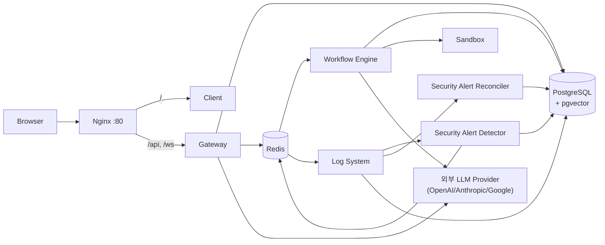

# Architecture

Status: Draft
시스템 구조, 인증 방식, 배포 구조, 외부 연동을 정의한다. 권한/감사 결정의 근거는 [decisions/](decisions/README.md)의 ADR을 따르고, 테이블 상세는 [data_model.md](data_model.md)를 따른다.

## 1. 시스템 구조

### 논리 서비스

| 구성요소 | 위치 | 책임 |
| --- | --- | --- |
| Client | `apps/client/` | Next.js. Workflow 편집, 설정, RBAC/observability UI |
| Gateway | `apps/gateway/` | FastAPI. 인증된 API 진입점과 resource permission enforcement 경계 |
| Workflow Engine | `apps/workflow_engine/` | Celery worker. Workflow 실행과 node runtime |
| Log System | `apps/log_system/` | Celery worker. audit/trace/log 계열 비동기 처리 |
| Sandbox | `apps/sandbox/` | NSJail 기반 격리 코드 실행 |
| Shared | `apps/shared/` | DB model, schema, 공통 service(permissions, llm_client, tracing/audit) |
| PostgreSQL | 컨테이너/chart | pgvector 포함 영속 저장소 |
| Redis | 컨테이너/chart | Celery broker/result, Pub/Sub |

Security Alert MVP는 [ADR-0028](decisions/ADR-0028-security-alert-detection-and-lifecycle.md)의 architecture를 따른다. MBA-223의 audit normalization, MBA-211의 alert/evidence 영속 모델·lifecycle service, MBA-212의 실시간 detector와 PostgreSQL watermark 기반 reconciler, MBA-213의 관리자 API, MBA-214의 notification/client 표면이 구현됐다. Reconciliation은 Celery Beat에 60초 주기로 등록되고 한 실행에서 최대 100건을 처리하며, 로컬 개발 스크립트와 Docker Compose가 Worker와 분리된 Beat 프로세스를 실행한다.

| 구성요소 | 위치 | 책임 |
| --- | --- | --- |
| Security Alert Audit Normalizer | audit producer와 shared contract | 탐지 대상 `permission.denied`의 검증된 organization provenance와 `policy.block`의 canonical `policy_reason`을 제공한다 |
| Security Alert Detector | Log System Celery task/application boundary | 저장된 eligible audit를 동일 rule evaluator로 실시간 평가하고 alert/evidence를 원자적으로 생성·갱신한다 |
| Security Alert Reconciler | Log System periodic Celery task | PostgreSQL watermark의 활성화 경계·batch generation과 processor별 audit receipt로 실시간 처리 누락과 late commit을 찾고, `(occurred_at, audit_log.id)` 순서로 최대 100건씩 commit하며 늦은 eligible audit 뒤의 최대 rule window 재평가를 batch 경계 너머까지 이어간다 |
| Security Alert Admin Service | Gateway application/service boundary | organization owner/manager 전용 alert 조회·상태 변경, safe evidence projection, lifecycle audit transaction을 제공한다 |
| Security Alert Notification Projection | Gateway/Client notification boundary | 영속 alert를 source of truth로 두고 Sidebar summary와 `notifications.changed` 재조회 신호를 제공한다 |

App hard-delete 구조는 [ADR-0045](decisions/ADR-0045-app-workflow-hard-delete-retention-boundary.md)을 따른다. MBA-87은 lifecycle FK migration, Gateway 삭제 use case, Runtime admission guard를 아래 경계로 구현한다.

| 구성요소 | 위치 | 책임 |
| --- | --- | --- |
| App Lifecycle Deletion Application | Gateway application boundary | active organization/manage 재검사, App→Workflow UUID exclusive lock 순서, bounded legacy 연결, 진행 중 operation 차단, active/history 삭제 계획과 단일 transaction을 조율한다 |
| App Lifecycle Persistence Adapter | Gateway SQLAlchemy adapter | 연결 Workflow union, blocker/history 조회, permission·설정 delete와 history provenance 보존을 구현하며 repository 안에서 commit하지 않는다 |
| App Lifecycle Audit Adapter | Gateway transaction-bound audit adapter | `app.delete`와 user/team Workflow permission delete audit를 같은 transaction에 기록하고 ORM 자동 audit의 중복 발행을 막는다. 삭제가 rollback되면 audit row도 함께 rollback된다 |
| Runtime Lifecycle Admission/Target Guard | Gateway와 Workflow Engine admission/runtime | 새 run/schedule/Mail durable active 상태 전에 App→Workflow shared lifecycle lock과 resource 재검사를 수행한다. 다른 graph의 stale WorkflowNode target은 수정하지 않고 preflight `workflow_node_target_unavailable`, runtime `workflow_node.target_unavailable`로 provider effect 전에 차단한다 |

Knowledge 통합 목표 구조에서는 Gateway/Shared/Workflow Engine 경계에 다음 domain service를 둔다. 아래 항목은 현재 구현 컴포넌트 전체가 아니라 [ADR-0014](decisions/ADR-0014-knowledge-base-document-atom-and-collection-boundary.md), [ADR-0015](decisions/ADR-0015-knowledge-skill-context-routing-boundary.md), [ADR-0017](decisions/ADR-0017-knowledge-integration-provisional-implementation-baseline.md), [ADR-0020](decisions/ADR-0020-knowledge-mcp-incremental-sync-boundary.md), [ADR-0036](decisions/ADR-0036-knowledge-runtime-candidate-resolution.md), [ADR-0039](decisions/ADR-0039-knowledge-workflow-collection-routing-integration.md)의 target component다.

| 구성요소 | 책임 |
| --- | --- |
| Knowledge Source Connector | 외부/내부 source item과 source ACL을 adapter별로 수집한다. outbound network 접근은 중앙 guard를 통과한다. |
| OutboundEgressGuard | server-side outbound dial 전 host/IP/port/proxy/timeout/size 정책을 검증한다. protocol별 SQL/command/listing 제한은 adapter가 담당한다. |
| Content Safety Gate / Parser Isolation Worker | 외부 source artifact를 redacted canonical text로 만들기 전 file type allowlist, active content 차단, archive cap, parser sandbox, malware/content scan hook을 평가한다. |
| Shared Privacy/Redaction Service | PII/secret detector, hard baseline, output-target별 masking/hash/drop/block rule을 제공한다. Audit/Tracing과 Knowledge가 함께 사용한다 ([ADR-0014](decisions/ADR-0014-knowledge-base-document-atom-and-collection-boundary.md)). |
| Knowledge Sync Scheduler / Worker | connector sync lease, cursor, retry, dead-letter, tombstone, outbox를 관리한다. |
| Knowledge Normalizer / Ingestion Pipeline | source item을 redacted canonical text와 document version artifact로 변환하고, indexing 성공 후 active version finalization을 수행한다. |
| Knowledge Permission Helper | collection route 권한, KB `use`, source ACL freshness/requester authorization을 bulk 평가한다. Router, Builder, Workflow LLM node runtime은 permission row를 직접 조합하지 않는다. |
| Knowledge Administration Application | KB object/property authorization, owner migration/bootstrap, organization-scoped domain delegation, self-escalation policy, lifecycle와 transaction-bound audit를 조율한다. Domain 관리 권한은 KB content/Collection route에 합산하지 않는다 ([ADR-0034](decisions/ADR-0034-knowledge-delegated-administration-and-rbac-boundary.md)). |
| Workflow Runtime Knowledge Candidate Resolver | Shared pure policy와 Workflow Engine `runtime_retrieval` use case/port, PostgreSQL adapter로 direct KB와 명시 selected Collection을 current audience 기준 재평가한다. Invocation마다 `REPEATABLE READ, READ ONLY` snapshot을 사용하고 Gateway Builder resolver를 import하지 않는다. MBA-232가 resolver seam을 구현했고 MBA-233은 additive graph/Builder/preflight/LLM retrieval wiring을 연결한다 ([ADR-0036](decisions/ADR-0036-knowledge-runtime-candidate-resolution.md), [ADR-0039](decisions/ADR-0039-knowledge-workflow-collection-routing-integration.md)). |
| Workflow Knowledge Reference Service | Gateway editable-graph write에서 direct KB effective `use`/source gate와 selected Collection `route`를 current editor 기준으로 재검증한다. Collection child를 열거하거나 runtime capability를 발급하지 않고 graph/success audit transaction 앞에서 fail-closed한다. |
| Route-safe Collection Picker | active organization에서 active lifecycle이고 `sync_state != source_deleted`인 Collection 중 current editor가 `route` 가능한 UUID와 approved safe label만 Builder에 제공한다. Collection management projection이나 runtime resolver를 재사용하지 않는다. |
| Collection Router / Retrieval Orchestrator | 권한 helper가 허용한 safe candidate set에서 collection/KB를 선택하고, metadata-aware/hierarchical retrieval 결과를 merge/rerank한다. |
| Knowledge Skill Registry | Workflow Builder가 LLM node의 RAG 옵션을 구성할 때 사용할 provider-neutral Skill, version, visibility, freshness/eval 상태를 관리하는 target component다. Skill은 권한 source나 source of truth가 아니다. |
| Skill Context Loader | 후속 target component로, 빌더 단계에서 safe skill metadata와 필요한 checklist/body를 gate 통과 후 점진적으로 로드한다. MBA-145 Agent Builder MVP는 Knowledge Skill body/checklist를 prompt context로 직접 로드하지 않고 ADR-0017 기본 RAG option 후보와 KB safe metadata만 사용한다. Raw skill body, hidden source reference, raw source title/path/url은 Builder input으로 제공하지 않는다. |
| Source-of-Truth Catalog | 정책 문서, ADR/decision record, semantic definition, curated query corpus 같은 source tier와 safe reference를 관리하는 target component다. Retrieval에서는 authorized evidence 안의 ranking/tie-break/conflict hint로만 사용한다. |

Conversation Memory 목표 구조는 [ADR-0030](decisions/ADR-0030-memory-bounded-context.md)과 [ADR-0033](decisions/ADR-0033-conversation-memory-contract-completion.md)을 따른다. 이는 현재 별도 network service가 추가되었다는 뜻이 아니라 Gateway와 Workflow Engine이 같은 domain/application contract를 사용하는 in-process bounded context다.

| 구성요소 | 책임 |
| --- | --- |
| Memory Domain/Application | Conversation Session, Turn, Access Grant, final/provisional entry와 summary, dependency, lifecycle과 retention policy의 단일 업무 mutation owner |
| Turn Dispatch Job/Dispatcher | StartTurn과 원자적으로 저장된 durable dispatch를 application command로 claim/publish/reconcile하고 Gateway crash, broker ambiguity와 Workflow admission acknowledgement 유실을 복구 |
| Memory Persistence Adapter | Memory-owned aggregate/revision/outbox를 PostgreSQL에 저장. 다른 production module의 Memory table 직접 mutation을 허용하지 않음 |
| Source Authorization Adapter | Knowledge/connector/subworkflow의 current decision과 principal-neutral authorization decision/resource/policy revision을 bulk contract로 변환 |
| Memory Provider Adapter | Reference-only materialization plan, LLM Credentials가 발급한 opaque `ProviderExecutionCapability` identity/revision에 binding된 provider attempt/lease claim, current authorization 재검증, raw bounded context materialization과 provider-start marker를 main provider 호출 직전에 결합 |
| Summary Process Adapter | Fenced generation lease, approved provider execution capability/egress, capability-bound budget reservation, provider usage와 reconciliation 조정 |

Workflow external effect 멱등성 목표 구조는 [ADR-0035](decisions/ADR-0035-external-effect-idempotency-boundary.md)을 따른다. 이는 별도 network service가 아니라 Workflow Engine 내부의 domain/application/adapter 경계다.

| 구성요소 | 책임 |
| --- | --- |
| Execution Identity Contract | Draft test, deployed/API/public/webhook, schedule, stream과 subworkflow가 공유하는 `execution_id` 생성·검증 규칙과 server-verified organization/app/workflow provenance를 제공. Compare A/B는 variant마다 별도 logical execution ID를 발급하고 각 variant retry에서 유지. Subworkflow는 ID를 유지하되 target resource provenance로 전환하고 server-owned WorkflowNode target binding으로 child deployment snapshot을 고정 |
| External Effect Domain | Stable node invocation identity, attempt lifecycle invariant, 외부 서비스 중복 방지와 결과 재사용 지원 수준, outcome/replay policy를 DB와 network 없이 판단 |
| External Effect Application | 독립된 짧은 DB session으로 durable attempt claim과 상태 전이를 조율한다. 유효한 claim 소유자가 있으면 lock 없는 제한적 조회로 terminal/만료를 기다린다. Terminal commit과 claim generation 검증이 성공한 뒤에만 최초 node output 또는 저장 result를 반환하고, duplicate delivery는 frozen provider/contract/input digest를 확인한 뒤 canonical JSON 65,536 bytes 이하 schema-compatible replay result를 반환하거나 safe typed external-effect error로 닫음 |
| External Effect Persistence Adapter | Operation 변경으로 새 row를 우회할 수 없는 stable effect slot unique, `workflow_node_effect_attempts` claim generation, lease, 구조 constraint, recovery query와 PostgreSQL concurrency를 구현 |
| External Provider Adapter | Server-derived logical node type과 canonical operation으로 versioned profile을 선택하고 두 지원 수준, key 전달 위치·형식·길이·보존 기간·duplicate 응답 의미·공식 근거와 network 호출을 구현. Generic HTTP mutation과 legacy `slack.http.request`는 provider replay `unknown`, result reuse `unavailable`이다. 전용 Slack API/Webhook은 provider replay `unknown`, safe result reuse `supported`이고 GitHub issue comment는 replay `unsupported`, result reuse `unavailable`이다. Generic HTTP `GET`과 GitHub `get_pr`는 기존 조회 경로를 유지한다. |
| External Effect Key Provider | Provider replay `supported`와 `header|body` key transport에서만 전용 versioned HMAC key를 제공하고 과거 replayable attempt key version의 재생성 또는 fail-closed를 보장. `unsupported|unknown`에는 key를 생성·주입하지 않음 |
| External Effect Test Support | Fake provider는 replay `supported`의 중복·장애 구간을, fake adapter는 result reuse `supported/unavailable`을 검증하고 `unsupported/unknown` replay는 pure policy test가 검증. `apps/workflow_engine/tests/fakes/` 또는 integration support에만 두고 production composition과 환경 설정에서 참조 금지 |

### 구성도



### 요청 흐름

1. 모든 외부 요청은 Nginx 단일 진입점을 지나 Client(`/`) 또는 Gateway(`/api`, `/ws`)로 라우팅된다.
2. Gateway는 인증과 organization scope, resource permission을 판정한 뒤 동기 응답하거나 Celery task를 발행한다. Turn admission처럼 DB mutation과 task 발행 사이 유실을 허용할 수 없는 target flow는 직접 publish 대신 같은 transaction의 durable outbox/dispatch job을 사용한다.
3. Workflow 실행은 Workflow Engine이 수행하고, 실행 시 user/organization/workflow/run/node 식별자를 포함한 execution context를 전달받는다.
4. audit/trace 기록은 Log System worker가 비동기로 처리한다.
5. Security Alert flow는 audit 저장 성공 뒤 `security_alert.detect` task를 `log` queue에 발행한다. Detector는 eligible event를 평가하고 alert/evidence/`security_alert.detected` audit을 같은 transaction에 기록한다. Cooldown 종료 후 같은 활성 alert가 새 threshold를 충족하면 새 row 대신 episode count와 episode 시작 시각을 새 evidence와 함께 갱신한다. `security_alert.reconcile`은 migration이 만든 `security-alert-v1` watermark의 활성화 경계와 processor별 receipt 부재를 사용해 같은 evaluator와 idempotency key로 실시간 누락과 event-time cursor보다 과거인 late commit을 복구한다. 늦은 eligible audit를 발견하면 같은 organization·actor·action 범위에서 그 audit부터 최대 rule window 안의 receipt 보유 후속 audit도 다시 평가해 event-time threshold 결과를 복구하고 다른 organization·actor·action 범위와 window 밖 audit는 재평가하지 않는다. Reconciler는 `(occurred_at, audit_log.id)` 순서로 최대 100건만 읽고 성공한 batch의 receipt 발견·평가 generation과 event-time cursor를 Alert/evidence·notification Outbox 변경과 함께 commit한다. 실패한 batch는 모두 rollback하며 다음 retry 또는 1분 주기 실행이 남은 receipt 부재·stale generation 작업을 이어간다. Alert 생성·occurrence·episode 갱신과 lifecycle 변경은 `notifications.changed` Outbox도 같은 transaction에 기록한다. Log worker는 현재 active manager를 조회해 Redis channel에 at-least-once로 전달하고 실패를 최대 5회 재시도한 뒤 dead-letter 처리한다. Client는 payload를 상태로 쓰지 않고 summary와 열려 있는 list/detail을 영속 API에서 다시 조회하며 reconnect 뒤에도 같은 방식으로 누락을 복구한다.
6. Knowledge 자동 수집은 connector adapter가 직접 네트워크를 열지 않고 `OutboundEgressGuard` 또는 승인된 client/dialer factory를 통과한다. MCP/API source도 LLM 임의 tool-use가 아니라 server-side Knowledge Source Connector allowlist adapter로만 호출한다. Retrieval/Agent 요청은 collection routing scope와 KB permission helper/source ACL helper 결과로 만든 safe candidate set만 사용한다.
7. Target Conversation Memory session은 canonical deployment ID/version 또는 snapshot hash, conversation mapping과 node Memory policy version에 고정한다. Gateway가 pending Turn과 durable dispatch job을 같은 transaction에 저장한 뒤 Dispatcher가 versioned Worker task를 발행한다. Workflow Engine은 `AdmitExecution(dispatch_id)`으로 중복 admission을 제거하고 task capability를 side effect 전에 검증하며 node value dependency와 활성 Condition/Switch/Loop control dependency를 final output까지 전파한다. Workflow Runtime이 provider effect 전에 server-issued provider attempt reference를 생성하면 LLM Credentials 경계가 해당 invocation/admission/attempt에 binding된 authoritative main-generation `ProviderExecutionCapability` identity/revision을 발급하고 Memory는 같은 capability에 binding된 context lease를 만든다. Provider adapter는 해당 capability와 provider attempt로 lease를 claim하고 current authorization을 재검증한 뒤 reference-only plan을 materialize하며 outbound 호출 직전에 provider-start marker를 기록한다. Log System은 observer이며 conversation source of truth가 아니다.
8. 모든 Workflow 실행 표면의 최초 발행자 또는 직접 실행 조정자는 logical execution마다 `execution_id`를 한 번 발급하고 retry에서 유지한다. Compare A/B는 variant마다 서로 다른 ID를 사용한다. External effect node는 Loop/subworkflow invocation을 구분하는 immutable context를 받는다. Workflow Engine application use case는 시스템 key를 넣기 전 request/digest를 준비하고 durable attempt winner를 확정한 뒤, winner row의 frozen key로 최종 call을 만들어 `in_flight`를 commit한다. Provider 호출 전후 상태 변경마다 새 DB session을 사용하고 network I/O 중에는 session을 유지하지 않는다. 유효한 claim 소유자가 있으면 중복 Worker는 provider를 호출하지 않고 lock 없는 짧은 조회로 terminal/만료를 제한적으로 기다린다. 같은 logical execution 재진입은 자기 attempt의 만료된 `in_flight`를 결과 불명 상태와 재호출 판단으로 먼저 정리하며, 이 정리 단계는 provider나 workflow를 호출하지 않는다. 별도 주기적 recovery scheduler는 두지 않는다. Log System의 비동기 WorkflowRun/NodeRun row는 external effect correctness source가 아니다.

### Public Chatbot/Widget browser 경계

Public Chatbot과 Widget은 [ADR-0043](decisions/ADR-0043-deployment-browser-origin-and-embedding-boundary.md)를 따른다.

```text
External parent
  -> GET Client /embed/chat/{slug}
     -> Next proxy
        -> Gateway /deployments/public/{slug}/browser-access
        -> CSP frame-ancestors <deployment exact parents>
  -> Browser가 모든 ancestor를 허용/차단

Loaded Nodease iframe document
  -> relative /api/v1/deployments/public/{slug}/info
  -> relative /api/v1/run-public/{slug}
  -> Next rewrite -> Gateway
```

- 외부 parent는 CSP 집행 대상이며 API principal/CORS grant가 아니다.
- iframe document는 Nodease first-party origin에서 relative API만 호출한다.
- External direct JavaScript public API는 V1에서 지원하지 않으며 public endpoint는 수동 wildcard CORS를 추가하지 않는다.
- `WorkflowDeployment.browser_access_policy`가 immutable parent policy를 소유한다. Missing/malformed policy와 projection 장애는 `frame-ancestors 'none'`이다.
- Next response boundary는 configured Gateway URL만 조회하며 request Origin/Referer/Host/query로 allowlist를 만들지 않는다.
- Public cookie는 execution subject를 만들지 않으며 `internal_chatbot`의 authenticated route/permission/CSRF와 이 경계를 공유하지 않는다.

### 경계 규칙

- Gateway endpoint는 얇게 유지한다. RBAC/audit/tracing 판정은 controller가 아니라 `apps/gateway/services/`, `apps/shared/services/`의 service/helper 경계에서 수행한다.
- Controller에서 DB를 직접 상세 조회해 권한을 판단하지 않는다.
- 공통 tracing/audit service가 trace 접근과 payload 처리의 경계다.
- `apps/shared/` 변경은 Gateway, Workflow Engine, Log System, Sandbox 전체에 영향을 준다.
- External effect node는 provider 호출 직전에 ADR-0035 application 경계를 통과한다. Node나 Celery task가 SQLAlchemy query, HMAC secret, 두 지원 수준과 replay 정책을 직접 조합하지 않는다. Provider adapter는 key-free `PreparedEffectRequest`, frozen key만 한 번 주입한 `PreparedProviderCall`과 invoke를 분리하며 invoke가 graph/input/template을 다시 읽지 않는다.
- `slackPostNode`는 [ADR-0037](decisions/ADR-0037-slack-dedicated-delivery-boundary.md)에 따라 Generic HTTP runtime과 분리된 전용 node/adapter를 사용한다. API mode는 `slack.chat.post_message`, Webhook mode는 `slack.incoming_webhook.post` profile을 선택한다. 과거 `slack.http.request.v1`은 기존 attempt 해석용으로만 유지하고 새 실행 profile로 선택하지 않는다.
- External effect invocation identity는 병렬 node가 공유하는 mutable execution context에 덮어쓰지 않는다. Node invocation별 immutable value를 사용하고 DB session을 context에 넣거나 병렬 node 사이에서 공유하지 않는다.
- External effect DB uniqueness는 `organization_id + execution_id + node_invocation_id + effect_sequence` stable slot을 사용한다. `operation`은 slot row에 고정해 mode/action 변경이 새 row를 만들지 못하게 하며, 불일치는 provider와 downstream 호출 전에 identity conflict로 닫는다.
- Retry 또는 duplicate delivery에서 `execution_id`가 누락되면 새 값을 보충하지 않고 provider 호출 전에 fail-closed한다. Subworkflow는 부모 execution ID를 유지하고 별도 node invocation ID로 호출 위치를 구분한다. Gateway가 배포 snapshot 또는 최초 draft 실행 command에 server-owned target deployment ID/version/snapshot-hash binding을 넣고 Runtime이 이를 재검증해, parent retry가 현재 active child deployment로 바뀌지 않게 한다. Binding 생성은 current active target만 허용한다. 소비 시 새 child 활성화로 bound row가 자동 비활성화돼도 ID/provenance/type/version/hash가 맞으면 과거 row를 쓰고 pointer 일치나 현재 graph 대체를 요구하지 않지만, app active pointer가 null이거나 유효한 same-app active row가 아닌 전체 비활성/불일치 kill switch는 존중한다. Client 입력과 clone/template/import 같은 graph 복사 경로의 metadata는 제거 후 재계산하고 client-facing graph 응답·trace·log에서 제거한다. Binding use case는 `apps/gateway/application/deployment/`에서 기존 preflight와 같은 repository port, shared Loop-aware walker와 organization/type/cycle/depth 정책을 사용하고 composition이 기존 DB adapter를 조립한다. Legacy closure는 canonical node catalog의 `external_write`를 기본으로 fail-closed하며 HTTP GET/GitHub get_pr만 명시적으로 read-only로 낮춘다. Gmail Draft/Acknowledge는 binding 판정에는 포함하지만 실제 effect ledger는 ADR-0032를 유지한다.
- Binding은 각 실행 surface가 기존 계약으로 선택한 검증된 graph의 server-owned 복사본에 계산한다. Stream의 유효한 request `graph_snapshot`처럼 저장되지 않은 graph 실행을 허용하던 경로를 DB draft로 대체하거나 저장하지 않는다. Shared binding domain은 catalog loader/file을 import하지 않고 Gateway/Workflow Engine composition이 canonical catalog에서 만든 immutable `node_type -> side_effect` mapping을 주입받는다.
- External effect table/revision, terminal을 포함한 모든 attempt의 과거 provider contract와 재호출 가능한 supported attempt에 필요한 HMAC key readiness는 Workflow Engine Worker composition에서만 등록한다. Revision 판정은 기존 shared Alembic current-head readiness를 재사용하고 필수 table/constraint/index shape를 함께 검사하며 MBA-190 revision ID의 exact equality만 요구하지 않는다. 공용 Celery app과 Log System Worker의 시작 조건으로 연결하지 않는다.
- External-effect 오류는 JSON-safe `code`, `message`, `retryable`, optional `node_id` payload로 정규화한다. 최소 `external_effect.result_unavailable`, `external_effect.identity_conflict`, `external_effect.outcome_unknown`의 `retryable=false`를 Node/application, Workflow Engine, Celery task result, Pub/Sub와 Gateway 경계에서 문자열로 축소하지 않고 보존한다. Custom exception attribute의 Celery 직렬화에 의존하지 않는다. 일반 실행/deployment는 기존 `detail`, stream은 error event, Compare/Cost Optimizer는 기존 문자열과 additive `error_detail`로 mapping한다. Schedule claim은 schema를 바꾸지 않고 outcome unknown만 기존 `execution_outcome_unknown`, 나머지 두 code는 `execution_failed_after_admission`으로 mapping한다. 구체 code는 task-local safe error/trace에만 두고 claim이나 conflict winner row에 덮어쓰지 않는다.
- Celery Worker task 수신 INFO log와 task event에는 실제 workflow args/kwargs를 넣지 않는다. 저장소 안 `app.send_task` publisher는 공통 helper로 redacted `argsrepr`/`kwargsrepr`을 설정한다. Workflow task 전용 Task base는 `apply_async` 기본 repr을 강제해 `.delay`, signature와 `self.retry`의 `task-sent`를 보호하고, Request base는 consumer 측에서 수신 repr을 다시 고정해 graph/input/binding/internal identity와 secret-like 값이 `task-received|task-sent` telemetry에 복제되지 않게 한다.
- Workflow Engine composition은 `httpx`, `httpcore`, `urllib3`/Requests transport logger의 raw record를 억제하고 provider adapter의 safe summary만 남긴다. Generic HTTP trace `host`는 URL user info가 포함되는 `netloc`이 아니라 parsed hostname과 명시 port로 만든다. 공통 `workflow.*` publish helper도 serialization/broker 실패를 raw exception message나 traceback으로 남기지 않는다. 이 logger 정책은 Shared signal이나 Log System Worker에 전역 적용하지 않는다.
- Security Alert detector는 target resource를 다시 조회해 organization이나 policy reason을 추론하지 않는다. Audit 생성 시점에 검증된 `audit_metadata.organization_id`와 canonical `audit_metadata.policy_reason`만 사용한다.
- Security Alert의 고정 v1 rule contract는 shared rule registry 하나가 소유한다. Evaluator, aggregation과 Log System 조회 window가 같은 registry를 사용하며, `scripts/replay_security_alert_rules.py`는 실제 evaluator를 read-only로 실행해 rule별 safe aggregate만 출력한다.
- Alert 탐지 실패는 원래 authorization 판단이나 사용자 응답을 변경하지 않는다. Alert 최초 생성과 lifecycle mutation은 각 canonical audit과 같은 transaction에 기록하되 notification publish 실패는 이미 commit된 alert를 rollback하지 않는다.

위 규칙은 목표 architecture rule이며, 현재 구현에 과도기 예외가 있다: Team 관리 API는 권한 판정과 team/member 조회를 `TeamService`로 이관했지만, user directory(`users.py`)와 permission 관리(`permissions.py`) 계열 endpoint에는 router에서 DB query와 permission helper를 직접 조합하는 코드가 남아 있다. 해당 영역을 수정할 때는 service 경계로의 이관을 함께 고려한다.

### Application Architecture Boundary

신규 backend business flow는 [ADR-0022](decisions/ADR-0022-incremental-hexagonal-architecture-adoption.md)의 점진적 헥사고널 아키텍처 경계를 따른다. 전면 재작성이나 대량 파일 이동이 아니라, 고위험 도메인부터 작은 use case와 port를 도입한다.

| Layer | 책임 | 금지 |
| --- | --- | --- |
| Inbound adapter | FastAPI router, Celery task, CLI 같은 진입점. request parsing, dependency 연결, command 생성, response mapping을 담당한다 | DB query로 정책 판단, transaction orchestration |
| Application use case | transaction 경계, permission/policy 호출 순서, port 호출, audit recorder/outbox port 호출을 조율한다 | SQLAlchemy query expression, provider SDK 호출, HTTP response shape 결정 |
| Domain policy | DB 없이 테스트 가능한 업무 규칙을 담는다 | DB session, FastAPI request, Celery task, storage path 접근 |
| Port | use case가 필요로 하는 외부 행위의 interface다 | 특정 ORM table CRUD를 그대로 노출하는 거대한 generic repository |
| Outbound adapter | SQLAlchemy, Celery enqueue/queue, storage, provider SDK 같은 기술 세부사항을 구현한다 | 업무 정책 독자 결정 |

이 문서에서 inbound port는 use case command/handler interface로 취급하고, `Port` 명칭은 주로 outbound port에 사용한다.

Package 기준:

| 위치 | 책임 |
| --- | --- |
| `apps/gateway/api/` | Gateway inbound adapter. Router는 가능한 한 use case dependency를 호출하고 response mapping만 수행한다 |
| `apps/gateway/application/` | Gateway use case, command/result, port, domain policy를 둔다 |
| `apps/gateway/adapters/` | Gateway SQLAlchemy repository, audit recorder, queue/storage/provider adapter를 둔다 |
| `apps/workflow_engine/domain/` | Workflow Engine 안에서만 사용하는 node invocation identity, external effect lifecycle과 replay 같은 pure domain rule을 둔다 |
| `apps/workflow_engine/application/` | Workflow runtime use case를 둔다. runtime 실행 책임은 `execution`, runtime RAG 책임은 `runtime_retrieval`처럼 명명한다 |
| `apps/workflow_engine/tasks.py` | Workflow Engine inbound adapter. Celery task는 외부 실행 이벤트를 받아 application use case로 전달한다 |
| `apps/workflow_engine/adapters/` | DB run repository, execution queue, node runtime/provider adapter 등 workflow runtime outbound adapter를 둔다 |
| `apps/workflow_engine/composition/` | Workflow Engine application use case와 독립 DB session factory, repository, provider/key concrete dependency를 조립한다 |
| `apps/memory/domain/`, `apps/memory/application/`, `apps/memory/adapters/` | ADR-0030 target Memory bounded context. 첫 실제 use case와 함께 추가하며 Gateway/Workflow concrete module을 import하지 않는다 |
| `apps/shared/domain/` | Gateway와 Workflow Engine이 함께 쓰는 순수 policy 또는 contract만 둔다. MBA-190에서는 모든 실행 표면의 `execution_id` 생성·검증, WorkflowNode binding, 공개 safe error code wire contract를 공유하고 lifecycle/replay policy는 Workflow Engine에 유지한다 |

초기 pilot과 이후 package 규칙:

- Gateway deployment scaffold 다음 단계로 deployment preflight pilot을 실제 이관했다.
- `apps/gateway/application/deployment/`는 framework-independent result/error, repository port, graph/audience policy와 use case를 소유한다. MBA-233에서는 shared strict Knowledge-reference parser를 사용해 direct KB와 selected Collection을 함께 검사하고, embedded subgraph는 반복 순회하며 workflow-node target graph는 기존 bounded target recursion으로 검사한다.
- `apps/gateway/adapters/db/deployment_preflight_repository.py`는 SQLAlchemy model/query를 pure snapshot으로 변환한다. Collection preflight query는 selected IDs와 active organization에 한정하고 active member/source 여부를 aggregate하되 child ID를 application result로 반환하지 않는다.
- `apps/gateway/composition/deployment.py`는 concrete repository와 use case만 조립하고 정책을 판단하지 않는다.
- `apps/gateway/services/knowledge_deployment_preflight_service.py`는 기존 caller 호환 facade로서 application result를 shared response schema로, typed blocked error를 기존 HTTP 409 envelope으로 변환한다. 응답은 KB/Collection count bucket과 candidate-budget boolean만 추가하며 resource/member identity를 포함하지 않는다.
- Deployment preflight는 runtime capability를 발급하지 않는다. Builder picker, saved display snapshot, preflight pass 뒤에도 Workflow Engine의 MBA-232 resolver가 각 Knowledge-enabled LLM invocation에서 current audience와 lifecycle/permission/source/readiness를 다시 평가한다.
- MBA-219는 이 deployment preflight application 경계를 Mail, Gmail Draft, Mail Acknowledge와 Slack node configuration readiness까지 확장한다. Canonical node catalog는 node type과 side effect 같은 정적 분류만 제공하고, UUID, lifecycle, permission, mode 조합과 graph path를 검사하는 semantic validator registry는 application layer가 소유한다. Application은 catalog loader, FastAPI, SQLAlchemy와 concrete resource service를 import하지 않는다.
- Draft와 Agent Builder preview는 unresolved external node를 보존할 수 있지만 Workflow Editor test/stream/compare/cost-optimizer compare·recommendation verification publisher, active deployment create/toggle과 schedule dispatch는 같은 server-side policy를 task publish 전에 적용한다. Inactive deployment는 `credential_id=null + configuration_state=unresolved` 같은 실제 미완성 설정만 warning으로 보존한다. `configuration_state` 도입 전 Client가 만든 `credential_id=null` Mail node는 필드가 아예 없는 경우에만 legacy unresolved로 해석하고, 신규 Client는 명시적 `unresolved`를 저장한다. Invalid configuration, non-null unavailable Mail credential, malformed graph와 validator가 없는 external node는 fail-closed한다. Compare/Cost Optimizer는 검사한 server-bound graph에서 candidate를 파생하고 dispatch 직전에 target을 다시 binding하지 않으며, 완료된 idempotent safe response replay는 publisher로 취급하지 않는다.
- Preflight는 provider 연결이나 secret 복호화를 수행하지 않고 safe resource snapshot만 사용한다. Runtime은 preflight 결과를 authorization capability로 신뢰하지 않으며 Mail credential scope/status/use, Slack mode/target/secret, LLM credential, outbound egress와 external-effect 계약을 provider 호출 직전에 다시 검증한다.
- Shared pure workflow graph contract는 최상위와 Loop subgraph의 node/edge shape, duplicate ID, dangling endpoint, cycle, 진입점과 isolation을 검사한다. 모든 node는 유한한 숫자 `x`, `y`를 가진 `position`을, 모든 edge는 비어 있지 않은 string `id`를 가져야 하며 Worker schema에 도달하기 전에 같은 규칙으로 차단한다. 최상위 graph는 명시적 trigger/start node가 정확히 하나여야 하고, Loop body는 편집기 구조상 trigger를 요구하지 않는 대신 incoming executable edge가 없는 실행 node가 정확히 하나여야 한다. 최상위와 모든 subgraph 합산 node 1,000개, edge 5,000개와 Loop subgraph depth 16을 상한으로 두며, Gateway endpoint, WorkflowNode binding, deployment preflight와 Loop runtime은 같은 contract를 사용하고 resource lookup 전에 검사하며 각 경계에서 safe 오류로 projection한다.
- Mail resource decision은 organization/user/membership을 요청당 한 번 판정하고 direct/team grant를 active same-organization credential 집합으로 조회한다. Scalar/bulk 판정은 revoked credential의 잔존 grant를 `none`으로 처리한다. Pure preview는 durable audit을 만들지 않지만 create/toggle/authenticated execution enforcement에서 확인된 same-organization `use` 거부는 resource별 한 번 `permission.denied`로 기록한다. 이 이벤트는 검증된 `organization_id`와 middleware `request_id`만 안전한 요청 provenance로 추가하고 raw path/header는 복사하지 않는다. Missing/revoked/cross-organization은 permission-denied target audit으로 만들지 않는다.
- System schedule은 canonical locked deployment graph를 budget 평가와 broker publish 전에 검사한다. Known configuration blocker는 claim을 `canceled`와 `configuration_preflight_blocked`로 전이하고 기존 `schedule_dispatch.canceled` audit action에 safe reason만 남긴다. Infrastructure failure는 같은 UoW를 rollback하고 fail-open하지 않는다. App/deployment/workflow owner를 Mail execution subject로 합성하지 않는다.
- `apps/gateway/application/access_management/`는 actor 중심 organization access 조회·단일 mutation policy, command/result/error와 capability별 port를 소유한다.
- `apps/gateway/adapters/db/access_management_*`와 `apps/gateway/adapters/audit/*`는 SQLAlchemy projection/mutation/lock, transaction-bound audit와 management reason redaction을 구현한다. `apps/gateway/composition/access_management.py`가 이를 조립한다.
- 기존 member/team/user-direct/App 생성 권한 경로는 일괄 이동하지 않고 같은 subject lock protocol과 transaction-bound audit을 사용하는 compatibility path로 보강한다. 기존 authorization, response/status와 latent-row 정책은 유지한다.
- MBA-87은 첫 구현에서 `apps/gateway/application/app_lifecycle/`에 삭제 command/result/error, repository/UnitOfWork port와 순수 삭제 계획을 두고 composition에서 SQLAlchemy와 audit adapter를 조립한다. 기존 `AppService.delete_app()`은 호환 facade로만 남기며 router가 여러 ORM delete를 직접 조율하지 않는다.
- 다른 도메인도 동일한 router/use case/domain policy/port/adapter 기준을 따른다. `permissions`, `knowledge`, `llm`, `workflow_management`, `runtime_retrieval` 같은 domain package는 빈 구조로 선생성하지 않고, 해당 도메인의 첫 리팩터링 PR에서 실제 use case/port와 함께 만든다.
- Conversation Memory는 Gateway 또는 Workflow Engine 하위 helper로 중복 구현하지 않는다. 첫 Memory use case와 함께 `apps/memory/` 최소 package를 만들고 `apps/gateway/composition/memory.py`, `apps/workflow_engine/composition/memory.py`가 runtime별 adapter를 조립한다. 현재 global `memory_mode`/execution-log memory가 이미 이 구조로 이관됐다고 간주하지 않는다.
- Deployment preflight pilot을 이후 도메인 리팩터링의 reference implementation으로 사용하되, mutation 도메인은 별도 UnitOfWork와 transaction-bound audit 요구를 추가해야 한다.
- `apps/shared/domain/*` 하위 도메인 package는 실제 cross-runtime pure policy가 생길 때만 만든다.
- Gateway workflow 관리 책임은 `workflow_management`처럼 API 관리 책임을 드러내고, Workflow Engine 실행 책임과 혼동하지 않는다.

Composition root:

- Gateway API는 `apps/gateway/api/deps.py` 또는 endpoint module의 dependency factory에서 concrete adapter와 use case를 조립한다.
- Gateway background/helper는 필요할 때만 `apps/gateway/composition.py` 또는 `apps/gateway/composition/<domain>.py`에서 조립한다.
- Workflow Engine은 Celery task boundary 또는 `apps/workflow_engine/composition/<domain>.py`에서 concrete adapter를 조립한다.
- Composition root는 concrete adapter와 application use case를 함께 import할 수 있으므로 application/domain package 안에 두지 않는다.
- Router function 본문에서 여러 concrete repository/adapter를 직접 조립하지 않는다.
- Composition root는 dependency wiring만 담당하고 업무 정책을 판단하지 않는다.

Transaction rule:

- 신규 use case의 commit owner는 use case 또는 UnitOfWork다.
- Repository adapter는 기본적으로 `commit()` 또는 `rollback()`을 호출하지 않는다. 필요한 경우 `flush()`까지만 수행한다.
- Permission, deployment activation, Knowledge lifecycle처럼 보안/운영 상태를 바꾸는 mutation은 audit 또는 durable outbox 기록 실패 시 성공으로 처리하지 않는다.
- Legacy service facade가 기존 commit을 유지하는 과도기 예외는 PR 본문에 명시한다.

신규 application/domain error는 FastAPI `HTTPException`에 직접 의존하지 않는다. Inbound adapter가 HTTP response로 변환한다. 기존 `apps/gateway/services/*`의 `HTTPException` 사용은 과도기 예외이며, 동작 보존 테스트 없이 일괄 수정하지 않는다.

| Application/domain error | HTTP status | 원칙 |
| --- | ---: | --- |
| `AuthenticationRequired` | 401 | 로그인 또는 인증 필요 |
| `ResourceHidden` | 404 | organization scope 밖 또는 safe hiding 대상 |
| `PermissionDenied` | 403 | scope 안 action 권한 부족 |
| `DeploymentPreflightBlocked` | 409 | active deployment surface 생성 차단 |
| `Conflict` / `StaleState` | 409 | stale version, 중복 mutation, lifecycle race |
| `InputValidationError` | 422 | request schema 검증과 구분되는 application-level 입력 제약 위반 |
| `ExternalAdapterUnavailable` | 502, 503 또는 timeout 계약의 504 | provider/storage/parser 같은 외부 adapter 실패 |
| `InvariantViolation` | 500 | 사용자가 해결할 수 없는 내부 불변식 위반 |

기존 API contract가 이미 다른 status를 사용한다면 리팩터링 PR에서 임의로 바꾸지 않는다. 변경이 필요하면 feature `api_spec.md`와 test case를 함께 갱신한다.

`apps/shared` import boundary:

- `apps/shared` production code는 Gateway 또는 Workflow Engine concrete implementation을 새로 import하지 않는다.
- Non-test code 검증은 `rg -n "from apps\\.gateway|import apps\\.gateway|from apps\\.workflow_engine|import apps\\.workflow_engine" apps/shared -g "*.py" -g "!apps/shared/tests/**"`를 기준으로 한다.
- 이 명령은 현재 0건이어야 통과하는 gate가 아니라 startup/development seed와 local demo seed를 포함한 known violation baseline scan이다.
- tests/manual 경로까지 포함한 전체 baseline audit은 같은 명령에서 `-g "!apps/shared/tests/**"`를 제거해 확인한다.
- 기존 위반은 startup/development seed(`apps/shared/db/seed.py`), local demo seed(`apps/shared/db/demo_seed.py`), manual/integration test 경로로 구분해 별도 정리 대상으로 본다.
- 특히 startup seed는 Gateway lifespan에서 호출될 수 있으므로 단순 test-only 예외로 보지 않는다.
- 이후 PR에서는 새 production code에 역방향 import를 추가하지 않았는지 확인한다.

Coverage 50%는 초기 baseline target이며, 기준 단위는 CI gate 적용 전에 backend Python package와 frontend Vitest suite를 구분해 확정한다. 별도 언급이 없으면 line coverage를 기준으로 하되, 숫자보다 permission, deployment, Knowledge/RAG, LLM credential, workflow runtime 같은 critical path policy/use case 테스트를 우선한다. CI threshold 적용 전에는 `pytest-cov` 또는 동등한 Python coverage tool과 Vitest coverage provider 설치 여부를 확인하고 baseline report를 먼저 만든다.

Domain refactoring checklist:

- 리팩터링 PR은 하나의 use case 또는 강하게 결합된 작은 use case 묶음만 다룬다.
- Router/Celery task는 request/event parsing, dependency 연결, command 생성, response/result mapping만 담당한다.
- Use case 입력과 출력은 API schema와 분리된 command/result로 표현한다.
- SQLAlchemy query, provider SDK 호출, storage 접근, Celery enqueue는 outbound adapter 뒤에 둔다.
- Domain policy는 DB session, FastAPI request/response, Celery task, provider/storage client를 import하지 않는다.
- Mutation use case의 commit owner는 use case 또는 UnitOfWork이며, repository adapter는 기본적으로 `commit()`/`rollback()`을 호출하지 않는다.
- Permission, deployment activation, Knowledge lifecycle처럼 보안/운영 상태를 바꾸는 mutation은 audit recorder 또는 durable outbox 기록 실패 시 성공으로 처리하지 않는다.
- Application/domain error는 FastAPI `HTTPException`에 직접 의존하지 않고, inbound adapter에서 기존 API contract에 맞게 mapping한다.
- 기존 API status, response schema, 권한 정책, audit/tracing 동작이 바뀌면 관련 feature `api_spec.md`, `component_spec.md`, `test_cases.md`를 함께 갱신한다.
- 신규 shared production code는 Gateway 또는 Workflow Engine concrete implementation을 import하지 않는다.
- 변경 전 동작 보존 test와 새 policy/use case test를 추가하거나, 테스트를 추가하지 못한 이유를 PR 본문에 명시한다.

Critical policy ownership:

- Deployment 실행 표면과 `DeploymentType` 허용 여부는 Gateway endpoint, scheduler, Workflow Engine task가 각자 문자열 분기로 판단하지 않고 shared pure policy를 통해 판정한다. Policy mapping은 직접 생성 경로까지 입력 mapping/set을 방어 복사·검증·동결하고, Gateway와 Workflow Engine의 process composition provider가 명시적으로 주입한다. Policy 객체를 queue payload로 직렬화하지 않으며 production 기본값을 환경변수나 전역 mutation으로 확장하지 않는다. Unknown surface 또는 unknown deployment type은 기본적으로 fail-closed다.
- Generic resource permission routing은 Gateway registry/service boundary가 소유한다. `workflow`, `llm_credential`, `mail_credential`, `knowledge_base`별 target model, organization lookup, effective auth resolver, team/user permission table mapping은 schema enum과 함께 contract test로 고정한다. Production permission API도 target/team/user ORM model을 직접 선택하지 않고 registry route에서 해석한다. Resource별 HTTP response와 audit action mapping은 incremental migration 동안 endpoint adapter에 남을 수 있다.
- 공개 `chatbot`은 public info/run surface에서 execution subject 없이 anonymous public-only로 실행한다. `internal_chatbot`은 public info/run에서 차단하고 authenticated run/run-info surface에서 active membership과 workflow `execute`를 확인한 뒤 current user를 `execution_subject`로 전달한다. Runtime은 이 주체 기준 KB permission/source ACL을 다시 검사한다.
- Generic resource permission routing은 Gateway registry/service boundary가 소유한다. `workflow`, `llm_credential`, `mail_credential`, `knowledge_base`별 target model, organization lookup, effective auth resolver, team/user permission table mapping은 schema enum과 함께 contract test로 고정한다. Production permission API도 target/team/user ORM model을 직접 선택하지 않고 registry route에서 해석한다. Resource별 HTTP response와 audit action mapping은 incremental migration 동안 endpoint adapter에 남을 수 있다.
- Audit actor는 access-management 진입점이 될 수 있지만 audit visibility가 organization mutation capability를 의미하지 않는다. Audit `auditor`/`raw_auditor`는 조회 전용이고, actor access profile과 membership/team/user-direct/App-creation mutation은 ADR-0009의 membership-first organization manager 판정을 통과한 caller만 수행한다. Access-management application use case는 permission source와 transaction을 조율하며, security mutation과 canonical audit을 같은 DB transaction에 기록한다. 기존 접근 변경 API도 동일한 subject lock protocol과 transaction-bound audit 계약을 따르는 compatibility path를 사용한다. Durable outbox 일반화는 MBA-189로 미룬다 ([ADR-0023](decisions/ADR-0023-audit-actor-access-management-boundary.md)).
- Security Alert rule과 lifecycle은 [ADR-0028](decisions/ADR-0028-security-alert-detection-and-lifecycle.md) 및 `features/security-alert/`가 소유한다. Detector와 reconciler는 같은 pure evaluator를 사용하고 `audit_log.id` evidence idempotency, detection-key별 활성 alert uniqueness, lifecycle optimistic version을 DB transaction/constraint로 방어한다. Lifecycle mutation winner는 현재 status와 expected version을 조건으로 한 원자적 DB update가 결정하며 canonical lifecycle audit과 같은 transaction에 기록한다. 전이 시 처리 manager는 필수지만 user 삭제 후 actor FK의 `SET NULL`은 허용하고 처리 시각·resolution·canonical audit은 보존한다. Alert 조회·상태 변경은 현재 active organization owner/manager 전용이며 audit `auditor`/`raw_auditor` 권한을 재사용하지 않는다.
- Schedule job은 dispatch 전에 `Schedule.id + deployment_id` canonical row 존재를 확인하며, row가 없거나 다른 deployment를 가리키는 stale local job은 제거하고 budget check/Celery enqueue/last-run update를 수행하지 않는다. Queue consumer는 queue가 전달한 `workflow_id`, `organization_id`, `app_id`, deployment/version, execution subject를 신뢰하지 않고 DB의 active Deployment/App에서 tenant/resource context를 다시 구성한다. MBA-187 target은 occurrence별 durable claim, canonical organization provenance, deterministic Celery task id와 DB-locked Worker admission으로 multi-replica/duplicate delivery의 engine 중복 시작을 차단한다. Lease/deadline은 lock과 정책 평가 이후 DB wall clock으로 계산하고, schedule task result backend에는 workflow/RAG 원문을 저장하지 않는다. `disabled`는 신규 실행 kill switch지만 schema-ready operational claim의 visibility/retention maintenance는 계속 수행한다. Non-disabled rollout은 spec이 아니라 실제 Ready Pod 수렴과 연속 안정 drain을 검증하는 coordinated workflow만 소유하며 schema downgrade 대신 application rollback을 사용한다. Admission 이후 결과가 불명확하면 자동 replay하지 않으며 외부 node 부수효과 exactly-once는 보장하지 않는다 ([ADR-0029](decisions/ADR-0029-distributed-schedule-dispatch-claim.md)).
- Workflow external effect는 [ADR-0035](decisions/ADR-0035-external-effect-idempotency-boundary.md)의 stable effect slot과 frozen operation, durable `prepared/in_flight/terminal` attempt, 외부 서비스 중복 방지 지원 수준과 결과 재사용 지원 수준에 따른 replay policy를 사용한다. DB unique slot은 `organization_id + execution_id + node_invocation_id + effect_sequence`이고 full logical identity에는 frozen `operation`이 포함된다. Application은 stable slot을 먼저 조회해 기존 row에는 frozen provider contract profile을, 새 row에만 active profile을 사용한다. 상태 변경은 매번 독립된 짧은 DB session으로 처리하고 network I/O 중에는 session/transaction/lock을 유지하지 않는다. Terminal commit과 generation 검증이 성공하기 전에는 output이나 downstream을 사용하지 않는다. 유효한 같은 claim generation에서는 한 Worker만 provider 호출 권한을 가지며, 중복 Worker는 lock 없는 제한적 조회로 terminal/만료를 기다린다. Claim TTL은 active Celery hard time limit에 code-owned 30초를 더해 계산하며 현재 600초 hard limit에서는 630초다. 새 환경변수는 추가하지 않고 hard limit 누락/비양수는 Worker readiness에서 거부한다. Claim loser 조회는 session을 닫은 채 100ms에서 최대 1초까지 간격을 늘리고 task monotonic deadline을 넘지 않는다. Claim 만료 뒤 살아 있는 이전 network 요청과 `supported` same-key replay가 겹칠 수 있으므로 보장은 동시 요청 금지가 아니라 provider 계약에 따른 duplicate effect 방지다. 구조 CHECK는 현재 시각을 참조하지 않으며 claim과 attempt 생성 때 고정한 `replay_deadline_at`의 만료는 DB clock을 사용하는 mutation이 판단한다. 별도 주기적 recovery scheduler는 추가하지 않고, 같은 logical execution이 재진입할 때 자기 attempt의 만료된 `in_flight`만 결과 불명 상태와 `replay_same_key|stop` 판단으로 정리한다. 이 정리 단계는 provider나 workflow를 호출하지 않는다. WorkflowRun/NodeRun은 비동기 trace correlation이며 effect uniqueness의 source of truth가 아니다. Versioned provider profile은 canonical request, key 전달 위치·형식·길이·보존 기간·duplicate 응답 의미와 공식 근거를 소유하며 확인되지 않은 값을 추측하지 않는다. 이미 사용한 profile version은 추가 전용으로 보존하고 Workflow Engine Worker는 terminal을 포함한 모든 attempt가 참조하는 과거 version을 시작 단계에서 검사한다. Generic HTTP mutation과 모든 Slack request는 중복 방지 `unknown`, GitHub issue comment는 `unsupported`이고 세 operation의 결과 재사용은 `unavailable`로 두며 자동 재호출하지 않는다. Generic HTTP `GET`과 GitHub `get_pr`는 effect ledger 밖의 기존 조회 경로를 유지하되 같은 stable slot에 기존 effect row가 있으면 operation 변경 우회로 보고 provider 호출 전에 차단한다. Generic HTTP runtime의 완전한 응답은 status code와 관계없이 기존 node output을 반환하고, non-2xx를 새 실패로 바꾸는 정책은 MBA-190에 포함하지 않는다. 사용자가 Generic HTTP 또는 Slack의 URL/mode/method/header를 바꿔도 지원 수준을 올리지 않으며 `unsupported|unknown` operation에는 시스템 key를 생성·주입하거나 사용자 header/body를 덮어쓰지 않는다. Production `supported` profile 또는 재호출 가능한 supported attempt가 있을 때만 versioned HMAC 설정을 필수로 검사한다. 이 readiness는 공용 Celery app과 Log System Worker에 적용하지 않는다. Generic HTTP의 기존 trace `host`와 `path`는 유지하되 Slack은 secret webhook path 보호를 위해 URL/host/path 대신 canonical operation만 기록한다. 전체 URL과 query/user info, raw request/response header/body, provider request identifier와 provider exception 원문은 durable trace, log와 metric에 남기지 않는다. 새 identity, provider-visible key와 key fingerprint는 사용자 출력에도 남기지 않고 fingerprint는 operational attempt column에만 저장한다. Generic HTTP/Slack의 기존 `status/data/headers`와 GitHub comment output은 이번 범위에서 유지하되 replay result나 durable raw trace로 저장하지 않으며, 이 기존 output은 PRD NFR-004와의 알려진 불일치다. Allowlist 뒤 canonical JSON이 65,536 bytes를 넘거나 결과 재사용이 불가능한 성공 실행의 중복 전달은 기존 실행 실패 형식의 `external_effect.result_unavailable`, `retryable=false`로 닫고 이 typed error를 Gateway까지 보존한다.
- 위 ADR-0035 문단의 Slack 관련 내용은 MBA-190 cutover baseline이다. 현재 `slackPostNode` 계약은 [ADR-0037](decisions/ADR-0037-slack-dedicated-delivery-boundary.md)이 보정한다. 전용 API/Webhook profile은 provider replay `unknown`을 유지하지만 safe output result reuse는 `supported`이며, 성공 재진입은 provider를 호출하지 않고 projection을 재사용한다. `429`, provider logical failure와 outcome-unknown은 자동 replay하지 않고, `data`/`headers` raw output과 arbitrary endpoint/header/body 설정은 새 실행 계약에서 제공하지 않는다.
- 외부 provider node의 반환값은 workflow downstream과 사용자 응답에서 기존 shape를 유지하지만 `WorkflowNodeRun.inputs/process_data/outputs`, node trace payload, `WorkflowRun.outputs`와 run-level trace payload에는 metadata-only capture policy를 적용한다. Workflow Engine과 Log System이 같은 Shared 정책을 각각 적용하며 provider node에는 provider, canonical operation, method, status, size, latency, outcome, replay decision과 safe error code만 저장한다. Provider 결과를 전달받는 downstream node는 durable node input/process/output과 run-level output을 비우고, 관련 없는 node output은 유지한다. 중첩 Workflow/Loop는 결과 민감도를 실행 완료 뒤에만 알 수 있으므로 시작 로그에는 입력·설정 payload를 넣지 않고, 안전한 성공 finish에서만 이를 기록한다. 외부 provider 결과가 반환되면 컨테이너 노드의 server-owned 민감 표시를 부모 실행에 전달해 해당 컨테이너와 후속 노드에도 같은 정책을 적용한다. 외부 효과 lifecycle/replay 정책은 Workflow Engine이 소유하되, Gateway 응답과 trace가 함께 소비하는 공개 safe error code 목록만 Shared wire contract로 둔다. Gateway는 미등록 `external_effect.*` 코드를 거부하고 등록된 코드의 message를 code 자체로 정규화한다. Claim/replay deadline은 row lock을 획득한 뒤 PostgreSQL `clock_timestamp()`로 판정한다. Legacy `workflow.execute_deployed`의 redelivery는 envelope의 exact deployment를 실행하고 current active pointer는 같은 app의 실제 active row를 가리키는지 확인하는 kill switch로만 사용한다.
- 공개 safe error code 집합은 내부 재시도 제어 code 집합과 분리한다. `external_effect.retry_allowed`와 `retryable=true` payload는 Gateway 응답이나 SSE로 공개하지 않는다. 일반 실행, deployment/public URL, Compare/Cost Optimizer와 SSE는 같은 Shared projection을 사용하며, 미등록 external-effect code나 공개 불가능한 retry payload는 기존 generic 실행 실패로 치환한다.
- 최초 attempt는 canonical organization/app/workflow provenance, provider key를 제외한 실제 effect 요청의 versioned canonical SHA-256 digest와 provider/operation/contract/capability를 고정한다. Tenant-scoped identity의 재진입 값이 다르면 새 provider key를 만들거나 저장 결과를 재사용하지 않고 `external_effect.identity_conflict`, `retryable=false`로 fail-closed한다. Provider key canonical input에도 organization/app/workflow를 포함한다. `ExternalEffectContext`는 application use case의 별도 typed control parameter로 전달하고 workflow input, template variable, LLM prompt/tool input에 병합하지 않는다. Digest와 새 internal identity는 node output/사용자 응답에 노출하지 않고, external-effect 오류/metadata, log, durable trace와 metric label에도 넣지 않는다. 기존 run/resource correlation 계약은 유지한다.
- ADR-0032에 따라 이미 구현된 Gmail inbound/draft/acknowledgement는 `mail_message_processings`와 `mail_draft_effects` 전용 ledger를 계속 사용한다. MBA-190은 이 row를 `workflow_node_effect_attempts`로 복제·이관하거나 두 ledger에 함께 기록하지 않는다. 두 계약을 직접 연결하는 작업은 ADR-0032 갱신이 필요한 후속 범위다.
- Knowledge Base archive/delete 같은 lifecycle mutation은 endpoint가 직접 permission cleanup, storage cleanup, retrieval exclusion, audit orchestration을 조합하지 않고 lifecycle service boundary를 통과한다. Endpoint는 인증/권한 dependency, request parsing, response/error mapping만 담당한다. MBA-182의 current hard-delete facade는 permission/storage/DB orchestration만 이 경계로 이동한 과도기 예외이며, durable audit/outbox transaction과 cleanup retry cutover는 MBA-184에서 완성한다.
- Physical storage adapter는 upload/presigned upload/delete에 공통 canonical object-name/key builder를 사용한다. 생성 가능한 key는 configured bucket의 승인 URL/key와 `uploads/` prefix를 확인하는 delete validator를 다시 통과해야 하고, Local adapter는 service-owned root containment를 확인한다. Slash/backslash, dot segment, control character, 과도한 길이의 filename/user segment는 provider/filesystem 호출 전에 거부한다. Invalid reference는 raw path를 기록하지 않는 typed adapter error로 fail-closed한다.

## 2. 인증 방식

### 사용자 인증

- 사용자 세션은 `auth_token` HttpOnly cookie 기준이다. user session용 Bearer token dependency는 없다.
- Google OAuth 로그인을 지원한다 (`/api/v1/auth/google/login` → callback).
- 인증 내부 실행의 safe same-origin `next` 복귀는 현재 이메일/비밀번호 로그인에만 적용하며, unsafe URL은 `/dashboard`로 닫는다. Google OAuth callback은 기존 `/dashboard` 복귀를 유지한다.
- Bearer secret은 public run/webhook endpoint의 app secret 인증에만 사용한다. Public webhook은 [ADR-0041](decisions/ADR-0041-public-webhook-ingress-security-boundary.md)에 따라 query `token`을 거부하고 정확히 하나의 Bearer 또는 `X-Webhook-Secret` header만 허용한다.
- Public webhook query의 `token` field는 Gateway ASGI transport middleware가 값 보존 없이 제거하고 boolean marker만 endpoint에 전달해 Uvicorn access log 노출과 legacy query 실행을 함께 막는다. App lookup과 header 인증 뒤, capture/deployment/budget/queue admission 전에 Gateway-owned immutable ingress policy로 JSON media, actual 1 MiB body, 5초 processing deadline, depth 20과 10,000 node 상한을 적용한다. Payload는 workflow input일 뿐 ORM 또는 server-derived execution context를 덮어쓰지 않는다.
- Webhook capture start/status/cancel helper는 public trigger 실행 표면이 아니므로 app secret 인증만으로 열지 않는다. 로그인 사용자 세션과 대상 workflow `deploy` 권한을 요구하며, captured payload는 redacted/capped preview만 반환한다.

### Organization Context

- Active organization은 `X-Organization-Id` request header로 전달한다. 서버는 session/cookie에 organization을 저장하지 않는다 ([ADR-0009](decisions/ADR-0009-active-organization-header-context.md)).
- Organization scope는 `organization_memberships` row 기준으로 판정한다. invited/suspended/removed row는 fail-closed 처리하고, membership row가 없는 legacy owner/manager만 호환 fallback을 받는다.

### RBAC

- 권한 상태는 `auth_state`(`none/viewer/operator/builder/manager`, audit용 `auditor/raw_auditor`)로 표준화한다 ([ADR-0006](decisions/ADR-0006-accept-rbac-auth-state-and-user-direct-permission.md)).
- 판정은 organization owner/manager override, team permission, user direct permission(additive allow) 중 가장 강한 허용을 적용한다. explicit deny는 없다. Source-managed KB retrieval에서는 organization manager override가 mbased KB permission/remediation은 만족시킬 수 있어도 source ACL/requester authorization gate를 우회하지 않는다.
- App/Workflow의 organization scope 밖 리소스는 `404`로 숨기고, scope 안 권한 부족은 `403 permission.denied`로 응답한다 ([ADR-0010](decisions/ADR-0010-resource-access-403-404-policy.md)). Target Knowledge resource hiding은 source ACL/source-managed KB 상태와 runtime source authorization 상태까지 포함하므로 [ADR-0017](decisions/ADR-0017-knowledge-integration-provisional-implementation-baseline.md), [ADR-0020](decisions/ADR-0020-knowledge-mcp-incremental-sync-boundary.md), [Knowledge implementation baseline](features/knowledge/implementation_baseline.md)의 provisional matrix를 따른다. 최종 JSON/SSE/API shape는 구현 PR에서 testable contract로 고정한다.

### Trace/Audit 접근

- Audit 기록은 canonical action 문자열을 사용한다 ([ADR-0008](decisions/ADR-0008-audit-action-naming-standard.md)).
- Trace 상세/payload 조회는 system admin, app owner, workflow effective `auth_state`, visibility policy를 함께 평가한다. Trace policy 관리의 system admin 판정 기본값은 deny-all이다.
- Raw payload 응답은 `trace_payload_access_events` 기록이 선행돼야 하며, 기록 실패 시 요청도 실패한다.
- Security Alert는 audit 조회 권한과 별도다. 현재 active organization owner/manager만 alert를 조회·확인·해결할 수 있으며, 일반 member와 audit 전용 `auditor`/`raw_auditor`는 접근할 수 없다. 다른 organization alert는 404로 숨긴다.

## 3. 배포 구조

세 가지 실행 모드를 용도별로 사용한다.

### 로컬 개발 — `scripts/dev.sh`

- `dev/docker-compose.yml`로 PostgreSQL, Redis, pgAdmin, Sandbox만 컨테이너로 띄우고 Gateway, worker, Client는 host process로 실행한다.
- 접속: Gateway `:8000`, Client `:3000`, Sandbox `:8194`, pgAdmin `:5050`. Workflow Engine worker는 gevent 기반 runtime과 맞춰 `-P gevent`로 실행하고, Log System worker는 로컬 안정성을 위해 `-P solo`를 사용할 수 있다. Windows 로컬 실행은 Python 로그 인코딩 오류를 피하기 위해 `PYTHONUTF8=1`, `PYTHONIOENCODING=utf-8`을 사용한다.

### 통합 컨테이너 — `docker/docker-compose.yml`

- 전체 서비스(postgres, redis, gateway, workflow_engine, log_system, frontend, sandbox, nginx, proxy)를 컨테이너로 실행한다.
- Nginx가 `:80` 단일 진입점이다: `/` → frontend, `/api`·`/ws` → gateway, `/health` → 단순 200. `/api/v1/hooks/`는 query-bearing request target이 access/error log에 남지 않게 해당 location log를 억제하고 1 MiB body와 5초 idle receive guard를 적용한다. Request buffering을 끄고 body를 Gateway로 즉시 stream해 application deadline이 지연되지 않게 한다. 이 edge guard는 Gateway의 actual-byte limit과 전체 processing deadline을 대체하지 않는다. Webhook 관측은 raw request target을 저장하지 않는 application status/metric/audit을 사용한다. Squid forward proxy(`:3128`)가 아웃바운드 경로를 제공한다.

### Kubernetes — `infra/helm/moduly`

- 주요 workload는 `gateway`, `worker`, `logger`, `frontend`, `sandbox`이며, chart dependency로 PostgreSQL, Redis, `ingress-nginx`를 사용한다. Sandbox NetworkPolicy가 template에 포함된다.
- `infra/terraform`, `infra/k8s`에 프로비저닝/매니페스트 코드가 있다.

### 시작/초기화

- Gateway 컨테이너 entrypoint는 PostgreSQL readiness 대기 → `CREATE EXTENSION IF NOT EXISTS vector` → `alembic upgrade head` → Uvicorn 순으로 실행한다.
- Gateway lifespan은 audit listener 등록 뒤 schedule dispatch 설정과 Alembic/schema readiness를 검증하고, pgvector extension 확인, default user/provider/model seed, model pricing sync, SchedulerService 초기화를 수행한다. 운영 startup은 migration-managed table/enum에 `Base.metadata.create_all()`을 실행하지 않으며 explicit demo/test bootstrap만 `create_all()`을 사용할 수 있다 ([ADR-0029](decisions/ADR-0029-distributed-schedule-dispatch-claim.md)).
- Health check: Gateway `/api/v1/health`는 DB `SELECT 1`까지 확인하고, Nginx `/health`는 proxy 자체의 단순 200이다.

## 4. 외부 연동

| 연동 | 방식 | 비고 |
| --- | --- | --- |
| LLM Provider (OpenAI, Anthropic, Google) | `apps/shared/services/llm_client`의 자체 client 계층. 일반 LLM 호출은 `LLMService`가 credential/권한/허용된 fallback 정책을 판정한 뒤 client를 선택한다. Standalone RAG answer API의 explicit KB/auto collection flow는 별도 ADR 전까지 명시 `generation_model_id`와 `credential_id`를 요구하며, 일반 fallback을 자동 선택으로 해석하지 않는다 | Gateway(테스트 실행, RAG answer)와 Workflow Engine(LLM node) 모두 이 경로를 사용 |
| Google OAuth | 로그인 연동 (`GOOGLE_CLIENT_ID/SECRET`) | |
| 문서 저장소 | local 또는 S3 (`STORAGE_TYPE`, `AWS_*`) | Knowledge 문서 원본 저장 |
| 문서 파싱 | LlamaCloud (`LLAMA_CLOUD_API_KEY`) | RAG ingestion 파싱 |
| 외부 DB connector | `/api/v1/connectors` — 연결 테스트/등록/스키마 조회 | workflow에서 외부 DB 사용 |
| Workflow 노드 아웃바운드 | HTTP, GitHub, Mail, Slack node | 실행 시점 외부 호출. Mail은 ADR-0031의 credential resolver와 IMAP egress gate를 적용한다. Slack은 provider 전용 API/Webhook adapter와 제한된 egress policy를 적용하고, durable claim/replay는 [ADR-0035](decisions/ADR-0035-external-effect-idempotency-boundary.md), provider 판정과 no-replay 정책은 [ADR-0037](decisions/ADR-0037-slack-dedicated-delivery-boundary.md)을 따른다. |
| 인바운드 트리거 | Webhook, Schedule node, public run API | Public webhook은 app secret Bearer primary 또는 `X-Webhook-Secret` compatibility header를 정확히 하나 사용하고 query secret은 거부한다. Schedule은 내부 system dispatch 계약을 따른다. |

Workflow node type 계약은 [ADR-0024](decisions/ADR-0024-agent-builder-node-capability-catalog.md)의 버전 관리되는 공통 catalog를 기준으로 한다. Workflow Editor registry, React Flow renderer, Workflow Engine registry, Agent Builder allowlist는 동일한 canonical node type 집합을 검증하며, 언어별 component/class/default factory만 각 runtime 코드가 소유한다.

- 아웃바운드 통제: 통합 컨테이너 모드에서는 Squid forward proxy를 경유할 수 있고, Sandbox는 `SANDBOX_ENABLE_NETWORK`와 K8s NetworkPolicy로 네트워크를 제한한다. Knowledge source connector test/preview/fetch/sync, `/api/v1/rag/proxy/preview`, URL 기반 upload/preview(`s3FileUrl`, `apiUrl`), crawler/sitemap/API connector, DB/SSH/SaaS/object-storage probe 같은 Knowledge/RAG server-side outbound surface는 목표 구조에서 중앙 `OutboundEgressGuard`를 통과해야 한다. Workflow runtime 중 Mail IMAP 연결은 [ADR-0031](decisions/ADR-0031-mail-credential-reference-boundary.md)에 따라 public target, 허용 포트, DNS 결과를 검증하고 검증된 IP로 연결을 고정하며 TLS 인증서·hostname 검증과 bounded timeout을 적용한다. Slack adapter는 commercial Web API 고정 endpoint 또는 정확히 검증된 incoming webhook host/path만 허용하고, proxy 환경변수를 신뢰하지 않으며 redirect를 따르지 않고 TLS·timeout·response-size 제한을 적용한다. GovSlack은 별도 공식 endpoint/profile 결정 전에는 허용하지 않는다. Gateway와 Workflow Worker는 요청 또는 task 소비 전에 Mail keyring 형식과 active version을 검증하되, Mail secret을 사용하지 않는 Log System에는 keyring을 주입하지 않는다. HTTP/GitHub node의 전면 egress guard 적용은 여전히 별도 egress policy/ADR이 필요하다.
- HTTP 계열 guard는 DNS resolve 후 IP 재검증, CNAME/IDNA/punycode와 IPv4 obfuscation canonicalization, redirect마다 재검증, private/link-local/metadata IP 차단, scheme allowlist, HTTPS downgrade 금지, `verify=false` 금지, sensitive header redirect stripping, compression/zip bomb 방지, timeout/size/content-type cap, rate limit, proxy/CA policy, custom HTTP client 우회 금지를 포함해야 한다. DB/SSH/SaaS/object-storage adapter는 arbitrary SQL/command 금지, read-only probe, schema/listing cap, credential scope 제한, tunnel/proxy 정책을 별도로 적용한다.

## 5. 알려진 리스크

- **`auth_secret` 원문 노출**: 현재 deployment 생성 응답이 `auth_secret` 원문을 포함할 수 있다. Secret 비노출 원칙([PRD](PRD.md) NFR-004)과 충돌하므로 보안 정렬 대상이다.
- **Workflow external node output raw payload**: 현재 Generic HTTP 성공 output의 `data`/`headers`와 GitHub comment의 기존 result field는 workflow downstream 및 실행 응답으로 전달될 수 있어 [PRD](PRD.md) NFR-004의 raw payload 응답 금지와 충돌한다. Slack 전용 node는 ADR-0037에 따라 `status`, `delivery_status`, `delivery_mode`, API mode의 검증된 `message_ref`만 제공한다. Generic HTTP/GitHub output allowlist와 downstream 호환 정책은 별도 보안 결정이 필요하다.
- **RAG proxy/URL preview SSRF surface**: 현재 `/api/v1/rag/proxy/preview`와 URL 기반 preview/upload 계열은 목표 `OutboundEgressGuard` 계약에 맞는 구현 검증이 필요하다. Production release 전에는 egress guard 이관 또는 명시적 risk acceptance가 필요하다.
- **Connector DB/SSH probe egress surface**: 현재 `/api/v1/connectors` test/schema 조회는 user-owned `connections`와 DB/SSH probe를 사용하며 목표 `OutboundEgressGuard` 적용이 보장됐다고 문서화하지 않는다. Production release 전에는 guard 이관, organization/owner scope 정렬, 또는 명시적 risk acceptance가 필요하다.
- **Current RAG raw artifact debt**: 현재 `document_chunks.content`, embedding input/vector index, document content/download/preview, 원본 저장소는 target redacted canonical text 모델이 보장됐다고 보지 않는다. Target cutover 전 reindex/sanitize/purge gate가 필요하다.
- **Schema 관리 이원화**: Alembic migration과 lifespan의 `Base.metadata.create_all()`이 공존한다. 운영 환경의 schema 변경 전략을 Alembic 단일 경로로 정리해야 한다.
