# Data Model

Status: Draft
전역 데이터 모델의 도메인 구성, 테이블별 상세, 엔티티 관계, 공통 규칙을 정의한다. 현재 구현 테이블 상세는 SQLAlchemy 모델(`apps/shared/db/models/*`)에서 직접 추출한 것이다. nullable/index/ondelete가 코드와 다르면 코드가 기준이며, 이 문서를 갱신한다. `Target`, `목표`, `계획`으로 표시된 subsection은 아직 코드에 모두 구현됐다는 뜻이 아니며, 해당 ADR/gate가 닫힌 뒤 migration으로 반영한다. 저장 방식 결정의 근거는 [decisions/](decisions/README.md)의 ADR을 따르고, cross-domain lifecycle·retention·비동기 소유권은 [operational_lifecycle.md](operational_lifecycle.md)를 따른다.

## 설계 원칙

- 기존 table/column을 삭제·rename·대체하지 않는다. 확장은 additive table/column만 허용한다. 단, [ADR-0014](decisions/ADR-0014-knowledge-base-document-atom-and-collection-boundary.md)의 data-preservation/cutover gate가 운영 데이터 없음, backup/export, reset/reindex, rollback 한계, 기존 reference 보존을 명시 승인한 경우에만 해당 gate 범위 안에서 destructive cutover 예외를 둘 수 있다.
- Tenant 경계는 별도 `tenant_id` 없이 `organization_id`로 판정한다. Project boundary는 `apps`다.
- RBAC은 `roles`/`user_roles`/polymorphic `resource_permissions` 없이 organization membership + team permission + user direct permission으로 구성한다 ([ADR-0006](decisions/ADR-0006-accept-rbac-auth-state-and-user-direct-permission.md)).
- 감사는 `audit_logs` 단일 테이블을 canonical로 사용한다. RAG trace 전용 테이블은 만들지 않는다 ([ADR-0004](decisions/ADR-0004-audit-log-rag-trace-storage.md)).
- Dashboard 통계는 aggregate table/materialized view 없이 기존 run/log/usage 테이블 raw query로 시작한다. Security Alert는 통계 cache가 아니라 탐지 evidence와 관리자 대응 lifecycle을 보존하는 업무 record이므로 [ADR-0028](decisions/ADR-0028-security-alert-detection-and-lifecycle.md)의 별도 table을 사용한다.

## 도메인별 테이블

현재 코드의 SQLAlchemy `__tablename__` 기준 활성 테이블은 103개다. 아래 목록은 공통 model registry와 Alembic head `b17c8d9e0f12`를 대조한 inventory다. `legacy_llm_provider`, `legacy_llm_credentials`는 migration `e4956fcd7e2b`에서 DROP됐고 주석 처리된 호환 모델이므로 개수와 목록에서 제외한다. 테이블 추가·삭제 시 수동 개수만 바꾸지 말고 이 inventory와 해당 도메인 설명을 함께 갱신한다.

| 도메인 | 테이블 |
| --- | --- |
| 사용자/조직 | `users`, `organization`, `organization_memberships`, `teams`, `team_memberships` |
| 권한 | `team_workflow_permissions`, `team_knowledge_permissions`, `team_knowledge_collection_permissions`, `team_knowledge_domain_permissions`, `team_llm_permissions`, `team_mail_credential_permissions`, `team_audit_permissions`, `user_workflow_permissions`, `user_knowledge_permissions`, `user_knowledge_collection_permissions`, `user_knowledge_domain_permissions`, `user_llm_permissions`, `user_mail_credential_permissions`, `permission_requests`, `user_app_creation_permissions` |
| 앱/워크플로우 | `apps`, `workflows`, `workflow_budgets`, `workflow_deployments`, `schedules`, `schedule_dispatch_claims`, `workflow_runs`, `workflow_node_runs`, `workflow_node_effect_attempts`, `workflow_node_secrets`, `llm_node_versions`, `deployment_parameter_optimization_plans` |
| Agent Builder | `agent_builder_sessions`, `agent_builder_requests`, `agent_builder_drafts` |
| Conversation Memory (authenticated target/dormant foundation) | `conversation_sessions`, `conversation_access_grants`, `conversation_turns`, `conversation_memory_entries`, `conversation_memory_summaries`, `memory_data_dependencies`, `memory_entry_dependencies`, `memory_summary_dependencies`, `memory_turn_dispatch_jobs`, `memory_summary_generation_jobs`, `memory_context_plans`, `memory_context_leases`, `memory_context_provider_attempts`, `conversation_purge_jobs`, `conversation_idempotency_records`, `conversation_secret_replays` |
| 추적/감사 | `trace_payloads`, `trace_payload_access_events`, `trace_redaction_policies`, `trace_retention_policies`, `trace_visibility_policies`, `audit_logs`, `audit_event_outbox` |
| 보안 알림 | `security_alerts`, `security_alert_audit_events`, `security_alert_reconciliation_watermarks`, `security_alert_reconciliation_receipts`, `security_alert_notification_outbox` |
| Knowledge/RAG | `knowledge_bases`, `documents`, `document_versions`, `document_chunks`, `rag_answer_runs`, `knowledge_collections`, `knowledge_collection_items`, `knowledge_collection_sync_jobs`, `knowledge_collection_sync_job_items`, `knowledge_ingestion_outbox`, `knowledge_document_ingestion_jobs`, `knowledge_source_identities`, `source_authorization_provenance`, `source_policy_kb_use_grants` |
| LLM | `llm_providers`, `llm_models`, `llm_credentials`, `llm_rel_credential_models`, `llm_deployment_credential_policies`, `provider_execution_capabilities`, `provider_usage_operations`, `provider_usage_corrections`, `llm_usage_logs` |
| LLM routing/비용 | `llm_model_routing_global_profiles`, `llm_node_model_routing_bootstraps`, `llm_node_model_routing_bootstrap_samples`, `llm_node_model_routing_policies`, `llm_node_model_routing_policy_run_events`, `llm_node_model_routing_policy_updates`, `llm_node_model_routing_performances`, `llm_node_model_routing_learners`, `llm_node_model_routing_learner_versions`, `llm_node_model_routing_learning_labels`, `cost_optimizer_candidates`, `cost_optimizer_experiments`, `cost_optimizer_recommendation_verifications` |
| 외부 연동 | `connections`, `mail_credentials`, `mail_draft_effects`, `mail_message_processings` |

## 엔티티 관계

```mermaid
erDiagram
  users ||--o{ organization_memberships : joins
  organization ||--o{ organization_memberships : has_members
  organization ||--o{ teams : owns
  organization ||--o{ apps : scopes
  organization ||--o{ knowledge_bases : scopes
  organization ||--o{ llm_credentials : scopes
  organization ||--o{ mail_credentials : scopes
  organization ||--o{ rag_answer_runs : scopes
  users ||--o{ team_memberships : joins
  teams ||--o{ team_memberships : has_members

  teams ||--o{ team_workflow_permissions : grants
  teams ||--o{ team_knowledge_permissions : grants
  teams ||--o{ team_llm_permissions : grants
  teams ||--o{ team_audit_permissions : grants
  teams ||--o{ team_mail_credential_permissions : grants
  users ||--o{ user_workflow_permissions : direct_grant
  users ||--o{ user_knowledge_permissions : direct_grant
  users ||--o{ user_llm_permissions : direct_grant
  users ||--o{ user_mail_credential_permissions : direct_grant

  apps ||--o{ workflows : has
  apps ||--o{ workflow_deployments : deploys
  workflows ||--o{ workflow_runs : runs
  workflow_deployments ||--o| schedules : may_have
  workflow_deployments ||--o{ workflow_runs : runs
  workflow_runs ||--o{ workflow_node_runs : has
  workflow_runs ||--o{ trace_payloads : stores
  workflow_node_runs ||--o{ trace_payloads : stores
  workflow_runs ||--o{ llm_usage_logs : records
  workflow_runs ||--o{ audit_logs : correlates
  workflow_node_runs ||--o{ audit_logs : correlates
  trace_payloads ||--o{ trace_payload_access_events : audited_by

  knowledge_bases ||--o{ documents : contains
  documents ||--o{ document_chunks : contains
  document_chunks ||--o{ document_chunks : parent_of
  knowledge_bases ||--o{ rag_answer_runs : answers_from

  llm_providers ||--o{ llm_models : provides
  llm_providers ||--o{ llm_credentials : has
  llm_credentials ||--o{ llm_rel_credential_models : enables
  llm_models ||--o{ llm_rel_credential_models : enabled_by
  workflow_deployments ||--o{ llm_deployment_credential_policies : configures
  llm_credentials ||--o{ llm_deployment_credential_policies : selected_by
  llm_deployment_credential_policies ||--o{ provider_execution_capabilities : issues
  workflow_deployments ||--o{ provider_execution_capabilities : scopes
  organization ||--o{ provider_usage_operations : bills
  provider_usage_operations ||--o{ provider_usage_corrections : corrects
  provider_usage_operations ||--o| llm_usage_logs : projects_as
  llm_credentials ||--o{ llm_usage_logs : logs

  mail_credentials ||--o{ team_mail_credential_permissions : grants
  mail_credentials ||--o{ user_mail_credential_permissions : direct_grant

  users ||--o{ audit_logs : acts
  users ||--o{ connections : owns
  organization ||--o{ security_alerts : scopes
  organization ||--o{ security_alert_notification_outbox : scopes
  security_alerts ||--o{ security_alert_audit_events : has_evidence
  audit_logs ||--o{ security_alert_audit_events : supports
```



- 위 ER diagram은 핵심 관계만 표시하며 103개 전체 table inventory를 반복하지 않는다.
- `rag_answer_runs`와 trace/usage 테이블은 FK가 아니라 opaque `correlation_id`(application-level convention)로만 연결한다 ([ADR-0013](decisions/ADR-0013-rag-answer-trace-usage-correlation-boundary.md)). 다이어그램에 없는 이유다.
- `apps.workflow_id`와 `workflows.app_id`는 상호 참조(순환 FK)다.
- JSONB metadata에 id를 넣는 방식(`audit_metadata`, `meta_info` 등)은 관계가 아니라 application convention이다.
- `provider_usage_operations → llm_usage_logs`는 nullable unique operation reference를 사용하는 compatibility projection 관계이며 DB FK는 아니다. Ledger가 canonical fact이고 projection 삭제·지연이 ledger lifecycle을 바꾸지 않는다 ([ADR-0069](decisions/ADR-0069-provider-usage-durable-ledger.md)).

## 공통 컬럼과 규칙

| 항목 | 규칙 |
| --- | --- |
| PK | `id` UUID (`uuid4` 기본값) |
| 시각 | `created_at`/`updated_at` 사용 (일부 테이블은 없음 — 테이블 상세 참조) |
| `organization_id` | 조직 scope FK. 기존에 nullable인 컬럼(`workflows`, `apps`, `knowledge_bases`, `llm_credentials`, `llm_usage_logs`)은 non-null로 바꾸지 않는다 |
| `auth_state` | DB enum이 아닌 VARCHAR(50). 허용값은 RBAC 요약의 application-level 표준을 따른다 |
| `options`/`flags` | 조직/팀/권한 계열 테이블의 공통 확장 슬롯. `options` JSONB NOT NULL, `flags` BIGINT NOT NULL (`>= 0` CHECK) |
| `audit_logs.status` | `success`/`failure`만 저장. 정책 결과(`pass/warn/block`)는 `audit_metadata.policy_result`에 저장 |
| `audit_metadata.organization_id` | Security Alert 탐지 대상 audit는 생성 시점에 검증된 organization UUID를 기록. Detector가 target resource에서 역추론하지 않는다 |
| `audit_metadata.policy_reason` | `policy.block`의 canonical `{domain}.{reason}` 원인 코드. Security Alert allowlist와 legacy mapping은 ADR-0028을 따른다 |
| classification | `documents.meta_info.classification`의 보안 민감도 convention(`public/internal/confidential/pii`). 문서 유형·업무 주제·taxonomy가 아니며 전용 column을 만들지 않는다 ([ADR-0007](decisions/ADR-0007-mvp2-classification-metadata-storage.md)) |
| `correlation_id` | FK가 아닌 application-level 식별 convention. 권한/scope 판정에 사용하지 않는다 |
| Secret | credential 원문/API key/token/`encrypted_config`·`encrypted_password` 값은 응답·로그·trace에 노출하지 않는다 |

## 테이블 상세

표기: 제약 열의 `FK→`는 outgoing FK이고 괄호는 ondelete 동작이다. NULL/NOT NULL은 각 행에 명시한다. ondelete 표기가 없는 FK는 기본 동작(RESTRICT/NO ACTION)이다.

### 사용자/조직

#### `users`

사용자 계정. 실행 actor, resource owner의 기준이다.

| 컬럼 | 타입 | 제약 |
| --- | --- | --- |
| id | UUID | PK |
| email | VARCHAR(255) | NOT NULL, UNIQUE |
| name | VARCHAR(255) | NOT NULL |
| password | VARCHAR(255) | NULL (소셜 로그인 시) |
| social_provider | VARCHAR(50) | NOT NULL |
| social_id | VARCHAR(255) | NULL, UNIQUE |
| avatar_url | VARCHAR(255) | NULL |
| deactivated_at | DATETIME | NULL — 비활성 사용자 판정 기준 |
| last_login_at | DATETIME | NULL |
| created_at / updated_at | DATETIME | NOT NULL |

#### `organization`

조직 범위(tenant-like boundary). 테이블명이 단수형이다.

| 컬럼 | 타입 | 제약 |
| --- | --- | --- |
| id | UUID | PK |
| name | VARCHAR(255) | NOT NULL |
| options | JSONB | NOT NULL |
| flags | BIGINT | NOT NULL, CK `flags >= 0` |
| created_by | UUID | NOT NULL, FK→users.id |
| managed_by | UUID | NULL, FK→users.id |
| is_active | BOOLEAN | NOT NULL |
| created_at / updated_at | DATETIME | NOT NULL |
| deactivated_at | DATETIME | NULL |

- `created_by`/`managed_by`는 membership row가 없는 legacy 데이터에서만 manager fallback으로 사용한다.

#### `organization_memberships`

user와 organization의 직접 소속. organization scope와 manager 판정의 우선 기준이다.

| 컬럼 | 타입 | 제약 |
| --- | --- | --- |
| id | UUID | PK |
| organization_id | UUID | NOT NULL, FK→organization.id |
| user_id | UUID | NOT NULL, FK→users.id |
| membership_state | VARCHAR(50) | NOT NULL, CK: `invited/active/suspended/removed` |
| organization_auth_state | VARCHAR(50) | NOT NULL, CK: `member/manager` |
| invited_by | UUID | NULL, FK→users.id |
| invited_at / accepted_at / removed_at | DATETIME | NULL |
| options / flags | JSONB / BIGINT | NOT NULL, CK `flags >= 0` |
| created_at / updated_at | DATETIME | NOT NULL |

- UNIQUE `(organization_id, user_id)`. 조회 인덱스: `(organization_id, membership_state)`, `(user_id, membership_state)`.
- `active` row만 scope로 인정한다. `invited/suspended/removed`는 fail-closed.

#### `teams`

조직 내 권한 부여 단위.

| 컬럼 | 타입 | 제약 |
| --- | --- | --- |
| id | UUID | PK |
| organization_id | UUID | NOT NULL, FK→organization.id |
| name | VARCHAR(255) | NOT NULL |
| options / flags | JSONB / BIGINT | NOT NULL, CK `flags >= 0` |
| description | TEXT | NULL |
| created_by | UUID | NOT NULL, FK→users.id |
| managed_by | UUID | NULL, FK→users.id |
| is_active | BOOLEAN | NOT NULL |
| is_auto_add | BOOLEAN | NOT NULL — 신규 멤버 자동 배정 여부 |
| created_at / updated_at | DATETIME | NOT NULL |
| deactivated_at | DATETIME | NULL |

- UNIQUE `(organization_id, name)`, UNIQUE `(id, organization_id)` — 후자는 permission 테이블의 복합 FK 대상이다.

#### `team_memberships`

사용자의 팀 배정. team permission 계산의 전제다.

| 컬럼 | 타입 | 제약 |
| --- | --- | --- |
| id | UUID | PK |
| user_id | UUID | NOT NULL, FK→users.id |
| grantee_organization_id | UUID | NOT NULL, FK→organization.id |
| team_id | UUID | NOT NULL, FK→teams.id |
| assigned_by | UUID | NOT NULL, FK→users.id |
| assigned_at | DATETIME | NOT NULL |
| options / flags | JSONB / BIGINT | NOT NULL, CK `flags >= 0` |

- UNIQUE `(grantee_organization_id, user_id, team_id)`.
- `(grantee_organization_id, team_id)`는 `teams(organization_id, id)`를 참조하는 **복합 FK**다. team이 grantee organization 안에 있음을 DB 수준에서 강제한다.

### 권한

#### Team permission 공통 구조

`team_workflow_permissions`, `team_knowledge_permissions`, `team_llm_permissions`, `team_mail_credential_permissions`, `team_audit_permissions`는 대상 리소스 컬럼만 다르고 구조가 같다.

| 컬럼 | 타입 | 제약 |
| --- | --- | --- |
| id | UUID | PK |
| *(resource 컬럼)* | UUID | NOT NULL — 아래 표 참조 |
| auth_state | VARCHAR(50) | NOT NULL (CHECK 없음 — application-level 검증) |
| grantee_organization_id | UUID | NOT NULL, FK→organization.id |
| team_id | UUID | NOT NULL, FK→teams.id |
| assigned_by | UUID | NOT NULL, FK→users.id |
| assigned_at | DATETIME | NOT NULL |
| options / flags | JSONB / BIGINT | NOT NULL, CK `flags >= 0` |

- 공통: `(grantee_organization_id, team_id)` → `teams(organization_id, id)` 복합 FK.

| 테이블 | resource 컬럼 | resource FK | UNIQUE |
| --- | --- | --- | --- |
| `team_workflow_permissions` | workflow_id | workflows.id | (grantee_organization_id, workflow_id, team_id) |
| `team_knowledge_permissions` | knowledge_base_id | knowledge_bases.id | (grantee_organization_id, knowledge_base_id, team_id) |
| `team_llm_permissions` | llm_credential_id | llm_credentials.id | (grantee_organization_id, llm_credential_id, team_id) |
| `team_mail_credential_permissions` | mail_credential_id | (mail_credential_id, grantee_organization_id) → mail_credentials(id, organization_id) | (grantee_organization_id, mail_credential_id, team_id) |
| `team_audit_permissions` | target_organization_id | organization.id | (grantee_organization_id, target_organization_id, team_id) |

#### User direct permission 공통 구조

`user_workflow_permissions`, `user_knowledge_permissions`, `user_llm_permissions`, `user_mail_credential_permissions`. additive allow 전용이다.

| 컬럼 | 타입 | 제약 |
| --- | --- | --- |
| id | UUID | PK |
| *(resource 컬럼)* | UUID | NOT NULL — 아래 표 참조 |
| grantee_organization_id | UUID | NOT NULL, FK→organization.id |
| user_id | UUID | NOT NULL, FK→users.id |
| auth_state | VARCHAR(50) | NOT NULL, CK: `none/viewer/operator/builder/manager` |
| assigned_by | UUID | NOT NULL, FK→users.id |
| assigned_at | DATETIME | NOT NULL |
| options / flags | JSONB / BIGINT | NOT NULL, CK `flags >= 0` |

| 테이블 | resource 컬럼 | 복합 FK (resource가 grantee org 안임을 강제) | UNIQUE |
| --- | --- | --- | --- |
| `user_workflow_permissions` | workflow_id | (workflow_id, grantee_organization_id) → workflows(id, organization_id) | (grantee_organization_id, user_id, workflow_id) |
| `user_knowledge_permissions` | knowledge_base_id | (knowledge_base_id, grantee_organization_id) → knowledge_bases(id, organization_id) | (grantee_organization_id, user_id, knowledge_base_id) |
| `user_llm_permissions` | llm_credential_id | (llm_credential_id, grantee_organization_id) → llm_credentials(id, organization_id) | (grantee_organization_id, user_id, llm_credential_id) |
| `user_mail_credential_permissions` | mail_credential_id | (mail_credential_id, grantee_organization_id) → mail_credentials(id, organization_id) | (grantee_organization_id, user_id, mail_credential_id) |

- `user_workflow_permissions`의 organization 단독 조건은 UNIQUE 인덱스의 왼쪽 접두어를 사용한다. 별도 `grantee_organization_id` 단일 인덱스는 유지하지 않는다.

#### Knowledge domain delegation permission

MBA-231은 [ADR-0034](decisions/ADR-0034-knowledge-delegated-administration-and-rbac-boundary.md)에 따라 `team_knowledge_domain_permissions`와 `user_knowledge_domain_permissions`를 사용한다. Resource `auth_state`가 아니라 organization-scoped management action의 additive allow다.

| 컬럼 | 타입 | 제약 |
| --- | --- | --- |
| id | UUID | PK |
| organization_id | UUID | NOT NULL, FK→organization.id |
| team_id 또는 user_id | UUID | NOT NULL, 같은 organization active subject는 application에서 검증. Team은 `(team_id, organization_id)` 복합 FK |
| permission_action | VARCHAR(32) | NOT NULL, CK: `catalog_manage/permission_delegate/lifecycle_manage/sync_manage` |
| assigned_by | UUID | NOT NULL, FK→users.id |
| assigned_at | DATETIME | NOT NULL |
| expires_at | DATETIME | NULL. 평가 시 현재 시각 이하이면 inactive |
| flags | BIGINT | NOT NULL, CK `flags >= 0` |

- UNIQUE: Team은 `(organization_id, team_id, permission_action)`, User는 `(organization_id, user_id, permission_action)`.
- 위 UNIQUE 인덱스가 organization/subject/action 조회와 만료 판정 row 접근을 이미 지원하므로, 같은 접두어 뒤에 `expires_at`만 추가한 중복 복합 인덱스는 유지하지 않는다.
- Organization manager만 grant/revoke한다. Domain permission은 KB `read/use/write/content_read/manage` 또는 Collection `read/route/manage/sync`를 저장하거나 상속하지 않는다.

- Mail team/user permission 테이블은 canonical `auth_state` CHECK를 적용한다. 기존 일부 team permission 테이블의 legacy 값(`read/write/execute/admin`)은 application-level에서 normalize한다.

### 앱/워크플로우

#### `apps`

project/endpoint boundary.

| 컬럼 | 타입 | 제약 |
| --- | --- | --- |
| id | UUID | PK |
| organization_id | UUID | NULL, FK→organization.id |
| name | VARCHAR | NOT NULL |
| description | TEXT | NULL |
| icon | JSONB | NULL |
| workflow_id | UUID | NULL, FK→workflows.id — primary workflow |
| active_deployment_id | UUID | NULL, **FK 없음** (application-level 참조) |
| url_slug | VARCHAR | NOT NULL, UNIQUE — public endpoint 경로 |
| auth_secret | VARCHAR | NULL — migration 전 credential과 혼합 배포 중 구버전 Pod가 만든 generation 0 late arrival 원문. Lifecycle 활성화 뒤 신규 write 금지, reconcile/contract에서 제거 |
| auth_secret_verifier | VARCHAR(64) | NULL — domain-separated SHA-256 V1 current verifier |
| auth_secret_verifier_version | INTEGER | NULL — current verifier algorithm version |
| auth_secret_generation | INTEGER | NOT NULL, default 0 — 성공한 발급·rotation 단조 증가 version |
| auth_secret_previous_verifier | VARCHAR(64) | NULL — 직전 secret verifier 하나 |
| auth_secret_previous_verifier_version | INTEGER | NULL — previous verifier algorithm version |
| auth_secret_previous_valid_until | DATETIME | NULL — UTC expiry, 경계 시각부터 무효 |
| auth_secret_rotated_at | DATETIME | NULL — 마지막 성공 발급·rotation 시각 |
| is_api_enabled | BOOLEAN | NOT NULL |
| api_req_per_minute / api_req_per_hour | INTEGER | NOT NULL — rate limit |
| is_market | BOOLEAN | NOT NULL |
| forked_from | UUID | NULL, FK 없음 |
| created_by | UUID | NOT NULL, FK→users.id |
| created_at / updated_at | DATETIME | NOT NULL |

App 인증 secret 원문은 일반 resource 데이터가 아니다. 신규 발급 원문은 API에서 one-time response로만 반환한다. Expand는 구형 Gateway traffic을 drain/fence한 뒤 verifier-aware revision을 `disabled` mode로 수렴시키며, 모든 Gateway가 같은 revision으로 수렴한 뒤에만 별도 설정 rollout으로 활성화한다. 활성화 뒤 신규 발급·rotation은 legacy raw를 저장하지 않으며 generation 1 이상 인증 권위는 current/previous verifier다. 후속 reconcile에서 generation 0 late arrival를 backfill하고 raw fallback을 중단한 뒤 contract migration에서 raw와 column을 제거한다. `auth_secret IS NULL`인 verifier-only 또는 unconfigured App은 구 schema의 NOT NULL 원문으로 복구할 수 없어 downgrade를 차단한다. Rotation은 App row lock과 expected generation CAS를 사용하며 previous는 최대 5분 또는 즉시 폐기 정책을 따른다. 상세 계약은 [ADR-0056](decisions/ADR-0056-app-auth-secret-issuance-and-rotation.md)를 따른다.

#### `workflows`

편집 대상 workflow. node는 별도 테이블 없이 `graph` JSONB 안의 id로 참조한다.

| 컬럼 | 타입 | 제약 |
| --- | --- | --- |
| id | UUID | PK |
| organization_id | UUID | NULL, FK→organization.id, INDEX |
| app_id | UUID | NOT NULL, FK→apps.id |
| graph | JSONB | NULL — 노드/엣지 정의 |
| features / env_variables / runtime_variables | JSONB | NULL |
| created_by | UUID | NOT NULL, FK→users.id |
| updated_by | UUID | NULL, FK→users.id |
| created_at / updated_at | DATETIME | NOT NULL |

- UNIQUE `(id, organization_id)` — user direct permission의 복합 FK 대상.
- MBA-233 LLM node data는 `knowledgeBases`와 additive `knowledgeCollections` reference
  목록을 함께 저장할 수 있다. 각 item은 canonical UUID와 bounded display snapshot만
  가지며 display 값은 permission/routing/source 판단에 사용하지 않는다.
- `knowledgeCollections`는 Collection membership snapshot이 아니다. 실행 시점에
  current Collection item/permission을 MBA-232 resolver가 다시 읽으므로 이 field를
  위해 새 relation, migration 또는 `llm_node_versions` column을 추가하지 않는다
  ([ADR-0039](decisions/ADR-0039-knowledge-workflow-collection-routing-integration.md)).

#### `workflow_budgets`

workflow 단위 월간 LLM 예산 ([features/budget-management](features/budget-management/requirements.md)). workflow당 최대 1 row로 최신 설정만 유지하고, 비활성화는 row 삭제가 아니라 `is_enabled=false`다.

| 컬럼 | 타입 | 제약 |
| --- | --- | --- |
| id | UUID | PK |
| organization_id | UUID | NOT NULL, FK→organization.id, index |
| workflow_id | UUID | NOT NULL, UNIQUE |
| monthly_budget_usd | NUMERIC(12,2) | NOT NULL, CHECK > 0 |
| is_enabled | BOOLEAN | NOT NULL, default true |
| created_by / updated_by | UUID | NULL, FK→users.id |
| created_at / updated_at | DATETIME | NOT NULL |
| options / flags | JSONB / BIGINT | NOT NULL — 공통 확장 컬럼 관례 |

- UNIQUE `(workflow_id)` — workflow당 예산 1개. 동시 upsert 경합 방어의 기반이다.
- 복합 FK `(workflow_id, organization_id)` → `workflows(id, organization_id)` ON DELETE CASCADE — 예산의 organization과 대상 workflow의 organization 정합을 DB에서 강제하고, workflow 삭제 시 예산도 삭제한다. `workflow_id`의 참조 무결성은 이 복합 FK가 담당한다 (단일 컬럼 FK 없음).

#### `workflow_deployments`

배포 snapshot과 버전.

| 컬럼 | 타입 | 제약 |
| --- | --- | --- |
| id | UUID | PK |
| app_id | UUID | NOT NULL, FK→apps.id (CASCADE) |
| version | INTEGER | NOT NULL |
| type | DeploymentType enum | NOT NULL — deployment type (api/webapp/widget/mcp/workflow_node/schedule/webhook/chatbot/internal_chatbot) |
| graph_snapshot | JSONB | NOT NULL — 배포 시점 graph 고정본. MBA-190 이후 server가 계산한 WorkflowNode target deployment ID/version/snapshot-hash internal binding을 포함할 수 있다. MBA-233 LLM node의 `knowledgeBases`/`knowledgeCollections` configured intent도 보존하되 public graph 응답에서는 internal binding과 두 Knowledge reference 목록을 제거한다 |
| config / input_schema / output_schema | JSONB | NULL |
| browser_access_policy | JSONB | NULL — `chatbot`/`widget` immutable version의 `deployment_browser_access.v1` parent embedding policy. Legacy null/malformed/unknown은 unrestricted가 아니라 disabled로 해석하고 public projection은 CSP에 필요한 canonical parent source만 반환한다 ([ADR-0043](decisions/ADR-0043-deployment-browser-origin-and-embedding-boundary.md)) |
| description | VARCHAR | NULL |
| created_by | UUID | NOT NULL, FK→users.id |
| created_at | DATETIME | NOT NULL |
| is_active | BOOLEAN | NOT NULL |

#### `schedules`

schedule deployment의 실행 설정. deployment와 1:1이다.

| 컬럼 | 타입 | 제약 |
| --- | --- | --- |
| id | UUID | PK |
| deployment_id | UUID | NOT NULL, FK→workflow_deployments.id (CASCADE), **UNIQUE** |
| node_id | VARCHAR | NOT NULL — graph 내 schedule node id |
| cron_expression | VARCHAR | NOT NULL |
| timezone | VARCHAR | NOT NULL |
| last_run_at / next_run_at | DATETIME | NULL (next_run_at INDEX) |
| configuration_error_code | VARCHAR(64) | NULL, allowlisted legacy configuration quarantine code; valid schedule update clears it |
| created_at / updated_at | DATETIME | NOT NULL |

#### `schedule_dispatch_claims` (MBA-187)

[ADR-0029](decisions/ADR-0029-distributed-schedule-dispatch-claim.md)의 분산 schedule operational ledger다. Claim schema는 Alembic migration으로 관리되며 raw workflow/prompt/evidence payload를 포함하지 않는다.

| 컬럼 | 타입 | 제약 |
| --- | --- | --- |
| id | UUID | PK |
| schedule_id / organization_id / deployment_id | UUID | NOT NULL, lifecycle FK 없음. Organization은 canonical tenant/audit provenance |
| scheduled_for | DATETIME(timezone) | NOT NULL, `UNIQUE(schedule_id, scheduled_for)` |
| idempotency_key | VARCHAR(128) | NOT NULL, UNIQUE |
| status | VARCHAR(32) | NOT NULL, allowlisted state와 상태별 field check |
| lease_owner / lease_expires_at | VARCHAR(64) / DATETIME(timezone) | dispatch/delivery lease 상태에서만 허용 |
| execution_deadline_at | DATETIME(timezone) | running outcome 분류 기준. 강제 종료 시각 아님 |
| attempt_count / next_attempt_at | INTEGER / DATETIME(timezone) | bounded retry. next attempt는 pending에서만 허용 |
| celery_task_id | VARCHAR(128) | deterministic idempotency key와 동일 |
| workflow_run_id | UUID | NULL, UNIQUE, FK 없음. Worker admission winner가 확정하며 pending/dispatching/enqueued에서는 NULL |
| workflow_run_missing_reported_at | DATETIME(timezone) | NULL. visibility grace 이후 Log System row가 아직 없을 때 한 번만 signal을 기록하는 timestamp |
| safe_reason_code | VARCHAR(64) | NULL, 상태별 allowlist |
| outcome_reviewed_at / outcome_review_audit_id / outcome_resolution_code | DATETIME / UUID / VARCHAR(64) | outcome unknown에서 all-or-none. Audit FK 없음 |
| claimed_at / enqueued_at / started_at / completed_at | DATETIME(timezone) | 상태별 monotonic/non-null check |
| created_at / updated_at | DATETIME(timezone) | NOT NULL |

Claim은 raw input, graph snapshot, prompt/evidence, credential, provider response, raw exception을 저장하지 않는다. 일반 terminal row와 검토 완료 `execution_outcome_unknown`은 bounded retention 대상이고, nonterminal 및 검토되지 않은 `execution_outcome_unknown`은 cleanup하지 않는다.

#### `workflow_runs`

workflow 실행 이력. usage/trace/dashboard raw query의 원천이다.

| 컬럼 | 타입 | 제약 |
| --- | --- | --- |
| id | UUID | PK |
| workflow_id | UUID | NOT NULL, FK→workflows.id (CASCADE) |
| user_id | UUID | FK→users.id (CASCADE). `trigger_mode='SCHEDULER'` 및 `workflow_task_id LIKE 'schedule:%'`인 system run에만 NULL 허용; 그 외는 NOT NULL |
| app_id | UUID | NULL, FK→apps.id (SET NULL) |
| deployment_id | UUID | NULL, FK→workflow_deployments.id (SET NULL) |
| workflow_version | INTEGER | NULL |
| status | VARCHAR(7) | NOT NULL |
| trigger_mode | VARCHAR(9) | NOT NULL — canonical `manual`/`api`/`webhook`/`scheduler`/`app` |
| inputs | JSONB | NOT NULL |
| outputs | JSONB | NULL |
| error_message | TEXT | NULL |
| started_at | DATETIME | NOT NULL |
| finished_at | DATETIME | NULL |
| duration | FLOAT | NULL |
| meta_info | JSONB | NULL |
| correlation_id / request_id | VARCHAR(255) | NULL, INDEX |
| conversation_id | VARCHAR(255) | NULL, INDEX — authenticated internal legacy conversation namespace용. Public Chatbot은 browser conversation ID를 보내거나 저장하지 않음 ([ADR-0074](decisions/ADR-0074-public-chatbot-client-held-history.md)) |
| workflow_task_id | VARCHAR(255) | NULL — Celery task id |
| trace_metadata | JSONB | NULL — redaction-safe summary만 |
| redaction_applied / pii_detected | BOOLEAN | NOT NULL |
| redaction_policy_id / retention_policy_id / visibility_policy_id | UUID | NULL, **FK 없음** (적용 시점 정책 id 기록) |
| payload_storage_mode | VARCHAR(32) | NOT NULL |
| retention_purged_at | DATETIME | NULL |
| total_tokens | INTEGER | NULL |
| total_cost | NUMERIC(10,6) | NULL |

Shared pure policy가 producer와 consumer의 실행 표면 문자열 계약을 소유한다. Workflow Engine은 노드 실행과 run id 할당 전에 trigger를 검증하고, Log System은 저장 직전에 같은 계약으로 canonical `RunTriggerMode`를 재검증한다. `schedule`은 `scheduler`, `webhook`은 `webhook`으로 저장한다. 기존 string compatibility를 위해 `app`/`deployed`/`api_secret`은 `api`, `test`/`manual_compare`/`cost_optimizer_compare`는 `manual`로 분류한다. Log System이 이미 `RunTriggerMode` enum을 받은 경우 exact 값을 보존한다. Trigger가 누락된 legacy payload만 `is_deployed`에 따라 `api` 또는 `manual`로 fallback하고, 명시적인 blank/unknown/invalid 값은 실행 또는 WorkflowRun 저장을 시작하지 않는다.

System schedule 실행 이력이 하나라도 존재하면 `user_id`를 다시 NOT NULL로 바꾸는 과거 schema downgrade는 의미를 보존할 수 없다. 비동기 Log System row가 아직 없더라도 admitted claim의 `workflow_run_id`는 실행 근거이므로 schedule branch의 migration downgrade는 이를 포함해 fail-closed한다. 후속 quarantine/visibility/allowlist migration도 partial DDL rollback으로 history 또는 operational state를 분리하지 않도록 같은 guard를 적용한다. 운영 rollback은 schema downgrade가 아니라 `claim -> drain -> disabled` mode 전환으로 수행한다.

#### `workflow_node_runs`

node 단위 실행 이력.

| 컬럼 | 타입 | 제약 |
| --- | --- | --- |
| id | UUID | PK |
| workflow_run_id | UUID | NOT NULL, FK→workflow_runs.id (CASCADE) |
| node_id / node_type | VARCHAR | NOT NULL — graph 내 string 참조 |
| status | VARCHAR(7) | NOT NULL |
| inputs / process_data | JSONB | NOT NULL |
| outputs | JSONB | NULL |
| error_message | TEXT | NULL |
| started_at | DATETIME | NOT NULL |
| finished_at | DATETIME | NULL |
| duration | FLOAT | NULL |
| trace_metadata | JSONB | NULL |
| redaction_applied / pii_detected | BOOLEAN | NOT NULL |
| redaction_policy_id | UUID | NULL, FK 없음 |
| parent_node_run_id | UUID | NULL, FK→workflow_node_runs.id (SET NULL) — loop/중첩 실행 |
| sequence | INTEGER | NULL |
| retry_count | INTEGER | NOT NULL |

#### `workflow_node_effect_attempts` (MBA-190)

Workflow Runtime에서 외부 부수효과를 만드는 node invocation의 claim, provider-start와 replay 판단을 보존하는 operational ledger다. [ADR-0035](decisions/ADR-0035-external-effect-idempotency-boundary.md)을 따른다. SQLAlchemy model과 Alembic revision `fe3f4a5b6c78`에 반영되어 있으며, 실제 환경에서는 해당 revision을 포함한 현재 code head 적용이 필요하다.

`workflow_node_runs`는 비동기 node trace의 중심이고, `workflow_node_effect_attempts`는 provider 호출 전후 correctness의 중심이다. WorkflowRun/NodeRun row가 늦게 생성되거나 생성되지 않아도 provider 호출 전 attempt를 만들 수 있어야 한다.

ADR-0032의 `mail_message_processings`와 `mail_draft_effects`는 이미 구현된 Mail/Gmail 전용 source/effect ledger다. MBA-190은 이 row를 대체하거나 외래 키로 연결하거나 같은 Gmail effect를 두 ledger에 이중 기록하지 않는다.

| 컬럼 | 타입 | 제약/의미 |
| --- | --- | --- |
| id | UUID | PK |
| organization_id | UUID | NOT NULL, FK 없음 — canonical tenant provenance와 uniqueness scope |
| app_id | UUID | NOT NULL, FK 없음 — 현재 node를 소유한 canonical App provenance |
| workflow_id | UUID | NOT NULL, FK 없음 — 현재 node를 소유한 canonical Workflow provenance. Subworkflow에서는 target Workflow |
| execution_id | UUID | NOT NULL — logical workflow 실행마다 한 번 발급되고 retry/duplicate delivery에서 유지 |
| node_invocation_id | UUID | NOT NULL — Loop iteration과 subworkflow path를 구분하는 opaque invocation identity |
| workflow_run_id | UUID | NULL, FK 없음 — 비동기 WorkflowRun correlation 전용 |
| node_run_id | UUID | NULL, FK 없음 — 비동기 WorkflowNodeRun correlation 전용 |
| node_id | VARCHAR(255) | NOT NULL — graph 내 display/correlation용 string 참조 |
| operation | VARCHAR(64) | NOT NULL — canonical provider operation |
| effect_sequence | INTEGER | NOT NULL, `>= 0` — 같은 invocation 안의 모든 외부 effect를 operation과 무관하게 세는 0-based stable slot 순번. 현재 1회 호출 node는 `0` |
| provider | VARCHAR(64) | NOT NULL |
| provider_contract_version | VARCHAR(64) | NOT NULL — 두 지원 수준, key 전달 위치·형식·길이·retention·duplicate 응답 의미와 replay-result schema를 고정하는 변경 불가능한 provider contract version |
| provider_replay_capability | VARCHAR(16) | NOT NULL — `supported`, `unsupported`, `unknown` |
| result_reuse_capability | VARCHAR(16) | NOT NULL — `supported`, `unavailable` |
| effect_input_digest | VARCHAR(64) | NOT NULL — provider key를 제외한 실제 effect-semantic request를 contract version별 canonicalization 후 SHA-256한 값. 원문 저장 금지 |
| replay_deadline_at | DATETIME(timezone) | NULL — provider replay가 `supported`일 때만 NOT NULL. Attempt 생성 DB 시각과 당시 contract retention으로 고정한 자동 재호출 마지막 시각 |
| status | VARCHAR(16) | NOT NULL — `prepared`, `in_flight`, `terminal` |
| outcome | VARCHAR(32) | NULL — terminal에서만 `succeeded`, `failed_before_effect`, `effect_outcome_unknown` |
| replay_decision | VARCHAR(32) | NULL — terminal에서만 `reuse_result`, `result_unavailable`, `retry_before_effect`, `replay_same_key`, `stop` |
| claim_owner | VARCHAR(64) | NULL — claim/reopen마다 새 CSPRNG UUID를 사용하는 delivery-local opaque owner. Celery task ID/worker/execution identity에서 파생 금지 |
| claim_expires_at | DATETIME(timezone) | NULL — DB clock 기준 claim expiry |
| claim_generation | INTEGER | NOT NULL, `> 0` — claim 재획득마다 증가하는 fencing value |
| key_version | VARCHAR(32) | NULL — provider replay `supported`일 때만 사용하는 전용 idempotency HMAC key version |
| key_format_version | VARCHAR(32) | NULL — provider replay `supported`일 때만 사용하는 canonical encoding/provider key format version |
| idempotency_key_fingerprint | VARCHAR(64) | NULL — provider replay `supported`일 때만 저장하는 최종 provider-visible key ASCII bytes의 SHA-256 lowercase hex fingerprint |
| replay_result | JSONB | NULL — `succeeded + reuse_result`에서 필수인 allowlisted projection. Sorted key, compact separator, UTF-8, non-ASCII 유지, NaN 금지 canonical JSON 기준 최대 65,536 bytes |
| provider_status_code | INTEGER | NULL |
| error_code | VARCHAR(64) | NULL — `connection_failed`, `invalid_prepared_request`, `provider_call_failed`, `provider_call_finalize_failed`, `provider_key_field_conflict`, `provider_key_request_conflict`, `provider_rejected_request`, `response_lost`, `response_malformed`, `timeout`, `unexpected_provider_status`만 저장 |
| provider_started_at | DATETIME(timezone) | NULL — effect 생성, request byte 전송이나 Python 함수 실제 진입 증거가 아니라 최종 provider call 검증 뒤 호출을 허용한 `in_flight` commit 시각 |
| terminal_at | DATETIME(timezone) | NULL — terminal에서만 non-null |
| created_at / updated_at | DATETIME(timezone) | NOT NULL |

- UNIQUE `(organization_id, execution_id, node_invocation_id, effect_sequence)` — operation이 재시도 중 바뀌어도 새 row를 만들 수 없도록 organization 안의 stable effect slot을 하나로 고정한다. Full logical identity에는 frozen `operation`이 포함된다.
- Repository는 위 slot로 먼저 조회한다. 기존 row가 있으면 그 row의 frozen `provider_contract_version` profile로 현재 request를 준비·canonicalize하고, row가 없을 때만 현재 active profile을 사용한다. 동시 insert unique 충돌도 winner row를 같은 slot로 다시 읽는다. 이때 loser가 선택한 contract version이 winner와 다르면 새 row나 provider 호출 없이 identity conflict로 닫는다. 최초 insert가 `app_id`, `workflow_id`, `provider`, `operation`, `provider_contract_version`, 두 지원 수준과 `effect_input_digest`를 고정한다. 재진입 값이 하나라도 다르면 별도 operation row를 만들거나 기존 row를 변경하지 않고 provider/result/downstream을 사용하지 않은 채 `external_effect.identity_conflict`로 종료한다.
- `prepared`: claim owner/expiry가 있고 outcome/replay decision/provider_started_at/terminal_at은 null이다.
- `in_flight`: claim owner/expiry와 provider_started_at이 있고 outcome/replay decision/terminal_at은 null이다.
- `terminal`: outcome/replay decision/terminal_at이 있고 active claim은 없다. `succeeded|effect_outcome_unknown`이면 `provider_started_at`이 non-null이다. `failed_before_effect`는 network-free prepare/finalize 단계에서 닫혔으면 null이고, `in_flight` commit 뒤 byte 미전송이 증명된 transport 실패 또는 provider rejection으로 닫혔으면 non-null이다. Commit 직후 실제 provider 함수 호출 전에 종료된 row도 marker는 non-null이고 다음 재진입에서 outcome unknown으로 처리한다.
- `provider_status_code`와 allowlisted `error_code`는 terminal에서만 non-null일 수 있다. `prepared`, `in_flight`와 reopen 직후에는 둘 다 null이다.
- Outcome/decision 조합은 `succeeded + reuse_result|result_unavailable`, `failed_before_effect + retry_before_effect|stop`, `effect_outcome_unknown + replay_same_key|stop`만 허용한다. `replay_same_key`는 frozen provider replay capability가 `supported`일 때만 허용한다.
- Provider replay capability가 `supported`면 `replay_deadline_at`이 non-null이어야 하고 `unsupported|unknown`이면 null이어야 한다.
- Provider replay capability `supported` profile은 key transport가 `header|body`여야 하며 key version/format/fingerprint가 모두 non-null이어야 한다. `none|unknown` transport와 `unsupported|unknown` capability에서는 세 값이 모두 null이고 시스템 key를 생성·주입하지 않는다.
- 새 row 후보가 선택한 active key version은 stable slot unique winner가 되기 전까지 확정값이 아니다. Concurrent insert loser는 자기 candidate key를 폐기하고 winner row의 key version/format/fingerprint를 source of truth로 사용한다. 실제 claim owner만 frozen key를 재생성해 fingerprint/길이를 검증하고 최종 provider call에 한 번 주입한다. 이 검증 실패는 `in_flight` 전에 `failed_before_effect + stop`으로 닫고 provider를 호출하지 않는다.
- Provider-visible key는 `key_format_version=hmac-b64url-v1`, domain tag `nodease.external-effect-key.v1`과 field name/value 각각에 unsigned 4-byte big-endian UTF-8 length를 붙이는 V1 framing을 사용한다. UUID는 lowercase hyphenated 36자, effect sequence는 leading zero 없는 base-10 ASCII다. Field 순서는 organization/app/workflow provenance, execution/node invocation identity, operation, effect sequence로 고정한다. 같은 logical identity라도 organization이나 target workflow가 다르면 다른 key를 만든다.
- `succeeded + reuse_result`는 result reuse capability가 `supported`이고 canonical JSON 65,536 bytes 이하 `replay_result`가 non-null이어야 한다. `succeeded + result_unavailable`은 capability가 `unavailable`이거나, `supported` profile이 안전한 projection을 만들지 못했거나 65,536 bytes를 넘은 방어적 fallback이며 `replay_result`가 null이어야 한다. Non-success outcome의 `replay_result`도 null이다.
- DB CHECK는 위 nullability/enum 조합과 generation 범위만 검사하며 현재 시각을 참조하지 않는다.
- Provider 실행 권한을 가진 delivery의 `prepared -> in_flight|terminal`과 `in_flight -> terminal` update는 `status + claim_owner + claim_generation + claim_expires_at > DB clock`으로 stale Worker를 거부한다. 만료 `prepared|in_flight` 복구는 예상 status/generation과 `claim_expires_at <= DB clock`을 사용한다. Terminal reopen과 retry budget 소진 전이는 예상 terminal status/generation/decision 및 `claim_owner IS NULL`, `claim_expires_at IS NULL`을 사용한다.
- 새 claim TTL은 active Workflow Engine Celery hard time limit에 code-owned terminal commit 여유 30초를 더해 계산한다. 현재 hard limit 600초에서는 630초이고 새 환경변수는 추가하지 않는다. Hard limit이 없거나 양수가 아니면 Worker readiness가 실패한다. Claim 획득/만료는 DB clock, loser 대기 deadline은 task 시작 때 계산한 monotonic clock을 사용한다. Loser 조회는 session을 닫은 채 100ms에서 최대 1초까지 간격을 늘린다.
- Repository는 canonical `organization_id`를 모든 attempt lookup/mutation 조건에 포함하고 queue/client 값만으로 scope를 선택하지 않는다. `app_id`/`workflow_id`가 frozen row와 다르면 다른 scope의 row 내용을 반환하지 않고 safe identity conflict로 닫는다.
- 유효한 claim을 다른 Worker가 소유하면 중복 Worker는 provider를 호출하지 않고 session/lock을 유지하지 않는 짧은 조회로 terminal, claim 만료 또는 기존 task deadline 중 먼저 오는 경계까지 기다린다. Terminal이면 frozen provider/contract/digest 일치 확인 뒤 저장된 decision을 따른다. 만료된 `in_flight`는 outcome-unknown 상태 정리만 수행하고, 만료된 `prepared`는 row를 바꾸거나 claim하지 않은 채 대기를 끝낸다. 어느 경우에도 같은 진입에서 provider를 호출하지 않는다. Task deadline이 먼저 오면 row를 변경하지 않고 기존 timeout/retry 경계로 종료한다.
- Fencing은 이미 시작된 network I/O를 취소하지 않는다. Claim 만료 뒤 이전 요청과 `supported` same-key replay가 겹칠 수 있으며 이 경우 provider contract가 duplicate effect를 막는다. `unsupported|unknown`은 replay하지 않는다.
- Provider 호출 결과를 받은 Worker는 terminal update의 owner/generation compare-and-set과 commit이 성공한 뒤에만 node output 또는 `replay_result`를 반환하고 downstream 실행을 허용한다. Terminal commit 실패나 stale generation 거부에서는 output/downstream을 사용하지 않고 committed `in_flight`를 다음 재진입의 outcome-unknown 처리에 맡긴다.
- `terminal + retry_before_effect|replay_same_key`만 같은 row를 새 claim generation의 `prepared`로 원자적으로 다시 열 수 있다. 예상 terminal status/decision/generation과 active claim null을 비교해 새 CSPRNG owner/expiry와 `generation + 1`을 같은 update에 기록한다. Identity, 두 지원 수준, contract/key version, `replay_deadline_at`과 fingerprint는 보존하고 outcome/decision/provider_started_at/terminal_at/result/error summary는 비운다. `reuse_result|result_unavailable|stop`은 reopen을 거부한다.
- 기존 Celery retry budget이 거부되거나 소진되면 `terminal + retry_before_effect|replay_same_key` row는 outcome, terminal timestamp와 기존 allowlisted `error_code`를 유지한 채 `replay_decision=stop`으로 compare-and-set한다. Provider를 호출하거나 generation을 증가시키지 않고 이후 broker redelivery의 reopen을 차단한다.
- `replay_same_key` reopen은 DB clock이 저장된 `replay_deadline_at`보다 이른 경우에만 허용하고, 경계 시각부터는 decision을 `stop`으로 바꾼다. 이후 배포의 현재 contract retention으로 이 값을 다시 계산하지 않는다.
- Provider request identifier는 attempt, trace, log에 저장하지 않는다.
- Provider contract profile 자체는 code-owned 정적 registry다. `provider + operation + provider_contract_version`으로 두 지원 수준, key 전달 위치/field, alphabet/format/max length, retention, provider key를 제외한 effect-semantic request canonicalization, replay result allowlist/schema와 전역 canonical JSON 65,536 bytes 이하 provider별 상한, effect success/rejection과 duplicate/conflict response semantics, 공식 문서 reference를 찾는다. V1 profile ID는 `generic_http.request.v1`, 역사적 `slack.http.request.v1`, 전용 `slack.chat.post_message.v1`, `slack.incoming_webhook.post.v1`, `github.issue_comment.create.v1`, test-only `fake.create_effect.v1`이다. Generic HTTP와 역사적 Slack V1의 key 위치는 `unknown`, result reuse는 `unavailable`이다. 전용 Slack 두 profile도 key 위치와 provider replay는 `unknown`이지만 allowlist된 성공 output의 result reuse는 `supported`다. GitHub V1의 key 위치는 `none`, result reuse는 `unavailable`이다. Fake의 different-request `409`는 success projection이 아니라 provider가 effect 부재를 확정한 safe stop이다. Registry는 version을 추가만 하고 한 번 사용한 과거 version을 수정하거나 제거하지 않는다.
- Workflow Engine Worker readiness는 terminal duplicate delivery까지 frozen canonicalization을 다시 수행할 수 있도록 모든 attempt row가 참조하는 provider contract version을 현재 코드가 해석할 수 있는지 확인한다. 하나라도 누락되면 현재 version으로 대체하지 않고 provider task 처리 전에 fail-closed한다. 공용 Celery app과 Log System Worker에는 이 readiness를 적용하지 않는다.
- Schema readiness는 기존 shared Alembic helper로 현재 code head와 DB revision을 비교하고 이 subsection의 필수 table/column/constraint/index shape를 검사한다. DB revision이 MBA-190 migration ID와 정확히 같은지만 검사해서는 안 되며 이후 descendant migration이 적용된 current head도 유효하다.
- HMAC key ring은 production `supported` profile을 새 attempt에 사용할 수 있거나 위 상태의 supported attempt가 참조하는 key version이 있을 때만 Workflow Engine Worker 시작 필수 설정이다. 현재처럼 production `supported` operation과 재호출 가능한 supported attempt가 모두 없으면 필수 설정이 아니다.
- 공식 문서에서 확인할 수 없는 profile 값은 `unknown`으로 유지한다. Generic HTTP 사용자 지정 header는 profile이나 frozen capability를 변경하지 않으며 시스템은 `unsupported|unknown` operation의 key를 생성·주입하거나 사용자 header/body를 덮어쓰지 않는다.
- MBA-190의 1차 production profile은 Generic HTTP mutation과 `slack.http.request` replay `unknown`, GitHub issue comment replay `unsupported`, 세 operation result reuse `unavailable`이다. ADR-0037 이후 새 Slack 실행은 mode에 따라 전용 API/Webhook operation을 선택하고 safe result reuse를 `supported`로 고정한다. 같은 stable slot의 mode/operation 변경은 새 attempt가 아니라 identity conflict다. Generic HTTP `GET`과 GitHub `get_pr`는 effect attempt를 만들지 않는다. Test-only fake profile은 production registry나 환경 설정에서 선택할 수 없다.
- Attempt row에는 provider-visible raw key, HMAC secret, credential 원문, Authorization, API key, token, `encrypted_config`, 전체 URL/host/path/query, raw request/response header/body와 provider exception message를 저장하지 않는다. `effect_input_digest`도 API, log, trace와 metric label에 노출하지 않는다. Generic HTTP durable trace의 기존 `host`와 `path`는 이 table 밖에서 기존 trace 계약대로 유지한다.
- Correlation 조회용 `workflow_run_id`, `node_run_id` index를 둔다. 별도 recovery scan index나 주기적 scheduler는 추가하지 않는다. 같은 logical execution의 재진입은 identity unique key로 자기 row를 찾고 만료된 `in_flight`를 `effect_outcome_unknown`과 저장된 capability/`replay_deadline_at`에 따른 `replay_same_key|stop`으로 바꾼다.
- Workflow Engine 시작 점검이 무기한 누적되는 전체 history를 매번 순차 조회하지 않도록 모든 row의 `(provider, operation, provider_contract_version)` 일반 index를 둔다. HMAC key readiness에는 `(provider, operation, provider_contract_version, key_version)` partial index를 별도로 두고 predicate를 supported row 중 `status IN ('prepared', 'in_flight') OR (status='terminal' AND replay_decision IN ('retry_before_effect', 'replay_same_key'))`로 제한한다. 두 index는 전역 recovery scan 용도가 아니다.
- MBA-190은 cleanup을 추가하지 않는다. 후속 cleanup은 broker/task duplicate-delivery 최대 기간이 끝나고, `replay_deadline_at`이 non-null이면 그 시각도 지났으며, row가 더 이상 reopen될 수 없음을 증명하기 전 row 또는 `replay_result`를 삭제하지 않는다.
- 운영 attempt row가 하나라도 있으면 migration downgrade는 기록과 재진입 판단을 잃으므로 fail-closed한다. 운영 rollback은 먼저 producer와 Worker를 중지하고 보존·배출 절차를 완료해야 하며, 자동 downgrade가 row를 삭제하지 않는다.

### Target Conversation Memory Logical Model

> Public Chatbot은 [ADR-0074](decisions/ADR-0074-public-chatbot-client-held-history.md)에 따라 아래 table을 생성·조회하지 않는다. Public 대화 이력은 Client request에만 존재하며 WorkflowRun/NodeRun/Trace payload에도 원문을 저장하지 않는다. 아래 logical/physical model은 authenticated internal Chatbot 후속 target과 기존 dormant foundation 설명이다.

아래 항목은 [ADR-0030](decisions/ADR-0030-memory-bounded-context.md)과 [ADR-0033](decisions/ADR-0033-conversation-memory-contract-completion.md)의 logical model이다. MBA-316은 이를 15개 additive table과 `apps/memory/` persistence adapter로 물리화했지만 Gateway, Workflow Runtime, Client 또는 legacy `memory_mode`에는 연결하지 않은 dormant foundation이다. Public grant 발급, summary/provider 실행, context materialization, purge worker와 production composition은 각 후속 이슈가 소유한다.

| Logical record | 핵심 binding과 제약 |
| --- | --- |
| Conversation Session | organization/app/workflow, deployment ID와 immutable version 또는 snapshot hash, conversation mapping/Memory policy version, authenticated execution subject, lifecycle/content revision, active turn, contract/storage generation |
| Conversation Access Grant | MBA-317의 dormant Public foundation. ADR-0074 이후 active Public API/runtime에서 생성·조회하지 않으며 authenticated internal target은 현재 authentication과 subject binding을 사용 |
| Conversation Turn | Session, canonical request/fingerprint, sequence/version, dispatch/execution reference, bounded display/Memory projection, terminal state |
| Conversation Memory Entry | Final 또는 provisional projection, channel, content revision, privacy classification과 server-derived dependency set. Provisional entry는 CompleteTurn 전 다음 turn에서 조회하지 않음 |
| Conversation Memory Summary | Source entry/revision과 dependency 합집합, summarizer capability/model policy version, generation/usage reconciliation state |
| Memory Data Dependency | Source kind/organization/canonical resource and version, sensitivity, authorization-safe reference. V1은 값 dependency와 결과를 선택한 활성 control dependency를 canonical 필수 합집합으로 처리 |
| Turn Dispatch Job | Turn과 같은 admission UnitOfWork에서 생성되는 durable publish/claim/admission reconciliation state |
| Summary Generation Job | Fenced generation, Provider Execution Capability, budget reservation, provider attempt, summary CAS와 usage reconciliation state |
| Context Materialization Plan / Lease / Provider Attempt | Raw context를 복제하지 않는 ordered reference plan, authorization decision revision, capability-bound short-lived claim과 durable provider-start/outcome state |
| Conversation Purge Job / Receipt | Delete tombstone, session/access/content/operational record purge progress, legal-hold isolation, terminal status와 verifier-hash receipt expiry. Session subject/audience binding과 Conversation grant verifier를 제거한 뒤에도 organization/deployment ID·version/audience scope snapshot이 있는 최소 opaque tombstone만 receipt expiry까지 유지 |
| Idempotency / secret replay record | Scope/fingerprint/status와 bounded encrypted response replay. Memory-owned periodic cleanup이 live database ciphertext를 TTL 뒤 물리 삭제하며 backup irrecoverability는 별도 승인된 crypto-erasure/no-backup activation contract가 소유 |

Session의 deployment binding은 active deployment pointer 변경으로 자동 갱신하지 않는다. Audit/usage는 Memory content record가 아니며 각 소유 도메인의 retention을 따르되 raw transcript, token/hash, prompt와 private source identity를 포함하지 않는다. 기존 Public purge 상태와 receipt column은 dormant foundation이며 ADR-0074의 Public request path에서 읽거나 쓰지 않는다. Authenticated internal erasure와 legal-hold 상태는 후속 governance 계약이 소유한다.

#### MBA-316 physical foundation

- `conversation_sessions`는 organization/app/workflow/deployment와 immutable deployment version 또는 snapshot hash, mapping/Memory policy/contract version, storage generation, audience/subject binding을 보존한다. Lifecycle revision과 content revision은 분리하며 한 session의 active turn은 partial unique index와 row lock/CAS로 보강한다.
- Session active-turn pointer와 nullable Purge Job session reference는 `SET NULL`용 단일 FK에 더해 organization/session composite FK를 함께 둔다. 따라서 참조 대상 삭제 뒤 operational row를 보존하면서도 살아 있는 참조가 다른 organization/session row를 가리키지 못한다.
- `conversation_turns`, `conversation_memory_entries`, `memory_turn_dispatch_jobs`는 StartTurn admission UnitOfWork를 구성한다. 같은 transaction에서 새 Turn보다 Entry/Dispatch가 먼저 flush될 수 있으므로 두 child-to-turn FK는 `DEFERRABLE INITIALLY DEFERRED`이고 commit 시 전체 참조를 검증한다.
- Turn status별 execution/assistant/failure timestamp 조합과 Dispatch claim generation/attempt/state field 조합은 domain transition뿐 아니라 DB check constraint로도 보강한다.
- Entry와 Summary의 display/model projection은 각각 BYTEA 암호문, key/format version, digest와 plaintext byte length를 가진다. 두 projection을 하나의 digest로 합치지 않으며 각 envelope에 독립 16 KiB 상한을 적용한다. 지워진 row는 모든 projection envelope가 NULL이고 `erased_at`이 있어야 한다.
- Access Grant와 Purge Job에는 verifier hash/key version만 두고 raw token/receipt column을 두지 않는다. Access Grant의 session/organization/deployment ID·version/audience는 Session canonical binding을 composite FK로 참조하므로 다른 deployment 또는 audience scope로 저장할 수 없다. Purge Job은 Session FK가 `SET NULL`된 뒤 receipt scope를 검증할 organization/deployment ID·version/audience snapshot을 별도 보존한다. Dispatch/Summary/Context/Purge/Idempotency operational row에는 raw transcript, prompt, token 또는 private source content를 두지 않는다.
- `apps/memory/adapters/persistence/readiness.py`는 16개 table과 필수 column이 모두 있을 때만 Memory schema readiness를 true로 반환한다. 일반 process health와 production feature 활성화를 뜻하지 않는다.

### 추적/감사

#### `trace_payloads`

실행/노드 단위 trace payload 저장소. workflow run이 있는 실행에만 사용한다.

| 컬럼 | 타입 | 제약 |
| --- | --- | --- |
| id | UUID | PK |
| workflow_run_id | UUID | NOT NULL, FK→workflow_runs.id (CASCADE) |
| workflow_node_run_id | UUID | NULL, FK→workflow_node_runs.id (CASCADE) |
| scope | VARCHAR(16) | NOT NULL — run/node |
| payload_kind | VARCHAR(64) | NOT NULL — 예: `rag.retrieval` |
| sequence | INTEGER | NULL |
| attempt | INTEGER | NOT NULL |
| redacted_payload | JSONB | NULL |
| raw_payload_encrypted | TEXT | NULL — 암호화 저장 |
| redaction_applied / pii_detected / secret_detected | BOOLEAN | NOT NULL |
| redaction_metadata | JSONB | NULL |
| storage_mode | VARCHAR(32) | NOT NULL |
| retention_expires_at / retention_purged_at | DATETIME | NULL |
| created_at | DATETIME | NOT NULL |

- 조회 인덱스 `ix_trace_payloads_latest_view(workflow_run_id, scope, workflow_node_run_id, payload_kind, created_at, sequence, attempt)`, retention 스캔 인덱스 별도. Raw 암호문 정리는 `raw_payload_encrypted IS NOT NULL` 조건의 부분 인덱스 `ix_trace_payloads_raw_retention(created_at)`를 사용한다.

#### `trace_payload_access_events`

trace payload 접근 감사. raw 응답은 이 기록이 선행돼야 한다.

| 컬럼 | 타입 | 제약 |
| --- | --- | --- |
| id | UUID | PK |
| payload_id | UUID | NULL, FK→trace_payloads.id (SET NULL) |
| workflow_run_id | UUID | NOT NULL, FK→workflow_runs.id (CASCADE) |
| actor_user_id | UUID | NULL, FK→users.id (SET NULL) |
| actor_user_ref | VARCHAR(128) | NULL — user 삭제 후에도 남는 참조 |
| view_level | VARCHAR(32) | NOT NULL |
| allowed | BOOLEAN | NOT NULL — 거부 시도도 기록 |
| reason_code | VARCHAR(128) | NOT NULL |
| created_at | DATETIME | NOT NULL |

#### `trace_redaction_policies` / `trace_retention_policies` / `trace_visibility_policies`

trace 정책 3종. 공통으로 `scope_type` VARCHAR(32) NOT NULL + `scope_id` UUID NULL(FK 없음)로 global/app scope를 표현하고, `is_active` BOOLEAN, `updated_by` FK→users.id (SET NULL), `created_at/updated_at`을 가진다.

| 테이블 | 고유 컬럼 |
| --- | --- |
| `trace_redaction_policies` | redaction_enabled, raw_payload_storage_enabled, prompt_completion_storage_enabled, pii_detection_enabled, store_redacted_copy_only, sensitive_headers/json_paths/keywords, regex_rules (JSONB), replacement |
| `trace_retention_policies` | metadata/raw_payload/redacted_payload/prompt_completion/failed_trace retention_days (INTEGER), retention_action |
| `trace_visibility_policies` | owner_trace/redacted/raw/prompt_completion access_enabled, admin_raw/prompt_completion access_enabled, deny_owner_trace_access, default_view_level |

- 물리 schema는 `organization` scope도 담을 수 있으나 현재 management API는 `global`/`app`만 지원한다.
- 각 정책 테이블은 `(scope_type, scope_id, is_active)` 복합 인덱스를 사용하며, 이에 포함되는 scope 단일 인덱스를 중복 생성하지 않는다.
- Trace redaction policy는 현재 trace payload 저장/조회 경계의 구현이다. Target KB integration에서는 detector/masking engine을 shared privacy/redaction boundary로 분리하고, trace-specific storage/visibility/retention은 Audit/Tracing 도메인에 남긴다 ([ADR-0014](decisions/ADR-0014-knowledge-base-document-atom-and-collection-boundary.md)).

#### `audit_logs`

canonical 감사 로그. action 값은 [ADR-0008](decisions/ADR-0008-audit-action-naming-standard.md)을 따른다.

| 컬럼 | 타입 | 제약 |
| --- | --- | --- |
| id | UUID | PK |
| occurred_at | DATETIME | NOT NULL |
| actor_id | UUID | NULL, FK→users.id (SET NULL) |
| actor_type | VARCHAR(6) | NOT NULL |
| category | VARCHAR(11) | NOT NULL |
| action | VARCHAR(100) | NOT NULL — canonical action 문자열 |
| target_type | VARCHAR(100) | NULL |
| target_id | VARCHAR(255) | NULL — UUID가 아닌 문자열(다형 참조, FK 없음) |
| before / after | JSONB | NULL — data-change diff |
| workflow_run_id | UUID | NULL, FK→workflow_runs.id (SET NULL) — 실행 단위 correlation |
| workflow_node_run_id | UUID | NULL, FK→workflow_node_runs.id (SET NULL) — 노드 실행 단위 correlation |
| status | VARCHAR(7) | NOT NULL — success/failure |
| audit_metadata | JSONB | NULL — policy_result, correlation_id 등 |

- 검색 인덱스: occurred_at, actor_id, category, action, `(target_type, target_id)`, `workflow_run_id`, `workflow_node_run_id`, cursor scan용 `(occurred_at, id)`.
- Migration `a9b0c1d2e3f4`는 기존 metadata correlation이 canonical UUID이고 실제 Run/NodeRun이 존재할 때만 typed 컬럼으로 backfill한다. Malformed/orphan 값은 NULL로 남긴다.
- Run/NodeRun 삭제는 감사 행을 삭제하지 않고 typed FK만 NULL로 만든다. 기존 safe metadata snapshot은 감사 시점 기록으로 보존된다.
- ADR-0030 Target public Conversation request lifecycle event는 `actor_id=NULL`, `actor_type='public'`을 사용한다. `public`은 현재 `VARCHAR(6)`에 맞는 explicit anonymous request actor kind이며 App/deployment owner나 Access Grant를 user actor로 합성하지 않는다. 비동기 physical purge/compliance completion은 `actor_id=NULL`, `actor_type='system'`이다.

Security Alert 탐지 대상 audit는 추가로 다음 application contract를 만족해야 한다.

- 인증된 `actor_id`, `actor_type='user'`, `category='action'`, `status='failure'`
- 검증된 `audit_metadata.organization_id`
- `permission.denied`의 safe target 또는 `policy.block`의 canonical `audit_metadata.policy_reason`
- 기능 활성화 시점 이후의 `occurred_at`

#### `audit_event_outbox`

Generic 비동기 audit event를 `audit_logs`에 전달하기 위한 durable outbox다. Rollout 4에서는 `record_audit()`이 Outbox row만 생성하고 Redis/Celery에 직접 발행하지 않는다. Caller session이 있으면 commit을 caller에게 맡기고, 없는 legacy producer는 짧은 독립 transaction으로 저장한다. Beat 기반 Log worker가 due/stale row를 lease해 배송한다.

| 컬럼 | 타입 | 제약/의미 |
| --- | --- | --- |
| id | UUID | PK |
| payload | JSONB | NOT NULL — 처리 전에는 직렬화 audit payload, 성공 후에는 빈 JSON object `{}` |
| status | VARCHAR(32) | NOT NULL — `pending/leased/succeeded/retry_scheduled/dead_lettered`, 기본 `pending` |
| owner_token | VARCHAR(128) | NULL — 현재 lease owner |
| lease_expires_at | DATETIME | NULL — lease 만료 시각 |
| attempt_count / max_attempts | INTEGER | NOT NULL, 0 이상 / 1 이상, 기본 0 / 5 |
| next_retry_at | DATETIME | NULL — 다음 처리 가능 시각 |
| retryable | BOOLEAN | NOT NULL, 기본 true |
| safe_reason_code | VARCHAR(100) | NULL — raw exception 대신 저장하는 실패 코드 |
| delivered_at / dead_lettered_at | DATETIME | NULL — terminal 상태 시각 |
| idempotency_key | VARCHAR(255) | NOT NULL, UNIQUE — 미리 고정한 audit event id 기반 key |
| created_at / updated_at | DATETIME | NOT NULL |

- Business resource FK를 두지 않아 audit outbox insert가 대상 resource lifecycle에 불필요하게 실패하지 않게 한다.
- `(status, next_retry_at)`과 `(status, lease_expires_at)` 인덱스가 due event polling과 stale lease 복구를 지원한다.
- Worker는 lease/attempt 증가를 먼저 commit하고 `AuditLog` insert, Outbox `succeeded`, 성공 payload의 `{}` 교체를 같은 transaction으로 commit한다. 성공 row는 idempotency key와 terminal 상태·시각만 tombstone으로 유지하고 같은 audit id는 멱등 성공으로 처리한다.
- Retry/dead-letter row의 payload는 재처리와 운영 복구를 위해 유지한다. Terminal row 삭제 기간은 별도 retention 정책으로 결정한다.
- 실패는 safe reason code로 최대 5회 재시도한 뒤 `dead_lettered`로 전환한다. Rollout 4부터 신규 producer는 기존 `audit.record` Celery 발행을 사용하지 않는다.

#### `security_alerts`

규칙 threshold를 충족한 위험 신호와 관리자 대응 lifecycle을 보존한다. 테이블과 기본 제약은 migration `a06b7c8d9e10`, 관리자 조회 인덱스는 additive migration `a17c8d9e0f21`, episode 필드는 additive migration `fe4a5b6c7d89`에서 생성한다.

| 컬럼 | 타입 | 제약/의미 |
| --- | --- | --- |
| id | UUID | PK |
| organization_id | UUID | NOT NULL, FK→organization.id |
| subject_actor_id | UUID | NOT NULL, FK 없음 — user 삭제 후에도 유지하는 historical opaque actor ref. User snapshot/email을 복사하지 않음 |
| rule_id / rule_version | VARCHAR | NOT NULL — MVP rule과 `v1` |
| severity | VARCHAR | NOT NULL — `medium/high` |
| status | VARCHAR | NOT NULL — `open/acknowledged/resolved` |
| policy_reason | VARCHAR | NULL — repeated policy block만 canonical allowlist 값 |
| detection_key | VARCHAR | NOT NULL — organization/actor/rule/version/reason에서 만든 내부 key, API 비노출 |
| occurrence_count | INTEGER | NOT NULL, 0 이상 |
| episode_count | INTEGER | NOT NULL, 1 이상 — 최초 alert는 1, cooldown 종료 후 threshold 재충족마다 1 증가 |
| first_detected_at / last_detected_at | DATETIME | NOT NULL, UTC event-time 기준 |
| last_episode_started_at | DATETIME | NOT NULL — 최초에는 `first_detected_at`, 이후 episode의 threshold event time. notification 전달 성공 시각은 아님 |
| lifecycle_version | INTEGER | NOT NULL, 1 이상 — occurrence 갱신에는 증가하지 않음 |
| acknowledged_by / acknowledged_at | UUID / DATETIME | NULL, 전이 시 service가 처리 관리자/시각을 필수로 기록. 관리자 삭제 후 FK→users.id는 SET NULL이고 시각은 보존 |
| resolution_type | VARCHAR | NULL — `mitigated/false_positive/accepted_risk` |
| resolution_reason | TEXT | NULL — resolved에서 sanitized non-blank 값 |
| resolved_by / resolved_at | UUID / DATETIME | NULL, 전이 시 service가 처리 관리자/시각을 필수로 기록. 관리자 삭제 후 FK→users.id는 SET NULL이고 시각·resolution 정보는 보존 |
| created_at / updated_at | DATETIME | NOT NULL |

- 같은 detection key의 `open/acknowledged` 활성 alert는 최대 하나다. PostgreSQL partial unique constraint 또는 동등한 transaction-safe 제약으로 보장한다.
- 관리자 조회 인덱스는 `organization_id` 뒤에 각각 `status`, `severity`, `rule_id`, `subject_actor_id`를 두고 `last_detected_at`, `id`를 이어 목록 filter와 최근순 조회를 지원한다.
- `occurrence_count`와 `last_detected_at` 갱신은 lifecycle version을 바꾸지 않아 상태 변경과 occurrence 처리의 불필요한 충돌을 피한다.
- Cooldown 종료 후 새 threshold를 충족한 활성 alert는 새 row를 만들지 않고 새 evidence와 같은 transaction에서 `episode_count`와 `last_episode_started_at`을 갱신한다. Evidence가 retry로 모두 중복이면 episode를 다시 증가시키지 않는다.
- Lifecycle 전이의 처리자 필수 여부는 전이 시점 service가 검증한다. DB status check는 user 삭제 후 `acknowledged_by`/`resolved_by`가 `SET NULL`인 historical row를 허용해야 하며 처리 시각과 resolution 이력을 제거하지 않는다.
- Lifecycle mutation은 현재 status와 `lifecycle_version`을 조건으로 한 원자적 DB update에서 winner를 결정하고 canonical lifecycle audit과 같은 transaction에 기록한다. Stale 요청은 row와 audit을 변경하지 않는다.
- Actor name/email snapshot, raw target 목록, raw audit metadata, IP/user-agent/exception/request body/secret/trace payload를 저장하지 않는다.
- Resolved row는 삭제하거나 다시 open으로 바꾸지 않는다. 재발은 resolve 이후 새 audit만으로 threshold를 충족한 새 row다.
- Alert retention/자동 삭제는 MVP 범위 밖이다.

#### `security_alert_audit_events`

Alert와 실제 근거 audit의 연결 및 idempotency boundary다.

| 컬럼 | 타입 | 제약/의미 |
| --- | --- | --- |
| id | UUID | PK |
| security_alert_id | UUID | NOT NULL, FK→security_alerts.id |
| audit_log_id | UUID | NOT NULL, FK→audit_logs.id |
| linked_at | DATETIME | NOT NULL |

- UNIQUE `(security_alert_id, audit_log_id)`로 같은 alert에서 동일 audit의 중복 연결을 막는다.
- 동일 audit은 서로 다른 rule alert의 근거가 될 수 있으므로 `audit_log_id` 단독 UNIQUE는 두지 않는다.
- Evidence를 연결할 때 canonical audit의 `audit_metadata.organization_id`가 alert의 `organization_id`와 일치해야 하며 ID만 전달된 경우에도 audit row를 조회해 같은 검증을 수행한다.
- `occurrence_count` 갱신과 evidence insert는 같은 transaction에서 처리하고 `(security_alert_id, audit_log_id)` conflict winner만 count를 증가시켜 재시도·동시 처리의 유실과 중복을 막는다.
- 활성 alert row를 잠근 뒤 최신 status를 확인하므로 resolve가 먼저 commit된 stale `open` 객체는 evidence나 occurrence를 변경하지 않는다. 서로 다른 audit의 동시 연결은 직렬화하며 `last_detected_at`은 가장 최신 event time을 유지한다.
- Alert 최초 row, 최초 evidence, `security_alert.detected` audit은 같은 transaction에 기록한다.
- Generic `audit_metadata`, `before`, `after`를 evidence table에 복사하지 않는다. 조회는 연결된 `audit_logs`의 safe projection을 사용한다.

#### `security_alert_reconciliation_watermarks`

실시간 task가 놓친 audit를 복구하는 reconciliation의 기능 활성화 시각, 마지막 완료 event-time 관찰값과 성공 batch generation을 PostgreSQL에 보존한다. Migration `b28d9e0f1a32`에서 테이블과 `security-alert-v1` 초기 row를 함께 생성하고 migration `2b6c7d8e9f02`가 generation을 추가한다. 초기 `activation_started_at`은 migration transaction의 `now()`이며 cursor 두 필드는 NULL, generation은 0이다. ADR-0042 이후 실제 미처리 여부는 아래 processor별 receipt가 소유한다.

| 컬럼 | 타입 | 제약/의미 |
| --- | --- | --- |
| processor_name | VARCHAR(100) | PK — rule/version별 reconciler identity |
| activation_started_at | DATETIME | NOT NULL — 이 시각 이전 audit은 backfill하지 않음 |
| cursor_occurred_at | DATETIME | NULL — 마지막 완료 audit의 UTC event time |
| cursor_audit_log_id | UUID | NULL, FK 없음 — 같은 occurred_at 안의 안정적인 tie-breaker |
| reconciliation_generation | BIGINT | NOT NULL, 기본값 0 — 마지막 성공 batch 번호 |
| created_at / updated_at | DATETIME | NOT NULL |

- Cursor 두 필드는 둘 다 NULL이거나 둘 다 값이 있어야 한다.
- 초기 row 생성 시각을 기능 활성화 경계로 사용하므로 migration 이전 audit은 backfill하지 않는다.
- Reconciler는 row를 잠근 뒤 receipt가 없는 audit와 같은 organization·actor·action 범위에서 재평가 generation이 뒤처진 후속 audit를 `(occurred_at, audit_log.id)` 순서로 최대 100건 평가한다. Generation과 cursor는 batch가 성공할 때만 전진하고, cursor는 성공한 audit 중 가장 최신 event-time 관찰값이며 late-arrival discovery 하한으로 사용하지 않는다.
- `audit_logs(occurred_at, id)` 복합 인덱스가 cursor scan을 지원한다.
- Audit row의 삭제 lifecycle에 watermark가 결합되지 않도록 cursor UUID에는 FK를 두지 않는다.

#### `security_alert_reconciliation_receipts`

Processor가 audit 평가를 성공적으로 끝냈다는 사실과 late-arrival 재평가 진행 상태를 저장하는 durable receipt다. Additive migration `1a5b6c7d8e91`에서 생성하고 migration `2b6c7d8e9f02`가 generation을 추가하며 기존 audit를 backfill하지 않는다.

| 컬럼 | 타입 | 제약/의미 |
| --- | --- | --- |
| processor_name | VARCHAR(100) | PK 일부 — rule/version별 reconciler identity |
| audit_log_id | UUID | PK 일부, FK 없음 — 성공적으로 평가한 audit |
| discovered_generation | BIGINT | NOT NULL, 기본값 0 — receipt가 처음 생성된 batch 번호, 재평가 시 유지 |
| evaluated_generation | BIGINT | NOT NULL, 기본값 0 — 마지막으로 평가한 batch 번호 |
| processed_at | DATETIME | NOT NULL — receipt commit 시각 |

- Primary key `(processor_name, audit_log_id)`가 같은 processor의 중복 receipt를 막는다.
- `activation_started_at` 이후 receipt가 없는 audit는 event-time cursor나 기존 overlap보다 과거여도 reconciliation 대상이다.
- 늦은 eligible audit는 같은 organization·actor·action 범위에서 자신보다 뒤이면서 최대 rule window 안에 있는 receipt 보유 audit의 재평가를 유발한다. 후보의 `evaluated_generation`보다 선행 audit의 `discovered_generation`이 크면 다음 bounded batch에서도 stale 후보로 남는다. 재평가 시 기존 `discovered_generation`은 유지하고 `evaluated_generation`만 갱신해 재평가 범위가 window 밖으로 연쇄 확장되지 않게 한다.
- Eligible하지 않은 audit도 평가가 성공했으면 receipt를 남겨 매 scan 재평가를 막는다.
- Alert/evidence·notification Outbox 변경, receipt upsert와 watermark generation/cursor는 같은 batch transaction에서 commit하며 실패하면 모두 rollback한다.
- Audit row의 별도 보존·삭제 lifecycle과 결합하지 않도록 `audit_log_id`에는 FK를 두지 않는다.

#### `security_alert_notification_outbox`

Alert 변경과 관리자 `notifications.changed` Redis 발행 사이의 durable retry 경계다. Additive migration `c05d6e7f8a90`에서 생성한다.

| 컬럼 | 타입 | 제약/의미 |
| --- | --- | --- |
| id | UUID | PK |
| organization_id | UUID | NOT NULL, FK→organization.id |
| event_type / idempotency_key | VARCHAR | `notifications.changed`와 source mutation별 중복 방지 key |
| status | VARCHAR | `pending/leased/succeeded/retry_scheduled/dead_lettered` |
| owner_token / lease_expires_at | VARCHAR / DATETIME | 동시 worker lease와 crash recovery |
| attempt_count / max_attempts | INTEGER | 기본 최대 5회 |
| next_retry_at / retryable | DATETIME / BOOLEAN | 60초 retry scheduling 여부 |
| safe_reason_code | VARCHAR | raw exception이 아닌 allowlisted 실패 분류 |
| delivered_at / dead_lettered_at | DATETIME | terminal 상태 시각 |
| created_at / updated_at | DATETIME | NOT NULL |

- Alert 생성·occurrence/episode 갱신·lifecycle 변경과 Outbox insert는 같은 DB transaction에서 commit한다.
- Worker는 `FOR UPDATE SKIP LOCKED` lease로 due row를 가져오고 처리 시점의 현재 manager만 조회한다. 30초 beat가 dispatch 유실과 만료 lease를 복구한다.
- Redis 또는 수신자 조회 실패는 60초 뒤 재시도하며 5번째 실패는 dead-letter 처리한다. At-least-once 중복 신호는 client의 영속 API 재조회로 안전하게 수렴한다.
- Alert/detail/evidence, raw notification payload, manager 수신자 목록, raw exception, email·token·credential을 저장하지 않는다.

### Agent Builder Target

다음 모델은 Accepted ADR-0045/0046의 MBA-228 Agent Builder 저장 계약과 ADR-0054의 생성 모드 계약이다. ADR-0019는 Superseded Preview 기록이며 활성 fallback의 근거로 사용하지 않는다. Workflow Editor 안에서 server-issued chat session, pending request, direct GraphMutation, CAS workflow draft 저장과 parameter task 상태를 복구하고 audit한다. 신규 Agent Builder table을 만들지 않고 기존 `AgentBuilderSession`, `AgentBuilderRequest`, workflow draft와 canonical audit 저장소를 재사용한다. GraphMutation을 local editor에 적용한 것만으로 완료로 보지 않으며, canonical persisted graph hash와 workflow `updated_at` acknowledgement 이후에만 parameter task를 활성화한다.

| 논리 모델 | 저장/보존해야 하는 상태 | 금지 데이터 |
| --- | --- | --- |
| `AgentBuilderSession` | server-issued session id, authenticated user, active organization, workflow/app scope, nullable `protocol_version`, agent panel lifecycle, redaction된 최근 message/response, foreground request pointer, expires_at | 신규 direct-edit session은 `protocol_version=direct_edit_v1`, 기존 null row는 legacy로 해석하고 backfill하거나 자동 변환하지 않음. Generation mode, raw `X-Agent-Builder-Mode-Contract` header 또는 request-scoped representation contract를 session에 저장하거나 client-generated session id를 권한/scope/audit 판단 근거로 사용하는 것, credential/token/API key 원문 또는 secret-like user input 원문 저장 금지 |
| `AgentBuilderRequest` | request id, session id, request status, safe structured request summary, `response_payload` 안의 request-scoped `mode_contract_version`과 monotonic `request_version`, canonical/requested/effective `generation_mode`와 `generation_mode_source`, mode transition 상태와 safe reason code, quick-to-guided 전환 시 값 독립 plan 및 재입력 대상 `step_id`/`parameter_key`, quick-completion proposal의 `pending|acknowledged|canceled|stale` 상태·monotonic `proposal_version`·fenced target task id/version/fingerprint·canonical graph hash/workflow `updated_at`, session/request operation id/kind/status와 persisted idempotency result, `catalog_version`, base graph hash, 발급 시 계산한 expected result graph hash, expected workflow `updated_at`, affected node ids, completion context, canonical save graph hash/`updated_at`, acknowledgement 또는 reverted 상태로 구성된 safe operation envelope, 모든 configurable parameter task의 node/parameter key, task version, defer policy, `reconfirmation_required`, pending/active/completed/deferred/skipped/invalid/canceled 상태와 자동 확정 resolution source, created_at/completed_at/canceled_at/expires_at | Raw negotiation header, full typed GraphMutation operations, proposal의 실제 parameter 값·node data·graph fragment, 값에 의존하는 미저장 graph fragment, raw graph snapshot, raw provider response, hidden KB/source detail, secret-like user input 원문, credential config 저장 금지 |
| Workflow draft graph | Agent Builder GraphMutation과 typed parameter decision이 반영된 실제 node/edge/data. Agent Builder 저장은 기존 draft endpoint의 additive `mutation_context`와 CAS 계약을 사용하고 node `configuration_state`는 Catalog required configuration에서 서버가 재계산한 값을 materialize한다. | 저장되지 않은 client graph나 client가 보낸 `configuration_state`를 server 권위 상태로 간주 금지, credential 원문 저장 금지, 존재하지 않는 workflow version/revision 추가 금지 |
| Agent Builder audit event | request/operation/session/workflow/node/parameter safe id, mutation 발급, CAS save/acknowledgement/revert outcome, permission/stale/validation state, safe reason, audit timestamp. Graph save/revert와 기존 `add_action_audit` insert가 같은 SQLAlchemy session/transaction에서 모두 성공한 경우에만 saved/reverted 상태 허용 | workflow execution output, Slack delivery result, KB retrieval evidence, parameter 값 원문, raw URL/path, external system mutation payload 저장 금지 |
| Legacy `AgentBuilderDraft`/apply metadata | ADR-0019 session을 `stale_protocol`로 식별하고 safe 대화 이력을 읽는 데만 사용. direct-edit mutation으로 변환하지 않고 cutover 뒤 신규 write를 중단 | legacy preview state를 MBA-228 direct-edit 완료 판단이나 mutation 적용 근거로 사용 금지 |

Agent Builder message history와 request `response_payload`는 사용자 경험 복구 목적의 기존 bounded TTL을 따른다. Parameter 값과 full typed operations는 request/session payload에 복제하지 않고 workflow graph와 일회성 API response가 각각 source of truth다. MBA-228은 nullable `AgentBuilderSession.protocol_version` additive migration과 null/direct protocol mixed read를 함께 제공한다. 신규 direct-edit session은 `direct_edit_v1`을 기록하고 기존 null row는 backfill 없이 `stale_protocol`로 복구한다. Frontend/Gateway 무중단 rollout과 image artifact 분리는 별도 배포 설계가 소유한다.

Request `response_payload`에는 `mode_contract_version`, `generation_mode_source`, canonical requested/effective mode, mode transition, `catalog_version=3`, operations 없는 safe envelope와 task/proposal safe state/version을 기록한다. 명시적 control과 `legacy-v1` default mode는 request 생성 시 저장한다. `canonical-v2` default mode는 planning 동안 미확정으로 두고 schema-valid planner 결과에서 intent mode 또는 guided fallback으로 정확히 한 번 확정한다. Contract 없는 기존 row는 `legacy-v1`로 읽고 backfill하지 않으며 `configure_and_generate`는 내부에서 guided로 정규화한다. Quick-to-guided 전환은 실제 parameter 값 없이 값 독립 plan과 재입력 대상 `step_id`/`parameter_key`만 저장한다.

Catalog version 누락·`2`인 미적용 envelope는 legacy stale, `3`은 current 후보로 분류한다. GraphMutation 발급 전에 `expected_result_graph_hash`를 기록하고 CAS save에서 candidate hash와 비교한다. Pre-save full operations 유실은 initial/graph-edit/replace parent request의 terminal cancel 확인 후 재생성하거나 현재 parameter task를 새 operation id로 재입력하는 방식으로 닫는다. Save 뒤 acknowledgement 유실만 persisted graph와 expected/saved hash, operation id, workflow `updated_at`으로 복구한다. `generation_mode`와 `initial_graph|graph_edit|replace_workflow|parameter_update|knowledge_binding` mutation kind는 독립이다.

Parameter/Knowledge 완료 상태는 canonical graph acknowledgement 뒤에만 전진한다. 최초 구조 mutation은 시작 전/final graph의 history boundary 하나를 만들고 후속 mutation은 그 final snapshot만 갱신한다. 완료 첫 Undo는 마지막 재편집 가능 task의 presentation 재진입, 다음 Undo는 시작 전 graph CAS 복구와 모든 task/Knowledge cancel이다. Optional skip은 graph를 바꾸지 않고 task를 `skipped`로 보존하며 Redo는 reload 전 client memory에만 유지한다.

Task와 mode transition은 parent request row lock, operation id와 expected version으로 직렬화한다. Workflow revision에 의존하는 proposal 생성·acknowledge는 `Workflow -> AgentBuilderRequest` lock을 사용하고 proposal cancel은 request row lock만 사용한다. Request cancel은 request version과 변경되는 task/proposal version을 증가시키고 모든 비종료 child를 닫되 persisted graph와 완료 값은 되돌리지 않는다. Proposal 생성은 request와 target task version을 증가시켜 pending fence를 만들고, `acknowledged|canceled|stale`에서 예약을 해제한다. Acknowledge만 task version을 다시 증가시켜 completed 처리한다. 같은 operation 재시도는 persisted result를 반환하고 GraphMutation, next task 또는 version 증가를 반복하지 않는다.

Workflow CAS는 `Workflow.updated_at`과 canonical graph hash를 사용하며 별도 workflow version column을 추가하지 않는다. Final graph reference는 server policy registry와 authoritative resolver로 재검증하고 client inventory나 발급 시점 allow 결과를 권위로 사용하지 않는다. Node `configuration_state`는 Catalog required configuration에서 매번 재계산한다. Graph save/revert/redo와 기존 `add_action_audit` insert는 같은 SQLAlchemy transaction에서 확정한다. `response_payload` 변경은 nested dict in-place mutation이 아니라 새 전체 JSON 객체 재할당으로 저장한다. Agent Builder audit는 graph/task 진행만 의미하며 workflow 실행, retrieval, Slack 전송, credential 사용 또는 외부 시스템 변경 성공을 의미하지 않는다.

Reference authorization은 새 table이나 client inventory를 만들지 않고 Catalog와 code-owned reference policy registry를 사용한다. Registry는 field path·mutation kind·resource kind별 authoritative resolver, required relation과 최소 permission action을 정의한다. Workflow draft 저장은 workflow `write`, Knowledge/Collection 및 managed credential binding은 대상 resource `use`를 요구하고 단순 reference에 대상 `read|write`를 일괄 요구하지 않는다. Target resource 자체를 변경하는 별도 operation만 그 resource의 `write`를 요구한다. Final graph의 managed reference는 registry가 지정한 최소 action으로 재검증하고 policy/resolver 누락은 fail-closed한다. Resolver 미구현 Slack/GitHub `legacy_editor_connection`은 persisted base graph의 canonical field 값과 connection-relevant node data를 비교해 동일한 경우만 carry-forward하며 이 분류나 credential 원문을 `response_payload`에 복제하지 않는다. Unknown 또는 신규·변경 legacy field는 저장하지 않는다.

Session-scoped active-request cancel의 client operation id와 canceled request id/status는 canceled request의 safe operation metadata에 멱등 결과로 저장한다. 같은 session에는 `planning|clarification_required|mode_transition_required|graph_mutation_ready` foreground row를 최대 하나만 허용한다. 하나 이상의 `parameter_configuration` row는 비차단 open request로 유지할 수 있으며 request별 message/task/Knowledge state가 source of truth다. Message 생성과 session cancel은 session row lock으로 foreground admission을 직렬화한다. Cancel 재시도는 `planning` row를 선택하기 전에 terminal request를 포함한 같은 session의 persisted operation result를 조회한다. 과거 결과가 있으면 이를 반환하고 이후 request나 기존 `parameter_configuration` row를 변경하지 않는다.

Quick-completion proposal 생성은 `Workflow -> AgentBuilderRequest` lock 안에서 expected graph hash/`updated_at`, request/task version을 확인한다. Request와 각 confirm 대상 ParameterTask version을 증가시키고, 증가된 task id/version, recommendation fingerprint와 canonical graph hash/`updated_at`만 pending proposal에 저장한다. 실제 값과 graph fragment는 저장하지 않는다. 이 snapshot은 proposal 종료 전 target task decision을 차단하는 fence다. Acknowledge는 같은 lock 순서로 권위 graph를 다시 읽어 revision/fingerprint를 검증하고 완료되는 task version을 다시 증가시켜 task id/version/status 목록을 persisted idempotency result에 보존한다. Cancel/stale은 proposal version을 증가시켜 fence를 해제하되 생성 시 증가한 task version을 되돌리지 않는다.

Terminal RequestStatus를 저장하는 transaction은 pending proposal, `pending|active|invalid` task, 미완료 Knowledge resolution과 저장 전 pending envelope를 함께 닫고 변경되는 proposal/task version을 증가시킨다. Terminal parent 아래에 비종료 child state를 남기지 않는다. 실제 provider attempt usage는 별도 usage source of truth가 소유하며 request cancel 뒤에도 이미 발생한 billing fact를 완료할 수 있지만 request payload에 token/cost를 복제하지 않는다.

Cancellation-only authorization은 persisted session/request의 원 `user_id`와 인증 principal의 정확한 일치만으로 본인 request의 safe terminalization을 허용한다. 현재 organization membership이나 workflow write 권한이 회수돼도 graph·parameter·organization 데이터를 읽거나 수정하지 않고 request id/status만 반환한다. 인증 불가·만료·rollout drain은 공개 관리자 endpoint가 아니라 내부 expiry/운영 작업이 같은 lock·child closure를 적용하며 safe actor/reason만 audit한다.

RequestStatus와 safe operation envelope의 GraphMutationStatus는 별도 상태다. `graph_mutation_ready` request가 `pending_apply` GraphMutation을 포함할 수 있으며 `pending_apply`를 RequestStatus로 저장하지 않는다. 같은 operation 재시도에서 기존 결과를 반환한다는 계약은 DB에 보존된 safe 상태·validation 결과에만 적용한다. CDS 저장 전 full operations 응답을 잃은 mutation 발급은 operations를 복원하지 않고 `operation_payload_unavailable`로 닫는다. Initial/graph-edit/replace는 parent request의 terminal cancel을 확인한 뒤 request 재생성을 허용하고, parameter decision은 current task/version에서 새 operation id 재입력을 요구한다. Raw `X-Agent-Builder-Mode-Contract` header는 저장하지 않지만 새 request가 선택한 정규화 `mode_contract_version`은 request별 복구와 rollback 안전성을 위해 canonical request metadata로 고정한다.

RequestStatus의 비종료 값은 `planning|clarification_required|mode_transition_required|graph_mutation_ready|parameter_configuration`, 종료 값은 `completed|configuration_required|stale|stale_protocol|validation_failed|unsupported|failed|canceled`다. 기능별 취소 allowlist를 별도로 두지 않으며 모든 비종료 row는 contract-neutral cancel로 terminal `canceled`가 될 수 있어야 한다. `configuration_required`는 model/credential route 선택 뒤 새 request를 제출해야 하는 terminal 상태다.

Session history 보존 기간에는 terminal `canonical-v2` request도 rollback compatibility 대상이다. Foreground와 open configuration을 포함한 canonical nonterminal request가 0건이어도 retained canonical history가 남아 있으면 Gateway dual-contract, request별 contract 직렬화와 Client dual-read를 유지한다. Completed quick mode를 legacy guided로 축소 projection하거나 숨기지 않으며, legacy-only cutback은 보존 중 canonical request aggregate가 0건일 때만 가능하다.

### Knowledge/RAG

#### `knowledge_bases`

문서/source item 1개에 대응하는 permission, retrieval, sync, lifecycle atom ([ADR-0014](decisions/ADR-0014-knowledge-base-document-atom-and-collection-boundary.md)). Legacy data를 비파괴로 읽기 위해 `knowledge_bases`와 `documents`의 물리 relation은 one-to-many를 유지하지만, MBA-273 이후 신규 manual registration은 KB row lock 아래 빈 KB에 최초 `Document` 하나만 만든다. 여러 독립 문서는 각각 별도 KB로 만들고 `knowledge_collection_items`로 묶는다.

| 컬럼 | 타입 | 제약 |
| --- | --- | --- |
| id | UUID | PK |
| organization_id | UUID | NULL, FK→organization.id |
| name | VARCHAR(255) | NOT NULL |
| description | TEXT | NULL |
| safe_metadata | JSONB | NOT NULL, default `{}` |
| embedding_model | VARCHAR(50) | NOT NULL |
| top_k | INTEGER | NOT NULL |
| similarity_threshold | FLOAT | NOT NULL |
| user_id | UUID | NOT NULL, FK→users.id — 생성자/귀속 정보. MBA-231 owner backfill 이후 authorization source가 아님 |
| created_at / updated_at | DATETIME | NOT NULL |

`knowledge_bases.safe_metadata`는 Agent Builder와 Knowledge recommendation에
사용할 수 있는 redaction-safe KB 표시·비교 metadata만 저장한다. 현재 허용
키는 `safe_label`, `kb_safe_description`, `kb_safe_topics`이며, 저장 전
sanitizer, 길이 제한, control character 정규화, secret/token, URL, email,
filesystem path 제거 규칙을 통과해야 한다. 이 값은 KB permission, source
ACL, organization scope, retrieval-visible 상태를 부여하거나 우회하는
근거가 아니다.

추천 요청의 `keyword_score`, 최종 recommendation score/confidence,
사용자 요청 원문, raw source title/path/url, raw document/chunk content는 이
컬럼에 저장하지 않는다. Recommendation score는 요청 시점의 structured
safe query topics와 저장된 safe metadata를 사용해 계산한다. Migration 전
호환 read 경로는 컬럼이 없거나 값이 비어 있으면 `{}`로 취급하며,
`safe_metadata`를 영속화하는 write 경로는 해당 migration 적용을 전제로
한다.

#### `documents`

현재 구현 기준 RAG 문서 단위. 목표 모델에서는 processing artifact lifecycle이 `document_versions`로 전환되고 manifest 입력은 그 산출 ID와 독립된 canonical content revision/hash를 사용한다. `documents.meta_info`는 [ADR-0012](decisions/ADR-0012-metadata-aware-hierarchical-rag-boundary.md)의 current metadata source이며, target cutover 후 canonical metadata source는 [ADR-0017](decisions/ADR-0017-knowledge-integration-provisional-implementation-baseline.md)의 provisional baseline에 따라 document version 또는 canonical metadata table 쪽으로 둔다. 최종 table/column은 구현 PR의 migration과 API/schema 문서에서 고정한다.

| 컬럼 | 타입 | 제약 |
| --- | --- | --- |
| id | UUID | PK |
| knowledge_base_id | UUID | NOT NULL, FK→knowledge_bases.id |
| filename | VARCHAR | NOT NULL |
| file_path | VARCHAR | NULL |
| source_type | VARCHAR(4) | NOT NULL |
| content_hash | VARCHAR(64) | NULL |
| status | VARCHAR(50) | NOT NULL — 색인 상태 |
| error_message | TEXT | NULL |
| chunk_size / chunk_overlap | INTEGER | NOT NULL — 현재 legacy splitter의 character 단위 값. token 단위로 재해석하지 않는다 |
| meta_info | JSONB | NOT NULL — security classification 등 metadata convention의 source of truth |
| embedding_model | VARCHAR | NULL |
| created_at | DATETIME | NOT NULL |
| updated_at | DATETIME | NULL |

현재 ingestion surface와 DB model의 기본값은 서로 같다고 가정할 수 없으며, 실행은 document에 저장된 값을 사용해야 한다. 현재 flat/hierarchical 경로는 `RecursiveCharacterTextSplitter`의 기본 길이 함수에 전달하므로 기존 `chunk_size`/`chunk_overlap` 값은 character 의미다. MBA-304의 token-aware/profile 기반 chunking을 도입할 때는 기존 숫자를 조용히 token으로 재해석하지 않고 `unit`, tokenizer/version, profile version과 fingerprint를 명시한 새 DocumentVersion/reindex 경계로 전환한다. 구체 profile 이름과 production default는 해당 설계에서 확정한다.

`meta_info.classification`의 canonical 의미는 ADR-0007의 보안 민감도다. Current demo/legacy 데이터에는 `public_law`, `internal_policy`처럼 문서 유형 또는 주제로 보이는 값이 남아 있지만 이를 허용 보안 등급 확장으로 해석하지 않는다. ADR-0065가 승인한 target `document_type`, taxonomy topic과 chunking profile은 classification과 분리된 additive metadata이며, AI가 만든 topic은 권한·보안 분류의 source of truth가 아니다.

#### Target Knowledge privacy detection model

[ADR-0070](decisions/ADR-0070-organization-detector-provider-and-pre-embedding-local-masking-boundary.md)은
다음 logical entity와 관계를 승인한다. 현재 physical table/column이 존재하거나 기존
chunk/vector가 이 privacy gate를 통과했다는 뜻은 아니다. MBA-362가 additive migration,
retention, index/FK/cascade와 upgrade/downgrade를 확정한다.

| Logical entity | 역할 | 핵심 불변조건 |
| --- | --- | --- |
| Organization/Scoped Privacy Policy Revision | Organization base 또는 Collection/source/KB stricter scope의 privacy requirement/action, normalization/masking과 nullable exact provider revision | Immutable same-Organization scope다. 하위 scope는 platform/Organization 값을 약화하지 않고 미지정 field는 상위 값을 유지한다. Existing Organization migration과 이후 Organization creation은 null provider와 current platform contract를 참조하는 explicit server-owned initial `baseline_only` revision을 가져야 하며 bootstrap 실패와 runtime missing policy는 fail-closed다. |
| Organization Privacy Foundation Writer Generation | Organization creation writer가 initial privacy policy/current Organization validity를 함께 생성할 수 있음을 증명하는 Target generation marker와 foundation refs | Migration 중 nullable backfill state만 허용한다. Enforcement activation은 모든 row가 exact supported generation과 non-null initial policy/current validity ref를 가진 뒤 no-default non-null DB commit constraint를 켜야 한다. New writer는 값을 명시적으로 쓰고 old writer insert는 Organization row 없이 rollback한다. Exact FK/deferred-constraint shape는 MBA-362 migration에서 확정한다. |
| Collection Privacy Policy Binding Revision | Published Collection privacy policy를 exact KB에 적용하는 explicit protected binding | 생성 시 active same-Organization routing membership이 전제이며 V1 Organization manager의 impact acknowledgement와 expected membership/binding/policy/current validity revision CAS로만 생성/교체/제거한다. 일반 membership link/reorder와 Collection archive/restore는 binding을 바꾸지 않는다. Archived Collection의 active binding도 explicit unbind 전까지 effective하며 active binding이 있는 unlink/hard-delete/referenced-policy purge는 차단한다. |
| Effective Privacy Policy Snapshot | 한 materialization에 적용된 platform/Organization/Collection/source/KB 정책 집합 | 모든 explicit active Collection Privacy Policy Binding을 포함한 exact scoped revision과 Collection privacy/source/KB binding revision, strongest action/OR requirement, distinct provider 집합 검증, compiled digest와 derived mode/action/provider를 고정한다. Collection ordering은 digest 재현성 전용이다. Scope set/result 변경은 Organization validity invalidation을 유발한다. |
| Detector Provider Registration/Revision | Organization-scoped DLP/NER endpoint/config/credential capability, exact egress approval revision과 trust/lifecycle contract | Immutable revision, exact owner, `organization_private|external_approved`, active/revoked를 분리한다. Endpoint/config/credential은 opaque server-owned reference이며 request/graph/document metadata에 저장하지 않는다. Safe management/revocation/approval/audit surface 전 provider path는 disabled다. |
| Detector Egress Approval Revision | Exact Organization/provider/trust tier의 외부 처리 승인 | Purpose, processor/ownership·endpoint/network boundary, data residency, retention, no-training/no-secondary-use와 active/expiry/revoke를 immutable하게 고정한다. External tier는 ADR-0067 public guard를 유지한다. Private tier는 server-owned exact host/port/CIDR allowlist와 dedicated isolated transport readiness를 별도로 요구한다. Private IP/DNS/mTLS/credential 존재는 approval이 아니다. |
| Raw Parser Egress Approval Revision | Exact Organization/applicable source 또는 KB/parser revision의 hard-baseline 전 raw 처리 승인 | Source-managed document는 source scope, manual document는 KB scope를 사용한다. Purpose, processor/ownership·endpoint/network, residency/retention/no-training/no-secondary-use, credential capability, active/expiry/revoke와 `knowledge.parser.external_approved` public-address operation-profile contract를 불변 고정한다. Private raw parser는 별도 Accepted ADR 전까지 지원하지 않고 Detector approval 또는 LlamaParse credential `use`를 재사용하지 않는다. |
| Privacy Artifact Validity Revision | Privacy Decision Manifest의 현재 retrieval 적합성을 판정하는 server-owned `platform|organization` scoped revision | 각 scope에 monotonic positive `validity_epoch`과 previous/current revision, `artifact_preserving|artifact_invalidating` effect를 불변 기록한다. Preserving은 epoch을 유지하고 invalidating은 platform global 또는 해당 Organization epoch을 정확히 1 증가시킨다. Ambiguous transition은 invalidating이고 V1 Organization invalidation은 해당 Organization의 모든 privacy-gated artifact에 적용한다. |
| Privacy Detection Attempt | Document/canonical generation의 effective policy/baseline/parser/provider snapshot, claim/fence와 safe operational state | Raw text/view/map, exact span/confidence, parser/provider payload/exception을 저장하지 않는다. Same materialization identity의 valid claim generation 하나만 external call/commit 권한을 가진다. |
| Privacy Review Candidate Revision | Pending generation의 encrypted staged redacted candidate를 결속하는 immutable revision | Monotonic candidate revision, protected staging ref, 최초 generation DB time에 묶인 `retention_expires_at`, effective policy/Collection privacy binding, validity/source snapshot과 safe outcome은 immutable이다. 연결된 body lifecycle projection은 CAS-managed `reviewable|approved_pending_finalization|purge_pending|purged`와 separate legal-hold state를 저장한다. 추가 masking은 candidate-relative range로 새 revision을 만들고 expiry를 연장하지 않으며 replacement/raw text 또는 submitted range를 durable 저장하지 않는다. Exact non-expired approved revision만 finalization input이고 blanket/stale/expired approval과 terminal block override는 없다. |
| Privacy Review Decision | Exact candidate에 대한 reviewer mutation을 기록하는 append-only decision | Generation/candidate revision, actor, `mask|approve|reject`, current policy/binding/validity/source precondition, safe outcome과 nullable successor candidate ref만 저장한다. Candidate body/range/raw/span/digest는 저장하지 않으며 decision과 generation review-state 또는 successor candidate mutation, canonical review audit는 한 Unit of Work다. |
| Privacy Decision Manifest | Staged redacted candidate의 revision/coverage/outcome provenance | Organization-scoped keyed source/span digest와 key version, redacted candidate ref와 exact candidate revision, effective policy snapshot/digest, provider/detector-approval/raw-parser/baseline/masking refs, exact platform/Organization validity revision refs와 epoch snapshot, segment coverage digest와 bounded outcome만 저장한다. Approved exact candidate의 manifest만 canonical finalization에 사용하며 audit/trace에는 digest 대신 opaque manifest ref만 제공한다. |
| Privacy Migration Inventory/Wave | Enforcement 시작 전 존재한 legacy raw-derived artifact의 일회성 전환 범위와 cutoff | Bounded item staging은 비권위다. Organization rollout coordination lock 아래 final freeze가 exact current retrieval-visible raw-derived set, staged inventory, `legacy_snapshot_revision`과 current platform/Organization validity ref+epoch을 대조하고 enforcement epoch/rollout marker와 immutable header를 원자 확정한다. Legacy-producing writer는 같은 epoch를 CAS한다. Organization/KB/document/nullable version과 opaque `legacy_artifact_ref`는 versioned 또는 unversioned chunk와 vector/keyword/hierarchy generation exact set을 결속한다. Inventory revision, frozen platform/Organization validity ref+epoch, immutable `enforcement_activated_at`, code-owned `privacy_legacy_grace_v1 = 30 * 24 hours`와 UTC `admission_deadline_at <= retrieval_cutoff_at <= enforcement_activated_at + 30 * 24 hours`를 고정한다. 각 artifact는 최대 한 wave에만 배정한다. Runtime/preflight는 frozen/current 두 epoch equality를 요구하고 invalidating epoch commit 즉시 관련 legacy를 제외한다. Privacy-compliant active pointer finalization은 같은 transaction에서 해당 eligibility를 비가역적으로 retire하며 이후 stale/invalid active에서도 legacy로 복귀하지 않는다. DB-time cutoff와 prefilter/final evidence gate가 stale cache/vector를 제외하고 client enrollment, deadline 연장, cleanup receipt 뒤 rollback을 금지한다. |
| Raw Copy Cutover Inventory/Disposition | Target enforcement 전에 Nodease-held upload/fetch raw copy를 수렴시키는 일회성 inventory와 terminal disposition | Exact source storage copy를 freeze하고 valid opt-in과 retention/legal-hold 보존 조건을 모두 충족한 item만 encrypted protected raw artifact로 이관한다. Protected migration 조건을 충족하지 않고 hold가 삭제를 막지 않는 item은 non-readable fence 뒤 purge한다. Destination integrity 또는 purge와 original-copy physical absence를 확인한 `protected_migrated|purged` receipt만 terminal이다. No-opt-in legal-hold conflict, unknown/partial과 readable duplicate는 activation을 차단한다. All-terminal aggregate만 final readiness marker와 `knowledge.raw_copy_cutover.completed` Audit Outbox intent를 원자 확정하며 per-item receipt는 AuditLog가 아니다. Raw body/object key/content hash/item identity와 exact count는 receipt/audit에 저장하지 않는다. |

Enforcement bootstrap은 current global platform Privacy Artifact Validity Revision/epoch을 먼저
provision하고 enforcement를 비활성으로 유지한다. 모든 signup/OAuth/seed/admin Organization creation
path가 initial `baseline_only` policy와 initial Organization validity revision/epoch을 같은 authoritative
Unit of Work에 생성하는 writer generation으로 수렴한 뒤 구버전 writer를 drain/fence한다. 그 다음 Existing
Organization을 idempotent backfill하고 bounded rescan이 missing policy/validity 0건임을 증명하며
writer-generation readiness marker를 확정한 뒤에만 enforcement를 활성화한다. Concurrent new-writer create와
backfill은 Organization row/uniqueness로 직렬화한다. 실패는 migration/creation 전체를 rollback하며 runtime은
missing policy/validity를 implicit default로 합성하지 않는다. Enforcement 뒤 dual-write를 모르는 구버전
writer image의 startup/rollback은 readiness에서 거부한다. Activation coordination transaction은
`privacy_foundation_writer_generation`과 initial policy/current Organization validity refs를 no-default non-null
DB commit constraint로 전환하며 old writer가 readiness를 우회해도 Organization insert 전체를 rollback한다.

Legacy cleanup state는 exact `legacy_artifact_ref`와 generation에 결속한다. Pre-delete transaction은
artifact를 non-retrievable `purging`으로 fence하고 durable intent를 남긴다. Physical absence 확인
뒤 completion transaction이 cleanup receipt, append-only tombstone과
`knowledge.processing_artifact.purged` audit를 함께 확정한다. Completion 실패는 visible state로
rollback하지 않고 same-generation reconciler가 exactly-once로 완성한다.

Privacy-compliant active pointer와 legacy eligibility retirement는 같은 transaction 경계다. Retirement는
cleanup 완료 여부와 독립된 append-only fact이며, pointer가 나중에 stale/invalid가 되어도 삭제하거나
되돌리지 않는다.

Privacy Review Candidate body는 일반 candidate row나 audit payload가 아니라 encrypted protected staging
artifact다. 최초 candidate 생성의 authoritative DB time에서 code-owned
`privacy_review_candidate_ttl_v1 = 7 * 24 hours`를 계산하고 모든 successor revision이 같은 expiry를
공유한다. Approve decision은 body를 review projection/mutation에서 닫되 TTL 안의
`approved_pending_finalization` input으로 유지하고 canonical active artifact finalization commit에서만
`purge_pending`으로 전환한다. TTL equality/경과, reject, successor 확정, generation-bound source/ingestion
authority revoke 또는 stale/abandoned generation도 body를 non-projectable `purge_pending`으로 만든다.
개별 reviewer 권한 회수는 해당 actor의 요청만 hidden zero-write로 닫고 candidate lifecycle을 바꾸지
않는다. Cleanup claim/fence,
`purge_generation`, legal-hold state, physical-absence 확인과 receipt/tombstone은 append-only Decision,
safe audit와 manifest provenance와 분리한다. Legal hold는 physical deletion만 보류하고 review 가능 상태나
TTL을 되돌리지 않는다.

Effective privacy policy, baseline/provider/detector-approval/raw-parser/validity revision,
`privacy_text_unicode_14_0_nfc_lf_v1`, masking
contract와 action policy는 Canonical Content Revision의 canonicalization contract와
ADR-0065 resolver/materialization input vector에 포함한다. Raw attempt-local byte-binding
fingerprint와 provider-view fingerprint는 external result binding에만 사용하고 attempt 종료
뒤 폐기한다. Durable digest는 low-entropy equality leakage를 줄이도록 Organization scope의
versioned keyed digest를 사용한다. `privacy_digest_hmac_sha256_v1`은 dedicated Privacy
Digest Key Ring의 master key version과 Organization UUID로 domain-separated key를 파생한
뒤 versioned length-delimited canonical bytes를 HMAC-SHA-256한다. Key material은 physical
row나 provider/observability payload가 아니며 rotation은 기존 manifest rewrite 또는 자동
reindex를 뜻하지 않는다.

Current artifact validity는 active pointer에 내장된 boolean이 아니다. Manifest는 finalization 당시
global platform과 same-Organization validity revision ref/epoch의 두 요소를 snapshot한다. Retrieval은
두 epoch가 current 두 epoch와 모두 같은지 prefilter/final evidence gate에서 대조한다. Preserving
transition은 revision만 전진하고 epoch을 유지할 수 있으며, security-invalidating transition은 affected
platform 또는 Organization epoch의 `+1` CAS와 canonical management audit를 같은 transaction에
확정한다. Applicable Collection/source/KB scope·binding 또는 effective result 변경과 detector/raw-parser
security change는 Organization invalidation이다. V1 Organization invalidation은 선택적 manifest bulk update 없이 해당 Organization의 모든
privacy-gated artifact를 old epoch으로 만든다. Pointer/state projection이 지연되어도 final evidence
gate가 권위이며 missing/malformed/stale epoch과 unknown transition을 preserving으로 해석하지 않는다.

Raw source bytes/text, provider-safe view/map, exact spans/confidence와 raw parser/provider
request/response는 일반 DB, retry/dead-letter payload, audit, trace와 log에 저장하지 않는다.
Protected raw artifact 예외는 ADR-0014의 별도 encryption, raw/compliance permission, fresh
source ACL, access audit, retention/legal hold/purge를 모두 요구하고 RAG/embedding/prompt 입력이
아니다.
Source system이 자체 보유하는 source-of-record object의 opaque protected reference는 raw body
copy가 아니다. 반면 Nodease가 upload/fetch 원문 bytes를 보존하면 physical field나 object 이름과
무관하게 protected raw artifact로 분류한다. Current `documents.file_path`와
`GET /api/v1/knowledge/{kb_id}/documents/{document_id}/content`는 이 Target schema/gate가 구현됐다는
증거가 아니다. Cutover는 exact raw-copy inventory를 freeze하고 valid opt-in과 retention/legal-hold 보존
조건을 모두 충족한 item만 protected store로 이관한다. Protected migration 조건을 충족하지 않고 hold가 삭제를 막지 않는 item은
non-readable fence 뒤 물리 삭제해 original-copy absence와 terminal disposition을 증명한다. No-opt-in
legal-hold conflict는 자동 이관하지 않고 activation을 차단한다. Current raw response는 dedicated gate 준비 전 별도로 fail-closed하며 response 차단이나
DB path null 처리는 storage migration/purge의 대안이 아니다.

#### Target Knowledge classification and processing model

[ADR-0065](decisions/ADR-0065-knowledge-classification-taxonomy-and-processing-profile.md)은
다음 logical entity와 관계를 승인한다. 이 subsection은 목표 모델이며 physical table/column,
FK와 retention은 각 구현 PR의 additive migration에서 확정한다.

| Logical entity | 역할 | 핵심 불변조건 |
| --- | --- | --- |
| Document Type Registry Version | Platform runtime이 지원하는 document type capability snapshot | Published version은 immutable하고 definition은 stable opaque type ID를 사용한다. Organization 자유 문자열은 runtime capability가 아니다. V1은 mixed-document capability를 지원하고 block structure fact와 semantic assignment를 분리한다 |
| Organization Classification Policy Coordination | Taxonomy/profile-policy publish의 organization-scoped shared serialization row 또는 epoch | 두 nullable current pointer를 함께 관찰한 publish write skew를 막는다. Taxonomy와 profile-policy publish는 applicable Organization/Platform catalog row 다음에 같은 coordination row를 잠그고 current pointers, registry 및 두 catalog snapshot을 재검증한다. Assignment current pointer, 새 canonical materialization input, KB/document impact-scope lifecycle, explicit profile override, current Processing Decision pointer와 active artifact pointer/availability mutation은 server-owned `assignment_impact_snapshot_revision`을 같은 transaction에서 전진시켜 preview acknowledgement의 stale 여부를 판정한다. No-op, suggestion-only state와 staging-only processing 변화는 전진시키지 않는다 |
| Knowledge Taxonomy Version | Organization 업무 taxonomy의 draft/published/superseded snapshot | Organization-scoped, published immutable, V1 single-parent rooted forest, cycle/orphan 금지. Complete-tree version은 topic 최대 1,000개와 candidate replacement edge 합계 최대 2,000개며 detail은 pagination 없이 이 bound 안의 전체 forest를 반환한다. Topic 0개인 empty forest를 허용하되 current profile-policy/registry와 Organization/Platform catalog compatibility snapshot, `taxonomy_impact_bucket_v1`, acknowledged `impact_preview_revision`을 publish CAS에 포함한다. Mutable draft는 별도 `draft_revision` CAS를 사용하고 최초 current pointer는 null-to-candidate CAS로 만든다. Server-owned `label_normalization_contract_version`을 snapshot한다 |
| Taxonomy Topic Identity Ledger | Organization 수명의 published stable topic identity와 terminal tombstone | Organization + stable ID가 logical key다. First-published ref와 active/terminal identity state를 append-only로 보존하며 version cleanup이 ledger를 삭제하지 않는다. First-published/tombstone append는 taxonomy current pointer와 canonical audit와 같은 transaction이다 |
| Taxonomy Topic Definition | 특정 taxonomy version의 server-issued stable topic ID, parent, bounded label과 lifecycle state | Mutable draft는 client UUID `draft_topic_key`와 server topic ID mapping을 current complete-tree snapshot에서 unique하게 보존해 response-loss detail recovery를 지원한다. Mapping 수는 current topic 수 이하이며 allocation 뒤 subsequent mutation은 server topic ID를 사용한다. Current-mapped key 재제출은 conflict다. Mapping은 topic 제거와 같은 CAS transaction에서 제거되고 제거한 key를 다시 제출하면 새 stable ID를 발급하며 old ID를 재사용하지 않는다. Draft key는 assignment/runtime identity가 아니며 published projection에서 제외한다. Raw label의 UTF-8 512 byte bound는 normalization 전에 검사하고 normalized comparison key의 non-empty와 UTF-8 512 byte bound는 pinned normalization 직후 sibling/graph/DB 전에 검사한다. Identity ledger를 참조하고 rename/move는 stable ID를 보존한다. Server normalizer가 만든 direct-sibling comparison key는 같은 parent에서 유일하고 root는 implicit parent를 공유한다. Optional replacement target은 같은 Organization의 candidate version에서 active인 topic이며 lifetime graph는 acyclic, 최대 depth 8이다. Terminal taxonomy topic tombstone을 active 또는 다른 의미로 재사용하지 않는다. Deprecated/missing topic은 assignment provenance에는 남지만 hard filter, boost와 profile mapping에서 제외한다 |
| Taxonomy Topic Replacement Edge | Published deprecate/merge/split의 immutable review hint | Organization + from/to stable topic ID + source taxonomy version이 logical identity다. Candidate complete-tree payload는 raw reference 합계 2,000개 이하며 identity ledger와 같은 retention으로 publish transaction에서 append한다. Same-organization active candidate target만 새 edge가 될 수 있으며 existing published edge와 합친 graph는 acyclic, 최대 path 8 edge다. Assignment를 자동 변경하지 않는다 |
| Classification Assignment Revision | KB scope의 effective document type, topic set, optional primary, axis별 source/lock/freshness와 revision | 하나의 atomic revision으로 교체하며 topic set은 최대 32개 stable ID다. Manual PUT은 complete effective set과 non-empty `manual_axes`를 요구하고 selected unlocked axis만 manual replace/takeover하며 unselected axis value/source/lock과 최초 snapshot을 보존한다. First create는 두 axis를 모두 선택한다. `effective_from_content_revision_ref`와 `last_validated_content_revision_ref`, nullable assigned taxonomy version, assigned registry version과 last-validated version을 구분한다. KB current assignment pointer는 nullable이며 required null precondition만 부재에서 revision 1로 conditional create할 수 있다. Current가 있는데 null이거나 current가 없는데 non-null이면 conflict이고 concurrent first mutation은 하나만 commit한다. Taxonomy pointer가 없을 때만 null taxonomy + empty topic set + null primary를 허용한다. Document type/topic source, lock과 derived `current|review_recommended|current_validation_required|review_required` freshness는 axis별로 투영한다. New canonical content에서 locked axis만 resolver-eligible이고 unlocked stale axis는 provenance에 남지만 filter/mapping/materialization에서 제외한다. Unlocked-to-locked 전이는 exact current assignment/content snapshot과 target `current` freshness를 요구해 stale state를 resolver-eligible로 소급 승격하지 않는다. Unlock은 Client content precondition 없이 current assignment와 canonical content pointer를 직렬화하는 authority-reduction recovery이며 stale/invalid reference에서도 complete revision으로 전이할 수 있다. Current-validation 성공은 effective set과 최초 snapshot을 보존한 새 revision이며 server-computed changed dimension set과 exact fixed reason, `validation_source=manual_confirmation` 및 canonical audit를 함께 확정한다. Changed dimension이 없으면 새 revision을 만들지 않는다. Server set에 content가 포함된 revision만 content-confirming이며 effective `content_read`와 applicable source/display gate를 통과한 safe authorization revision/watermark만 provenance로 참조하고 raw source identity를 저장하지 않는다. Source-managed assignment PUT/current-validation/lock/unlock은 protected row lookup 전 fresh source/display gate를 통과하고 commit 직전에 bounded revision/watermark와 current KB authority를 다시 검증하며 revoke winner는 revision, impact snapshot과 audit를 만들지 않는다. `accepted_suggestion` source는 purge되는 suggestion row와 독립된 opaque suggestion/outcome, selected axis 및 tagged generator safe provenance snapshot을 가진다 |
| Classification Manual Mutation Reason | Manual assignment transition에서 server가 계산한 bounded audit reason | First create 또는 selected value 변경은 `manual_assignment`, selected value가 모두 같고 non-manual authority만 manual로 바뀌면 `manual_takeover`다. Value+authority 변경에는 assignment reason이 우선한다. Client `reason_code`/free text와 unknown field는 저장하지 않고 mutation 전에 거부한다 |
| Classification Suggestion | Exact canonical content revision/hash에 대한 비권위 axis candidate와 review outcome | Proposed axis, nullable taxonomy pointer/document-type registry version과 `generator_kind=deterministic_rule|ai_classifier` tagged provenance를 고정하고 topic candidate는 최대 32개다. 두 kind 모두 immutable `generator_contract_ref`를 가지며 deterministic kind는 approved rule-set/version만, AI kind는 classifier policy/model/prompt-template/calibration 및 bounded confidence를 저장한다. Non-applicable provider field나 fake ref는 허용하지 않는다. Taxonomy가 없으면 type-only candidate만 허용하고 canonical content 또는 null-to-version을 포함한 taxonomy 변경 시 아직 suggested인 candidate만 expired다. Accepted terminal outcome은 selected axes를 저장하고 unselected proposal을 child/retry 후보로 남기지 않는다. Terminal outcome은 다시 쓰지 않고 profile-only output DocumentVersion 변경으로 expire시키지 않는다. Operational list는 KB/state + `created_at DESC, suggestion_id DESC` keyset 조회를 지원하고 default 25/max 50보다 큰 unbounded scan이나 total count를 만들지 않는다. Raw prompt/completion/rationale를 저장하지 않고 review window와 terminal retention은 각각 최대 30일이다. Stored source-authorization ref는 capability가 아니며 list/review마다 fresh gate를 다시 평가한다 |
| Suggestion Accept Preview Revision | Candidate를 current assignment/resolver/materialization vector에 hypothetically 적용한 non-capability validation snapshot | Organization/KB/actor/suggestion/state/candidate/accepted axes와 current content, assignment, taxonomy/registry, profile policy/catalog/override, nullable current Processing Decision Manifest ref 및 resolver/materialization fingerprints, nullable active Artifact Build Manifest ref·generation·availability 및 materialization/integrity fingerprints를 최대 10분 opaque token의 server-side state에 bind한다. Durable business row가 아니며 raw token/digest/internal fingerprint를 response/audit/log/trace에 저장하지 않는다. Accept terminal outcome은 exact authorized retry 판별용 non-reversible request fingerprint와 resulting assignment ref만 보존하고 fresh authorization 뒤에는 preview expiry보다 terminal replay를 먼저 판정한다 |
| Processing Profile Identity | Platform 또는 Organization profile의 stable opaque identity와 owner scope | Organization identity는 active organization이 소유하고 다른 organization에서 조회·참조할 수 없다. Platform identity는 read-only platform registry가 소유한다. Published history가 생긴 identity를 다른 의미로 재사용하거나 hard-delete하지 않는다 |
| Processing Profile Revision | Tokenizer, chunk unit/size/overlap, boundary, parser, representation과 embedding contract | Stable profile identity 아래 mutable draft와 immutable published revision을 구분한다. Exact empty-object first-create는 base/config가 null이고 `draft_revision=0`인 incomplete shell을 identity와 원자 생성하며 첫 complete PATCH 전에는 validate/publish할 수 없다. Successor draft는 request가 지정한 same-identity immutable `published` `base_revision_id`와 normalized config clone lineage를 기록한다. Mutable draft, deprecated/non-published 또는 다른 owner/profile identity revision은 successor base가 아니다. Draft는 `draft_revision` CAS를 사용하고 published config는 수정하지 않는다. Policy/override는 strict `{catalog_scope: organization|platform, profile_revision_id}`로 active organization 소유 published/selectable revision 또는 approved published/selectable Platform revision만 exact scoped revision으로 참조하며 legacy character 숫자를 token 값으로 재해석하지 않는다 |
| Processing Profile Schema Contract | Published profile config의 versioned transport/processing safety envelope | `processing_profile_schema_v1`은 strict integer `chunk_size_tokens=64..8192`와 `chunk_overlap_tokens=0..floor(size/2)` inclusive를 고정한다. Current catalog capability는 더 작게 제한할 수 있지만 넓힐 수 없고 bound 변경은 새 schema version이다 |
| Organization Processing Profile Catalog Revision | Organization profile publish/deprecate selectability snapshot | Organization-scoped monotonic `organization_profile_catalog_revision`이다. Publish/deprecate와 canonical audit가 같은 transaction에서 전진하며 policy/override/preview/finalizer가 exact revision을 CAS한다. Deprecation과 policy/override의 신규 current reference 생성은 같은 Organization catalog serialization boundary를 사용한다. Deprecation은 append-only lifecycle event이고 current policy/override direct reference가 있으면 차단한다 |
| Platform Processing Profile Catalog Revision | Approved platform profile publish/deprecate/default selectability snapshot | Platform-scoped monotonic `platform_profile_catalog_revision`이다. Organization API에는 read-only projection만 제공한다. Profile-policy publish, override와 Platform default pointer mutation은 exact revision을 요구하며 같은 Platform catalog serialization boundary를 사용한다. Platform deprecate는 모든 current policy/override direct reference와 current default pointer 부재를 확인하며 reference/default가 먼저 commit되면 in-use, deprecate가 먼저 commit되면 stale mutation conflict로 수렴한다 |
| Platform Default Processing Profile Pointer | Null-policy resolver가 사용하는 exact approved Platform profile revision | Non-null `platform_default_profile_revision`이며 profile control plane 공개 전에 초기화한다. Pointer 변경은 platform registry owner/system actor의 required exact expected Platform catalog revision을 받고 target published/selectable state를 Platform catalog transaction에서 다시 확인한다. Pointer, incremented catalog revision과 canonical `knowledge.processing_profile_default.changed` audit를 같은 Unit of Work에서 확정하며 stale CAS 또는 audit 실패는 전체 rollback한다. Current default target은 pointer를 옮기기 전에 deprecate할 수 없다. Organization API에는 safe read-only projection만 제공하고 mutable latest/env/legacy fallback을 허용하지 않는다 |
| KB Processing Profile Override Revision | Document-level KB가 mapping policy보다 우선해 선택한 exact scoped profile revision의 explicit state | `catalog_scope=organization|platform`과 exact `profile_revision_id`를 함께 저장하는 KB-scoped optimistic revision을 가지며 set/clear는 KB `manage`, required nullable assignment revision, required nullable profile-policy version, override revision과 opaque full resolver revision을 요구한다. New set/change target은 Organization scope의 active owner published/selectable revision 또는 Platform scope의 approved published/selectable revision이어야 한다. Assignment 또는 current profile-policy가 없는 platform-default resolver에서 null은 exact absence이고 pointer 생성 또는 Platform default ref/catalog revision 변경은 stale conflict다. Transaction은 canonical content, nullable assignment, registry/nullable taxonomy, nullable mapping policy/override, Platform default ref, Organization/Platform profile catalog/selectability와 resolved exact scoped profile ref를 lock/CAS 또는 동등한 serializable validation으로 다시 확인하고 같은 snapshot에서 canonical audit와 `reindex_required` projection을 확정한다. Missing/deprecated/incompatible override target에서도 resulting resolver가 valid하면 clear recovery가 가능하다. Default-required branch가 unavailable이면 clear는 rollback하지만 selectable explicit override set/change는 recovery로 허용한다. Source-managed override GET/options/set/clear와 resolve-preview는 protected row lookup 전에 fresh source/display gate를 적용하고 set/clear commit 직전에 bounded revision/watermark와 current KB authority를 다시 검증한다. Revoke winner는 override revision, impact snapshot, audit와 reindex projection을 만들지 않는다. Stale vector는 전체 rollback하고 mutation 자체는 reindex나 active pointer swap을 시작하지 않는다 |
| Profile Mapping Policy Version | Type/primary topic에서 profile revision을 선택하는 organization policy | Published immutable, 동일 specificity 충돌 금지. Published policy의 Organization general fallback은 optional이고 policy Platform general fallback은 필수다. Mutable draft는 별도 `draft_revision` CAS를 사용하고 최초 current pointer는 null-to-candidate CAS로 만든다. Publish는 exact Organization/Platform profile catalog revision을 모두 CAS하고 두 catalog serialization boundary 아래 rule/general fallback selectability를 다시 검증한다. Current policy pointer가 null인 resolver는 이 entity가 아니라 Platform Default Processing Profile Pointer를 사용한다 |
| Profile Mapping Policy Draft Document | `processing_profile_policy_v1` complete authoring state | Required schema version, raw rules 최대 2,000개, strict type+primary/type/primary matcher union과 required nullable Organization/Platform general refs를 가진다. PATCH는 complete replacement다. Incomplete draft의 Platform general null은 저장할 수 있지만 validate/impact-preview/publish는 거부하고 published version은 non-null Platform fallback을 가진다 |
| Canonical Content Revision | Processing 입력인 redacted canonical content의 독립 identity | KB/document scope, canonicalization contract와 canonical bytes/structure/materialization-safe metadata의 input hash를 고정한다. Source sync/document generation은 lineage ref로 분리하고 materialization input이 같으면 새 revision을 만들지 않는다 |
| Processing Decision Manifest | 특정 canonical content에 대한 exact policy/resolver 판단 | Immutable canonical content ref, resolver input vector/fingerprint, resolved scoped profile ref와 materialization input fingerprint를 저장한다. KB/document + canonical content ref + 두 input fingerprint가 logical identity이며 current decision pointer는 active artifact pointer와 분리한다 |
| Artifact Build Manifest | 특정 DocumentVersion/index를 만든 immutable build provenance | Canonical materialization input hash, immutable config, materialized assignment field와 pre-build materialization input fingerprint 및 post-build artifact integrity hash를 구분한다. Output artifact ID/result는 input fingerprint에 포함하지 않는다. Manifest/Satisfaction provenance reference 자체는 physical retention pin이 아니다 |
| Decision Satisfaction | Decision Manifest와 Artifact Build Manifest의 append-only 충족 link | `satisfied_existing` 또는 `satisfied_new`, validated exact refs와 safe completion provenance를 저장한다. Existing artifact reuse는 current decision pointer만, new build finalization은 decision/artifact pointer를 함께 전환한다. Purged manifest link는 history로만 남고 재사용할 수 없다 |
| Artifact Retention Pin | Physical artifact deletion을 막는 current/citation/evidence/compliance hold | Current active/current decision, in-flight build와 bounded citation/evidence retention 또는 legal hold만 blocking pin이다. Pin은 owner scope, generation, reason, expiry/hold state를 가지며 단순 manifest provenance reference와 분리한다 |
| Artifact Availability Tombstone | Physical artifact purge 뒤 남는 append-only availability marker | Manifest/artifact ref, purge generation, fixed reason, completed timestamp와 safe deletion outcome을 보존한다. Physical deletion 확인 뒤 `purged` availability, impact snapshot revision과 canonical `knowledge.processing_artifact.purged` audit를 같은 completion transaction에서 확정한다. `purging|purged` projection은 retrieval/citation/`satisfied_existing`를 차단하고 immutable manifest/integrity provenance는 삭제하지 않는다. Completion 실패는 이미 삭제된 artifact를 `ready`로 되돌리지 않으며 same-generation reconciler가 tombstone/audit를 idempotent하게 완성한다 |
| Reindex Idempotency Wire Identity | Required `Idempotency-Key` header에서 검증한 canonical request identity | 값은 lower-case hyphenated UUID 36자 하나이고 nil/alias/duplicate/body field를 허용하지 않는다. Receipt에는 canonical ASCII bytes의 SHA-256 digest와 별도 typed request digest만 저장한다. Raw header는 durable data, response, log, audit와 trace에 저장하지 않는다 |
| Processing Admission Receipt | Reindex idempotency request와 safe admission result | Parent/current KB authority와 applicable fresh source authorization을 receipt lookup보다 먼저 확인한다. Organization/KB/actor/operation scope, protected key digest, canonical request/token digest, nullable safe source authorization revision/watermark, `unchanged/satisfied_existing/job_created/job_reused` result와 safe refs를 저장한다. Actor/source refs는 current execution authorization provenance이며 capability가 아니다. Replay return과 fresh commit 전 revision을 재검증하고 revoke winner는 receipt/result를 숨긴다. `job_created` actor는 physical job의 immutable execution actor가 되고 다른 actor의 `job_reused` receipt가 이를 교체하지 않는다. 최초 result receipt와 result별 mutation, `knowledge.processing_reindex.admitted` success audit은 한 Unit of Work며 exact authorized replay는 audit를 중복 생성하지 않는다. Raw token/internal fingerprint는 저장하지 않으며 기본 retention은 연결된 job/result와 같은 30일이다 |
| Knowledge Processing Embedding Execution Binding | Physical reindex job이 사용할 Organization-scoped embedding credential/model authorization snapshot | LLM Credentials boundary가 resolved profile의 exact model/provider와 immutable job execution actor에 대해 active credential, verified relation과 current `use`를 평가해 eligible candidate가 정확히 하나일 때만 발급한다. Job/attempt에 safe credential/model/provider refs와 credential lifecycle, relation, permission decision 및 provider-routing revision을 고정하고 fresh job commit 직전에 같은 revisions를 직렬화 검증하며 `job_reused`가 actor/binding을 교체하지 않는다. Candidate 0/복수와 stale/revoked binding은 fallback 없이 fail-closed하고 각 provider batch 및 finalization 전에 같은 binding을 재검증한다. Credential value/encrypted config/provider raw config는 profile, receipt, task payload, audit와 trace에 저장하지 않는다 |
| Retrieval Representation | Canonical evidence에서 파생된 검색용 text/vector artifact | Canonical content를 덮어쓰지 않고 별도 identity, version, fingerprint와 Artifact Build Manifest ref를 가진다 |

Target relationship은 다음과 같다.

```text
Platform Document Type Registry Version --\
                                           +-> Classification Assignment Revision --\
Organization Taxonomy Version ------------/                                      \
KB Processing Profile Override Revision ------------------------------------------+-> Deterministic Profile Resolver
Profile Mapping Policy Version ---------------------------------------------------+                |
Platform Default Processing Profile Pointer -------------------------------------/                |
                                                                                                  v
Processing Profile Identity -> Processing Profile Revision --------------> Processing Decision Manifest
Organization Profile Catalog Revision --\
                                         +-------------------------------> Processing Decision Manifest
Platform Profile Catalog Revision -------/
Canonical Content Revision -----------------------------------------------> Processing Decision Manifest
Exact resolver input revision vector -------------------------------------> Processing Decision Manifest
Canonical materialization input hash --\
Immutable materialization configuration --+-> Artifact Build Manifest -> output DocumentVersion/index
Materialized assignment-derived fields ---/                           +-> Retrieval Representation
Build output integrity -----------------------------------------------> Artifact Build Manifest

Processing Decision Manifest --\
                                +-> Decision Satisfaction (`satisfied_existing` | `satisfied_new`)
Artifact Build Manifest --------/

Artifact Build Manifest -> Artifact Retention Pin
Artifact Build Manifest -> Artifact Availability Tombstone (`purged` provenance-only)

Authorized reindex request -> Processing Admission Receipt -> existing safe result | durable build job
LLM Credentials authoritative port -> Knowledge Processing Embedding Execution Binding -> durable build job
```

Effective assignment는 ADR-0014의 document-level KB scope에 두되 결정·검증한 exact canonical
content revision/hash를 기록한다. Target cutover 전 legacy multi-document KB는 exact document와
version 없이 KB-wide assignment를 만들지 않으며 `migration_required`로 닫고 legacy version을
canonical content identity에 매핑한다. Suggestion은 exact canonical content revision에만 묶이고 새
content revision에 자동 승계하지 않으며 profile-only output version 변경으로 expire시키지 않는다.

Profile resolver는 valid explicit override를 먼저 평가한다. Current profile-policy가 있으면 type+primary, type,
primary, organization general, policy platform general 순서를 사용하고, policy가 null이면 exact Platform default를
`platform_default` source로 선택한다. Resolver input fingerprint는 nullable policy pointer, Platform default ref,
Organization/Platform catalog revision을 포함한 exact control revision vector를 stale-work fencing과 decision
provenance에 사용한다. Null-policy이고 valid override가 없는 default-required branch의 unavailable은
preview/reindex와 override clear를 fail-closed하되 selectable override set/change recovery를 허용하고 기존
active-ready artifact를 유지한다. Materialization input fingerprint는 canonical input hash, immutable configuration과
실제 output에 materialize되는 assignment-derived field를 admission 전에 고정한다. Artifact integrity hash는 build 뒤 output 검증용이며 job identity가 아니다. Durable job
identity는 canonical content revision ref와 두 input fingerprint를 함께 사용한다.

Taxonomy와 profile-policy publish는 서로의 current version, document-type registry 및 Organization/Platform
profile catalog revision을 compatibility snapshot으로 교차 검증한다. Candidate validate와 pointer CAS가 다른 snapshot을
사용하지 않으며 simultaneous publish가 incompatible current pair를 만들 수 없다.

Taxonomy impact preview revision은 exact candidate/draft와 위 compatibility snapshot뿐 아니라
`assignment_impact_snapshot_revision`을 bind한다. Publish acknowledgement가 없거나 assignment/content/override,
current decision 또는 active artifact pointer/availability mutation으로 impact basis가 전진하면 publish는 stale
conflict로 닫고 current pointer와 ledger를 변경하지 않는다. Taxonomy와 profile-policy impact의 reindex candidate는
active-ready artifact가 있는 affected target만 평가한다. Current Processing Decision의 비교 가능한 materialization
fingerprint가 있으면 candidate와 다른 경우만 세고, active-ready legacy artifact는 있지만 decision/fingerprint가
없어 동일 materialization을 증명할 수 없으면 보수적으로 센다. Active-ready artifact가 없거나 fingerprint가
같음이 증명된 target은 reindex candidate에서 제외하며 preview/publish만으로 artifact/job을 만들지 않는다.

Resolver-only change에서 materialization input fingerprint가 active Artifact Build Manifest와 같고
integrity가 valid하면 새 Decision Manifest와 `satisfied_existing` link를 만들고 current decision
pointer만 전환한다. Materialization input fingerprint가 다를 때만 새 staging version/index를 만든다.
Finalizer는 전체 resolver input vector를 다시 resolve하고 input fingerprints를 재계산하며
pointer/revision row lock, conditional CAS 또는 동등한 serializable validation으로 compare와 active
swap을 하나의 boundary로 만든다. Ready 검증과 원자적 current decision/active artifact pointer swap이
실패하거나 stale이면 기존 active ready version을 유지한다. Valid fence/lease를 가진 stale attempt는
terminal transition과 staging artifact cleanup outbox intent만 원자적으로 기록하고, fence를 잃은 worker는
commit하지 않는다. Reconciler와 cleanup handler는 generation/fence 및 current reference 부재를 재검증해
orphan DB/vector/storage artifact를 idempotent 정리한다. Manifest/Satisfaction history만 존재하는 artifact는
retention expiry 뒤 정리할 수 있지만 active/current-decision, in-flight, citation/evidence retention 또는 legal
hold pin이 있으면 삭제하지 않는다. Eligible artifact는 pre-delete transaction에서 `purging` fence, durable
intent와 impact snapshot revision을 확정한 뒤 physical delete한다. Deletion 확인 뒤 completion transaction에서
append-only Artifact Availability Tombstone, `purged`, impact snapshot revision과 canonical
`knowledge.processing_artifact.purged` audit를 함께 확정한다. Completion 실패는 `ready` rollback 대신
non-retrievable `purging`과 durable intent를 유지하고 reconciler가 같은 generation으로 완성한다. Purged
manifest는 lineage 조회에는 남지만 retrieval/citation과 existing-artifact satisfaction에는 사용할 수 없다.

#### `knowledge_document_ingestion_jobs`

Document process, sync, approval-resume와 embedding model reindex의 durable 실행 record다
([ADR-0052](decisions/ADR-0052-knowledge-document-ingestion-durable-execution-boundary.md)).
Celery result backend, task ID와 Redis progress는 이 table을 대체하지 않는다.

| 컬럼 | 타입 | 제약 |
| --- | --- | --- |
| id | UUID | PK, Celery payload의 유일한 업무 식별자 |
| organization_id | UUID | NOT NULL, FK→organization.id (RESTRICT) |
| knowledge_base_id / document_id | UUID | NULL, FK→knowledge_bases/documents (SET NULL). 삭제 뒤 terminal 이력 보존 |
| requested_by_user_id | UUID | NULL, FK→users.id (SET NULL). Worker-start current authorization 재검사 대상 |
| operation_kind | VARCHAR(32) | NOT NULL, CK: `process/sync/resume/reindex` |
| generation | INTEGER | NOT NULL, 양수 |
| input_revision / idempotency_key | VARCHAR(64) | NOT NULL, protected SHA-256 digest. Raw source config/content 저장 금지 |
| status | VARCHAR(32) | NOT NULL, `pending/running/retry_scheduled/succeeded/dead_lettered/cancelled` |
| attempt_count / max_attempts / retryable | INTEGER / INTEGER / BOOLEAN | bounded retry contract |
| safe_reason_code | VARCHAR(100) | NULL, allowlisted terminal/retry reason |
| owner_token / fencing_token | VARCHAR(128) | running 동안만 NOT NULL |
| lease_expires_at / heartbeat_at / next_retry_at | DATETIME | DB clock 기반 execution claim/recovery |
| dispatch_lease_expires_at | DATETIME | NULL, pending/retry job의 bounded recovery 발행 lease |
| requested_at / started_at / completed_at / dead_lettered_at / updated_at | DATETIME | lifecycle timestamp |
| result_document_version_id | UUID | NULL, FK→document_versions.id (SET NULL) |
| safe_metadata | JSONB | NOT NULL, default `{}`. Raw parser/source/provider payload 금지 |

- `(organization_id, idempotency_key)`는 unique다.
- `document_id`별 active(`pending/running/retry_scheduled`) partial unique index가 single-flight를 강제한다.
- Due scan `(status, next_retry_at, dispatch_lease_expires_at, requested_at)`과 stale execution lease `(status, lease_expires_at)` index를 둔다.
- Terminal row는 기본 30일 뒤 bounded cleanup하며 canonical audit/document version retention은 별도다.

#### `document_chunks`

retrieval 최소 단위. pgvector 임베딩과 hierarchical chunk 구조를 가진다. 목표 모델에서 `content`, embedding input, retrieval-visible text artifact는 redacted canonical text에서 생성된다 ([ADR-0014](decisions/ADR-0014-knowledge-base-document-atom-and-collection-boundary.md)).

현재 구현의 `document_chunks.content`, embedding input, vector index, 원본 문서 저장소는 redacted canonical text 보장을 전제로 작성된 것이 아니다. Target cutover는 reindex/sanitize/purge 계획과 raw artifact retention gate를 닫은 뒤 진행한다.

| 컬럼 | 타입 | 제약 |
| --- | --- | --- |
| id | UUID | PK |
| document_id | UUID | NOT NULL, FK→documents.id |
| document_version_id | UUID | Target NULL/FK→document_versions.id — target cutover 후 canonical version FK |
| knowledge_base_id | UUID | NOT NULL, FK→knowledge_bases.id (denormalized) |
| content | TEXT | NOT NULL |
| embedding | VECTOR | NOT NULL — pgvector |
| chunk_index | INTEGER | NOT NULL |
| parent_chunk_id | UUID | NULL, FK→document_chunks.id (SET NULL) — hierarchical retrieval |
| chunk_level | VARCHAR(32) | NULL |
| section_path | JSONB | NULL |
| heading | VARCHAR(512) | NULL |
| token_count | INTEGER | NOT NULL |
| metadata | JSONB | NOT NULL — `documents.meta_info`의 denormalized cache. 충돌 시 document 우선 ([ADR-0012](decisions/ADR-0012-metadata-aware-hierarchical-rag-boundary.md)) |

- 인덱스: `(knowledge_base_id, chunk_level)`, `(knowledge_base_id, document_version_id)`, document_version_id, parent_chunk_id.

#### `rag_answer_runs`

standalone RAG Agent answer의 실행 anchor. raw query/answer/chunk content는 저장하지 않는다 ([ADR-0013](decisions/ADR-0013-rag-answer-trace-usage-correlation-boundary.md)).

| 컬럼 | 타입 | 제약 |
| --- | --- | --- |
| id | UUID | PK |
| organization_id | UUID | NOT NULL, FK→organization.id |
| user_id | UUID | NULL, FK→users.id (SET NULL) |
| actor_user_ref | JSONB | NULL |
| knowledge_base_id | UUID | NULL, FK→knowledge_bases.id (SET NULL) |
| knowledge_base_ref | JSONB | NULL |
| correlation_id | VARCHAR(255) | NOT NULL — trace/usage와의 느슨한 연결 키 |
| status | VARCHAR(32) | NOT NULL, CK: `requested/running/completed/failed/cancelled/blocked` |
| query_hash / answer_hash | VARCHAR(128) | NULL — HMAC, `hash_version`과 함께 사용 |
| hash_version | VARCHAR(64) | NULL |
| retrieval_summary / citation_summary / answer_summary / policy_result / usage_summary | JSONB | NOT NULL — redaction-safe allowlist |
| generation_model_id | UUID | NULL, FK→llm_models.id (SET NULL) |
| generation_model_snapshot | JSONB | NULL |
| generation_credential_id | UUID | NULL, FK→llm_credentials.id (SET NULL) |
| generation_credential_ref | JSONB | NULL |
| error_code | VARCHAR(100) | NULL |
| retention_expires_at | DATETIME | NOT NULL |
| created_at | DATETIME | NOT NULL |
| started_at / completed_at | DATETIME | NULL |

- 조회 인덱스 `(organization_id, correlation_id, created_at)`, retention 인덱스 별도.

#### KB integration current/target model

아래 목록은 [ADR-0014](decisions/ADR-0014-knowledge-base-document-atom-and-collection-boundary.md), [ADR-0015](decisions/ADR-0015-knowledge-skill-context-routing-boundary.md), [ADR-0017](decisions/ADR-0017-knowledge-integration-provisional-implementation-baseline.md), [ADR-0018](decisions/ADR-0018-workflow-rag-anonymous-public-only-runtime.md), [ADR-0020](decisions/ADR-0020-knowledge-mcp-incremental-sync-boundary.md)의 통합 방향을 설명하지만, 물리 table 존재와 목표 동작 완성을 구분한다.

- **Current physical table**: `knowledge_bases`, `documents`, `document_versions`, `document_chunks`, `knowledge_collections`, `knowledge_collection_items`, `knowledge_collection_sync_jobs`, `knowledge_collection_sync_job_items`, `team_knowledge_collection_permissions`, `user_knowledge_collection_permissions`, `team_knowledge_domain_permissions`, `user_knowledge_domain_permissions`, `knowledge_source_identities`, `source_policy_kb_use_grants`, `source_authorization_provenance`, `knowledge_ingestion_outbox`, `knowledge_document_ingestion_jobs`. 이 목록에 있다고 lifecycle, source ACL, redacted canonical text, finalization/cleanup의 모든 Target invariant가 완료됐다는 뜻은 아니다. `knowledge_document_ingestion_jobs`는 process/sync/resume/reindex 요청 실행을 소유하며 `knowledge_ingestion_outbox`의 physical cleanup intent를 대체하지 않는다.
- **Target-only candidate**: `raw_knowledge_artifacts`, `source_acl_principals`, `source_acl_facts`, `source_subject_mappings`, `source_public_exposure_policies`, `knowledge_skills`, `knowledge_skill_versions`, `knowledge_skill_source_refs`, `knowledge_skill_evaluations`, ADR-0070의 Organization privacy policy/provider/egress-approval/artifact-validity revision, privacy detection attempt/decision manifest와 ADR-0065의 organization classification-policy coordination, taxonomy topic identity ledger, canonical content revision, document-type registry, taxonomy version/topic, assignment revision, suggestion, profile/policy revision, processing decision manifest, artifact build manifest, decision satisfaction, processing admission receipt, retrieval representation logical entity. 이 이름과 물리 분할은 별도 승인과 migration에서 확정한다.

MBA-105 구현은 ADR-0017, ADR-0018, ADR-0020과 [Knowledge implementation baseline](features/knowledge/implementation_baseline.md)을 기준으로 진행하되, destructive production migration, raw artifact opt-in, code-bearing skill, global/main Agent retrieval path, platform-wide Workflow egress guard는 별도 승인 전까지 포함하지 않는다.

```text
Current: knowledge_collections -> knowledge_collection_items -> knowledge_bases
Current: knowledge_collections -> knowledge_collection_sync_jobs -> knowledge_collection_sync_job_items
Current: knowledge_bases -> documents -> document_versions -> document_chunks
Target candidate: knowledge_skills -> knowledge_skill_versions -> source refs / evaluations
```

| 테이블 또는 후보 | 역할 | 핵심 제약 |
| --- | --- | --- |
| `knowledge_collections` | collection/grouping/routing/UX/ops 단위 | `organization_id`, safe display name/description, source connector ref, system-managed flag, sync status. Manual Collection의 Workflow picker용 표시명은 관리용 raw `name`과 분리한 `safe_metadata.safe_label`에 저장하고 공통 safe-text sanitizer와 255자 cap을 적용한다. Label이 없으면 raw `name`을 picker fallback으로 사용하지 않는다. MVP anonymous public-only runtime은 `safe_metadata["visibility"] == "public"`을 public collection 판정으로 사용하며, 누락 또는 다른 값은 private로 취급한다. Source-managed KB는 별도 `source_public_exposure_policies` validation도 통과해야 public-only 후보가 된다. Source-derived display fields는 redacted/capped/display-policy-approved 값만 저장한다. |
| `knowledge_collection_items` | collection과 document-level KB의 link | collection membership은 child KB content retrieval 권한을 부여하지 않는다. Linking에는 collection manage와 KB manage가 모두 필요하다. Item 자체에는 lifecycle column이 없으므로 row 존재는 linked, unlink/missing은 membership 없음으로 해석하고 Collection과 child KB lifecycle을 별도로 평가한다. |
| `knowledge_collection_sync_jobs` | KC sync 요청, lease, retry, terminal 집계의 durable source of truth | `organization_id`, `collection_id`, requester, request-key SHA-256, document updated time을 제외한 ordered membership topology snapshot revision, immutable total, bounded status/attempt/lease/deadline/retry/timestamp, internal count와 safe reason을 저장한다. Worker는 Collection lock 아래 claim/finalize에서 같은 canonical target scan으로 revision을 재계산한다. `(id, organization_id, collection_id)`는 item snapshot ownership FK의 target이다. Organization+Collection+request hash는 unique이며 queued/running은 Collection별 PostgreSQL partial unique로 하나만 허용한다. API projector는 internal exact count와 requester/target identity를 반환하지 않는다. Terminal row는 기본 30일 retention 뒤 bounded cleanup한다. |
| `knowledge_collection_sync_job_items` | job이 snapshot한 내부 DB document target과 child 실행 상태 | organization/job/Collection/KB/document, deterministic position, membership topology와 document updated time을 모두 포함한 per-target revision, pending/running/succeeded/failed/skipped, attempt/retryability/safe reason을 저장한다. Attempt는 outcome transaction에서 실제 실행당 한 번 증가한다. `(job_id, document_id)`와 `(job_id, position)`을 unique하게 유지한다. KB/document UUID는 live resource FK가 아닌 opaque snapshot reference라서 요청 뒤 unlink/hard delete에도 item이 cascade 삭제되지 않으며, `(job_id, organization_id, collection_id)` composite FK로 owning job scope만 고정한다. KB/document reverse lookup 인덱스는 유지하되 API/audit/trace에는 child identity를 투영하지 않는다. |
| `team_knowledge_collection_permissions` / `user_knowledge_collection_permissions` | collection `read`/`route`/`manage`/`sync` 권한 저장 | ADR-0017 임시 baseline의 collection permission table이다. 기존 `auth_state` 계층으로 추론하지 않고 `permission_action` 값(`read`, `route`, `manage`, `sync`)을 저장하는 additive allow row를 기본으로 한다. Collection permission은 child KB content access를 상속하지 않고, router/controller는 permission row가 아니라 helper 결과를 소비한다. |
| `team_knowledge_domain_permissions` / `user_knowledge_domain_permissions` | organization-scoped Knowledge 관리 위임 | ADR-0034의 `catalog_manage`, `permission_delegate`, `lifecycle_manage`, `sync_manage` additive allow를 저장한다. Optional expiry를 평가 시점에 적용하며 KB content/Collection route 권한을 상속하지 않는다. |
| `knowledge_bases` | document/source item 단위 permission/retrieval/sync/lifecycle atom | target 의미는 `granularity=document`로 고정한다. Source-managed KB는 protected source identity와 sync state를 갖고, KB `use`와 source ACL gate를 모두 통과해야 retrieval 대상이 된다. Target column 후보에는 서로 분리된 `current_processing_decision_manifest_id`, `active_document_version_id`, `source_identity_id`, lifecycle/sync state가 포함된다. |
| `document_versions` | document-level KB의 processing artifact version | `staging/indexing/ready/failed/superseded` 상태. Active version pointer swap은 indexing 성공 후 transaction/outbox 계약에 따라 수행한다. Current schema가 canonical content와 artifact를 같은 row에 함께 두더라도 build 입력 identity는 별도 canonical content revision/input hash이며 산출 `document_versions.id`와 result bytes를 pre-build materialization fingerprint에 사용하지 않는다. Physical decision/build/satisfaction split과 current decision pointer는 MBA-304 migration에서 확정한다. `content_hash`, materialization input fingerprint, post-build artifact integrity hash와 embedding model reference는 실제 artifact finalization boundary에 맞춰 저장한다. Content safety state, parser/scanner policy version, safe reason code는 ready 전 gate 결과로 document version metadata 또는 canonical metadata table에 둔다. `source_tier`, approval state, source freshness, version provenance는 document version metadata 또는 canonical metadata table에 두고 chunk metadata에는 ranking용으로 denormalize할 수 있다. |
| `knowledge_document_ingestion_jobs` | process/sync/resume/reindex 요청의 durable 실행 source of truth | Document queued 설정과 job의 transaction-bound admission, document single-flight, protected input revision, fresh worker authorization, lease/heartbeat/fencing, bounded retry/dead-letter와 terminal 30일 cleanup을 current schema contract로 둔다. ADR-0065 profile reindex job은 최초 `job_created` requester를 immutable execution actor로, LLM Credentials가 발급한 safe embedding execution binding을 job generation에 bind하고 cross-actor/credential `job_reused`가 이를 바꾸지 않는다. Binding safe refs/revisions의 additive table/FK shape는 MBA-304 migration에서 확정하며 raw credential/config를 job payload에 두지 않는다. |
| `knowledge_source_identities` | source item identity의 protected 저장소 | 사용자-facing resource가 아니며 source-managed KB와 1:1 관계를 목표로 한다. Raw source id/url/principal/path는 keyed HMAC-SHA256 safe ref, key version, rotation/backfill, tombstone matching, safe external reference format으로 다룬다. |
| `raw_knowledge_artifacts` | opt-in protected raw source content 저장소 또는 encrypted object storage metadata | RAG/embedding/prompt에는 사용하지 않는다. `organization_id`, `knowledge_base_id`, `document_version_id`, `source_identity_id`, storage ref, encryption key version, content hash, retention/legal hold/purge state가 필요하다. Raw value/object key는 audit/trace/log/router/citation summary에 노출하지 않는다 ([ADR-0014](decisions/ADR-0014-knowledge-base-document-atom-and-collection-boundary.md)). |
| `source_acl_principals` / `source_acl_facts` | source 사용자/그룹/ACL 원천 사실 | Raw principal email/path/title/url은 기본 노출 금지. Safe ref, HMAC, key version, rotation/backfill 정책이 필요하다. |
| `source_subject_mappings` | Nodease execution subject와 source system subject mapping lifecycle | `organization_id`, connector/source identity, Nodease subject ref, protected source subject ref, mapping state(`mapped`, `unmapped`, `ambiguous`, `stale`, `revoked` 후보), mapping epoch, last_verified_at, expires_at, revoked_at, audit-safe reason이 필요하다. `unmapped`, `ambiguous`, `stale` revalidate failure, `revoked`는 private source-managed retrieval에서 fail-closed다. |
| `source_policy_kb_use_grants` | organization-approved connector/source policy가 provision한 KB `use` allow row | Manual `team_knowledge_permissions`/`user_knowledge_permissions`와 별도 table로 둔다. `organization_id`, `knowledge_base_id`, subject type/id, source policy id, protected `source_identity_id`, provisioned_by, expires_at, revocation behavior, active/inactive state, audit-safe reason, freshness epoch가 필요하다. Permission helper는 이 row를 mbased KB `use` allow 후보로 합산하되 source ACL/requester authorization gate를 별도로 적용한다. |
| `source_public_exposure_policies` | Source-managed KB를 anonymous public-only 후보로 공개하기 위한 source/connector 승인 사실 | Collection visibility와 별도다. `organization_id`, `approval_scope`(`connector`, `source_identity`, `collection`, `knowledge_base` 후보), scope별 target id, approved_by, approved_at, expires_at, source_identity_id, connector_id, revocation_behavior, reverification cadence, explicit acknowledgement, active/revoked state, audit-safe reason이 필요하다. `approval_scope`와 target field가 일치하지 않는 row는 public-only 후보에서 제외한다. Connector-wide approval은 broad exposure이므로 organization manager approval, expiry, reverification, revocation behavior가 모두 필요하다. |
| `source_authorization_provenance` | source ACL authorization provenance를 permission helper가 소비할 수 있게 materialize한 target table | Source permission action/provenance, source authorization state, freshness epoch, requester subject ref를 KB permission `auth_state`와 구분한다. Raw source permission 값은 source ACL facts 또는 safe metadata에 둔다. 이 table은 mbased KB `use` gate를 자동 대체하지 않는다. MBA-232 runtime resolver는 현재 materialized row만 사용하며 live connector 호출/cache는 구현하지 않는다. Missing/stale/mismatched/denied/unknown row는 fail-closed다. 이름은 KB `use` grant처럼 읽히지 않아야 하므로 grant 중심 이름을 쓰지 않는다. |
| `knowledge_ingestion_outbox` | physical artifact cleanup/finalization side effect 조정 | Current 구현은 active pointer swap과 previous version `superseded` 표시 뒤 같은 transaction에 `cleanup_superseded` event를 넣고, processor가 이전 version chunk를 lease/retry로 정리한다. Process/sync 요청 실행 job이 아니며, 정기 schedule과 complete dead-letter/redrive, orphan/object storage/vector index/hard-delete cleanup은 MBA-184에서 보완한다. ADR-0065 target에서는 valid fence/lease의 stale terminal transition과 staging cleanup intent를 같은 transaction에 넣고, fence를 잃은 worker 대신 reconciler가 누락 intent를 생성한다. Handler는 generation/fence와 active/decision reference 부재를 재검증한다. Target은 idempotency, owner/fencing, bounded retry와 external index/DB finalize mismatch 복구를 모든 cleanup surface에 확장하되 pre-finalized artifact를 retrieval-visible하게 만들지 않는다. |
| `knowledge_skills` | Workflow Builder가 LLM node의 RAG 옵션을 구성할 때 참고하는 provider-neutral 절차/context/routing artifact | `organization_id`, safe display name/description, owner/review state, visibility policy, publication state가 필요하다. Skill은 권한 source나 source of truth가 아니며 child KB content permission을 부여하지 않는다. |
| `knowledge_skill_versions` | skill body/checklist/routing rule의 version | raw source content, raw source title/path/url, raw principal, raw ACL fact, restricted document list, hidden KB id, raw prompt/completion/provider response를 저장하지 않는다. `freshness_state`, `last_validated_at`, `eval_status`, `source_version_refs` 또는 safe refs가 필요하다. |
| `knowledge_skill_source_refs` | skill이 참조하는 source-of-truth tier, safe reference, 빌더 단계 routing hint | 정책 문서, ADR/decision record, semantic definition, curated query corpus 같은 tier와 safe source/version ref만 저장한다. Collection/KB route hint가 필요하면 display-policy-approved safe reference로 저장하고, 실행 시점 permission helper와 교집합 처리해야 한다. Raw source id/url/path/title은 protected identity gate 없이 저장하지 않는다. |
| `knowledge_skill_evaluations` | golden question/regression 결과 | eval fixture는 raw restricted content를 포함하지 않고, safe question id, expected behavior, pass/fail/bucketed score, evaluated_at, evaluator ref를 저장한다. |

Collection permission row는 organization/subject/collection/action UNIQUE를 권한 판정에 사용한다. Team 또는 User와 Collection 단일 인덱스는 FK 역방향 조회·삭제 경로를 위해 유지하지만, UNIQUE의 왼쪽 접두어와 같은 organization 단일 인덱스와 조회하지 않는 `assigned_by` 단일 인덱스는 중복 생성하지 않는다.

Target permission helper는 mbased KB permission gate와 source ACL/requester authorization gate를 분리해 평가한다. Manual team/user KB grant와 organization manager override는 mbased KB gate를 만족시킬 수 있지만 source-managed KB의 source ACL freshness/requester authorization gate를 우회하지 않는다. Source ACL provenance는 source ACL gate의 입력이며, KB `use` permission 자체를 자동 부여하는 행으로 해석하지 않는다. 자동 수집된 document-level KB는 normal mbased permission path 또는 `source_policy_kb_use_grants`가 명시 KB `use`를 provision한 경우에만 retrieval 후보가 된다. `subject_type="organization"` source-policy grant는 해당 organization의 active member에게만 적용되며, removed/suspended/invited/non-member user에게는 단순 organization_id 일치만으로 적용되지 않는다. Policy expiry, connector revocation, source ACL revocation, policy disable은 source-policy-provisioned grant만 inactive 처리하고 freshness epoch와 candidate cache를 갱신해야 한다. Manual team/user/admin grant row는 저장상 유지될 수 있지만, source-managed KB에서는 fresh source ACL/requester authorization gate가 fail-closed이면 retrieval 후보가 될 수 없다. Runtime source authorization cache는 short-lived optimization이며 authorization source of truth가 아니다. Cache key에는 organization, connector, protected source identity, source item 또는 document version, execution subject, mapping epoch, source ACL freshness epoch, operation을 포함해야 하고, subject-level allowed 결과를 다른 source item에 재사용하지 않는다. Helper는 allow/deny뿐 아니라 sanitized reason code, source ACL freshness state, freshness epoch, audit-safe metadata를 반환해야 하며 router/retrieval이 grant row를 직접 조합하지 않는다. `source_authorization_provenance` column 이름은 source permission action, source authorization state, provenance, KB permission `auth_state`가 섞이지 않게 정한다.

Target retrieval에서 `document_chunks.content`, embedding input, retrieval-visible text artifact는 redacted canonical text에서 생성된다. ADR-0070의 hard baseline, exact Organization provider policy, UTF-8 span 검증과 local deterministic masking이 canonical content 이전에 적용되며 provider/정책 실패는 raw 또는 부분 결과로 fallback하지 않는다. Raw source content는 organization/source policy가 opt-in한 경우에만 `raw_knowledge_artifacts` 또는 encrypted object storage + metadata table에 분리 저장할 수 있다. Raw content는 RAG, embedding, prompt 구성, Agent answer stream, durable citation summary에 사용하지 않는다. Raw 조회는 별도 raw/compliance permission, fresh source ACL, audit, retention, purge policy를 통과해야 한다 ([ADR-0014](decisions/ADR-0014-knowledge-base-document-atom-and-collection-boundary.md), [ADR-0070](decisions/ADR-0070-organization-detector-provider-and-pre-embedding-local-masking-boundary.md)).

Target ingestion은 processed identity와 retrieval artifact visibility를 분리하지 않는다. `content_hash`나 fingerprint가 새 값이면 그 값에 대응하는 content safety pass 또는 safe remediation state, redacted canonical text, chunks, embeddings, index namespace, active version이 모두 committed 상태여야 한다. 현재 구현의 조기 `content_hash` commit이나 delete-then-insert chunk replacement pattern은 목표 모델의 finalization baseline을 통과하기 전까지 target-safe한 것으로 보지 않는다. Active version finalization은 fencing token, transactional outbox insert, outbox retry/dead-letter, recovery scanner, pre-finalized artifact visibility 차단, external index/DB finalize mismatch 복구 계약을 구현한다. Vector/keyword retrieval-visible artifact는 `organization_id + knowledge_base_id + active_document_version_id` filter 또는 이와 동등한 version-scoped tenant namespace를 기본 invariant로 사용해야 한다.

Target Knowledge Skill은 Workflow Builder가 LLM node의 RAG 옵션을 구성하는 데 필요한 context/routing/procedure metadata를 제공하지만 source of truth나 permission source가 아니다. MBA-145 Agent Builder MVP는 Knowledge Skill body/checklist를 prompt context로 직접 로드하지 않고 ADR-0017 기본 RAG option 후보와 KB safe metadata만 사용한다. 후속 기능에서 Skill metadata/body/resource를 Builder에 제공하더라도 organization, skill visibility, display policy, freshness/eval gate를 통과한 safe field만 사용할 수 있다. 빌더 단계 skill selection은 실행 시점 data access 권한으로 전파되지 않고, 생성된 LLM node의 RAG 옵션은 execution subject 기준 Knowledge permission helper를 다시 통과해야 한다. Skill code execution은 별도 sandbox/approval/egress/resource-cap gate가 닫히기 전까지 target model에 포함하지 않는다 ([ADR-0015](decisions/ADR-0015-knowledge-skill-context-routing-boundary.md)).

### LLM

#### `llm_providers`

LLM provider catalog.

| 컬럼 | 타입 | 제약 |
| --- | --- | --- |
| id | UUID | PK |
| name / type / auth_type / doc_url | TEXT | NOT NULL |
| description / base_url | TEXT | NULL |
| created_at / updated_at | DATETIME | NOT NULL |

#### `llm_models`

model catalog와 가격 정보.

| 컬럼 | 타입 | 제약 |
| --- | --- | --- |
| id | UUID | PK |
| provider_id | UUID | NOT NULL, FK→llm_providers.id (CASCADE) |
| model_id_for_api_call | TEXT | NOT NULL |
| name / type | TEXT | NOT NULL |
| context_window | INTEGER | NOT NULL |
| input_price_1k / output_price_1k | NUMERIC(10,6) | NULL — 비용 계산 원천 |
| is_active | BOOLEAN | NOT NULL |
| metadata | JSONB | NULL |
| created_at / updated_at | DATETIME | NOT NULL |

#### `llm_credentials`

Organization-scoped provider credential. 정책상 개인 사용자 credential은 허용하지 않으며, credential 등록은 organization manager만 수행할 수 있다. 현재 schema의 `user_id`(필수)는 등록 행위자 또는 호환 owner reference이고, credential scope의 기준은 `organization_id`다. Provider config는 [ADR-0057](decisions/ADR-0057-llm-credential-at-rest-encryption-and-rotation.md)의 versioned encryption envelope로 저장한다.

- 알려진 차이 (현재 구현): `organization_id`는 nullable이지만 active credential은 organization-scoped resource로 해석해야 한다. 신규 등록 경로는 organization manager 권한을 요구하고 organization scope를 채워야 한다.
- 전환 규칙: 기존 row 중 `encryption_key_version`과 `encryption_algorithm`이 모두 null인 경우만 legacy 평문 config로 읽을 수 있다. 신규·갱신 row는 active key 암호문을 저장한다. Metadata pair 불일치나 encrypted row 복호화 실패에는 평문 fallback을 하지 않는다.
- 현재 credential `DELETE` API는 row를 hard delete하지 않고 `is_valid=false`로 바꾸는 revoke 동작이다. 기존 usage relation과 암호화된 secret material은 row에 남으며, 별도 purge 또는 crypto-shred 정책이 확정되기 전까지 revoked row도 backfill과 rotation 대상에 포함한다. 구체 보존 기간과 물리 삭제 정책은 [operational_lifecycle.md](operational_lifecycle.md)의 Decision Required 항목으로 유지한다.

| 컬럼 | 타입 | 제약 |
| --- | --- | --- |
| id | UUID | PK |
| provider_id | UUID | NOT NULL, FK→llm_providers.id (CASCADE) |
| user_id | UUID | NOT NULL, FK→users.id (CASCADE) |
| organization_id | UUID | NULL, FK→organization.id |
| credential_name | TEXT | NOT NULL |
| encrypted_config | TEXT | NOT NULL — legacy row는 config JSON, encrypted row는 ciphertext. 어느 값도 응답/로그 노출 금지 |
| encryption_key_version | VARCHAR(64) | NULL — legacy row는 NULL, encrypted row는 keyring version |
| encryption_algorithm | VARCHAR(32) | NULL — legacy row는 NULL, 현재 encrypted row는 `fernet-v1` |
| config_preview | TEXT | NULL |
| is_valid | BOOLEAN | NOT NULL |
| quota_type | TEXT | NOT NULL |
| quota_limit / quota_used | BIGINT | NOT NULL |
| last_used_at | DATETIME | NULL |
| created_at / updated_at | DATETIME | NOT NULL |

- UNIQUE `(id, organization_id)` — user direct permission의 복합 FK 대상.
- CHECK `(encryption_key_version IS NULL) = (encryption_algorithm IS NULL)` — legacy/encrypted metadata pair를 원자적으로 구분한다.
- INDEX `(encryption_key_version)` — backfill/rotation 대상과 구키 잔여 row를 조회한다.
- Alembic은 metadata만 추가하고 application key를 읽지 않는다. 제한 batch 운영 경로가 legacy·구키 row를 active version으로 재암호화하며 encrypted row가 남아 있는 metadata downgrade는 차단한다.

#### `llm_rel_credential_models`

credential-model 사용 가능 관계.

| 컬럼 | 타입 | 제약 |
| --- | --- | --- |
| id | UUID | PK |
| credential_id | UUID | NOT NULL, FK→llm_credentials.id (CASCADE) |
| model_id | UUID | NOT NULL, FK→llm_models.id (CASCADE) |
| is_verified | BOOLEAN | NOT NULL — 검증된 관계만 runtime 사용 |
| priority | INTEGER | NOT NULL — fallback 순서 |
| created_at | DATETIME | NOT NULL |

#### `llm_deployment_credential_policies`

Immutable deployment version의 canonical LLM node location에 사용할 credential과 server-derived credential principal을 graph 밖에서 고정하는 실행 제어 row다 ([ADR-0064](decisions/ADR-0064-provider-execution-capability-boundary.md), [ADR-0066](decisions/ADR-0066-nested-llm-canonical-node-location.md), [ADR-0071](decisions/ADR-0071-rag-query-embedding-provider-capability.md)). Organization manager만 교체할 수 있고 graph에는 credential ID를 저장하지 않는다.

| 컬럼 | 타입 | 제약 |
| --- | --- | --- |
| id | UUID | PK, UNIQUE `(id, organization_id)`의 일부 |
| organization_id | UUID | NOT NULL, FK→organization.id (RESTRICT) |
| workflow_id | UUID | NOT NULL, FK→workflows.id (CASCADE) |
| deployment_id | UUID | NOT NULL, FK→workflow_deployments.id (CASCADE) |
| deployment_version | INTEGER | NOT NULL, 1 이상 |
| node_id | VARCHAR(255) | NOT NULL |
| container_path | JSONB | NOT NULL, root는 `[]`, V1 segment는 `{kind: "loop", node_id}` |
| node_location_digest | VARCHAR(64) | NOT NULL, server-derived canonical location SHA-256 |
| purpose | VARCHAR(32) | NOT NULL, `main_generation` 또는 `query_embedding`; legacy write 호환 server default는 `main_generation` |
| model_id | UUID | NOT NULL, FK→llm_models.id (RESTRICT) |
| credential_id | UUID | NOT NULL, FK→llm_credentials.id (RESTRICT) |
| credential_principal_user_id | UUID | NOT NULL, FK→users.id (RESTRICT) |
| policy_revision | INTEGER | NOT NULL, 1 이상 |
| is_active | BOOLEAN | NOT NULL |
| created_at / updated_at | DATETIME | NOT NULL |

- Main generation은 partial UNIQUE `(organization_id, deployment_id, deployment_version, node_location_digest) WHERE is_active AND purpose='main_generation'`으로 canonical location당 active policy를 최대 한 개만 허용한다.
- Query embedding은 partial UNIQUE `(organization_id, deployment_id, deployment_version, node_location_digest, model_id) WHERE is_active AND purpose='query_embedding'`으로 location/model slot당 active policy를 최대 한 개만 허용한다. 서로 다른 embedding model slot과 main-generation slot은 공존한다.
- Query policy mutation은 purpose-aware Gateway/worker 수렴 전 기본-disabled server gate로 차단한다. Downgrade는 policy/capability/usage 세 테이블을 deterministic `ACCESS EXCLUSIVE` lock으로 먼저 직렬화하고 query row가 하나라도 있으면 purpose column이나 제약을 제거하지 않는다.
- Digest는 index projection이며 authorization의 단독 근거가 아니다. 조회 뒤 structured `container_path`와 `node_id`를 exact 비교하고 불일치하면 fail-closed한다.
- Policy 교체는 canonical deployment row와 기존 active policy를 lock하고 새 revision을 같은 transaction에 저장한다.

#### `provider_execution_capabilities`

하나의 provider attempt에 대한 short-lived opaque 실행 권한과 admission snapshot이다. Secret, decrypted config, provider request/response 원문을 저장하지 않으며 provider 호출 전에 commit한다. 장기 usage·청구·감사 원장이 아니고 MBA-287의 durable usage ledger가 해당 이력을 소유한다.

| 컬럼 | 타입 | 제약 |
| --- | --- | --- |
| id | UUID | PK, UNIQUE `(id, organization_id)`의 일부 |
| organization_id | UUID | NOT NULL, FK→organization.id (RESTRICT) |
| policy_id | UUID | NOT NULL, composite FK→llm_deployment_credential_policies `(id, organization_id)` (CASCADE) |
| workflow_id | UUID | NOT NULL, FK→workflows.id (CASCADE) |
| deployment_id | UUID | NOT NULL, FK→workflow_deployments.id (CASCADE) |
| deployment_version / node_id | INTEGER / VARCHAR(255) | NOT NULL, immutable deployment node binding |
| container_path / node_location_digest | JSONB / VARCHAR(64) | NOT NULL, policy와 같은 canonical graph location binding |
| node_invocation_id / execution_admission_id / provider_attempt_id | UUID | NOT NULL, provider attempt binding |
| purpose | VARCHAR(32) | NOT NULL, `main_generation`, `memory_summary` 또는 `query_embedding` |
| provider_id / model_id / credential_id | UUID | NOT NULL, 각 catalog/resource FK (RESTRICT) |
| credential_principal_user_id | UUID | NOT NULL, FK→users.id (RESTRICT) |
| execution_subject_kind / execution_subject_id | VARCHAR(32) / UUID | user·anonymous_public·system typed identity |
| billing_principal_kind / billing_principal_id | VARCHAR(32) / UUID | organization typed identity, row organization과 일치 |
| audit_actor_kind / audit_actor_id | VARCHAR(32) / UUID | execution subject에 정합한 user·public·system actor |
| capability_revision / policy_revision | INTEGER | NOT NULL, 1 이상 |
| permission_revision / relation_revision / egress_revision / pricing_revision | VARCHAR(64) | NOT NULL, SHA-256 revision fingerprint |
| input_token_cap / output_token_cap / cost_cap_microusd | INTEGER / INTEGER / BIGINT | NOT NULL, 0 이상 |
| state / expires_at / revoked_at | VARCHAR(16) / DATETIME / DATETIME | active는 revoked_at NULL, revoked는 revoked_at NOT NULL |
| created_at / updated_at | DATETIME | NOT NULL |

- UNIQUE `(organization_id, provider_attempt_id, purpose)`로 같은 logical provider operation을 하나의 capability row에 수렴시킨다.
- Query embedding capability는 exact embedding model policy를 사용하고 `output_token_cap=0`이어야 한다. Main generation과 Memory summary capability를 query consumer가 사용할 수 없다.
- 기존 MBA-249 row는 migration에서 root `container_path=[]`로 backfill한다. Nested policy/capability row가 있으면 node-ID-only downgrade를 중단한다.
- Admission은 실제 prompt UTF-8 byte upper bound, provider `max_tokens`와 canonical pricing의 최대 비용을 cap과 비교한다. Missing pricing과 provider별 output-limit alias는 capability-required path에서 fail-closed한다.
- `egress_revision`은 현재 provider catalog routing fingerprint이며 중앙 egress authorization은 아니다. 실제 outbound guard 정책은 별도 경계가 소유한다.

#### `provider_usage_operations`

Capability-required provider attempt의 canonical token/cost/outcome 원장이다 ([ADR-0069](decisions/ADR-0069-provider-usage-durable-ledger.md)). Provider I/O보다 먼저 intent와 started fence를 각각 짧은 transaction으로 확정하고, 장기 비용 사실을 live capability나 WorkflowRun lifecycle과 분리한다.

| 컬럼 | 타입 | 제약 |
| --- | --- | --- |
| id | UUID | PK |
| organization_id | UUID | NOT NULL, FK→organization.id (RESTRICT) |
| workflow_id / deployment_id / deployment_version / node_id | UUID / UUID / INTEGER / VARCHAR(255) | NOT NULL, immutable 실행 binding snapshot |
| container_path | JSONB | NOT NULL, ADR-0066의 ordered Loop-only canonical parent path; root는 `[]` |
| node_invocation_id / execution_admission_id / provider_attempt_id | UUID | NOT NULL, canonical attempt binding |
| purpose | VARCHAR(32) | NOT NULL, `main_generation`, `memory_summary` 또는 `query_embedding` |
| capability_id / capability_revision | UUID / INTEGER | NOT NULL, opaque capability snapshot |
| capability_expires_at | DATETIME | NOT NULL |
| policy_id / policy_revision | UUID / INTEGER | NOT NULL |
| provider_id / model_id / model_api_id / credential_id | UUID / UUID / VARCHAR(255) / UUID | NOT NULL, live FK가 아닌 safe reference snapshot |
| permission_revision / relation_revision / egress_revision / pricing_revision | VARCHAR(64) | NOT NULL, SHA-256 revision fingerprint |
| input_price_per_1k / output_price_per_1k | NUMERIC(20,9) | NOT NULL, admission 시점 immutable pricing. Intent 생성 시 정확히 9자리 fixed scale로 정규화하고 반올림 또는 precision 초과가 필요한 값은 거부 |
| input_token_cap / output_token_cap / cost_cap_microusd | INTEGER / INTEGER / BIGINT | NOT NULL, 0 이상 |
| admitted_input_tokens / admitted_output_tokens | INTEGER | NOT NULL, 각 capability cap 이하 |
| execution_subject_kind / execution_subject_id | VARCHAR(32) / UUID | user·anonymous_public·system typed identity |
| credential_principal_kind / credential_principal_id | VARCHAR(32) / UUID | user만 허용, reference 필수 |
| billing_principal_kind / billing_principal_id | VARCHAR(32) / UUID | organization만 허용, row organization과 일치 |
| audit_actor_kind / audit_actor_id | VARCHAR(32) / UUID | subject에 정합한 user·public·system actor |
| state / state_version | VARCHAR(32) / INTEGER | `intent`, `provider_started`, `succeeded`, `failed_definitive`, `outcome_unknown`; version 1 이상 |
| safe_reason_code | VARCHAR(64) | NULL, terminal 실패/unknown allowlist만 허용 |
| intent_created_at / provider_started_at / terminal_at | DATETIME | state별 nullability CHECK |
| prompt_tokens / completion_tokens / total_cost_microusd / latency_ms | INTEGER / INTEGER / BIGINT / INTEGER | `succeeded`에서만 NOT NULL, 0 이상 |
| usage_revision | INTEGER | NOT NULL, success/correction revision |
| workflow_run_id / cost_optimizer_candidate_id | UUID | NULL, FK 없는 correlation snapshot |
| projection_status | VARCHAR(32) | NOT NULL, `pending`, `awaiting_workflow_run`, `projected`, `retryable_failure`, `terminal_failure`. `awaiting_workflow_run`은 usage projection을 완료했으나 nullable WorkflowRun 연결만 남은 상태이며 `projected`는 주기 복구 대상이 아닌 완료 상태다 |
| projected_usage_log_id / projected_usage_revision / projected_at | UUID / INTEGER / DATETIME | successful compatibility projection marker |
| projection_attempts / projection_next_attempt_at / projection_reason_code | INTEGER / DATETIME / VARCHAR(64) | bounded reconciler 상태 |
| audit_event_id | UUID | NULL, post-call terminal에서 deterministic event id 필수·UNIQUE |
| created_at / updated_at | DATETIME | NOT NULL |

- UNIQUE `(organization_id, provider_attempt_id, purpose)`가 provider attempt identity의 단일 권위다. 같은 key의 replay는 canonical `container_path + node_id`를 포함한 나머지 binding/principal/revision/pricing/cap snapshot이 정확히 같을 때만 기존 operation으로 수렴한다. 가격 비교는 DB round trip 전후가 같은 `NUMERIC(20,9)` fixed-scale canonical 표현을 사용한다.
- Query embedding operation은 `output_token_cap=0`, `admitted_output_tokens=0`, success의 `completion_tokens=0`을 강제한다. Raw query, vector와 KB ID는 operation 또는 correction payload에 저장하지 않는다.
- Organization FK 외 control-resource FK를 두지 않는다. Deployment/capability/policy/credential/model/user/WorkflowRun 삭제는 이미 발생한 usage fact를 cascade 삭제하거나 reconciliation을 막지 않는다.
- `provider_started` 뒤 결과를 확정할 수 없으면 `outcome_unknown`으로 분류하고 provider를 자동 재호출하지 않는다. Typed outcome-unknown은 호출 경로에서 즉시 terminalize한다. Typed `before_send`는 `failed_definitive/provider_not_sent`, provider 인증·인가 HTTP `401`/`403`은 `failed_definitive/provider_rejected`로 닫되 `429`/`5xx`는 확정 거절로 승격하지 않는다. Stale started row를 정리하는 reconciler도 provider I/O를 수행하지 않는다.
- Success, late success reconciliation과 correction은 모두 sealed admitted token, immutable input/output 가격으로 다시 계산한 `total_cost_microusd`와 cost cap을 domain 경계에서 검증한다.
- 서로 다른 operation의 compatibility projection과 run 종료 legacy 집계가 같은 WorkflowRun 합계를 갱신하면 모두 run row를 fresh `FOR UPDATE`로 잠가 token/cost delta를 직렬화한다.
- Terminal `llm.call` Audit Outbox는 ledger의 nullable `workflow_run_id`를 top-level typed correlation으로 전달하며, run 저장이 늦으면 기존 bounded retry 뒤 nullable로 내리는 audit 계약을 따른다.
- Workflow 단일 월간 예산 조회는 `(workflow_id, provider_started_at)` 선두 부분 인덱스를 사용하며 billable purpose의 `provider_started|succeeded|outcome_unknown`만 포함한다. Organization 선두 인덱스는 organization-scoped 집계용으로 별도 유지한다.
- 사용자별 Top Models 조회는 `(execution_subject_id, provider_started_at)` 선두 부분 인덱스를 사용하며 user subject, billable purpose와 `succeeded` predicate를 인덱스 조건에 고정한다.
- 전역 projection/stale-start 복구 쿼리는 state/status 부분 조건과 `(provider_started_at, id)` 정렬이 일치하는 별도 부분 인덱스를 사용한다.
- Canonical operation이 하나라도 존재하면 migration downgrade는 `ACCESS EXCLUSIVE` lock 아래 fail-closed한다. Downgrade가 projection을 근거로 operation/correction을 삭제하거나 이력 의미를 축소하지 않는다.
- Raw prompt/completion, request/response/header, credential/config와 raw exception column은 두지 않는다.

#### `provider_usage_corrections`

Provider 보고 또는 billing reconciliation으로 canonical measurement를 정정한 append-only receipt다.

| 컬럼 | 타입 | 제약 |
| --- | --- | --- |
| id | UUID | PK |
| operation_id | UUID | NOT NULL, FK→provider_usage_operations.id (CASCADE) |
| correction_key | VARCHAR(128) | NOT NULL |
| base_usage_revision / resulting_usage_revision | INTEGER | NOT NULL, resulting = base + 1 |
| prompt_tokens / completion_tokens / total_cost_microusd / latency_ms | INTEGER / INTEGER / BIGINT / INTEGER | NOT NULL, 0 이상 |
| source / reason_code | VARCHAR | NOT NULL, 고정 allowlist |
| created_at | DATETIME | NOT NULL |

- UNIQUE `(operation_id, correction_key)`와 `(operation_id, resulting_usage_revision)`로 replay와 revision 경합을 제한한다.
- Correction이 적용되면 operation의 canonical measurement/revision과 projection pending marker가 같은 transaction에서 갱신된다. Provider invoice나 raw payload는 저장하지 않는다.

#### `llm_usage_logs`

Legacy LLM token/cost/latency 원천이자 durable provider usage의 compatibility projection. Operation reference가 없는 기존 행만 canonical mixed read의 legacy 부분으로 직접 합산한다.

| 컬럼 | 타입 | 제약 |
| --- | --- | --- |
| id | UUID | PK |
| user_id | UUID | NOT NULL, FK→users.id |
| organization_id | UUID | NULL, FK→organization.id |
| credential_id | UUID | NULL, FK→llm_credentials.id (SET NULL) — 신규 기록에는 실제 credential ID가 필수이며 삭제 뒤 과거 token/cost 보존을 위해서만 NULL 허용 |
| model_id | UUID | NULL, FK→llm_models.id (SET NULL) — 신규 기록에는 실제 model ID가 필수이며 삭제 뒤 과거 token/cost 보존을 위해서만 NULL 허용 |
| workflow_id | UUID | NULL, FK→workflows.id (SET NULL) |
| workflow_run_id | UUID | NULL, FK→workflow_runs.id (SET NULL) |
| cost_optimizer_candidate_id | UUID | NULL, FK→cost_optimizer_candidates.id (SET NULL) — candidate summary가 정리돼도 usage fact는 유지 |
| node_id | TEXT | NULL — graph 내 string 참조 |
| runtime_surface | VARCHAR(64) | NULL — Agent Builder intent는 `agent_builder_intent`, 기존 row는 NULL |
| runtime_session_id | UUID | NULL — runtime provenance snapshot, FK 없음 |
| runtime_request_id | UUID | NULL — 논리 요청 snapshot, FK 없음 |
| runtime_attempt | INTEGER | NULL, 1 이상 — 최초 planner 1, repair 2 |
| provider_usage_operation_id | UUID | NULL, compatibility projection identity, UNIQUE, FK 없음 |
| provider_usage_revision | INTEGER | NULL, operation id와 함께 존재하고 1 이상 |
| prompt_tokens / completion_tokens | INTEGER | NOT NULL |
| total_cost | NUMERIC(10,6) | NULL |
| latency_ms | INTEGER | NOT NULL |
| status | TEXT | NOT NULL |
| error_message | TEXT | NULL |
| created_at | DATETIME | NOT NULL |

- RAG 전용 FK(`rag_answer_run_id`)를 추가하지 않는다. standalone answer와의 연결은 correlation convention이다.
- Durable provider usage projection은 operation당 한 행만 허용한다. WorkflowRun이 늦으면 `workflow_run_id=NULL`로 먼저 저장하고, 해당 run의 workflow와 organization이 ledger snapshot과 정확히 일치할 때만 나중에 연결한다. 삭제된 optional credential/model/workflow/candidate reference는 `SET NULL` 또는 projection 정규화로 내릴 수 있으며 canonical safe snapshot은 ledger에 남는다.
- Agent Builder intent row는 `(runtime_surface, runtime_session_id, runtime_request_id, runtime_attempt)` partial unique key로 중복을 제거한다. Provider 호출 전 `pending` 행은 token/cost/latency 0으로 예약하고 응답 뒤 같은 행을 `success`로 완료한다. 해당 surface에서는 session/request/attempt가 모두 필수이며 prompt/completion token, total cost와 latency는 음수가 될 수 없다. `total_cost`도 필수다.
- Model 또는 credential 삭제 시 연결 ID만 NULL이 되며 token, 당시 계산된 비용, user/organization/workflow 귀속은 유지한다. 일반 조직·workflow·예산 집계는 이 행을 계속 합산한다 ([ADR-0055](decisions/ADR-0055-agent-builder-intent-usage-attribution.md)).
- 비용 구분 집계는 `runtime_surface='agent_builder_intent' AND status='success'`인 행만 Agent Builder 비용·token·호출 수로 포함한다. Pending 행은 미확정 운영 증거이며 집계에서 제외한다. NULL과 그 밖의 surface는 기존 workflow 실행 비용 분류를 유지한다. 두 구분값의 합은 기존 총비용과 같아야 하며 예산과 전월 추세는 총비용 기준을 유지한다.
- 일반 credential revoke는 row를 삭제하지 않는다. Hard purge 또는 catalog row 삭제는 nullable FK와 `SET NULL`로 연결 ID만 해제하며, 이력 비용 행은 삭제하지 않는다.
- Usage는 청구·비용 분석·감사의 historical fact이므로 credential/model과 함께 cascade delete하지 않는다. Capability path의 provider/model/pricing/principal 의미는 canonical ledger safe snapshot으로 보존한다. Organization별 retention·법적 보존·physical purge 기간은 별도 결정 전까지 자동화하지 않는다.

### 외부 연동

#### `mail_credentials`

Organization-scoped Mail 인증 resource다. Workflow graph에는 이 table의 opaque `id`만 저장하며 secret과 암호화 envelope는 graph, API response, audit, trace에 포함하지 않는다 ([ADR-0031](decisions/ADR-0031-mail-credential-reference-boundary.md)).
Mailbox identity, provider/auth type과 IMAP endpoint/TLS mode는 생성 후 불변이며 변경이 필요하면 새 credential row를 등록한다. 기존 row의 PATCH는 표시 이름과 secret 교체만 허용한다.

| 컬럼 | 타입 | 제약 |
| --- | --- | --- |
| id | UUID | PK |
| organization_id | UUID | NOT NULL, FK→organization.id, UNIQUE `(id, organization_id)` |
| credential_name | VARCHAR(255) | NOT NULL |
| provider / auth_type | VARCHAR(50) | NOT NULL |
| email_address | VARCHAR(320) | NOT NULL, API·audit에서는 마스킹 |
| encrypted_secret | TEXT | NOT NULL, 응답·로그 노출 금지 |
| encryption_key_version / encryption_algorithm | VARCHAR | NOT NULL, versioned envelope metadata |
| imap_host / imap_port / use_ssl | VARCHAR / INTEGER / BOOLEAN | NOT NULL, runtime egress 검증 대상 |
| status | VARCHAR(20) | NOT NULL, `active` 또는 `revoked` |
| created_by | UUID | FK→users.id |
| revoked_at | DATETIME | NULL |
| oauth_refresh_lease_owner_hash | VARCHAR(64) | NULL, raw task/user id가 아닌 opaque lease owner |
| oauth_refresh_lease_expires_at | DATETIME | NULL, token HTTP timeout보다 긴 bounded expiry |
| created_at / updated_at | DATETIME | NOT NULL |

`team_mail_credential_permissions`와 `user_mail_credential_permissions`는 Mail credential의 `read/use/manage`를 기존 auth state 계층으로 표현한다. Organization manager는 resource override를 가지며 runtime은 실행 직전에 동일 organization, active 상태와 `use` 권한을 다시 검사한다.

`auth_type=oauth2`인 Gmail credential은 `encrypted_secret` envelope 안에 `gmail.modify` scope를 포함한 versioned OAuth secret payload를 저장한다. Refresh/access token 원문은 별도 column, workflow graph, API response, audit 또는 trace에 저장하지 않는다. OAuth row는 Gmail REST API를 사용하고 IMAP app password/password row만 제한된 IMAP egress 경로를 사용하지만 동일 resource permission/lifecycle을 공유한다.

#### `mail_message_processings`

Mail 자동화가 같은 provider message를 중복 처리하지 않도록 logical consumer별 상태를 저장하는 operational table이다 ([ADR-0032](decisions/ADR-0032-mail-processing-gmail-draft-idempotency.md)).

| 컬럼 | 타입 | 제약 |
| --- | --- | --- |
| id | UUID | PK, client에는 opaque processing ref로만 노출 |
| organization_id | UUID | NOT NULL, FK→organization.id |
| workflow_id | UUID | NOT NULL, FK→workflows.id (CASCADE, operational lifecycle) |
| deployment_id | UUID | NULL, FK→workflow_deployments.id (SET NULL), provenance only |
| source_node_id | VARCHAR(255) | NOT NULL, stable logical consumer id |
| credential_id | UUID | NOT NULL, FK→mail_credentials.id |
| provider | VARCHAR(32) | NOT NULL |
| message_identity_hash | VARCHAR(64) | NOT NULL, raw provider id 저장 금지 |
| encrypted_source_reference | TEXT | NOT NULL, IMAP의 최소 folder/UID/UIDVALIDITY/RFC Message-ID 또는 Gmail REST provider message id reference envelope |
| source_key_version / source_algorithm | VARCHAR | NOT NULL |
| status | VARCHAR(32) | NOT NULL, pending/processing/ack_pending/succeeded/failed/outcome_unknown |
| lease_owner_hash | VARCHAR(64) | NULL, terminal acknowledgement admission owner hash |
| lease_expires_at | DATETIME | NULL, active acknowledgement lease expiry |
| attempt_count | INTEGER | NOT NULL |
| safe_reason_code | VARCHAR(128) | NULL |
| required_effect_contract_hash | VARCHAR(64) | NULL, 최초 terminal acknowledgement contract 고정 |
| created_at / updated_at / completed_at | DATETIME | NOT NULL / NOT NULL / NULL |

Unique key는 `(organization_id, workflow_id, source_node_id, credential_id, provider, message_identity_hash)`다. Mail body, snippet, subject, recipient와 MIME는 저장하지 않는다.

#### `mail_draft_effects`

Gmail Draft provider 호출의 durable admission과 결과를 저장한다. Provider 호출 전에 claim을 commit하며 결과 불명 상태는 자동 replay하지 않는다.

| 컬럼 | 타입 | 제약 |
| --- | --- | --- |
| id | UUID | PK, client에는 opaque draft ref로만 노출 |
| processing_id | UUID | NOT NULL, FK→mail_message_processings.id (CASCADE) |
| node_id | VARCHAR(255) | NOT NULL |
| operation_key_hash / input_digest | VARCHAR(64) | NOT NULL |
| status | VARCHAR(32) | NOT NULL, pending/claimed/succeeded/failed_before_effect/outcome_unknown/exhausted |
| encrypted_draft_reference | TEXT | NULL, provider success 시 최소 draft id envelope |
| draft_key_version / draft_algorithm | VARCHAR | NULL |
| lease_owner_hash | VARCHAR(64) | NULL |
| lease_expires_at | DATETIME | NULL |
| next_attempt_at | DATETIME | NULL, failed_before_effect 재시도 하한 |
| attempt_count | INTEGER | NOT NULL |
| safe_reason_code | VARCHAR(128) | NULL |
| created_at / updated_at / completed_at | DATETIME | NOT NULL / NOT NULL / NULL |

Unique key는 `(processing_id, node_id, operation_key_hash)`다. Reply body, MIME, raw provider response/error를 저장하지 않는다.

#### `connections`

외부 DB data source. 현재 user 소유이며 `organization_id`와 `created_at/updated_at`이 없다.

현재 `connections`는 organization-scoped resource가 아니므로, target Knowledge source connector나 KB sync가 connection을 사용할 때 workflow/KB 권한만으로 connection 사용 권한이 자동 충족된다고 해석하지 않는다. Organization/owner scope, secret manage/use 경계, egress guard 이관은 connector gate에서 정리해야 한다.

현재 구현의 Connection use 최소 정책은 `connections.user_id == execution_subject_user_id`다. Knowledge DB source는 문서 설정에 opaque `connection_id`만 저장하고, 설정 저장 시와 외부 DB 연결 직전에 Shared Connection Use Resolver로 이 조건을 다시 확인한다. 이 조회는 dial 시작 시점의 권한 스냅샷이며 runtime row lock이나 실행 도중 revoke 취소를 의미하지 않는다. Missing, malformed, deleted, owner 변경과 non-owner reference는 같은 resource-hiding 실패로 처리한다. `connections`에는 lifecycle/status column이 없으므로 별도 active 상태나 organization 공유 권한을 추측하지 않으며, 이를 추가하려면 별도 정책 결정과 migration이 필요하다. Runtime transaction/lock protocol은 MBA-302에서 별도로 정의한다.

MBA-302 이후 runtime DB use는 독립된 짧은 session에서 owner predicate와 최소 credential projection을 읽고 복호화한 immutable in-memory snapshot만 반환한다. Snapshot transaction과 session은 외부 DB connect/query 전에 종료되며 ORM row, encrypted/decrypted credential과 Connection identity를 durable data나 observability payload로 복제하지 않는다. 이 변경은 `connections` 물리 schema를 바꾸지 않는다.

Connection reference 저장·교체·삭제만 owner Connection row lock을 사용한다. 여러 Knowledge row가 함께 필요한 transaction의 전역 순서는 `Connection -> KnowledgeBase -> Document/DocumentVersion`이다. Existing Document reference writer는 Connection 잠금 뒤 Document를 fresh read lock하고 최초 authorization read의 `updated_at`과 비교해 stale writer를 `connection.reference_conflict`로 rollback한다. PostgreSQL local lock wait는 2초로 제한하고 timeout/deadlock/serialization victim은 전체 transaction rollback 뒤 새 session에서만 재시도 가능한 transient failure로 처리한다. 외부 DB/storage/provider I/O, chunking과 embedding은 Connection row lock transaction에 포함하지 않는다 ([ADR-0053](decisions/ADR-0053-connection-transaction-and-lock-boundary.md)).

| 컬럼 | 타입 | 제약 |
| --- | --- | --- |
| id | UUID | PK |
| user_id | UUID | NOT NULL, FK→users.id |
| name | VARCHAR | NOT NULL |
| description | TEXT | NULL |
| type | VARCHAR | NOT NULL — DB 종류 |
| host / database / username | VARCHAR | NOT NULL |
| port | INTEGER | NOT NULL |
| encrypted_password | TEXT | NOT NULL |
| use_ssh | BOOLEAN | NOT NULL |
| ssh_host / ssh_username / ssh_auth_type | VARCHAR | NULL |
| ssh_port | INTEGER | NULL |
| encrypted_ssh_password / encrypted_ssh_private_key | TEXT | NULL |

## RBAC 요약

권한 상세 matrix와 판정의 최종 근거는 [ADR-0006](decisions/ADR-0006-accept-rbac-auth-state-and-user-direct-permission.md)과 `apps/shared/services/permissions` 구현이다.

### `auth_state` 표준값

| `auth_state` | 포함 permission |
| --- | --- |
| `none` | 없음 (거부) |
| `viewer` | `read` |
| `operator` | `read`, `execute`, `use` |
| `builder` | `read`, `write`, `execute`, `use`, Knowledge eligible manual `content_read` |
| `manager` | `read`, `write`, `execute`, `use`, `deploy`, `manage` |
| `auditor` | `read` (audit 전용) |
| `raw_auditor` | `read`, `view_raw` (audit 전용) |

- 강도 순서: `none < viewer < operator < builder < manager`, `auditor < raw_auditor < manager`.
- Legacy row 호환: `read → viewer`, `execute → operator`, `write → builder`, `admin → manager`로 normalize한다. normalize 후에도 유효하지 않은 값은 `none`으로 fail-closed.

### 판정 순서

1. 인증 후 `X-Organization-Id`로 active organization을 결정한다.
2. `organization_memberships` row로 scope를 판정한다. invited/suspended/removed는 fail-closed, membership row가 없는 legacy owner/manager만 fallback으로 manager 인정.
3. 대상 resource가 요청 organization 밖이면 거부한다(404로 숨김). Knowledge target의 source ACL/hidden/deleted/archived/resource-unverified 상태는 이 전역 요약만으로 구현하지 않고 ADR-0017과 Knowledge implementation baseline의 provisional resource-hiding matrix를 따른다. 최종 JSON/SSE/API shape는 구현 PR에서 testable contract로 고정한다.
4. organization owner/manager는 scope 안에서 mbased resource permission `manager`로 판정한다. Source-managed KB retrieval에서는 이 override가 source ACL/requester authorization gate를 우회하지 않는다.
5. team permission과 user direct permission 중 **가장 강한 허용**을 적용한다. user direct는 additive allow 전용이며 team 권한을 낮추지 못한다. explicit deny는 없다.
6. permission row 없음 또는 `auth_state='none'`이면 거부한다.
7. trace raw payload처럼 별도 visibility policy가 있으면 추가 평가하고, 거부/민감 action은 audit에 기록한다.

Knowledge 관리 plane은 별도 domain action을 합산한다. Organization manager
override, active Team grant, active user direct grant 중 해당 action이 하나라도
있고 만료되지 않았으면 허용한다. 이 결과는 resource `auth_state`, KB `use`,
Collection `route`, source ACL requester authorization에 합산하지 않는다.

### Team Template

신규 조직 생성 시 기본 권한 preset이다. 실제 권한은 permission row가 결정한다.

| Template | Workflow | Knowledge | LLM | Audit |
| --- | --- | --- | --- | --- |
| `Admin` | manager | manager | manager | manager |
| `Builder` | builder | builder | builder | none |
| `Operator` | operator | operator | operator | none |
| `Viewer` | viewer | viewer | viewer | none |
| `Auditor` | viewer | viewer | viewer | auditor |

## 계획 테이블

아직 코드에 없고 Accepted ADR 승인 범위에 포함된 목표 테이블이다. 별도 표기가 없으면 [ADR-0006](decisions/ADR-0006-accept-rbac-auth-state-and-user-direct-permission.md) 범위다. 도입 시점은 필요해지는 feature 작업에서 결정한다. `permission_requests`와 `user_app_creation_permissions`는 이미 구현되어 위 Current inventory에 포함되므로 계획 테이블이 아니다.

| 테이블 | 목표 역할 |
| --- | --- |
| `user_audit_permissions` | 특정 user에게 audit visibility 직접 추가 권한 부여 |

## 만들지 않는 테이블

기존 결정으로 확정된 항목이다. 아래를 추가하는 설계는 관련 ADR과 충돌한다.

| 항목 | 대체 기준 |
| --- | --- |
| `roles`, `user_roles`, polymorphic `resource_permissions` | organization membership + team/user permission table |
| `audit_events` | `audit_logs` |
| `rag_retrieval_traces` | `trace_payloads.payload_kind='rag.retrieval'` |
| `trace_payloads.rag_answer_run_id`, `llm_usage_logs.rag_answer_run_id` FK | `correlation_id` convention ([ADR-0013](decisions/ADR-0013-rag-answer-trace-usage-correlation-boundary.md)) |
| 독립 `projects` table | `apps`가 project boundary |
| workflow node table, node-level permission | `workflows.graph` 내부 참조 |
| `user_app_permissions`, `user_document_permissions`, `user_model_permissions`, `user_connection_permissions` | 각각 workflow 권한, KB 권한, credential-model relation, connection owner/manager 규칙으로 대체 |
| dashboard aggregate table, materialized view | raw query |
