# Data Model

Status: Draft
전역 데이터 모델의 도메인 구성, 테이블별 상세, 엔티티 관계, 공통 규칙을 정의한다. 현재 구현 테이블 상세는 SQLAlchemy 모델(`apps/shared/db/models/*`)에서 직접 추출한 것이다. nullable/index/ondelete가 코드와 다르면 코드가 기준이며, 이 문서를 갱신한다. `Target`, `목표`, `계획`으로 표시된 subsection은 아직 코드에 모두 구현됐다는 뜻이 아니며, 해당 ADR/gate가 닫힌 뒤 migration으로 반영한다. 저장 방식 결정의 근거는 [decisions/](decisions/README.md)의 ADR을 따른다.

## 설계 원칙

- 기존 table/column을 삭제·rename·대체하지 않는다. 확장은 additive table/column만 허용한다. 단, [ADR-0014](decisions/ADR-0014-knowledge-base-document-atom-and-collection-boundary.md)의 data-preservation/cutover gate가 운영 데이터 없음, backup/export, reset/reindex, rollback 한계, 기존 reference 보존을 명시 승인한 경우에만 해당 gate 범위 안에서 destructive cutover 예외를 둘 수 있다.
- Tenant 경계는 별도 `tenant_id` 없이 `organization_id`로 판정한다. Project boundary는 `apps`다.
- RBAC은 `roles`/`user_roles`/polymorphic `resource_permissions` 없이 organization membership + team permission + user direct permission으로 구성한다 ([ADR-0006](decisions/ADR-0006-accept-rbac-auth-state-and-user-direct-permission.md)).
- 감사는 `audit_logs` 단일 테이블을 canonical로 사용한다. RAG trace 전용 테이블은 만들지 않는다 ([ADR-0004](decisions/ADR-0004-audit-log-rag-trace-storage.md)).
- Dashboard 통계는 aggregate table/materialized view 없이 기존 run/log/usage 테이블 raw query로 시작한다. Security Alert는 통계 cache가 아니라 탐지 evidence와 관리자 대응 lifecycle을 보존하는 업무 record이므로 [ADR-0028](decisions/ADR-0028-security-alert-detection-and-lifecycle.md)의 별도 table을 사용한다.

## 도메인별 테이블

현재 SQLAlchemy metadata 기준 활성 테이블은 78개다. `legacy_llm_provider`, `legacy_llm_credentials`는 migration `e4956fcd7e2b`에서 DROP됐고 모델도 주석 처리돼 있다.

| 도메인 | 테이블 |
| --- | --- |
| 사용자/조직 | `users`, `organization`, `organization_memberships`, `teams`, `team_memberships` |
| 권한/신청 | `permission_requests`, `user_app_creation_permissions`, `team_workflow_permissions`, `team_knowledge_permissions`, `team_knowledge_collection_permissions`, `team_knowledge_domain_permissions`, `team_llm_permissions`, `team_mail_credential_permissions`, `team_audit_permissions`, `user_workflow_permissions`, `user_knowledge_permissions`, `user_knowledge_collection_permissions`, `user_knowledge_domain_permissions`, `user_llm_permissions`, `user_mail_credential_permissions` |
| 앱/워크플로우 | `apps`, `workflows`, `workflow_budgets`, `workflow_deployments`, `schedules`, `schedule_dispatch_claims`, `workflow_runs`, `workflow_node_runs`, `workflow_node_effect_attempts` |
| 추적/감사 | `trace_payloads`, `trace_payload_access_events`, `trace_redaction_policies`, `trace_retention_policies`, `trace_visibility_policies`, `audit_logs` |
| 보안 알림 | `security_alerts`, `security_alert_audit_events`, `security_alert_reconciliation_watermarks`, `security_alert_reconciliation_receipts`, `security_alert_notification_outbox` |
| Knowledge/RAG | `knowledge_bases`, `knowledge_collections`, `knowledge_collection_items`, `knowledge_source_identities`, `documents`, `document_chunks`, `document_versions`, `source_policy_kb_use_grants`, `source_authorization_provenance`, `knowledge_ingestion_outbox`, `rag_answer_runs` |
| LLM | `llm_providers`, `llm_models`, `llm_credentials`, `llm_rel_credential_models`, `llm_usage_logs`, `llm_node_versions` |
| Agent Builder | `agent_builder_sessions`, `agent_builder_requests`, `agent_builder_drafts` |
| Cost Optimizer | `cost_optimizer_experiments`, `cost_optimizer_candidates`, `cost_optimizer_recommendation_verifications` |
| Model Routing | `llm_node_model_routing_policies`, `llm_node_model_routing_policy_updates`, `llm_node_model_routing_policy_run_events`, `llm_node_model_routing_cohorts`, `llm_node_model_routing_cohort_examples`, `llm_node_model_routing_observations`, `llm_node_model_routing_model_evidence`, `llm_node_model_routing_validation_batches`, `llm_node_model_routing_validation_budget_months`, `llm_node_model_routing_validation_items`, `llm_node_model_routing_validation_cost_events` |
| 외부 연동 | `connections`, `mail_credentials`, `mail_message_processings`, `mail_draft_effects` |

## 엔티티 관계

```mermaid
erDiagram
  users ||--o{ organization_memberships : joins
  organization ||--o{ organization_memberships : has_members
  organization ||--o{ teams : owns
  organization ||--o{ apps : scopes
  organization ||--o{ knowledge_bases : scopes
  organization ||--o{ llm_credentials : scopes
  organization ||--o{ mail_credentials : scopes
  organization ||--o{ rag_answer_runs : scopes
  users ||--o{ team_memberships : joins
  teams ||--o{ team_memberships : has_members

  teams ||--o{ team_workflow_permissions : grants
  teams ||--o{ team_knowledge_permissions : grants
  teams ||--o{ team_llm_permissions : grants
  teams ||--o{ team_audit_permissions : grants
  teams ||--o{ team_mail_credential_permissions : grants
  users ||--o{ user_workflow_permissions : direct_grant
  users ||--o{ user_knowledge_permissions : direct_grant
  users ||--o{ user_llm_permissions : direct_grant
  users ||--o{ user_mail_credential_permissions : direct_grant

  apps ||--o{ workflows : has
  apps ||--o{ workflow_deployments : deploys
  workflows ||--o{ workflow_runs : runs
  workflow_deployments ||--o| schedules : may_have
  workflow_deployments ||--o{ workflow_runs : runs
  workflow_runs ||--o{ workflow_node_runs : has
  workflow_runs ||--o{ trace_payloads : stores
  workflow_node_runs ||--o{ trace_payloads : stores
  workflow_runs ||--o{ llm_usage_logs : records
  trace_payloads ||--o{ trace_payload_access_events : audited_by

  knowledge_bases ||--o{ documents : contains
  documents ||--o{ document_chunks : contains
  document_chunks ||--o{ document_chunks : parent_of
  knowledge_bases ||--o{ rag_answer_runs : answers_from

  llm_providers ||--o{ llm_models : provides
  llm_providers ||--o{ llm_credentials : has
  llm_credentials ||--o{ llm_rel_credential_models : enables
  llm_models ||--o{ llm_rel_credential_models : enabled_by
  llm_credentials ||--o{ llm_usage_logs : logs

  mail_credentials ||--o{ team_mail_credential_permissions : grants
  mail_credentials ||--o{ user_mail_credential_permissions : direct_grant

  users ||--o{ audit_logs : acts
  users ||--o{ connections : owns
  organization ||--o{ security_alerts : scopes
  organization ||--o{ security_alert_notification_outbox : scopes
  security_alerts ||--o{ security_alert_audit_events : has_evidence
  audit_logs ||--o{ security_alert_audit_events : supports
```



- `rag_answer_runs`와 trace/usage 테이블은 FK가 아니라 opaque `correlation_id`(application-level convention)로만 연결한다 ([ADR-0013](decisions/ADR-0013-rag-answer-trace-usage-correlation-boundary.md)). 다이어그램에 없는 이유다.
- `apps.workflow_id`와 `workflows.app_id`는 상호 참조(순환 FK)다.
- JSONB metadata에 id를 넣는 방식(`audit_metadata`, `meta_info` 등)은 관계가 아니라 application convention이다.

### App hard-delete lifecycle (ADR-0045)

[ADR-0045](decisions/ADR-0045-app-workflow-hard-delete-retention-boundary.md)은 App 삭제와 운영 이력 purge를 분리한다. Migration `fe5f6a7b8c90`은 보존 대상의 기존 resource ID를 그대로 둔 채 App/Workflow/Deployment/active routing policy lifecycle FK를 제거한다. 별도 provenance 컬럼이나 backfill은 필요하지 않다. 삭제 use case의 권한·잠금·blocker·audit 구현은 이 DB 경계와 별도로 적용한다.

| 분류 | 대상 | App 삭제 시 목표 동작 |
| --- | --- | --- |
| 활성 리소스 | `apps`, 연결 `workflows` | hard delete |
| 권한/설정 | team/user Workflow permission, `workflow_budgets`, `workflow_deployments`, `schedules`, active routing policy, App-owned `llm_node_versions` | 같은 transaction에서 delete |
| 실행/추적 | `workflow_runs`, `workflow_node_runs`, trace payload/access | row와 당시 resource ID 보존 |
| 비용/최적화 | `llm_usage_logs`, Cost Optimizer experiment/candidate/verification | row와 당시 resource ID 보존 |
| routing 이력 | policy update/run, cohort/observation/evidence/validation history | active policy와 분리해 보존 |
| 외부 효과 이력 | `mail_message_processings`, `mail_draft_effects`, `workflow_node_effect_attempts`, `schedule_dispatch_claims` | 완료·해결된 row와 당시 resource ID 보존 |
| 감사/보안 증거 | `audit_logs`, Security Alert evidence | 각 retention 정책까지 보존 |
| 임시 Builder 상태 | Agent Builder session/draft | row는 자체 만료, App/Workflow reference만 `SET NULL` |

보존 대상의 `app_id`, `workflow_id`, `deployment_id`는 삭제된 resource를 다시 join하기 위한 lifecycle FK가 아니라 immutable provenance ID다. App 삭제가 이 값을 `NULL`로 만들거나 row를 cascade delete하지 않는다. 해당 이력의 실제 삭제는 각 도메인 retention 정책만 수행한다.

`team_workflow_permissions`와 `user_workflow_permissions`는 활성 설정이므로 Workflow 삭제 안전망으로 `ON DELETE CASCADE`를 사용한다. 새 삭제 use case는 permission audit를 위해 이 row를 명시적으로 먼저 삭제하며, cascade는 legacy 경로가 FK 500을 내지 않게 하는 최후 방어선이다. Migration downgrade는 보존 이력이 이미 삭제된 resource ID를 가리키면 lifecycle FK를 복구할 수 없으므로 안전하게 중단한다.

## 공통 컬럼과 규칙

| 항목 | 규칙 |
| --- | --- |
| PK | `id` UUID (`uuid4` 기본값) |
| 시각 | `created_at`/`updated_at` 사용 (일부 테이블은 없음 — 테이블 상세 참조) |
| `organization_id` | 조직 scope FK. 기존에 nullable인 컬럼(`workflows`, `apps`, `knowledge_bases`, `llm_credentials`, `llm_usage_logs`)은 non-null로 바꾸지 않는다 |
| `auth_state` | DB enum이 아닌 VARCHAR(50). 허용값은 RBAC 요약의 application-level 표준을 따른다 |
| `options`/`flags` | 조직/팀/권한 계열 테이블의 공통 확장 슬롯. `options` JSONB NOT NULL, `flags` BIGINT NOT NULL (`>= 0` CHECK) |
| `audit_logs.status` | `success`/`failure`만 저장. 정책 결과(`pass/warn/block`)는 `audit_metadata.policy_result`에 저장 |
| `audit_metadata.organization_id` | Security Alert 탐지 대상 audit는 생성 시점에 검증된 organization UUID를 기록. Detector가 target resource에서 역추론하지 않는다 |
| `audit_metadata.policy_reason` | `policy.block`의 canonical `{domain}.{reason}` 원인 코드. Security Alert allowlist와 legacy mapping은 ADR-0028을 따른다 |
| classification | `documents.meta_info.classification` metadata convention. 전용 column을 만들지 않는다 ([ADR-0007](decisions/ADR-0007-mvp2-classification-metadata-storage.md)) |
| `correlation_id` | FK가 아닌 application-level 식별 convention. 권한/scope 판정에 사용하지 않는다 |
| Secret | credential 원문/API key/token/`encrypted_config`·`encrypted_password` 값은 응답·로그·trace에 노출하지 않는다 |

## 테이블 상세

표기: 제약 열의 `FK→`는 outgoing FK이고 괄호는 ondelete 동작이다. NULL/NOT NULL은 각 행에 명시한다. ondelete 표기가 없는 FK는 기본 동작(RESTRICT/NO ACTION)이다.

### 사용자/조직

#### `users`

사용자 계정. 실행 actor, resource owner의 기준이다.

| 컬럼 | 타입 | 제약 |
| --- | --- | --- |
| id | UUID | PK |
| email | VARCHAR(255) | NOT NULL, UNIQUE |
| name | VARCHAR(255) | NOT NULL |
| password | VARCHAR(255) | NULL (소셜 로그인 시) |
| social_provider | VARCHAR(50) | NOT NULL |
| social_id | VARCHAR(255) | NULL, UNIQUE |
| avatar_url | VARCHAR(255) | NULL |
| deactivated_at | DATETIME | NULL — 비활성 사용자 판정 기준 |
| last_login_at | DATETIME | NULL |
| created_at / updated_at | DATETIME | NOT NULL |

#### `organization`

조직 범위(tenant-like boundary). 테이블명이 단수형이다.

| 컬럼 | 타입 | 제약 |
| --- | --- | --- |
| id | UUID | PK |
| name | VARCHAR(255) | NOT NULL |
| options | JSONB | NOT NULL |
| flags | BIGINT | NOT NULL, CK `flags >= 0` |
| created_by | UUID | NOT NULL, FK→users.id |
| managed_by | UUID | NULL, FK→users.id |
| is_active | BOOLEAN | NOT NULL |
| created_at / updated_at | DATETIME | NOT NULL |
| deactivated_at | DATETIME | NULL |

- `created_by`/`managed_by`는 membership row가 없는 legacy 데이터에서만 manager fallback으로 사용한다.

#### `organization_memberships`

user와 organization의 직접 소속. organization scope와 manager 판정의 우선 기준이다.

| 컬럼 | 타입 | 제약 |
| --- | --- | --- |
| id | UUID | PK |
| organization_id | UUID | NOT NULL, FK→organization.id |
| user_id | UUID | NOT NULL, FK→users.id |
| membership_state | VARCHAR(50) | NOT NULL, CK: `invited/active/suspended/removed` |
| organization_auth_state | VARCHAR(50) | NOT NULL, CK: `member/manager` |
| invited_by | UUID | NULL, FK→users.id |
| invited_at / accepted_at / removed_at | DATETIME | NULL |
| options / flags | JSONB / BIGINT | NOT NULL, CK `flags >= 0` |
| created_at / updated_at | DATETIME | NOT NULL |

- UNIQUE `(organization_id, user_id)`. 조회 인덱스: `(organization_id, membership_state)`, `(user_id, membership_state)`.
- `active` row만 scope로 인정한다. `invited/suspended/removed`는 fail-closed.

#### `teams`

조직 내 권한 부여 단위.

| 컬럼 | 타입 | 제약 |
| --- | --- | --- |
| id | UUID | PK |
| organization_id | UUID | NOT NULL, FK→organization.id |
| name | VARCHAR(255) | NOT NULL |
| options / flags | JSONB / BIGINT | NOT NULL, CK `flags >= 0` |
| description | TEXT | NULL |
| created_by | UUID | NOT NULL, FK→users.id |
| managed_by | UUID | NULL, FK→users.id |
| is_active | BOOLEAN | NOT NULL |
| is_auto_add | BOOLEAN | NOT NULL — 신규 멤버 자동 배정 여부 |
| created_at / updated_at | DATETIME | NOT NULL |
| deactivated_at | DATETIME | NULL |

- UNIQUE `(organization_id, name)`, UNIQUE `(id, organization_id)` — 후자는 permission 테이블의 복합 FK 대상이다.

#### `team_memberships`

사용자의 팀 배정. team permission 계산의 전제다.

| 컬럼 | 타입 | 제약 |
| --- | --- | --- |
| id | UUID | PK |
| user_id | UUID | NOT NULL, FK→users.id |
| grantee_organization_id | UUID | NOT NULL, FK→organization.id |
| team_id | UUID | NOT NULL, FK→teams.id |
| assigned_by | UUID | NOT NULL, FK→users.id |
| assigned_at | DATETIME | NOT NULL |
| options / flags | JSONB / BIGINT | NOT NULL, CK `flags >= 0` |

- UNIQUE `(grantee_organization_id, user_id, team_id)`.
- `(grantee_organization_id, team_id)`는 `teams(organization_id, id)`를 참조하는 **복합 FK**다. team이 grantee organization 안에 있음을 DB 수준에서 강제한다.

### 권한

#### Team permission 공통 구조

`team_workflow_permissions`, `team_knowledge_permissions`, `team_llm_permissions`, `team_mail_credential_permissions`, `team_audit_permissions`는 대상 리소스 컬럼만 다르고 구조가 같다.

| 컬럼 | 타입 | 제약 |
| --- | --- | --- |
| id | UUID | PK |
| *(resource 컬럼)* | UUID | NOT NULL — 아래 표 참조 |
| auth_state | VARCHAR(50) | NOT NULL (CHECK 없음 — application-level 검증) |
| grantee_organization_id | UUID | NOT NULL, FK→organization.id |
| team_id | UUID | NOT NULL, FK→teams.id |
| assigned_by | UUID | NOT NULL, FK→users.id |
| assigned_at | DATETIME | NOT NULL |
| options / flags | JSONB / BIGINT | NOT NULL, CK `flags >= 0` |

- 공통: `(grantee_organization_id, team_id)` → `teams(organization_id, id)` 복합 FK.

| 테이블 | resource 컬럼 | resource FK | UNIQUE |
| --- | --- | --- | --- |
| `team_workflow_permissions` | workflow_id | workflows.id | (grantee_organization_id, workflow_id, team_id) |
| `team_knowledge_permissions` | knowledge_base_id | knowledge_bases.id | (grantee_organization_id, knowledge_base_id, team_id) |
| `team_llm_permissions` | llm_credential_id | llm_credentials.id | (grantee_organization_id, llm_credential_id, team_id) |
| `team_mail_credential_permissions` | mail_credential_id | (mail_credential_id, grantee_organization_id) → mail_credentials(id, organization_id) | (grantee_organization_id, mail_credential_id, team_id) |
| `team_audit_permissions` | target_organization_id | organization.id | (grantee_organization_id, target_organization_id, team_id) |

#### User direct permission 공통 구조

`user_workflow_permissions`, `user_knowledge_permissions`, `user_llm_permissions`, `user_mail_credential_permissions`. additive allow 전용이다.

| 컬럼 | 타입 | 제약 |
| --- | --- | --- |
| id | UUID | PK |
| *(resource 컬럼)* | UUID | NOT NULL — 아래 표 참조 |
| grantee_organization_id | UUID | NOT NULL, FK→organization.id |
| user_id | UUID | NOT NULL, FK→users.id |
| auth_state | VARCHAR(50) | NOT NULL, CK: `none/viewer/operator/builder/manager` |
| assigned_by | UUID | NOT NULL, FK→users.id |
| assigned_at | DATETIME | NOT NULL |
| options / flags | JSONB / BIGINT | NOT NULL, CK `flags >= 0` |

| 테이블 | resource 컬럼 | 복합 FK (resource가 grantee org 안임을 강제) | UNIQUE |
| --- | --- | --- | --- |
| `user_workflow_permissions` | workflow_id | (workflow_id, grantee_organization_id) → workflows(id, organization_id) | (grantee_organization_id, user_id, workflow_id) |
| `user_knowledge_permissions` | knowledge_base_id | (knowledge_base_id, grantee_organization_id) → knowledge_bases(id, organization_id) | (grantee_organization_id, user_id, knowledge_base_id) |
| `user_llm_permissions` | llm_credential_id | (llm_credential_id, grantee_organization_id) → llm_credentials(id, organization_id) | (grantee_organization_id, user_id, llm_credential_id) |
| `user_mail_credential_permissions` | mail_credential_id | (mail_credential_id, grantee_organization_id) → mail_credentials(id, organization_id) | (grantee_organization_id, user_id, mail_credential_id) |

- `user_workflow_permissions`의 organization 단독 조건은 UNIQUE 인덱스의 왼쪽 접두어를 사용한다. 별도 `grantee_organization_id` 단일 인덱스는 유지하지 않는다.

#### Knowledge domain delegation permission

MBA-231은 [ADR-0034](decisions/ADR-0034-knowledge-delegated-administration-and-rbac-boundary.md)에 따라 `team_knowledge_domain_permissions`와 `user_knowledge_domain_permissions`를 사용한다. Resource `auth_state`가 아니라 organization-scoped management action의 additive allow다.

| 컬럼 | 타입 | 제약 |
| --- | --- | --- |
| id | UUID | PK |
| organization_id | UUID | NOT NULL, FK→organization.id |
| team_id 또는 user_id | UUID | NOT NULL, 같은 organization active subject는 application에서 검증. Team은 `(team_id, organization_id)` 복합 FK |
| permission_action | VARCHAR(32) | NOT NULL, CK: `catalog_manage/permission_delegate/lifecycle_manage/sync_manage` |
| assigned_by | UUID | NOT NULL, FK→users.id |
| assigned_at | DATETIME | NOT NULL |
| expires_at | DATETIME | NULL. 평가 시 현재 시각 이하이면 inactive |
| flags | BIGINT | NOT NULL, CK `flags >= 0` |

- UNIQUE: Team은 `(organization_id, team_id, permission_action)`, User는 `(organization_id, user_id, permission_action)`.
- 위 UNIQUE 인덱스가 organization/subject/action 조회와 만료 판정 row 접근을 이미 지원하므로, 같은 접두어 뒤에 `expires_at`만 추가한 중복 복합 인덱스는 유지하지 않는다.
- Organization manager만 grant/revoke한다. Domain permission은 KB `read/use/write/content_read/manage` 또는 Collection `read/route/manage/sync`를 저장하거나 상속하지 않는다.

- Mail team/user permission 테이블은 canonical `auth_state` CHECK를 적용한다. 기존 일부 team permission 테이블의 legacy 값(`read/write/execute/admin`)은 application-level에서 normalize한다.

### 앱/워크플로우

#### `apps`

project/endpoint boundary.

| 컬럼 | 타입 | 제약 |
| --- | --- | --- |
| id | UUID | PK |
| organization_id | UUID | NULL, FK→organization.id |
| name | VARCHAR | NOT NULL |
| description | TEXT | NULL |
| icon | JSONB | NULL |
| workflow_id | UUID | NULL, FK→workflows.id — primary workflow |
| active_deployment_id | UUID | NULL, **FK 없음** (application-level 참조) |
| url_slug | VARCHAR | NOT NULL, UNIQUE — public endpoint 경로 |
| auth_secret | VARCHAR | NOT NULL — public run/webhook Bearer secret |
| is_api_enabled | BOOLEAN | NOT NULL |
| api_req_per_minute / api_req_per_hour | INTEGER | NOT NULL — rate limit |
| is_market | BOOLEAN | NOT NULL |
| forked_from | UUID | NULL, FK 없음 |
| created_by | UUID | NOT NULL, FK→users.id |
| created_at / updated_at | DATETIME | NOT NULL |

#### `workflows`

편집 대상 workflow. node는 별도 테이블 없이 `graph` JSONB 안의 id로 참조한다.

| 컬럼 | 타입 | 제약 |
| --- | --- | --- |
| id | UUID | PK |
| organization_id | UUID | NULL, FK→organization.id, INDEX |
| app_id | UUID | NOT NULL, FK→apps.id |
| graph | JSONB | NULL — 노드/엣지 정의 |
| features / env_variables / runtime_variables | JSONB | NULL |
| created_by | UUID | NOT NULL, FK→users.id |
| updated_by | UUID | NULL, FK→users.id |
| created_at / updated_at | DATETIME | NOT NULL |

- UNIQUE `(id, organization_id)` — user direct permission의 복합 FK 대상.
- MBA-233 LLM node data는 `knowledgeBases`와 additive `knowledgeCollections` reference
  목록을 함께 저장할 수 있다. 각 item은 canonical UUID와 bounded display snapshot만
  가지며 display 값은 permission/routing/source 판단에 사용하지 않는다.
- `knowledgeCollections`는 Collection membership snapshot이 아니다. 실행 시점에
  current Collection item/permission을 MBA-232 resolver가 다시 읽으므로 이 field를
  위해 새 relation, migration 또는 `llm_node_versions` column을 추가하지 않는다
  ([ADR-0039](decisions/ADR-0039-knowledge-workflow-collection-routing-integration.md)).

#### `workflow_budgets`

workflow 단위 월간 LLM 예산 ([features/budget-management](features/budget-management/requirements.md)). workflow당 최대 1 row로 최신 설정만 유지하고, 비활성화는 row 삭제가 아니라 `is_enabled=false`다.

| 컬럼 | 타입 | 제약 |
| --- | --- | --- |
| id | UUID | PK |
| organization_id | UUID | NOT NULL, FK→organization.id, index |
| workflow_id | UUID | NOT NULL, UNIQUE |
| monthly_budget_usd | NUMERIC(12,2) | NOT NULL, CHECK > 0 |
| is_enabled | BOOLEAN | NOT NULL, default true |
| created_by / updated_by | UUID | NULL, FK→users.id |
| created_at / updated_at | DATETIME | NOT NULL |
| options / flags | JSONB / BIGINT | NOT NULL — 공통 확장 컬럼 관례 |

- UNIQUE `(workflow_id)` — workflow당 예산 1개. 동시 upsert 경합 방어의 기반이다.
- 복합 FK `(workflow_id, organization_id)` → `workflows(id, organization_id)` ON DELETE CASCADE — 예산의 organization과 대상 workflow의 organization 정합을 DB에서 강제하고, workflow 삭제 시 예산도 삭제한다. `workflow_id`의 참조 무결성은 이 복합 FK가 담당한다 (단일 컬럼 FK 없음).

#### `workflow_deployments`

배포 snapshot과 버전.

| 컬럼 | 타입 | 제약 |
| --- | --- | --- |
| id | UUID | PK |
| app_id | UUID | NOT NULL, FK→apps.id (CASCADE) |
| version | INTEGER | NOT NULL |
| type | DeploymentType enum | NOT NULL — deployment type (api/webapp/widget/mcp/workflow_node/schedule/webhook/chatbot/internal_chatbot) |
| graph_snapshot | JSONB | NOT NULL — 배포 시점 graph 고정본. MBA-190 이후 server가 계산한 WorkflowNode target deployment ID/version/snapshot-hash internal binding을 포함할 수 있다. MBA-233 LLM node의 `knowledgeBases`/`knowledgeCollections` configured intent도 보존하되 public graph 응답에서는 internal binding과 두 Knowledge reference 목록을 제거한다 |
| config / input_schema / output_schema | JSONB | NULL |
| browser_access_policy | JSONB | NULL — `chatbot`/`widget` immutable version의 `deployment_browser_access.v1` parent embedding policy. Legacy null/malformed/unknown은 unrestricted가 아니라 disabled로 해석하고 public projection은 CSP에 필요한 canonical parent source만 반환한다 ([ADR-0043](decisions/ADR-0043-deployment-browser-origin-and-embedding-boundary.md)) |
| description | VARCHAR | NULL |
| created_by | UUID | NOT NULL, FK→users.id |
| created_at | DATETIME | NOT NULL |
| is_active | BOOLEAN | NOT NULL |

#### `schedules`

schedule deployment의 실행 설정. deployment와 1:1이다.

| 컬럼 | 타입 | 제약 |
| --- | --- | --- |
| id | UUID | PK |
| deployment_id | UUID | NOT NULL, FK→workflow_deployments.id (CASCADE), **UNIQUE** |
| node_id | VARCHAR | NOT NULL — graph 내 schedule node id |
| cron_expression | VARCHAR | NOT NULL |
| timezone | VARCHAR | NOT NULL |
| last_run_at / next_run_at | DATETIME | NULL (next_run_at INDEX) |
| configuration_error_code | VARCHAR(64) | NULL, allowlisted legacy configuration quarantine code; valid schedule update clears it |
| created_at / updated_at | DATETIME | NOT NULL |

#### `schedule_dispatch_claims` (MBA-187)

[ADR-0029](decisions/ADR-0029-distributed-schedule-dispatch-claim.md)의 분산 schedule operational ledger다. Claim schema는 Alembic migration으로 관리되며 raw workflow/prompt/evidence payload를 포함하지 않는다.

| 컬럼 | 타입 | 제약 |
| --- | --- | --- |
| id | UUID | PK |
| schedule_id / organization_id / deployment_id | UUID | NOT NULL, lifecycle FK 없음. Organization은 canonical tenant/audit provenance |
| scheduled_for | DATETIME(timezone) | NOT NULL, `UNIQUE(schedule_id, scheduled_for)` |
| idempotency_key | VARCHAR(128) | NOT NULL, UNIQUE |
| status | VARCHAR(32) | NOT NULL, allowlisted state와 상태별 field check |
| lease_owner / lease_expires_at | VARCHAR(64) / DATETIME(timezone) | dispatch/delivery lease 상태에서만 허용 |
| execution_deadline_at | DATETIME(timezone) | running outcome 분류 기준. 강제 종료 시각 아님 |
| attempt_count / next_attempt_at | INTEGER / DATETIME(timezone) | bounded retry. next attempt는 pending에서만 허용 |
| celery_task_id | VARCHAR(128) | deterministic idempotency key와 동일 |
| workflow_run_id | UUID | NULL, UNIQUE, FK 없음. Worker admission winner가 확정하며 pending/dispatching/enqueued에서는 NULL |
| workflow_run_missing_reported_at | DATETIME(timezone) | NULL. visibility grace 이후 Log System row가 아직 없을 때 한 번만 signal을 기록하는 timestamp |
| safe_reason_code | VARCHAR(64) | NULL, 상태별 allowlist |
| outcome_reviewed_at / outcome_review_audit_id / outcome_resolution_code | DATETIME / UUID / VARCHAR(64) | outcome unknown에서 all-or-none. Audit FK 없음 |
| claimed_at / enqueued_at / started_at / completed_at | DATETIME(timezone) | 상태별 monotonic/non-null check |
| created_at / updated_at | DATETIME(timezone) | NOT NULL |

Claim은 raw input, graph snapshot, prompt/evidence, credential, provider response, raw exception을 저장하지 않는다. 일반 terminal row와 검토 완료 `execution_outcome_unknown`은 bounded retention 대상이고, nonterminal 및 검토되지 않은 `execution_outcome_unknown`은 cleanup하지 않는다.

#### `workflow_runs`

workflow 실행 이력. usage/trace/dashboard raw query의 원천이다.

| 컬럼 | 타입 | 제약 |
| --- | --- | --- |
| id | UUID | PK |
| workflow_id | UUID | NOT NULL, FK→workflows.id (CASCADE) |
| user_id | UUID | FK→users.id (CASCADE). `trigger_mode='SCHEDULER'` 및 `workflow_task_id LIKE 'schedule:%'`인 system run에만 NULL 허용; 그 외는 NOT NULL |
| app_id | UUID | NULL, FK→apps.id (SET NULL) |
| deployment_id | UUID | NULL, FK→workflow_deployments.id (SET NULL) |
| workflow_version | INTEGER | NULL |
| status | VARCHAR(7) | NOT NULL |
| trigger_mode | VARCHAR(9) | NOT NULL — canonical `manual`/`api`/`webhook`/`scheduler`/`app` |
| inputs | JSONB | NOT NULL |
| outputs | JSONB | NULL |
| error_message | TEXT | NULL |
| started_at | DATETIME | NOT NULL |
| finished_at | DATETIME | NULL |
| duration | FLOAT | NULL |
| meta_info | JSONB | NULL |
| correlation_id / request_id | VARCHAR(255) | NULL, INDEX |
| conversation_id | VARCHAR(255) | NULL, INDEX — **Legacy Current Implementation**의 browser-provided 챗봇 대화 격리 키. Target Conversation Memory session/access capability source of truth가 아님 ([chatbot-deployment](features/chatbot-deployment/requirements.md), [ADR-0030](decisions/ADR-0030-memory-bounded-context.md)) |
| workflow_task_id | VARCHAR(255) | NULL — Celery task id |
| trace_metadata | JSONB | NULL — redaction-safe summary만 |
| redaction_applied / pii_detected | BOOLEAN | NOT NULL |
| redaction_policy_id / retention_policy_id / visibility_policy_id | UUID | NULL, **FK 없음** (적용 시점 정책 id 기록) |
| payload_storage_mode | VARCHAR(32) | NOT NULL |
| retention_purged_at | DATETIME | NULL |
| total_tokens | INTEGER | NULL |
| total_cost | NUMERIC(10,6) | NULL |

Shared pure policy가 producer와 consumer의 실행 표면 문자열 계약을 소유한다. Workflow Engine은 노드 실행과 run id 할당 전에 trigger를 검증하고, Log System은 저장 직전에 같은 계약으로 canonical `RunTriggerMode`를 재검증한다. `schedule`은 `scheduler`, `webhook`은 `webhook`으로 저장한다. 기존 string compatibility를 위해 `app`/`deployed`/`api_secret`은 `api`, `test`/`manual_compare`/`cost_optimizer_compare`는 `manual`로 분류한다. Log System이 이미 `RunTriggerMode` enum을 받은 경우 exact 값을 보존한다. Trigger가 누락된 legacy payload만 `is_deployed`에 따라 `api` 또는 `manual`로 fallback하고, 명시적인 blank/unknown/invalid 값은 실행 또는 WorkflowRun 저장을 시작하지 않는다.

System schedule 실행 이력이 하나라도 존재하면 `user_id`를 다시 NOT NULL로 바꾸는 과거 schema downgrade는 의미를 보존할 수 없다. 비동기 Log System row가 아직 없더라도 admitted claim의 `workflow_run_id`는 실행 근거이므로 schedule branch의 migration downgrade는 이를 포함해 fail-closed한다. 후속 quarantine/visibility/allowlist migration도 partial DDL rollback으로 history 또는 operational state를 분리하지 않도록 같은 guard를 적용한다. 운영 rollback은 schema downgrade가 아니라 `claim -> drain -> disabled` mode 전환으로 수행한다.

#### `workflow_node_runs`

node 단위 실행 이력.

| 컬럼 | 타입 | 제약 |
| --- | --- | --- |
| id | UUID | PK |
| workflow_run_id | UUID | NOT NULL, FK→workflow_runs.id (CASCADE) |
| node_id / node_type | VARCHAR | NOT NULL — graph 내 string 참조 |
| status | VARCHAR(7) | NOT NULL |
| inputs / process_data | JSONB | NOT NULL |
| outputs | JSONB | NULL |
| error_message | TEXT | NULL |
| started_at | DATETIME | NOT NULL |
| finished_at | DATETIME | NULL |
| duration | FLOAT | NULL |
| trace_metadata | JSONB | NULL |
| redaction_applied / pii_detected | BOOLEAN | NOT NULL |
| redaction_policy_id | UUID | NULL, FK 없음 |
| parent_node_run_id | UUID | NULL, FK→workflow_node_runs.id (SET NULL) — loop/중첩 실행 |
| sequence | INTEGER | NULL |
| retry_count | INTEGER | NOT NULL |

#### `workflow_node_effect_attempts` (MBA-190)

Workflow Runtime에서 외부 부수효과를 만드는 node invocation의 claim, provider-start와 replay 판단을 보존하는 operational ledger다. [ADR-0035](decisions/ADR-0035-external-effect-idempotency-boundary.md)을 따른다. SQLAlchemy model과 Alembic revision `fe3f4a5b6c78`에 반영되어 있으며, 실제 환경에서는 해당 revision을 포함한 현재 code head 적용이 필요하다.

`workflow_node_runs`는 비동기 node trace의 중심이고, `workflow_node_effect_attempts`는 provider 호출 전후 correctness의 중심이다. WorkflowRun/NodeRun row가 늦게 생성되거나 생성되지 않아도 provider 호출 전 attempt를 만들 수 있어야 한다.

ADR-0032의 `mail_message_processings`와 `mail_draft_effects`는 이미 구현된 Mail/Gmail 전용 source/effect ledger다. MBA-190은 이 row를 대체하거나 외래 키로 연결하거나 같은 Gmail effect를 두 ledger에 이중 기록하지 않는다.

| 컬럼 | 타입 | 제약/의미 |
| --- | --- | --- |
| id | UUID | PK |
| organization_id | UUID | NOT NULL, FK 없음 — canonical tenant provenance와 uniqueness scope |
| app_id | UUID | NOT NULL, FK 없음 — 현재 node를 소유한 canonical App provenance |
| workflow_id | UUID | NOT NULL, FK 없음 — 현재 node를 소유한 canonical Workflow provenance. Subworkflow에서는 target Workflow |
| execution_id | UUID | NOT NULL — logical workflow 실행마다 한 번 발급되고 retry/duplicate delivery에서 유지 |
| node_invocation_id | UUID | NOT NULL — Loop iteration과 subworkflow path를 구분하는 opaque invocation identity |
| workflow_run_id | UUID | NULL, FK 없음 — 비동기 WorkflowRun correlation 전용 |
| node_run_id | UUID | NULL, FK 없음 — 비동기 WorkflowNodeRun correlation 전용 |
| node_id | VARCHAR(255) | NOT NULL — graph 내 display/correlation용 string 참조 |
| operation | VARCHAR(64) | NOT NULL — canonical provider operation |
| effect_sequence | INTEGER | NOT NULL, `>= 0` — 같은 invocation 안의 모든 외부 effect를 operation과 무관하게 세는 0-based stable slot 순번. 현재 1회 호출 node는 `0` |
| provider | VARCHAR(64) | NOT NULL |
| provider_contract_version | VARCHAR(64) | NOT NULL — 두 지원 수준, key 전달 위치·형식·길이·retention·duplicate 응답 의미와 replay-result schema를 고정하는 변경 불가능한 provider contract version |
| provider_replay_capability | VARCHAR(16) | NOT NULL — `supported`, `unsupported`, `unknown` |
| result_reuse_capability | VARCHAR(16) | NOT NULL — `supported`, `unavailable` |
| effect_input_digest | VARCHAR(64) | NOT NULL — provider key를 제외한 실제 effect-semantic request를 contract version별 canonicalization 후 SHA-256한 값. 원문 저장 금지 |
| replay_deadline_at | DATETIME(timezone) | NULL — provider replay가 `supported`일 때만 NOT NULL. Attempt 생성 DB 시각과 당시 contract retention으로 고정한 자동 재호출 마지막 시각 |
| status | VARCHAR(16) | NOT NULL — `prepared`, `in_flight`, `terminal` |
| outcome | VARCHAR(32) | NULL — terminal에서만 `succeeded`, `failed_before_effect`, `effect_outcome_unknown` |
| replay_decision | VARCHAR(32) | NULL — terminal에서만 `reuse_result`, `result_unavailable`, `retry_before_effect`, `replay_same_key`, `stop` |
| claim_owner | VARCHAR(64) | NULL — claim/reopen마다 새 CSPRNG UUID를 사용하는 delivery-local opaque owner. Celery task ID/worker/execution identity에서 파생 금지 |
| claim_expires_at | DATETIME(timezone) | NULL — DB clock 기준 claim expiry |
| claim_generation | INTEGER | NOT NULL, `> 0` — claim 재획득마다 증가하는 fencing value |
| key_version | VARCHAR(32) | NULL — provider replay `supported`일 때만 사용하는 전용 idempotency HMAC key version |
| key_format_version | VARCHAR(32) | NULL — provider replay `supported`일 때만 사용하는 canonical encoding/provider key format version |
| idempotency_key_fingerprint | VARCHAR(64) | NULL — provider replay `supported`일 때만 저장하는 최종 provider-visible key ASCII bytes의 SHA-256 lowercase hex fingerprint |
| replay_result | JSONB | NULL — `succeeded + reuse_result`에서 필수인 allowlisted projection. Sorted key, compact separator, UTF-8, non-ASCII 유지, NaN 금지 canonical JSON 기준 최대 65,536 bytes |
| provider_status_code | INTEGER | NULL |
| error_code | VARCHAR(64) | NULL — `connection_failed`, `invalid_prepared_request`, `provider_call_failed`, `provider_call_finalize_failed`, `provider_key_field_conflict`, `provider_key_request_conflict`, `provider_rejected_request`, `response_lost`, `response_malformed`, `timeout`, `unexpected_provider_status`만 저장 |
| provider_started_at | DATETIME(timezone) | NULL — effect 생성, request byte 전송이나 Python 함수 실제 진입 증거가 아니라 최종 provider call 검증 뒤 호출을 허용한 `in_flight` commit 시각 |
| terminal_at | DATETIME(timezone) | NULL — terminal에서만 non-null |
| created_at / updated_at | DATETIME(timezone) | NOT NULL |

- UNIQUE `(organization_id, execution_id, node_invocation_id, effect_sequence)` — operation이 재시도 중 바뀌어도 새 row를 만들 수 없도록 organization 안의 stable effect slot을 하나로 고정한다. Full logical identity에는 frozen `operation`이 포함된다.
- Repository는 위 slot로 먼저 조회한다. 기존 row가 있으면 그 row의 frozen `provider_contract_version` profile로 현재 request를 준비·canonicalize하고, row가 없을 때만 현재 active profile을 사용한다. 동시 insert unique 충돌도 winner row를 같은 slot로 다시 읽는다. 이때 loser가 선택한 contract version이 winner와 다르면 새 row나 provider 호출 없이 identity conflict로 닫는다. 최초 insert가 `app_id`, `workflow_id`, `provider`, `operation`, `provider_contract_version`, 두 지원 수준과 `effect_input_digest`를 고정한다. 재진입 값이 하나라도 다르면 별도 operation row를 만들거나 기존 row를 변경하지 않고 provider/result/downstream을 사용하지 않은 채 `external_effect.identity_conflict`로 종료한다.
- `prepared`: claim owner/expiry가 있고 outcome/replay decision/provider_started_at/terminal_at은 null이다.
- `in_flight`: claim owner/expiry와 provider_started_at이 있고 outcome/replay decision/terminal_at은 null이다.
- `terminal`: outcome/replay decision/terminal_at이 있고 active claim은 없다. `succeeded|effect_outcome_unknown`이면 `provider_started_at`이 non-null이다. `failed_before_effect`는 network-free prepare/finalize 단계에서 닫혔으면 null이고, `in_flight` commit 뒤 byte 미전송이 증명된 transport 실패 또는 provider rejection으로 닫혔으면 non-null이다. Commit 직후 실제 provider 함수 호출 전에 종료된 row도 marker는 non-null이고 다음 재진입에서 outcome unknown으로 처리한다.
- `provider_status_code`와 allowlisted `error_code`는 terminal에서만 non-null일 수 있다. `prepared`, `in_flight`와 reopen 직후에는 둘 다 null이다.
- Outcome/decision 조합은 `succeeded + reuse_result|result_unavailable`, `failed_before_effect + retry_before_effect|stop`, `effect_outcome_unknown + replay_same_key|stop`만 허용한다. `replay_same_key`는 frozen provider replay capability가 `supported`일 때만 허용한다.
- Provider replay capability가 `supported`면 `replay_deadline_at`이 non-null이어야 하고 `unsupported|unknown`이면 null이어야 한다.
- Provider replay capability `supported` profile은 key transport가 `header|body`여야 하며 key version/format/fingerprint가 모두 non-null이어야 한다. `none|unknown` transport와 `unsupported|unknown` capability에서는 세 값이 모두 null이고 시스템 key를 생성·주입하지 않는다.
- 새 row 후보가 선택한 active key version은 stable slot unique winner가 되기 전까지 확정값이 아니다. Concurrent insert loser는 자기 candidate key를 폐기하고 winner row의 key version/format/fingerprint를 source of truth로 사용한다. 실제 claim owner만 frozen key를 재생성해 fingerprint/길이를 검증하고 최종 provider call에 한 번 주입한다. 이 검증 실패는 `in_flight` 전에 `failed_before_effect + stop`으로 닫고 provider를 호출하지 않는다.
- Provider-visible key는 `key_format_version=hmac-b64url-v1`, domain tag `nodease.external-effect-key.v1`과 field name/value 각각에 unsigned 4-byte big-endian UTF-8 length를 붙이는 V1 framing을 사용한다. UUID는 lowercase hyphenated 36자, effect sequence는 leading zero 없는 base-10 ASCII다. Field 순서는 organization/app/workflow provenance, execution/node invocation identity, operation, effect sequence로 고정한다. 같은 logical identity라도 organization이나 target workflow가 다르면 다른 key를 만든다.
- `succeeded + reuse_result`는 result reuse capability가 `supported`이고 canonical JSON 65,536 bytes 이하 `replay_result`가 non-null이어야 한다. `succeeded + result_unavailable`은 capability가 `unavailable`이거나, `supported` profile이 안전한 projection을 만들지 못했거나 65,536 bytes를 넘은 방어적 fallback이며 `replay_result`가 null이어야 한다. Non-success outcome의 `replay_result`도 null이다.
- DB CHECK는 위 nullability/enum 조합과 generation 범위만 검사하며 현재 시각을 참조하지 않는다.
- Provider 실행 권한을 가진 delivery의 `prepared -> in_flight|terminal`과 `in_flight -> terminal` update는 `status + claim_owner + claim_generation + claim_expires_at > DB clock`으로 stale Worker를 거부한다. 만료 `prepared|in_flight` 복구는 예상 status/generation과 `claim_expires_at <= DB clock`을 사용한다. Terminal reopen과 retry budget 소진 전이는 예상 terminal status/generation/decision 및 `claim_owner IS NULL`, `claim_expires_at IS NULL`을 사용한다.
- 새 claim TTL은 active Workflow Engine Celery hard time limit에 code-owned terminal commit 여유 30초를 더해 계산한다. 현재 hard limit 600초에서는 630초이고 새 환경변수는 추가하지 않는다. Hard limit이 없거나 양수가 아니면 Worker readiness가 실패한다. Claim 획득/만료는 DB clock, loser 대기 deadline은 task 시작 때 계산한 monotonic clock을 사용한다. Loser 조회는 session을 닫은 채 100ms에서 최대 1초까지 간격을 늘린다.
- Repository는 canonical `organization_id`를 모든 attempt lookup/mutation 조건에 포함하고 queue/client 값만으로 scope를 선택하지 않는다. `app_id`/`workflow_id`가 frozen row와 다르면 다른 scope의 row 내용을 반환하지 않고 safe identity conflict로 닫는다.
- 유효한 claim을 다른 Worker가 소유하면 중복 Worker는 provider를 호출하지 않고 session/lock을 유지하지 않는 짧은 조회로 terminal, claim 만료 또는 기존 task deadline 중 먼저 오는 경계까지 기다린다. Terminal이면 frozen provider/contract/digest 일치 확인 뒤 저장된 decision을 따른다. 만료된 `in_flight`는 outcome-unknown 상태 정리만 수행하고, 만료된 `prepared`는 row를 바꾸거나 claim하지 않은 채 대기를 끝낸다. 어느 경우에도 같은 진입에서 provider를 호출하지 않는다. Task deadline이 먼저 오면 row를 변경하지 않고 기존 timeout/retry 경계로 종료한다.
- Fencing은 이미 시작된 network I/O를 취소하지 않는다. Claim 만료 뒤 이전 요청과 `supported` same-key replay가 겹칠 수 있으며 이 경우 provider contract가 duplicate effect를 막는다. `unsupported|unknown`은 replay하지 않는다.
- Provider 호출 결과를 받은 Worker는 terminal update의 owner/generation compare-and-set과 commit이 성공한 뒤에만 node output 또는 `replay_result`를 반환하고 downstream 실행을 허용한다. Terminal commit 실패나 stale generation 거부에서는 output/downstream을 사용하지 않고 committed `in_flight`를 다음 재진입의 outcome-unknown 처리에 맡긴다.
- `terminal + retry_before_effect|replay_same_key`만 같은 row를 새 claim generation의 `prepared`로 원자적으로 다시 열 수 있다. 예상 terminal status/decision/generation과 active claim null을 비교해 새 CSPRNG owner/expiry와 `generation + 1`을 같은 update에 기록한다. Identity, 두 지원 수준, contract/key version, `replay_deadline_at`과 fingerprint는 보존하고 outcome/decision/provider_started_at/terminal_at/result/error summary는 비운다. `reuse_result|result_unavailable|stop`은 reopen을 거부한다.
- 기존 Celery retry budget이 거부되거나 소진되면 `terminal + retry_before_effect|replay_same_key` row는 outcome, terminal timestamp와 기존 allowlisted `error_code`를 유지한 채 `replay_decision=stop`으로 compare-and-set한다. Provider를 호출하거나 generation을 증가시키지 않고 이후 broker redelivery의 reopen을 차단한다.
- `replay_same_key` reopen은 DB clock이 저장된 `replay_deadline_at`보다 이른 경우에만 허용하고, 경계 시각부터는 decision을 `stop`으로 바꾼다. 이후 배포의 현재 contract retention으로 이 값을 다시 계산하지 않는다.
- Provider request identifier는 attempt, trace, log에 저장하지 않는다.
- Provider contract profile 자체는 code-owned 정적 registry다. `provider + operation + provider_contract_version`으로 두 지원 수준, key 전달 위치/field, alphabet/format/max length, retention, provider key를 제외한 effect-semantic request canonicalization, replay result allowlist/schema와 전역 canonical JSON 65,536 bytes 이하 provider별 상한, effect success/rejection과 duplicate/conflict response semantics, 공식 문서 reference를 찾는다. V1 profile ID는 `generic_http.request.v1`, 역사적 `slack.http.request.v1`, 전용 `slack.chat.post_message.v1`, `slack.incoming_webhook.post.v1`, `github.issue_comment.create.v1`, test-only `fake.create_effect.v1`이다. Generic HTTP와 역사적 Slack V1의 key 위치는 `unknown`, result reuse는 `unavailable`이다. 전용 Slack 두 profile도 key 위치와 provider replay는 `unknown`이지만 allowlist된 성공 output의 result reuse는 `supported`다. GitHub V1의 key 위치는 `none`, result reuse는 `unavailable`이다. Fake의 different-request `409`는 success projection이 아니라 provider가 effect 부재를 확정한 safe stop이다. Registry는 version을 추가만 하고 한 번 사용한 과거 version을 수정하거나 제거하지 않는다.
- Workflow Engine Worker readiness는 terminal duplicate delivery까지 frozen canonicalization을 다시 수행할 수 있도록 모든 attempt row가 참조하는 provider contract version을 현재 코드가 해석할 수 있는지 확인한다. 하나라도 누락되면 현재 version으로 대체하지 않고 provider task 처리 전에 fail-closed한다. 공용 Celery app과 Log System Worker에는 이 readiness를 적용하지 않는다.
- Schema readiness는 기존 shared Alembic helper로 현재 code head와 DB revision을 비교하고 이 subsection의 필수 table/column/constraint/index shape를 검사한다. DB revision이 MBA-190 migration ID와 정확히 같은지만 검사해서는 안 되며 이후 descendant migration이 적용된 current head도 유효하다.
- HMAC key ring은 production `supported` profile을 새 attempt에 사용할 수 있거나 위 상태의 supported attempt가 참조하는 key version이 있을 때만 Workflow Engine Worker 시작 필수 설정이다. 현재처럼 production `supported` operation과 재호출 가능한 supported attempt가 모두 없으면 필수 설정이 아니다.
- 공식 문서에서 확인할 수 없는 profile 값은 `unknown`으로 유지한다. Generic HTTP 사용자 지정 header는 profile이나 frozen capability를 변경하지 않으며 시스템은 `unsupported|unknown` operation의 key를 생성·주입하거나 사용자 header/body를 덮어쓰지 않는다.
- MBA-190의 1차 production profile은 Generic HTTP mutation과 `slack.http.request` replay `unknown`, GitHub issue comment replay `unsupported`, 세 operation result reuse `unavailable`이다. ADR-0037 이후 새 Slack 실행은 mode에 따라 전용 API/Webhook operation을 선택하고 safe result reuse를 `supported`로 고정한다. 같은 stable slot의 mode/operation 변경은 새 attempt가 아니라 identity conflict다. Generic HTTP `GET`과 GitHub `get_pr`는 effect attempt를 만들지 않는다. Test-only fake profile은 production registry나 환경 설정에서 선택할 수 없다.
- Attempt row에는 provider-visible raw key, HMAC secret, credential 원문, Authorization, API key, token, `encrypted_config`, 전체 URL/host/path/query, raw request/response header/body와 provider exception message를 저장하지 않는다. `effect_input_digest`도 API, log, trace와 metric label에 노출하지 않는다. Generic HTTP durable trace의 기존 `host`와 `path`는 이 table 밖에서 기존 trace 계약대로 유지한다.
- Correlation 조회용 `workflow_run_id`, `node_run_id` index를 둔다. 별도 recovery scan index나 주기적 scheduler는 추가하지 않는다. 같은 logical execution의 재진입은 identity unique key로 자기 row를 찾고 만료된 `in_flight`를 `effect_outcome_unknown`과 저장된 capability/`replay_deadline_at`에 따른 `replay_same_key|stop`으로 바꾼다.
- Workflow Engine 시작 점검이 무기한 누적되는 전체 history를 매번 순차 조회하지 않도록 모든 row의 `(provider, operation, provider_contract_version)` 일반 index를 둔다. HMAC key readiness에는 `(provider, operation, provider_contract_version, key_version)` partial index를 별도로 두고 predicate를 supported row 중 `status IN ('prepared', 'in_flight') OR (status='terminal' AND replay_decision IN ('retry_before_effect', 'replay_same_key'))`로 제한한다. 두 index는 전역 recovery scan 용도가 아니다.
- MBA-190은 cleanup을 추가하지 않는다. 후속 cleanup은 broker/task duplicate-delivery 최대 기간이 끝나고, `replay_deadline_at`이 non-null이면 그 시각도 지났으며, row가 더 이상 reopen될 수 없음을 증명하기 전 row 또는 `replay_result`를 삭제하지 않는다.
- 운영 attempt row가 하나라도 있으면 migration downgrade는 기록과 재진입 판단을 잃으므로 fail-closed한다. 운영 rollback은 먼저 producer와 Worker를 중지하고 보존·배출 절차를 완료해야 하며, 자동 downgrade가 row를 삭제하지 않는다.

### Target Conversation Memory Logical Model

아래 항목은 [ADR-0030](decisions/ADR-0030-memory-bounded-context.md)과 [ADR-0033](decisions/ADR-0033-conversation-memory-contract-completion.md)의 목표 logical model이다. 물리 table 이름, column 타입, aggregate별 table 분할과 retention partition은 구현 PR의 migration/API 계약에서 확정한다. 아직 현재 활성 table 34개와 위 도메인별 현재 table 목록에는 포함하지 않는다.

| Logical record | 핵심 binding과 제약 |
| --- | --- |
| Conversation Session | organization/app/workflow, deployment ID와 immutable version 또는 snapshot hash, conversation mapping/Memory policy version, execution subject 또는 public audience, lifecycle/content revision, active turn, contract/storage generation |
| Conversation Access Grant | Public session, deployment ID/version/audience, verifier hash, expiry와 `active`, `transcript_only`, `revoked`, `expired` state. Raw token과 identity/subject를 저장하지 않으며 V1은 rotation chain/grace state를 두지 않음 |
| Conversation Turn | Session, canonical request/fingerprint, sequence/version, dispatch/execution reference, bounded display/Memory projection, terminal state |
| Conversation Memory Entry | Final 또는 provisional projection, channel, content revision, privacy classification과 server-derived dependency set. Provisional entry는 CompleteTurn 전 다음 turn에서 조회하지 않음 |
| Conversation Memory Summary | Source entry/revision과 dependency 합집합, summarizer capability/model policy version, generation/usage reconciliation state |
| Memory Data Dependency | Source kind/organization/canonical resource and version, sensitivity, authorization-safe reference. V1은 값 dependency와 결과를 선택한 활성 control dependency를 canonical 필수 합집합으로 처리 |
| Turn Dispatch Job | Turn과 같은 admission UnitOfWork에서 생성되는 durable publish/claim/admission reconciliation state |
| Summary Generation Job | Fenced generation, Provider Execution Capability, budget reservation, provider attempt, summary CAS와 usage reconciliation state |
| Context Materialization Plan / Lease / Provider Attempt | Raw context를 복제하지 않는 ordered reference plan, authorization decision revision, capability-bound short-lived claim과 durable provider-start/outcome state |
| Conversation Purge Job / Receipt | Delete tombstone, session/access/content/operational record purge progress, legal-hold isolation, terminal status와 verifier-hash receipt expiry. Session subject/audience binding과 Conversation grant verifier를 제거한 뒤 최소 opaque tombstone만 receipt expiry까지 유지 |
| Idempotency / secret replay record | Scope/fingerprint/status와 bounded encrypted response replay. Content/secret ciphertext는 TTL 뒤 irreversible delete |

Session의 deployment binding은 active deployment pointer 변경으로 자동 갱신하지 않는다. Audit/usage는 Memory content record가 아니며 각 소유 도메인의 retention을 따르되 raw transcript, token/hash, prompt와 private source identity를 포함하지 않는다. `completed_with_hold`는 public purge의 compliance 격리 terminal 상태이고 실제 physical erasure 완료를 뜻하지 않는다. Hold 해제 erasure는 별도 compliance process가 소유하며 public terminal row를 `completed`로 되돌리지 않는다.

### 추적/감사

#### `trace_payloads`

실행/노드 단위 trace payload 저장소. workflow run이 있는 실행에만 사용한다.

| 컬럼 | 타입 | 제약 |
| --- | --- | --- |
| id | UUID | PK |
| workflow_run_id | UUID | NOT NULL, FK→workflow_runs.id (CASCADE) |
| workflow_node_run_id | UUID | NULL, FK→workflow_node_runs.id (CASCADE) |
| scope | VARCHAR(16) | NOT NULL — run/node |
| payload_kind | VARCHAR(64) | NOT NULL — 예: `rag.retrieval` |
| sequence | INTEGER | NULL |
| attempt | INTEGER | NOT NULL |
| redacted_payload | JSONB | NULL |
| raw_payload_encrypted | TEXT | NULL — 암호화 저장 |
| redaction_applied / pii_detected / secret_detected | BOOLEAN | NOT NULL |
| redaction_metadata | JSONB | NULL |
| storage_mode | VARCHAR(32) | NOT NULL |
| retention_expires_at / retention_purged_at | DATETIME | NULL |
| created_at | DATETIME | NOT NULL |

- 조회 인덱스 `ix_trace_payloads_latest_view(workflow_run_id, scope, workflow_node_run_id, payload_kind, created_at, sequence, attempt)`, retention 스캔 인덱스 별도. Raw 암호문 정리는 `raw_payload_encrypted IS NOT NULL` 조건의 부분 인덱스 `ix_trace_payloads_raw_retention(created_at)`를 사용한다.

#### `trace_payload_access_events`

trace payload 접근 감사. raw 응답은 이 기록이 선행돼야 한다.

| 컬럼 | 타입 | 제약 |
| --- | --- | --- |
| id | UUID | PK |
| payload_id | UUID | NULL, FK→trace_payloads.id (SET NULL) |
| workflow_run_id | UUID | NOT NULL, FK→workflow_runs.id (CASCADE) |
| actor_user_id | UUID | NULL, FK→users.id (SET NULL) |
| actor_user_ref | VARCHAR(128) | NULL — user 삭제 후에도 남는 참조 |
| view_level | VARCHAR(32) | NOT NULL |
| allowed | BOOLEAN | NOT NULL — 거부 시도도 기록 |
| reason_code | VARCHAR(128) | NOT NULL |
| created_at | DATETIME | NOT NULL |

#### `trace_redaction_policies` / `trace_retention_policies` / `trace_visibility_policies`

trace 정책 3종. 공통으로 `scope_type` VARCHAR(32) NOT NULL + `scope_id` UUID NULL(FK 없음)로 global/app scope를 표현하고, `is_active` BOOLEAN, `updated_by` FK→users.id (SET NULL), `created_at/updated_at`을 가진다.

| 테이블 | 고유 컬럼 |
| --- | --- |
| `trace_redaction_policies` | redaction_enabled, raw_payload_storage_enabled, prompt_completion_storage_enabled, pii_detection_enabled, store_redacted_copy_only, sensitive_headers/json_paths/keywords, regex_rules (JSONB), replacement |
| `trace_retention_policies` | metadata/raw_payload/redacted_payload/prompt_completion/failed_trace retention_days (INTEGER), retention_action |
| `trace_visibility_policies` | owner_trace/redacted/raw/prompt_completion access_enabled, admin_raw/prompt_completion access_enabled, deny_owner_trace_access, default_view_level |

- 물리 schema는 `organization` scope도 담을 수 있으나 현재 management API는 `global`/`app`만 지원한다.
- 각 정책 테이블은 `(scope_type, scope_id, is_active)` 복합 인덱스를 사용하며, 이에 포함되는 scope 단일 인덱스를 중복 생성하지 않는다.
- Trace redaction policy는 현재 trace payload 저장/조회 경계의 구현이다. Target KB integration에서는 detector/masking engine을 shared privacy/redaction boundary로 분리하고, trace-specific storage/visibility/retention은 Audit/Tracing 도메인에 남긴다 ([ADR-0014](decisions/ADR-0014-knowledge-base-document-atom-and-collection-boundary.md)).

#### `audit_logs`

canonical 감사 로그. action 값은 [ADR-0008](decisions/ADR-0008-audit-action-naming-standard.md)을 따른다.

| 컬럼 | 타입 | 제약 |
| --- | --- | --- |
| id | UUID | PK |
| occurred_at | DATETIME | NOT NULL |
| actor_id | UUID | NULL, FK→users.id (SET NULL) |
| actor_type | VARCHAR(6) | NOT NULL |
| category | VARCHAR(11) | NOT NULL |
| action | VARCHAR(100) | NOT NULL — canonical action 문자열 |
| target_type | VARCHAR(100) | NULL |
| target_id | VARCHAR(255) | NULL — UUID가 아닌 문자열(다형 참조, FK 없음) |
| before / after | JSONB | NULL — data-change diff |
| status | VARCHAR(7) | NOT NULL — success/failure |
| audit_metadata | JSONB | NULL — policy_result, correlation_id 등 |

- 검색 인덱스: occurred_at, actor_id, category, action, `(target_type, target_id)`, cursor scan용 `(occurred_at, id)`.
- ADR-0030 Target public Conversation request lifecycle event는 `actor_id=NULL`, `actor_type='public'`을 사용한다. `public`은 현재 `VARCHAR(6)`에 맞는 explicit anonymous request actor kind이며 App/deployment owner나 Access Grant를 user actor로 합성하지 않는다. 비동기 physical purge/compliance completion은 `actor_id=NULL`, `actor_type='system'`이다.

Security Alert 탐지 대상 audit는 추가로 다음 application contract를 만족해야 한다.

- 인증된 `actor_id`, `actor_type='user'`, `category='action'`, `status='failure'`
- 검증된 `audit_metadata.organization_id`
- `permission.denied`의 safe target 또는 `policy.block`의 canonical `audit_metadata.policy_reason`
- 기능 활성화 시점 이후의 `occurred_at`

#### `security_alerts`

규칙 threshold를 충족한 위험 신호와 관리자 대응 lifecycle을 보존한다. 테이블과 기본 제약은 migration `a06b7c8d9e10`, 관리자 조회 인덱스는 additive migration `a17c8d9e0f21`, episode 필드는 additive migration `fe4a5b6c7d89`에서 생성한다.

| 컬럼 | 타입 | 제약/의미 |
| --- | --- | --- |
| id | UUID | PK |
| organization_id | UUID | NOT NULL, FK→organization.id |
| subject_actor_id | UUID | NOT NULL, FK 없음 — user 삭제 후에도 유지하는 historical opaque actor ref. User snapshot/email을 복사하지 않음 |
| rule_id / rule_version | VARCHAR | NOT NULL — MVP rule과 `v1` |
| severity | VARCHAR | NOT NULL — `medium/high` |
| status | VARCHAR | NOT NULL — `open/acknowledged/resolved` |
| policy_reason | VARCHAR | NULL — repeated policy block만 canonical allowlist 값 |
| detection_key | VARCHAR | NOT NULL — organization/actor/rule/version/reason에서 만든 내부 key, API 비노출 |
| occurrence_count | INTEGER | NOT NULL, 0 이상 |
| episode_count | INTEGER | NOT NULL, 1 이상 — 최초 alert는 1, cooldown 종료 후 threshold 재충족마다 1 증가 |
| first_detected_at / last_detected_at | DATETIME | NOT NULL, UTC event-time 기준 |
| last_episode_started_at | DATETIME | NOT NULL — 최초에는 `first_detected_at`, 이후 episode의 threshold event time. notification 전달 성공 시각은 아님 |
| lifecycle_version | INTEGER | NOT NULL, 1 이상 — occurrence 갱신에는 증가하지 않음 |
| acknowledged_by / acknowledged_at | UUID / DATETIME | NULL, 전이 시 service가 처리 관리자/시각을 필수로 기록. 관리자 삭제 후 FK→users.id는 SET NULL이고 시각은 보존 |
| resolution_type | VARCHAR | NULL — `mitigated/false_positive/accepted_risk` |
| resolution_reason | TEXT | NULL — resolved에서 sanitized non-blank 값 |
| resolved_by / resolved_at | UUID / DATETIME | NULL, 전이 시 service가 처리 관리자/시각을 필수로 기록. 관리자 삭제 후 FK→users.id는 SET NULL이고 시각·resolution 정보는 보존 |
| created_at / updated_at | DATETIME | NOT NULL |

- 같은 detection key의 `open/acknowledged` 활성 alert는 최대 하나다. PostgreSQL partial unique constraint 또는 동등한 transaction-safe 제약으로 보장한다.
- 관리자 조회 인덱스는 `organization_id` 뒤에 각각 `status`, `severity`, `rule_id`, `subject_actor_id`를 두고 `last_detected_at`, `id`를 이어 목록 filter와 최근순 조회를 지원한다.
- `occurrence_count`와 `last_detected_at` 갱신은 lifecycle version을 바꾸지 않아 상태 변경과 occurrence 처리의 불필요한 충돌을 피한다.
- Cooldown 종료 후 새 threshold를 충족한 활성 alert는 새 row를 만들지 않고 새 evidence와 같은 transaction에서 `episode_count`와 `last_episode_started_at`을 갱신한다. Evidence가 retry로 모두 중복이면 episode를 다시 증가시키지 않는다.
- Lifecycle 전이의 처리자 필수 여부는 전이 시점 service가 검증한다. DB status check는 user 삭제 후 `acknowledged_by`/`resolved_by`가 `SET NULL`인 historical row를 허용해야 하며 처리 시각과 resolution 이력을 제거하지 않는다.
- Lifecycle mutation은 현재 status와 `lifecycle_version`을 조건으로 한 원자적 DB update에서 winner를 결정하고 canonical lifecycle audit과 같은 transaction에 기록한다. Stale 요청은 row와 audit을 변경하지 않는다.
- Actor name/email snapshot, raw target 목록, raw audit metadata, IP/user-agent/exception/request body/secret/trace payload를 저장하지 않는다.
- Resolved row는 삭제하거나 다시 open으로 바꾸지 않는다. 재발은 resolve 이후 새 audit만으로 threshold를 충족한 새 row다.
- Alert retention/자동 삭제는 MVP 범위 밖이다.

#### `security_alert_audit_events`

Alert와 실제 근거 audit의 연결 및 idempotency boundary다.

| 컬럼 | 타입 | 제약/의미 |
| --- | --- | --- |
| id | UUID | PK |
| security_alert_id | UUID | NOT NULL, FK→security_alerts.id |
| audit_log_id | UUID | NOT NULL, FK→audit_logs.id |
| linked_at | DATETIME | NOT NULL |

- UNIQUE `(security_alert_id, audit_log_id)`로 같은 alert에서 동일 audit의 중복 연결을 막는다.
- 동일 audit은 서로 다른 rule alert의 근거가 될 수 있으므로 `audit_log_id` 단독 UNIQUE는 두지 않는다.
- Evidence를 연결할 때 canonical audit의 `audit_metadata.organization_id`가 alert의 `organization_id`와 일치해야 하며 ID만 전달된 경우에도 audit row를 조회해 같은 검증을 수행한다.
- `occurrence_count` 갱신과 evidence insert는 같은 transaction에서 처리하고 `(security_alert_id, audit_log_id)` conflict winner만 count를 증가시켜 재시도·동시 처리의 유실과 중복을 막는다.
- 활성 alert row를 잠근 뒤 최신 status를 확인하므로 resolve가 먼저 commit된 stale `open` 객체는 evidence나 occurrence를 변경하지 않는다. 서로 다른 audit의 동시 연결은 직렬화하며 `last_detected_at`은 가장 최신 event time을 유지한다.
- Alert 최초 row, 최초 evidence, `security_alert.detected` audit은 같은 transaction에 기록한다.
- Generic `audit_metadata`, `before`, `after`를 evidence table에 복사하지 않는다. 조회는 연결된 `audit_logs`의 safe projection을 사용한다.

#### `security_alert_reconciliation_watermarks`

실시간 task가 놓친 audit를 복구하는 reconciliation의 기능 활성화 시각, 마지막 완료 event-time 관찰값과 성공 batch generation을 PostgreSQL에 보존한다. Migration `b28d9e0f1a32`에서 테이블과 `security-alert-v1` 초기 row를 함께 생성하고 migration `2b6c7d8e9f02`가 generation을 추가한다. 초기 `activation_started_at`은 migration transaction의 `now()`이며 cursor 두 필드는 NULL, generation은 0이다. ADR-0042 이후 실제 미처리 여부는 아래 processor별 receipt가 소유한다.

| 컬럼 | 타입 | 제약/의미 |
| --- | --- | --- |
| processor_name | VARCHAR(100) | PK — rule/version별 reconciler identity |
| activation_started_at | DATETIME | NOT NULL — 이 시각 이전 audit은 backfill하지 않음 |
| cursor_occurred_at | DATETIME | NULL — 마지막 완료 audit의 UTC event time |
| cursor_audit_log_id | UUID | NULL, FK 없음 — 같은 occurred_at 안의 안정적인 tie-breaker |
| reconciliation_generation | BIGINT | NOT NULL, 기본값 0 — 마지막 성공 batch 번호 |
| created_at / updated_at | DATETIME | NOT NULL |

- Cursor 두 필드는 둘 다 NULL이거나 둘 다 값이 있어야 한다.
- 초기 row 생성 시각을 기능 활성화 경계로 사용하므로 migration 이전 audit은 backfill하지 않는다.
- Reconciler는 row를 잠근 뒤 receipt가 없는 audit와 같은 organization·actor·action 범위에서 재평가 generation이 뒤처진 후속 audit를 `(occurred_at, audit_log.id)` 순서로 최대 100건 평가한다. Generation과 cursor는 batch가 성공할 때만 전진하고, cursor는 성공한 audit 중 가장 최신 event-time 관찰값이며 late-arrival discovery 하한으로 사용하지 않는다.
- `audit_logs(occurred_at, id)` 복합 인덱스가 cursor scan을 지원한다.
- Audit row의 삭제 lifecycle에 watermark가 결합되지 않도록 cursor UUID에는 FK를 두지 않는다.

#### `security_alert_reconciliation_receipts`

Processor가 audit 평가를 성공적으로 끝냈다는 사실과 late-arrival 재평가 진행 상태를 저장하는 durable receipt다. Additive migration `1a5b6c7d8e91`에서 생성하고 migration `2b6c7d8e9f02`가 generation을 추가하며 기존 audit를 backfill하지 않는다.

| 컬럼 | 타입 | 제약/의미 |
| --- | --- | --- |
| processor_name | VARCHAR(100) | PK 일부 — rule/version별 reconciler identity |
| audit_log_id | UUID | PK 일부, FK 없음 — 성공적으로 평가한 audit |
| discovered_generation | BIGINT | NOT NULL, 기본값 0 — receipt가 처음 생성된 batch 번호, 재평가 시 유지 |
| evaluated_generation | BIGINT | NOT NULL, 기본값 0 — 마지막으로 평가한 batch 번호 |
| processed_at | DATETIME | NOT NULL — receipt commit 시각 |

- Primary key `(processor_name, audit_log_id)`가 같은 processor의 중복 receipt를 막는다.
- `activation_started_at` 이후 receipt가 없는 audit는 event-time cursor나 기존 overlap보다 과거여도 reconciliation 대상이다.
- 늦은 eligible audit는 같은 organization·actor·action 범위에서 자신보다 뒤이면서 최대 rule window 안에 있는 receipt 보유 audit의 재평가를 유발한다. 후보의 `evaluated_generation`보다 선행 audit의 `discovered_generation`이 크면 다음 bounded batch에서도 stale 후보로 남는다. 재평가 시 기존 `discovered_generation`은 유지하고 `evaluated_generation`만 갱신해 재평가 범위가 window 밖으로 연쇄 확장되지 않게 한다.
- Eligible하지 않은 audit도 평가가 성공했으면 receipt를 남겨 매 scan 재평가를 막는다.
- Alert/evidence·notification Outbox 변경, receipt upsert와 watermark generation/cursor는 같은 batch transaction에서 commit하며 실패하면 모두 rollback한다.
- Audit row의 별도 보존·삭제 lifecycle과 결합하지 않도록 `audit_log_id`에는 FK를 두지 않는다.

#### `security_alert_notification_outbox`

Alert 변경과 관리자 `notifications.changed` Redis 발행 사이의 durable retry 경계다. Additive migration `c05d6e7f8a90`에서 생성한다.

| 컬럼 | 타입 | 제약/의미 |
| --- | --- | --- |
| id | UUID | PK |
| organization_id | UUID | NOT NULL, FK→organization.id |
| event_type / idempotency_key | VARCHAR | `notifications.changed`와 source mutation별 중복 방지 key |
| status | VARCHAR | `pending/leased/succeeded/retry_scheduled/dead_lettered` |
| owner_token / lease_expires_at | VARCHAR / DATETIME | 동시 worker lease와 crash recovery |
| attempt_count / max_attempts | INTEGER | 기본 최대 5회 |
| next_retry_at / retryable | DATETIME / BOOLEAN | 60초 retry scheduling 여부 |
| safe_reason_code | VARCHAR | raw exception이 아닌 allowlisted 실패 분류 |
| delivered_at / dead_lettered_at | DATETIME | terminal 상태 시각 |
| created_at / updated_at | DATETIME | NOT NULL |

- Alert 생성·occurrence/episode 갱신·lifecycle 변경과 Outbox insert는 같은 DB transaction에서 commit한다.
- Worker는 `FOR UPDATE SKIP LOCKED` lease로 due row를 가져오고 처리 시점의 현재 manager만 조회한다. 30초 beat가 dispatch 유실과 만료 lease를 복구한다.
- Redis 또는 수신자 조회 실패는 60초 뒤 재시도하며 5번째 실패는 dead-letter 처리한다. At-least-once 중복 신호는 client의 영속 API 재조회로 안전하게 수렴한다.
- Alert/detail/evidence, raw notification payload, manager 수신자 목록, raw exception, email·token·credential을 저장하지 않는다.

### Agent Builder

Agent Builder는 Workflow Editor 안에서 server-issued chat session, pending request, draft preview, apply/save 상태를 복구하고 audit해야 한다. 아래 항목은 논리 데이터 모델이며, 물리 저장소는 기존 session/audit 저장소 재사용 또는 신규 테이블 중 구현 단계에서 결정할 수 있다. 단, `draft_id`로 원 draft metadata를 조회하고, refresh 이후 최근 대화와 pending request를 복구하며, apply/save 결과를 audit-safe metadata로 추적할 수 있어야 한다.

| 논리 모델 | 저장/보존해야 하는 상태 | 금지 데이터 |
| --- | --- | --- |
| `AgentBuilderSession` | server-issued session id, authenticated user, active organization, workflow/app scope, agent panel lifecycle, redaction된 사용자 message summary와 assistant response로 구성된 최근 메시지 보존 범위, pending request pointer, expires_at | client-generated session id를 권한/scope/audit 판단 근거로 사용 금지, credential/token/API key 원문 또는 secret-like user input 원문 저장 금지 |
| `AgentBuilderRequest` | request id, session id, request status, safe structured request summary, pending/canceled/completed state, created_at/updated_at/expires_at | raw provider response, hidden KB/source detail, secret-like user input 원문 저장 금지 |
| `AgentBuilderDraft` | draft id, source request id, draft mode, workflow_id 또는 새 workflow 생성 scope, app_id, preview graph hash, base graph hash, workflow version/updated_at snapshot, validation state, selected/resolved knowledge recommendation safe handles 또는 node별 KB binding 목록, expires_at | raw KB id mapping, raw KB document/chunk content, raw source path/url/title, hidden/denied resource list, credential 원문 저장 금지 |
| `AgentBuilderApplyEvent` | apply id, draft id, apply/save outcome, saved workflow id, latest graph hash/version/updated_at, block reason, failure reason, permission recheck outcome, stale state, validation state, audit timestamp. `outcome=saved`는 ADR-0019에 따라 apply/save audit event가 canonical audit store에 기록되었거나 workflow graph 저장과 같은 transaction 또는 동등한 내구성 경계의 outbox/durable queue에 enqueue된 경우에만 허용 | workflow execution output, Slack delivery result, KB retrieval evidence, external system mutation payload 저장 금지 |

Agent Builder message history를 사용자 경험 복구 목적으로 보존할 때도 보존 개수와 TTL을 제한하고, secret-like value는 redaction policy를 거쳐야 한다. Agent Builder audit metadata는 사용자가 검토한 preview와 저장 여부를 추적하기 위한 값만 담고, workflow 실행, Knowledge Base retrieval, Slack 전송, credential 사용/변경 또는 외부 시스템 변경의 성공을 의미하지 않는다.

### Knowledge/RAG

#### `knowledge_bases`

현재 구현 기준 RAG data source 상위 단위. 목표 KB 통합 모델에서는 `knowledge_bases`가 문서/source item 1개에 대응하는 permission, retrieval, sync, lifecycle atom으로 재정의된다 ([ADR-0014](decisions/ADR-0014-knowledge-base-document-atom-and-collection-boundary.md)).

| 컬럼 | 타입 | 제약 |
| --- | --- | --- |
| id | UUID | PK |
| organization_id | UUID | NULL, FK→organization.id |
| name | VARCHAR(255) | NOT NULL |
| description | TEXT | NULL |
| safe_metadata | JSONB | NOT NULL, default `{}` |
| embedding_model | VARCHAR(50) | NOT NULL |
| top_k | INTEGER | NOT NULL |
| similarity_threshold | FLOAT | NOT NULL |
| user_id | UUID | NOT NULL, FK→users.id — 생성자/귀속 정보. MBA-231 owner backfill 이후 authorization source가 아님 |
| created_at / updated_at | DATETIME | NOT NULL |

`knowledge_bases.safe_metadata`는 Agent Builder와 Knowledge recommendation에
사용할 수 있는 redaction-safe KB 표시·비교 metadata만 저장한다. 현재 허용
키는 `safe_label`, `kb_safe_description`, `kb_safe_topics`이며, 저장 전
sanitizer, 길이 제한, control character 정규화, secret/token, URL, email,
filesystem path 제거 규칙을 통과해야 한다. 이 값은 KB permission, source
ACL, organization scope, retrieval-visible 상태를 부여하거나 우회하는
근거가 아니다.

추천 요청의 `keyword_score`, 최종 recommendation score/confidence,
사용자 요청 원문, raw source title/path/url, raw document/chunk content는 이
컬럼에 저장하지 않는다. Recommendation score는 요청 시점의 structured
safe query topics와 저장된 safe metadata를 사용해 계산한다. Migration 전
호환 read 경로는 컬럼이 없거나 값이 비어 있으면 `{}`로 취급하며,
`safe_metadata`를 영속화하는 write 경로는 해당 migration 적용을 전제로
한다.

#### `documents`

현재 구현 기준 RAG 문서 단위. 목표 모델에서는 canonical content/version artifact가 `document_versions`로 전환된다. `documents.meta_info`는 [ADR-0012](decisions/ADR-0012-metadata-aware-hierarchical-rag-boundary.md)의 current metadata source이며, target cutover 후 canonical metadata source는 [ADR-0017](decisions/ADR-0017-knowledge-integration-provisional-implementation-baseline.md)의 provisional baseline에 따라 document version 또는 canonical metadata table 쪽으로 둔다. 최종 table/column은 구현 PR의 migration과 API/schema 문서에서 고정한다.

| 컬럼 | 타입 | 제약 |
| --- | --- | --- |
| id | UUID | PK |
| knowledge_base_id | UUID | NOT NULL, FK→knowledge_bases.id |
| filename | VARCHAR | NOT NULL |
| file_path | VARCHAR | NULL |
| source_type | VARCHAR(4) | NOT NULL |
| content_hash | VARCHAR(64) | NULL |
| status | VARCHAR(50) | NOT NULL — 색인 상태 |
| error_message | TEXT | NULL |
| chunk_size / chunk_overlap | INTEGER | NOT NULL |
| meta_info | JSONB | NOT NULL — classification 등 metadata convention의 source of truth |
| embedding_model | VARCHAR | NULL |
| created_at | DATETIME | NOT NULL |
| updated_at | DATETIME | NULL |

#### `document_chunks`

retrieval 최소 단위. pgvector 임베딩과 hierarchical chunk 구조를 가진다. 목표 모델에서 `content`, embedding input, retrieval-visible text artifact는 redacted canonical text에서 생성된다 ([ADR-0014](decisions/ADR-0014-knowledge-base-document-atom-and-collection-boundary.md)).

현재 구현의 `document_chunks.content`, embedding input, vector index, 원본 문서 저장소는 redacted canonical text 보장을 전제로 작성된 것이 아니다. Target cutover는 reindex/sanitize/purge 계획과 raw artifact retention gate를 닫은 뒤 진행한다.

| 컬럼 | 타입 | 제약 |
| --- | --- | --- |
| id | UUID | PK |
| document_id | UUID | NOT NULL, FK→documents.id |
| document_version_id | UUID | Target NULL/FK→document_versions.id — target cutover 후 canonical version FK |
| knowledge_base_id | UUID | NOT NULL, FK→knowledge_bases.id (denormalized) |
| content | TEXT | NOT NULL |
| embedding | VECTOR | NOT NULL — pgvector |
| chunk_index | INTEGER | NOT NULL |
| parent_chunk_id | UUID | NULL, FK→document_chunks.id (SET NULL) — hierarchical retrieval |
| chunk_level | VARCHAR(32) | NULL |
| section_path | JSONB | NULL |
| heading | VARCHAR(512) | NULL |
| token_count | INTEGER | NOT NULL |
| metadata | JSONB | NOT NULL — `documents.meta_info`의 denormalized cache. 충돌 시 document 우선 ([ADR-0012](decisions/ADR-0012-metadata-aware-hierarchical-rag-boundary.md)) |

- 인덱스: `(knowledge_base_id, chunk_level)`, `(knowledge_base_id, document_version_id)`, document_version_id, parent_chunk_id.

#### `rag_answer_runs`

standalone RAG Agent answer의 실행 anchor. raw query/answer/chunk content는 저장하지 않는다 ([ADR-0013](decisions/ADR-0013-rag-answer-trace-usage-correlation-boundary.md)).

| 컬럼 | 타입 | 제약 |
| --- | --- | --- |
| id | UUID | PK |
| organization_id | UUID | NOT NULL, FK→organization.id |
| user_id | UUID | NULL, FK→users.id (SET NULL) |
| actor_user_ref | JSONB | NULL |
| knowledge_base_id | UUID | NULL, FK→knowledge_bases.id (SET NULL) |
| knowledge_base_ref | JSONB | NULL |
| correlation_id | VARCHAR(255) | NOT NULL — trace/usage와의 느슨한 연결 키 |
| status | VARCHAR(32) | NOT NULL, CK: `requested/running/completed/failed/cancelled/blocked` |
| query_hash / answer_hash | VARCHAR(128) | NULL — HMAC, `hash_version`과 함께 사용 |
| hash_version | VARCHAR(64) | NULL |
| retrieval_summary / citation_summary / answer_summary / policy_result / usage_summary | JSONB | NOT NULL — redaction-safe allowlist |
| generation_model_id | UUID | NULL, FK→llm_models.id (SET NULL) |
| generation_model_snapshot | JSONB | NULL |
| generation_credential_id | UUID | NULL, FK→llm_credentials.id (SET NULL) |
| generation_credential_ref | JSONB | NULL |
| error_code | VARCHAR(100) | NULL |
| retention_expires_at | DATETIME | NOT NULL |
| created_at | DATETIME | NOT NULL |
| started_at / completed_at | DATETIME | NULL |

- 조회 인덱스 `(organization_id, correlation_id, created_at)`, retention 인덱스 별도.

#### Target KB integration model

아래 테이블은 [ADR-0014](decisions/ADR-0014-knowledge-base-document-atom-and-collection-boundary.md), [ADR-0015](decisions/ADR-0015-knowledge-skill-context-routing-boundary.md), [ADR-0017](decisions/ADR-0017-knowledge-integration-provisional-implementation-baseline.md), [ADR-0018](decisions/ADR-0018-workflow-rag-anonymous-public-only-runtime.md), [ADR-0020](decisions/ADR-0020-knowledge-mcp-incremental-sync-boundary.md)의 목표 구조다. 이 subsection은 현재 코드에 모두 구현됐다는 뜻이 아니다. MBA-105 구현은 ADR-0017, ADR-0018, ADR-0020과 [Knowledge implementation baseline](features/knowledge/implementation_baseline.md)을 기준으로 진행하되, destructive production migration, raw artifact opt-in, code-bearing skill, global/main Agent retrieval path, platform-wide Workflow egress guard는 별도 승인 전까지 포함하지 않는다.

```text
knowledge_collections
  -> knowledge_collection_items
      -> knowledge_bases
          -> document_versions
              -> document_chunks
knowledge_skills
  -> knowledge_skill_versions
      -> knowledge_skill_source_refs
      -> knowledge_skill_evaluations
```

| 목표 테이블 | 역할 | 핵심 제약 |
| --- | --- | --- |
| `knowledge_collections` | collection/grouping/routing/UX/ops 단위 | `organization_id`, safe display name/description, source connector ref, system-managed flag, sync status. Manual Collection의 Workflow picker용 표시명은 관리용 raw `name`과 분리한 `safe_metadata.safe_label`에 저장하고 공통 safe-text sanitizer와 255자 cap을 적용한다. Label이 없으면 raw `name`을 picker fallback으로 사용하지 않는다. MVP anonymous public-only runtime은 `safe_metadata["visibility"] == "public"`을 public collection 판정으로 사용하며, 누락 또는 다른 값은 private로 취급한다. Source-managed KB는 별도 `source_public_exposure_policies` validation도 통과해야 public-only 후보가 된다. Source-derived display fields는 redacted/capped/display-policy-approved 값만 저장한다. |
| `knowledge_collection_items` | collection과 document-level KB의 link | collection membership은 child KB content retrieval 권한을 부여하지 않는다. Linking에는 collection manage와 KB manage가 모두 필요하다. Item 자체에는 lifecycle column이 없으므로 row 존재는 linked, unlink/missing은 membership 없음으로 해석하고 Collection과 child KB lifecycle을 별도로 평가한다. |
| `team_knowledge_collection_permissions` / `user_knowledge_collection_permissions` | collection `read`/`route`/`manage`/`sync` 권한 저장 | ADR-0017 임시 baseline의 collection permission table이다. 기존 `auth_state` 계층으로 추론하지 않고 `permission_action` 값(`read`, `route`, `manage`, `sync`)을 저장하는 additive allow row를 기본으로 한다. Collection permission은 child KB content access를 상속하지 않고, router/controller는 permission row가 아니라 helper 결과를 소비한다. |
| `team_knowledge_domain_permissions` / `user_knowledge_domain_permissions` | organization-scoped Knowledge 관리 위임 | ADR-0034의 `catalog_manage`, `permission_delegate`, `lifecycle_manage`, `sync_manage` additive allow를 저장한다. Optional expiry를 평가 시점에 적용하며 KB content/Collection route 권한을 상속하지 않는다. |
| `knowledge_bases` | document/source item 단위 permission/retrieval/sync/lifecycle atom | target 의미는 `granularity=document`로 고정한다. Source-managed KB는 protected source identity와 sync state를 갖고, KB `use`와 source ACL gate를 모두 통과해야 retrieval 대상이 된다. Target column 후보에는 `active_document_version_id`, `source_identity_id`, lifecycle/sync state가 포함된다. |
| `document_versions` | document-level KB의 canonical content/index version | `staging/indexing/ready/failed/superseded` 상태. Active version pointer swap은 indexing 성공 후 transaction/outbox 계약에 따라 수행한다. `content_hash`, chunking fingerprint, embedding model reference는 실제 artifact finalization과 같은 boundary에서 확정해야 한다. Content safety state, parser/scanner policy version, safe reason code는 ready 전 gate 결과로 document version metadata 또는 canonical metadata table에 둔다. `source_tier`, approval state, source freshness, version provenance는 document version metadata 또는 canonical metadata table에 두고 chunk metadata에는 ranking용으로 denormalize할 수 있다. |
| `knowledge_source_identities` | source item identity의 protected 저장소 | 사용자-facing resource가 아니며 source-managed KB와 1:1 관계를 목표로 한다. Raw source id/url/principal/path는 keyed HMAC-SHA256 safe ref, key version, rotation/backfill, tombstone matching, safe external reference format으로 다룬다. |
| `raw_knowledge_artifacts` | opt-in protected raw source content 저장소 또는 encrypted object storage metadata | RAG/embedding/prompt에는 사용하지 않는다. `organization_id`, `knowledge_base_id`, `document_version_id`, `source_identity_id`, storage ref, encryption key version, content hash, retention/legal hold/purge state가 필요하다. Raw value/object key는 audit/trace/log/router/citation summary에 노출하지 않는다 ([ADR-0014](decisions/ADR-0014-knowledge-base-document-atom-and-collection-boundary.md)). |
| `source_acl_principals` / `source_acl_facts` | source 사용자/그룹/ACL 원천 사실 | Raw principal email/path/title/url은 기본 노출 금지. Safe ref, HMAC, key version, rotation/backfill 정책이 필요하다. |
| `source_subject_mappings` | Nodease execution subject와 source system subject mapping lifecycle | `organization_id`, connector/source identity, Nodease subject ref, protected source subject ref, mapping state(`mapped`, `unmapped`, `ambiguous`, `stale`, `revoked` 후보), mapping epoch, last_verified_at, expires_at, revoked_at, audit-safe reason이 필요하다. `unmapped`, `ambiguous`, `stale` revalidate failure, `revoked`는 private source-managed retrieval에서 fail-closed다. |
| `source_policy_kb_use_grants` | organization-approved connector/source policy가 provision한 KB `use` allow row | Manual `team_knowledge_permissions`/`user_knowledge_permissions`와 별도 table로 둔다. `organization_id`, `knowledge_base_id`, subject type/id, source policy id, protected `source_identity_id`, provisioned_by, expires_at, revocation behavior, active/inactive state, audit-safe reason, freshness epoch가 필요하다. Permission helper는 이 row를 mbased KB `use` allow 후보로 합산하되 source ACL/requester authorization gate를 별도로 적용한다. |
| `source_public_exposure_policies` | Source-managed KB를 anonymous public-only 후보로 공개하기 위한 source/connector 승인 사실 | Collection visibility와 별도다. `organization_id`, `approval_scope`(`connector`, `source_identity`, `collection`, `knowledge_base` 후보), scope별 target id, approved_by, approved_at, expires_at, source_identity_id, connector_id, revocation_behavior, reverification cadence, explicit acknowledgement, active/revoked state, audit-safe reason이 필요하다. `approval_scope`와 target field가 일치하지 않는 row는 public-only 후보에서 제외한다. Connector-wide approval은 broad exposure이므로 organization manager approval, expiry, reverification, revocation behavior가 모두 필요하다. |
| `source_authorization_provenance` | source ACL authorization provenance를 permission helper가 소비할 수 있게 materialize한 target table | Source permission action/provenance, source authorization state, freshness epoch, requester subject ref를 KB permission `auth_state`와 구분한다. Raw source permission 값은 source ACL facts 또는 safe metadata에 둔다. 이 table은 mbased KB `use` gate를 자동 대체하지 않는다. MBA-232 runtime resolver는 현재 materialized row만 사용하며 live connector 호출/cache는 구현하지 않는다. Missing/stale/mismatched/denied/unknown row는 fail-closed다. 이름은 KB `use` grant처럼 읽히지 않아야 하므로 grant 중심 이름을 쓰지 않는다. |
| `knowledge_ingestion_outbox` | indexing/finalization/cleanup side effect 조정 | active version finalization, orphan cleanup, object storage/vector index cleanup, retry/dead-letter, recovery scanner의 기준 record다. Idempotency key, owner/fencing token, lease expiry, status(`pending`, `leased`, `succeeded`, `retry_scheduled`, `dead_lettered`, `cancelled` 후보), target artifact reference, attempt count, max attempts, next retry timestamp, retryability, safe reason code, dead-letter timestamp/reason, re-drive marker가 필요하다. Active pointer swap과 previous version `superseded` 표시, processed state commit, outbox insert는 같은 DB transaction 안에서 수행한다. External index success 후 DB finalize failure, DB finalize success 후 cleanup failure를 복구할 수 있어야 하며 pre-finalized artifact는 retrieval-visible하면 안 된다. |
| `knowledge_skills` | Workflow Builder가 LLM node의 RAG 옵션을 구성할 때 참고하는 provider-neutral 절차/context/routing artifact | `organization_id`, safe display name/description, owner/review state, visibility policy, publication state가 필요하다. Skill은 권한 source나 source of truth가 아니며 child KB content permission을 부여하지 않는다. |
| `knowledge_skill_versions` | skill body/checklist/routing rule의 version | raw source content, raw source title/path/url, raw principal, raw ACL fact, restricted document list, hidden KB id, raw prompt/completion/provider response를 저장하지 않는다. `freshness_state`, `last_validated_at`, `eval_status`, `source_version_refs` 또는 safe refs가 필요하다. |
| `knowledge_skill_source_refs` | skill이 참조하는 source-of-truth tier, safe reference, 빌더 단계 routing hint | 정책 문서, ADR/decision record, semantic definition, curated query corpus 같은 tier와 safe source/version ref만 저장한다. Collection/KB route hint가 필요하면 display-policy-approved safe reference로 저장하고, 실행 시점 permission helper와 교집합 처리해야 한다. Raw source id/url/path/title은 protected identity gate 없이 저장하지 않는다. |
| `knowledge_skill_evaluations` | golden question/regression 결과 | eval fixture는 raw restricted content를 포함하지 않고, safe question id, expected behavior, pass/fail/bucketed score, evaluated_at, evaluator ref를 저장한다. |

Collection permission row는 organization/subject/collection/action UNIQUE를 권한 판정에 사용한다. Team 또는 User와 Collection 단일 인덱스는 FK 역방향 조회·삭제 경로를 위해 유지하지만, UNIQUE의 왼쪽 접두어와 같은 organization 단일 인덱스와 조회하지 않는 `assigned_by` 단일 인덱스는 중복 생성하지 않는다.

Target permission helper는 mbased KB permission gate와 source ACL/requester authorization gate를 분리해 평가한다. Manual team/user KB grant와 organization manager override는 mbased KB gate를 만족시킬 수 있지만 source-managed KB의 source ACL freshness/requester authorization gate를 우회하지 않는다. Source ACL provenance는 source ACL gate의 입력이며, KB `use` permission 자체를 자동 부여하는 행으로 해석하지 않는다. 자동 수집된 document-level KB는 normal mbased permission path 또는 `source_policy_kb_use_grants`가 명시 KB `use`를 provision한 경우에만 retrieval 후보가 된다. `subject_type="organization"` source-policy grant는 해당 organization의 active member에게만 적용되며, removed/suspended/invited/non-member user에게는 단순 organization_id 일치만으로 적용되지 않는다. Policy expiry, connector revocation, source ACL revocation, policy disable은 source-policy-provisioned grant만 inactive 처리하고 freshness epoch와 candidate cache를 갱신해야 한다. Manual team/user/admin grant row는 저장상 유지될 수 있지만, source-managed KB에서는 fresh source ACL/requester authorization gate가 fail-closed이면 retrieval 후보가 될 수 없다. Runtime source authorization cache는 short-lived optimization이며 authorization source of truth가 아니다. Cache key에는 organization, connector, protected source identity, source item 또는 document version, execution subject, mapping epoch, source ACL freshness epoch, operation을 포함해야 하고, subject-level allowed 결과를 다른 source item에 재사용하지 않는다. Helper는 allow/deny뿐 아니라 sanitized reason code, source ACL freshness state, freshness epoch, audit-safe metadata를 반환해야 하며 router/retrieval이 grant row를 직접 조합하지 않는다. `source_authorization_provenance` column 이름은 source permission action, source authorization state, provenance, KB permission `auth_state`가 섞이지 않게 정한다.

Target retrieval에서 `document_chunks.content`, embedding input, retrieval-visible text artifact는 redacted canonical text에서 생성된다. Raw source content는 organization/source policy가 opt-in한 경우에만 `raw_knowledge_artifacts` 또는 encrypted object storage + metadata table에 분리 저장할 수 있다. Raw content는 RAG, embedding, prompt 구성, Agent answer stream, durable citation summary에 사용하지 않는다. Raw 조회는 별도 raw/compliance permission, fresh source ACL, audit, retention, purge policy를 통과해야 한다 ([ADR-0014](decisions/ADR-0014-knowledge-base-document-atom-and-collection-boundary.md)).

Target ingestion은 processed identity와 retrieval artifact visibility를 분리하지 않는다. `content_hash`나 fingerprint가 새 값이면 그 값에 대응하는 content safety pass 또는 safe remediation state, redacted canonical text, chunks, embeddings, index namespace, active version이 모두 committed 상태여야 한다. 현재 구현의 조기 `content_hash` commit이나 delete-then-insert chunk replacement pattern은 목표 모델의 finalization baseline을 통과하기 전까지 target-safe한 것으로 보지 않는다. Active version finalization은 fencing token, transactional outbox insert, outbox retry/dead-letter, recovery scanner, pre-finalized artifact visibility 차단, external index/DB finalize mismatch 복구 계약을 구현한다. Vector/keyword retrieval-visible artifact는 `organization_id + knowledge_base_id + active_document_version_id` filter 또는 이와 동등한 version-scoped tenant namespace를 기본 invariant로 사용해야 한다.

Target Knowledge Skill은 Workflow Builder가 LLM node의 RAG 옵션을 구성하는 데 필요한 context/routing/procedure metadata를 제공하지만 source of truth나 permission source가 아니다. MBA-145 Agent Builder MVP는 Knowledge Skill body/checklist를 prompt context로 직접 로드하지 않고 ADR-0017 기본 RAG option 후보와 KB safe metadata만 사용한다. 후속 기능에서 Skill metadata/body/resource를 Builder에 제공하더라도 organization, skill visibility, display policy, freshness/eval gate를 통과한 safe field만 사용할 수 있다. 빌더 단계 skill selection은 실행 시점 data access 권한으로 전파되지 않고, 생성된 LLM node의 RAG 옵션은 execution subject 기준 Knowledge permission helper를 다시 통과해야 한다. Skill code execution은 별도 sandbox/approval/egress/resource-cap gate가 닫히기 전까지 target model에 포함하지 않는다 ([ADR-0015](decisions/ADR-0015-knowledge-skill-context-routing-boundary.md)).

### LLM

#### `llm_providers`

LLM provider catalog.

| 컬럼 | 타입 | 제약 |
| --- | --- | --- |
| id | UUID | PK |
| name / type / auth_type / doc_url | TEXT | NOT NULL |
| description / base_url | TEXT | NULL |
| created_at / updated_at | DATETIME | NOT NULL |

#### `llm_models`

model catalog와 가격 정보.

| 컬럼 | 타입 | 제약 |
| --- | --- | --- |
| id | UUID | PK |
| provider_id | UUID | NOT NULL, FK→llm_providers.id (CASCADE) |
| model_id_for_api_call | TEXT | NOT NULL |
| name / type | TEXT | NOT NULL |
| context_window | INTEGER | NOT NULL |
| input_price_1k / output_price_1k | NUMERIC(10,6) | NULL — 비용 계산 원천 |
| is_active | BOOLEAN | NOT NULL |
| metadata | JSONB | NULL |
| created_at / updated_at | DATETIME | NOT NULL |

#### `llm_credentials`

Organization-scoped provider credential. 정책상 개인 사용자 credential은 허용하지 않으며, credential 등록은 organization manager만 수행할 수 있다. 현재 schema의 `user_id`(필수)는 등록 행위자 또는 호환 owner reference이고, credential scope의 기준은 `organization_id`다. 원문은 암호화 저장을 목표로 한다.

- 알려진 차이 (현재 구현): `organization_id`는 nullable이지만 active credential은 organization-scoped resource로 해석해야 한다. 신규 등록 경로는 organization manager 권한을 요구하고 organization scope를 채워야 한다.
- 알려진 차이 (현재 구현): `encrypted_config`는 이름과 달리 config JSON(`apiKey`, `baseUrl`)을 암호화 없이 평문으로 저장하고, 조회 경로도 `json.loads`로 직접 읽는다 (`apps/gateway/services/llm_service.py`의 생성/조회 흐름). 암호화 저장 적용은 별도 작업이며, 그 전까지는 이 컬럼 값의 응답/로그/문서 노출 금지 규칙이 유일한 방어선이다.

| 컬럼 | 타입 | 제약 |
| --- | --- | --- |
| id | UUID | PK |
| provider_id | UUID | NOT NULL, FK→llm_providers.id (CASCADE) |
| user_id | UUID | NOT NULL, FK→users.id (CASCADE) |
| organization_id | UUID | NULL, FK→organization.id |
| credential_name | TEXT | NOT NULL |
| encrypted_config | TEXT | NOT NULL — 응답/로그 노출 금지 |
| config_preview | TEXT | NULL |
| is_valid | BOOLEAN | NOT NULL |
| quota_type | TEXT | NOT NULL |
| quota_limit / quota_used | BIGINT | NOT NULL |
| last_used_at | DATETIME | NULL |
| created_at / updated_at | DATETIME | NOT NULL |

- UNIQUE `(id, organization_id)` — user direct permission의 복합 FK 대상.

#### `llm_rel_credential_models`

credential-model 사용 가능 관계.

| 컬럼 | 타입 | 제약 |
| --- | --- | --- |
| id | UUID | PK |
| credential_id | UUID | NOT NULL, FK→llm_credentials.id (CASCADE) |
| model_id | UUID | NOT NULL, FK→llm_models.id (CASCADE) |
| is_verified | BOOLEAN | NOT NULL — 검증된 관계만 runtime 사용 |
| priority | INTEGER | NOT NULL — fallback 순서 |
| created_at | DATETIME | NOT NULL |

#### `llm_usage_logs`

LLM token/cost/latency 원천.

| 컬럼 | 타입 | 제약 |
| --- | --- | --- |
| id | UUID | PK |
| user_id | UUID | NOT NULL, FK→users.id |
| organization_id | UUID | NULL, FK→organization.id |
| credential_id | UUID | NOT NULL, FK→llm_credentials.id (SET NULL) — current model has a NOT NULL/SET NULL mismatch; future usage-log schema changes must resolve this by making the FK nullable or changing delete behavior |
| model_id | UUID | NOT NULL, FK→llm_models.id (SET NULL) — current model has a NOT NULL/SET NULL mismatch; future usage-log schema changes must resolve this by making the FK nullable or changing delete behavior |
| workflow_id | UUID | NULL, FK→workflows.id |
| workflow_run_id | UUID | NULL, FK→workflow_runs.id (SET NULL) |
| node_id | TEXT | NULL — graph 내 string 참조 |
| prompt_tokens / completion_tokens | INTEGER | NOT NULL |
| total_cost | NUMERIC(10,6) | NULL |
| latency_ms | INTEGER | NOT NULL |
| status | TEXT | NOT NULL |
| error_message | TEXT | NULL |
| created_at | DATETIME | NOT NULL |

- RAG 전용 FK(`rag_answer_run_id`)를 추가하지 않는다. standalone answer와의 연결은 correlation convention이다.

### 외부 연동

#### `mail_credentials`

Organization-scoped Mail 인증 resource다. Workflow graph에는 이 table의 opaque `id`만 저장하며 secret과 암호화 envelope는 graph, API response, audit, trace에 포함하지 않는다 ([ADR-0031](decisions/ADR-0031-mail-credential-reference-boundary.md)).
Mailbox identity, provider/auth type과 IMAP endpoint/TLS mode는 생성 후 불변이며 변경이 필요하면 새 credential row를 등록한다. 기존 row의 PATCH는 표시 이름과 secret 교체만 허용한다.

| 컬럼 | 타입 | 제약 |
| --- | --- | --- |
| id | UUID | PK |
| organization_id | UUID | NOT NULL, FK→organization.id, UNIQUE `(id, organization_id)` |
| credential_name | VARCHAR(255) | NOT NULL |
| provider / auth_type | VARCHAR(50) | NOT NULL |
| email_address | VARCHAR(320) | NOT NULL, API·audit에서는 마스킹 |
| encrypted_secret | TEXT | NOT NULL, 응답·로그 노출 금지 |
| encryption_key_version / encryption_algorithm | VARCHAR | NOT NULL, versioned envelope metadata |
| imap_host / imap_port / use_ssl | VARCHAR / INTEGER / BOOLEAN | NOT NULL, runtime egress 검증 대상 |
| status | VARCHAR(20) | NOT NULL, `active` 또는 `revoked` |
| created_by | UUID | FK→users.id |
| revoked_at | DATETIME | NULL |
| oauth_refresh_lease_owner_hash | VARCHAR(64) | NULL, raw task/user id가 아닌 opaque lease owner |
| oauth_refresh_lease_expires_at | DATETIME | NULL, token HTTP timeout보다 긴 bounded expiry |
| created_at / updated_at | DATETIME | NOT NULL |

`team_mail_credential_permissions`와 `user_mail_credential_permissions`는 Mail credential의 `read/use/manage`를 기존 auth state 계층으로 표현한다. Organization manager는 resource override를 가지며 runtime은 실행 직전에 동일 organization, active 상태와 `use` 권한을 다시 검사한다.

`auth_type=oauth2`인 Gmail credential은 `encrypted_secret` envelope 안에 `gmail.modify` scope를 포함한 versioned OAuth secret payload를 저장한다. Refresh/access token 원문은 별도 column, workflow graph, API response, audit 또는 trace에 저장하지 않는다. OAuth row는 Gmail REST API를 사용하고 IMAP app password/password row만 제한된 IMAP egress 경로를 사용하지만 동일 resource permission/lifecycle을 공유한다.

#### `mail_message_processings`

Mail 자동화가 같은 provider message를 중복 처리하지 않도록 logical consumer별 상태를 저장하는 operational table이다 ([ADR-0032](decisions/ADR-0032-mail-processing-gmail-draft-idempotency.md)).

| 컬럼 | 타입 | 제약 |
| --- | --- | --- |
| id | UUID | PK, client에는 opaque processing ref로만 노출 |
| organization_id | UUID | NOT NULL, FK→organization.id |
| workflow_id | UUID | NOT NULL, FK→workflows.id (CASCADE, operational lifecycle) |
| deployment_id | UUID | NULL, FK→workflow_deployments.id (SET NULL), provenance only |
| source_node_id | VARCHAR(255) | NOT NULL, stable logical consumer id |
| credential_id | UUID | NOT NULL, FK→mail_credentials.id |
| provider | VARCHAR(32) | NOT NULL |
| message_identity_hash | VARCHAR(64) | NOT NULL, raw provider id 저장 금지 |
| encrypted_source_reference | TEXT | NOT NULL, IMAP의 최소 folder/UID/UIDVALIDITY/RFC Message-ID 또는 Gmail REST provider message id reference envelope |
| source_key_version / source_algorithm | VARCHAR | NOT NULL |
| status | VARCHAR(32) | NOT NULL, pending/processing/ack_pending/succeeded/failed/outcome_unknown |
| lease_owner_hash | VARCHAR(64) | NULL, terminal acknowledgement admission owner hash |
| lease_expires_at | DATETIME | NULL, active acknowledgement lease expiry |
| attempt_count | INTEGER | NOT NULL |
| safe_reason_code | VARCHAR(128) | NULL |
| required_effect_contract_hash | VARCHAR(64) | NULL, 최초 terminal acknowledgement contract 고정 |
| created_at / updated_at / completed_at | DATETIME | NOT NULL / NOT NULL / NULL |

Unique key는 `(organization_id, workflow_id, source_node_id, credential_id, provider, message_identity_hash)`다. Mail body, snippet, subject, recipient와 MIME는 저장하지 않는다.

#### `mail_draft_effects`

Gmail Draft provider 호출의 durable admission과 결과를 저장한다. Provider 호출 전에 claim을 commit하며 결과 불명 상태는 자동 replay하지 않는다.

| 컬럼 | 타입 | 제약 |
| --- | --- | --- |
| id | UUID | PK, client에는 opaque draft ref로만 노출 |
| processing_id | UUID | NOT NULL, FK→mail_message_processings.id (CASCADE) |
| node_id | VARCHAR(255) | NOT NULL |
| operation_key_hash / input_digest | VARCHAR(64) | NOT NULL |
| status | VARCHAR(32) | NOT NULL, pending/claimed/succeeded/failed_before_effect/outcome_unknown/exhausted |
| encrypted_draft_reference | TEXT | NULL, provider success 시 최소 draft id envelope |
| draft_key_version / draft_algorithm | VARCHAR | NULL |
| lease_owner_hash | VARCHAR(64) | NULL |
| lease_expires_at | DATETIME | NULL |
| next_attempt_at | DATETIME | NULL, failed_before_effect 재시도 하한 |
| attempt_count | INTEGER | NOT NULL |
| safe_reason_code | VARCHAR(128) | NULL |
| created_at / updated_at / completed_at | DATETIME | NOT NULL / NOT NULL / NULL |

Unique key는 `(processing_id, node_id, operation_key_hash)`다. Reply body, MIME, raw provider response/error를 저장하지 않는다.

#### `connections`

외부 DB data source. 현재 user 소유이며 `organization_id`와 `created_at/updated_at`이 없다.

현재 `connections`는 organization-scoped resource가 아니므로, target Knowledge source connector나 KB sync가 connection을 사용할 때 workflow/KB 권한만으로 connection 사용 권한이 자동 충족된다고 해석하지 않는다. Organization/owner scope, secret manage/use 경계, egress guard 이관은 connector gate에서 정리해야 한다.

| 컬럼 | 타입 | 제약 |
| --- | --- | --- |
| id | UUID | PK |
| user_id | UUID | NOT NULL, FK→users.id |
| name | VARCHAR | NOT NULL |
| description | TEXT | NULL |
| type | VARCHAR | NOT NULL — DB 종류 |
| host / database / username | VARCHAR | NOT NULL |
| port | INTEGER | NOT NULL |
| encrypted_password | TEXT | NOT NULL |
| use_ssh | BOOLEAN | NOT NULL |
| ssh_host / ssh_username / ssh_auth_type | VARCHAR | NULL |
| ssh_port | INTEGER | NULL |
| encrypted_ssh_password / encrypted_ssh_private_key | TEXT | NULL |

## RBAC 요약

권한 상세 matrix와 판정의 최종 근거는 [ADR-0006](decisions/ADR-0006-accept-rbac-auth-state-and-user-direct-permission.md)과 `apps/shared/services/permissions` 구현이다.

### `auth_state` 표준값

| `auth_state` | 포함 permission |
| --- | --- |
| `none` | 없음 (거부) |
| `viewer` | `read` |
| `operator` | `read`, `execute`, `use` |
| `builder` | `read`, `write`, `execute`, `use`, Knowledge eligible manual `content_read` |
| `manager` | `read`, `write`, `execute`, `use`, `deploy`, `manage` |
| `auditor` | `read` (audit 전용) |
| `raw_auditor` | `read`, `view_raw` (audit 전용) |

- 강도 순서: `none < viewer < operator < builder < manager`, `auditor < raw_auditor < manager`.
- Legacy row 호환: `read → viewer`, `execute → operator`, `write → builder`, `admin → manager`로 normalize한다. normalize 후에도 유효하지 않은 값은 `none`으로 fail-closed.

### 판정 순서

1. 인증 후 `X-Organization-Id`로 active organization을 결정한다.
2. `organization_memberships` row로 scope를 판정한다. invited/suspended/removed는 fail-closed, membership row가 없는 legacy owner/manager만 fallback으로 manager 인정.
3. 대상 resource가 요청 organization 밖이면 거부한다(404로 숨김). Knowledge target의 source ACL/hidden/deleted/archived/resource-unverified 상태는 이 전역 요약만으로 구현하지 않고 ADR-0017과 Knowledge implementation baseline의 provisional resource-hiding matrix를 따른다. 최종 JSON/SSE/API shape는 구현 PR에서 testable contract로 고정한다.
4. organization owner/manager는 scope 안에서 mbased resource permission `manager`로 판정한다. Source-managed KB retrieval에서는 이 override가 source ACL/requester authorization gate를 우회하지 않는다.
5. team permission과 user direct permission 중 **가장 강한 허용**을 적용한다. user direct는 additive allow 전용이며 team 권한을 낮추지 못한다. explicit deny는 없다.
6. permission row 없음 또는 `auth_state='none'`이면 거부한다.
7. trace raw payload처럼 별도 visibility policy가 있으면 추가 평가하고, 거부/민감 action은 audit에 기록한다.

Knowledge 관리 plane은 별도 domain action을 합산한다. Organization manager
override, active Team grant, active user direct grant 중 해당 action이 하나라도
있고 만료되지 않았으면 허용한다. 이 결과는 resource `auth_state`, KB `use`,
Collection `route`, source ACL requester authorization에 합산하지 않는다.

### Team Template

신규 조직 생성 시 기본 권한 preset이다. 실제 권한은 permission row가 결정한다.

| Template | Workflow | Knowledge | LLM | Audit |
| --- | --- | --- | --- | --- |
| `Admin` | manager | manager | manager | manager |
| `Builder` | builder | builder | builder | none |
| `Operator` | operator | operator | operator | none |
| `Viewer` | viewer | viewer | viewer | none |
| `Auditor` | viewer | viewer | viewer | auditor |

## 계획 테이블

아직 코드에 없고 Accepted ADR 승인 범위에 포함된 목표 테이블이다. 별도 표기가 없으면 [ADR-0006](decisions/ADR-0006-accept-rbac-auth-state-and-user-direct-permission.md) 범위다. 도입 시점은 필요해지는 feature 작업에서 결정한다.

| 테이블 | 목표 역할 |
| --- | --- |
| `user_audit_permissions` | 특정 user에게 audit visibility 직접 추가 권한 부여 |
| `permission_requests` | 권한 신청 제출/처리 상태 저장, pending은 조직·사용자·요청 권한당 1건 ([ADR-0016](decisions/ADR-0016-permission-request-and-app-creation-permission.md)) |
| `user_app_creation_permissions` | 조직 수준 App 생성 능력의 user 부여, row 존재 = 허용 ([ADR-0016](decisions/ADR-0016-permission-request-and-app-creation-permission.md)) |

## 만들지 않는 테이블

기존 결정으로 확정된 항목이다. 아래를 추가하는 설계는 관련 ADR과 충돌한다.

| 항목 | 대체 기준 |
| --- | --- |
| `roles`, `user_roles`, polymorphic `resource_permissions` | organization membership + team/user permission table |
| `audit_events` | `audit_logs` |
| `rag_retrieval_traces` | `trace_payloads.payload_kind='rag.retrieval'` |
| `trace_payloads.rag_answer_run_id`, `llm_usage_logs.rag_answer_run_id` FK | `correlation_id` convention ([ADR-0013](decisions/ADR-0013-rag-answer-trace-usage-correlation-boundary.md)) |
| 독립 `projects` table | `apps`가 project boundary |
| workflow node table, node-level permission | `workflows.graph` 내부 참조 |
| `user_app_permissions`, `user_document_permissions`, `user_model_permissions`, `user_connection_permissions` | 각각 workflow 권한, KB 권한, credential-model relation, connection owner/manager 규칙으로 대체 |
| dashboard aggregate table, materialized view | raw query |
