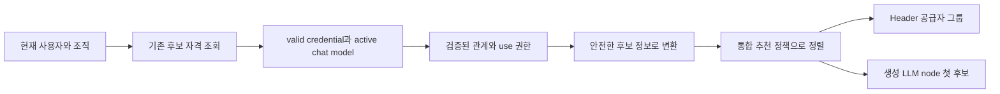

# Agent Builder 통합 모델 추천 정책 설계

> Status: Draft

## 1. 목적

Agent Builder Header에서 처음 선택하는 내부 설계 모델과 새 workflow 초안의 LLM 노드에 넣는 모델이 같은 추천 정책을 따르도록 한다.

이 문서는 MBA-256 구현의 모듈 경계, 정책 입력과 출력, 공급자별 모델 이름 해석, 정렬 순서, 실패 처리, 보안 조건, 테스트 방법을 정의한다. 코드와 테스트는 이 계약에 맞춰 구현했으며, 변경을 포함하는 커밋이 아직 없으므로 `Verified Against`는 기록하지 않는다.

## 2. 해결할 문제

구현 전 두 경로는 같은 사용자와 조직에서 사용할 수 있는 모델 후보를 조회하지만 서로 다른 정렬 함수를 사용했다.

- Header는 공급자별로 최신 세대와 높은 성능 등급을 우선한다.
- 새 workflow 초안은 공급자 순서와 최신 세대 다음에 mini 또는 낮은 등급을 우선한다.
- MBA-240에서 OpenAI `gpt-5.5`를 두 경로의 최우선 예외로 추가했지만, 나머지 후보는 여전히 다르게 정렬된다.

따라서 `gpt-5.5`가 없거나 다른 세대와 등급이 함께 있을 때 Header와 생성 LLM 노드가 다른 모델을 추천할 수 있다. 사용자는 Header에서 본 기본 선택과 실제 생성 결과가 다른 이유를 알기 어렵다.

## 3. 범위

### 3.1 포함 범위

- Header와 생성 LLM 노드가 공유하는 하나의 추천 정책
- Active organization의 `LLMCredential.is_valid=true`, `LLMModel.is_active=true`, `LLMModel.type=chat`, `LLMRelCredentialModel.is_verified=true`, 사용자 credential `use` 권한을 만족한 후보를 사용하되 정규화한 API model ID로 특수 목적이 확정된 모델만 제외
- 공급자별 세대 해석과 제품 등급 분류
- 최신 세대 우선 정렬
- 같은 세대의 `general -> mini -> nano -> pro` 정렬
- 사용할 수 없는 후보를 제외하고 첫 사용 가능 후보 선택
- 사용자의 수동 선택과 기존 node 모델 보존
- 정책 단위 테스트와 두 경로의 계약 동일성 테스트
- 기존 feature 문서와 ADR 갱신

### 3.2 제외 범위

- 기존 workflow와 기존 Agent 모델 backfill
- graph에 credential 또는 secret 저장
- 권한 없는 후보로의 fallback
- 비용, 속도, 품질의 동적 benchmark
- 모델 catalog 또는 credential 관리 기능 재설계
- 데이터 모델과 migration 변경
- Header UI 재설계
- 새로운 provider 등록 체계

## 4. 용어

- **후보 자격 판정**: 사용자가 현재 조직에서 특정 모델과 credential 조합을 사용할 수 있는지 확인하는 과정이다.
- **추천 정책**: 자격을 통과한 후보를 일정한 순서로 배열하고 첫 후보를 고르는 규칙이다.
- **세대**: 모델 ID에서 공급자별 형식으로 읽은 버전의 큰 번호와 작은 번호다. 예를 들어 `gpt-5.5`의 세대는 `(5, 5)`다.
- **제품 등급**: MBA-256의 정렬을 위해 모델 계열을 `general`, `mini`, `nano`, `pro`로 대응시킨 값이다. 실제 성능이나 가격의 측정값이 아니다.
- **결정적 순서**: 입력이 같으면 실행 시점과 데이터베이스 반환 순서에 관계없이 항상 같은 결과를 내는 순서다.

## 5. 설계 원칙

### 5.1 후보 자격 판정과 순위 계산을 분리한다

데이터베이스와 권한에 의존하는 후보 조회는 기존 Gateway service가 맡는다. 추천 정책은 이미 자격을 통과한 후보의 안전한 식별 정보만 받아 순서를 계산한다.

이 분리는 다음 효과가 있다.

- 권한 정책 변경과 모델 이름 정책 변경이 서로 영향을 덜 준다.
- 공급자별 이름 해석을 데이터베이스 없이 단위 테스트할 수 있다.
- Header와 생성 LLM 노드가 실수로 다른 정렬 함수를 선택하는 것을 막을 수 있다.
- API 또는 ORM schema를 정책 모듈에 고정하지 않는다.

### 5.2 하나의 정렬 결과를 두 경로가 공유한다

Header와 생성 LLM 노드는 별도의 추천 key를 만들지 않는다. 같은 후보 집합을 하나의 정책으로 정렬한다.

- Header는 정렬된 후보를 공급자 그룹에 담고 첫 사용 가능 후보를 초기 선택으로 보여 준다.
- 생성 LLM 노드는 같은 전체 순서의 첫 사용 가능 chat model을 새 node에 넣는다.
- LlamaParse는 Header의 상태 표시는 유지하지만 chat model 추천 후보에는 포함하지 않는다.

### 5.3 공급자 간 세대 숫자를 비교하지 않는다

OpenAI, Anthropic, Google의 세대 표기는 서로 다른 제품 체계다. `GPT 5`, `Claude 4`, `Gemini 3`의 숫자를 하나의 점수처럼 비교하면 근거 없는 순위가 된다.

따라서 기존 공개 계약인 공급자 순서를 먼저 적용하고, 세대와 등급은 같은 공급자 안에서만 비교한다.

1. OpenAI
2. Anthropic
3. Google

Header는 이 순서로 그룹을 반환한다. 생성 LLM 노드도 같은 순서를 사용해 첫 사용 가능 공급자로 이동한다.

### 5.4 특수 목적 모델과 이름을 해석하지 못한 chat 모델을 구분한다

DB의 `LLMModel.type=chat`은 provider 동기화 당시 명확히 다른 type으로 판별되지 않은 모델에도 설정될 수 있다. 따라서 이 값만으로 일반 대화용 모델임을 보장하지 않는다.

- Provider별 정책표는 해석 가능한 일반 chat 모델의 세대와 등급을 결정하고, 별도의 명시적 특수 목적 규칙은 Agent Builder에서 사용할 수 없는 모델을 판정한다.
- Sora, audio, transcribe, TTS, speech, Whisper, realtime, live, image, embedding, moderation, search, Codex, computer-use, robotics 계열은 DB type과 무관하게 Agent Builder option과 추천에서 제외한다.
- 특수 목적 판정은 앞뒤 공백 제거, 소문자화, 선행 `models/` 제거 후 `-`, `_`, `.`, `/`, `:`로 나눈 완전한 token 또는 `computer-use` 같은 명시된 연속 token과 provider별 전체 model ID 일치 규칙만 사용한다. 단순 부분 문자열 일치는 사용하지 않는다.
- 정책표가 세대나 tier를 해석하지 못한 verified chat 모델에는 임의의 세대나 등급을 부여하지 않는다. 정규화한 API model ID로 특수 목적이라고 확정할 수 없다면 제거하지 않고 같은 provider의 해석 가능한 모델 뒤에 안정적인 순서로 둔다.
- 전역 model catalog row를 삭제하거나 비활성화하지 않는다.
- 이 구분은 기존 Header API schema를 바꾸지 않는다. Header와 generated LLM node는 같은 후순위 fallback을 사용한다.
- 특수 목적 모델을 제외한 뒤 자격 있는 chat 모델이 하나도 없을 때만 후보 없음 계약을 따른다.

## 6. 모듈 경계

### 6.1 책임 배치

| 모듈 | 책임 | 알면 안 되는 정보 |
| --- | --- | --- |
| Agent Builder API endpoint | 요청 파싱, 인증 의존성, service 호출, 응답 반환 | 모델 이름 해석 규칙, ORM query 세부사항 |
| `LLMService.get_agent_answer_options()` | 조직 범위, credential validity, active chat model, verified relation, `use` 권한에 따른 후보 조회 | Header와 생성 node별 정렬 차이 |
| 통합 추천 정책 | 공급자/세대/등급 해석, 결정적 정렬, 첫 후보 선택 | DB session, ORM model, FastAPI, provider SDK, secret |
| `LLMService`의 Agent Builder 연결 메서드 | 자격 후보를 정책 입력으로 바꾸고 결과를 기존 response schema로 조립 | 별도 추천 규칙 |
| Agent Builder 초안 생성 service | 새 LLM node에 추천 모델 ID 적용, 후보 없음 처리 | credential 원문, 공급자별 parsing 구현 |
| Client Header | 서버가 준 그룹 표시, 초기값 설정, 사용자 수동 선택 유지 | 권한 판단, 숨은 fallback 정책 |

### 6.2 새 정책 모듈

예상 위치는 다음과 같다.

`apps/gateway/application/agent_builder/model_recommendation_policy.py`

이 위치를 선택하는 이유는 두 호출 경로가 모두 Gateway의 Agent Builder 기능이고, 정책을 Workflow Engine 또는 Shared에서 사용할 요구사항이 없기 때문이다. `apps/shared`로 옮기면 필요하지 않은 서비스까지 이 정책에 결합된다.

정책은 Python 표준 라이브러리와 자체 불변 자료형만 사용할 수 있다. SQLAlchemy, Pydantic response schema, FastAPI, credential service, provider SDK와 outer adapter를 import하지 않는다. 이 규칙은 architecture import-boundary 테스트로 고정한다.

## 7. 정책 계약

### 7.1 입력

각 후보는 다음 안전한 값만 제공한다.

| 필드 | 용도 |
| --- | --- |
| `provider_name` | 공급자 정책 선택과 공급자 순서 |
| `model_id` | 세대와 등급 해석, 실행용 모델 식별 |
| `model_name` | 동률 해소용 표시 이름 |
| `relation_priority` | 검증된 credential-model 관계의 기존 우선순위 |
| `credential_name` | 같은 모델에 여러 credential이 있을 때 안정적 동률 해소 |
| `model_stable_id` | 최종 동률 해소 |
| `credential_stable_id` | 최종 동률 해소 |

입력에는 API key, token, `encrypted_config`, credential 설정 내용, provider raw payload를 포함하지 않는다.

### 7.2 출력

정책은 다음 중 하나의 형태로 제공할 수 있다.

- 전체 후보의 결정적인 정렬 결과
- 한 후보의 정렬 key
- 정렬 결과의 첫 후보

실제 구현에서는 Header 그룹과 생성 node가 같은 전체 순서를 재사용할 수 있도록 공개 함수 수를 최소화한다. 호출자가 자체 등급 판단이나 별도 예외를 추가할 수 없게 한다.

### 7.3 불변 조건

- 자격을 통과하지 않은 후보를 정책이 새로 만들지 않는다.
- 같은 입력 집합은 입력 순서와 무관하게 같은 결과를 낸다.
- 최신 세대 우선은 제품 등급 우선보다 강하다.
- 제품 등급은 같은 공급자와 같은 세대 안에서만 비교한다.
- 정책은 사용자가 이미 선택한 값을 변경하지 않는다.
- 정책은 credential 원문을 읽거나 반환하지 않는다.

## 8. 공급자 정책표

### 8.1 공통 등급 순서

| 등급 | 정렬 순서 | 의미 |
| --- | ---: | --- |
| `general` | 0 | 공급자의 일반 목적 기본 계열 |
| `mini` | 1 | 공급자의 소형 또는 경량 계열 |
| `nano` | 2 | 공급자의 초경량 계열 |
| `pro` | 3 | 공급자의 고성능 또는 상위 계열 |

이 순서는 MBA-256의 제품 추천 정책이며 실제 성능, 가격, context window 또는 benchmark 순위가 아니다. 정책표가 등급을 확정하지 못하면 임의의 `unknown` tier를 부여하지 않고 해석 가능한 모델 뒤의 별도 미분류 구간에 안정적으로 둔다.

### 8.2 OpenAI

| 이름 형태 | 세대 해석 | 등급 |
| --- | --- | --- |
| `gpt-<major>[.<minor>]` | 숫자 부분 | `general` |
| `gpt-<major>[.<minor>]-mini` | 숫자 부분 | `mini` |
| `gpt-<major>[.<minor>]-nano` | 숫자 부분 | `nano` |
| `gpt-<major>[.<minor>]-pro` | 숫자 부분 | `pro` |
| `gpt-<major>o` | 큰 번호와 minor `0` | `general` |
| `gpt-<major>o-mini` | 큰 번호와 minor `0` | `mini` |
| `o<major>[.<minor>]` | 숫자 부분 | `general` |
| `o<major>[.<minor>]-mini` | 숫자 부분 | `mini` |
| `o<major>[.<minor>]-nano` | 숫자 부분 | `nano` |
| `o<major>[.<minor>]-pro` | 숫자 부분 | `pro` |

비교 전 앞뒤 공백을 제거하고 소문자로 바꾸며, 선행 `models/`가 있으면 비교용 값에서만 제거한다. 날짜, release, `preview`, `latest` suffix는 세대와 tier 계산에서 제외할 수 있지만 실제 호출과 저장에 사용하는 원래 model ID는 변경하지 않는다. 예를 들어 `gpt-5.5-2026-04-23`은 5.5세대 general의 날짜 snapshot으로 분류하되 해당 ID 전체를 유지한다. 허용한 이름 형태 뒤에 `codex`, `search`, `audio`, `transcribe`, `tts`, `speech`, `whisper`, `realtime`, `live`, `computer-use` 같은 특수 용도 표기가 완전한 token이나 명시된 연속 token으로 붙으면 앞부분만 보고 일반 대화 모델로 오인하지 않고 제외한다. Provider별 예외가 필요하면 정규화한 model ID 전체에 일치하는 명시적 규칙으로만 추가한다. `gpt-livestream`, `gpt-researcher`, `gpt-audiophile`처럼 금지 token의 문자열 일부만 포함한 ID는 특수 목적으로 판정하지 않는다.

### 8.3 Anthropic

| 이름 형태 | 세대 해석 | 등급 |
| --- | --- | --- |
| `claude-sonnet-<major>[-<minor>]` | 숫자 부분 | `general` |
| `claude-haiku-<major>[-<minor>]` | 숫자 부분 | `mini` |
| 대응 계열 없음 | 해당 없음 | `nano` 없음 |
| `claude-opus-<major>[-<minor>]` | 숫자 부분 | `pro` |
| `claude-fable-<major>[-<minor>]` | 숫자 부분 | `pro` |
| `claude-<major>[-<minor>]-sonnet` | 숫자 부분 | `general` |
| `claude-<major>[-<minor>]-haiku` | 숫자 부분 | `mini` |
| `claude-<major>[-<minor>]-opus` | 숫자 부분 | `pro` |

Anthropic의 제품명은 OpenAI suffix와 구조가 다르므로 이름을 작은 명시적 표로 대응한다. `claude-sonnet-4-5-20250929`와 `claude-3-5-sonnet-latest`처럼 제품명 우선 또는 세대명 우선 형식에 날짜나 상태가 붙어도 세대와 tier를 해석하되 원래 ID를 유지한다. 표에 없는 계열은 추측하지 않고 같은 provider의 해석 가능한 모델 뒤에 둔다.

### 8.4 Google

| 이름 형태 | 세대 해석 | 등급 |
| --- | --- | --- |
| `gemini-<major>[.<minor>]` 기본형 | 숫자 부분 | `general` |
| `gemini-<major>[.<minor>]-flash` | 숫자 부분 | `mini` |
| `gemini-<major>[.<minor>]-flash-lite` | 숫자 부분 | `nano` |
| `gemini-<major>[.<minor>]-pro` | 숫자 부분 | `pro` |

`flash-lite`는 `flash`보다 먼저 검사해 잘못 `mini`로 분류하지 않는다. `gemini-3.1-pro-preview`처럼 release 상태가 붙은 이름은 3.1세대 pro로 해석하되 원래 ID를 유지한다.

### 8.5 같은 세대와 등급의 model ID 상태 순서

| model ID 상태 | 정렬 순서 | 예시 |
| --- | ---: | --- |
| suffix 없는 기본형 | 0 | `gpt-5.5` |
| 날짜 또는 명시 release snapshot | 1 | `gpt-5.5-2026-04-23` |
| `preview` | 2 | `gemini-3.1-pro-preview` |
| `latest` | 3 | `claude-3-5-sonnet-latest` |

이 순서는 같은 provider, 세대와 tier 안에서만 적용한다. 상태가 다른 후보도 실제 호출과 graph 저장에는 원래 model ID를 사용한다.

## 9. 정렬 규칙

각 후보의 정렬 key는 개념적으로 다음 순서다.

1. 공급자 순서
2. 세대 해석 가능 여부
3. 세대 큰 번호 내림차순
4. 세대 작은 번호 내림차순
5. 제품 등급 오름차순
6. model ID 상태 순서: 기본형, 날짜 또는 release snapshot, `preview`, `latest`
7. 관계 우선순위 오름차순
8. 정규화한 모델 표시 이름 오름차순
9. 정규화한 credential 표시 이름 오름차순
10. 안정적 모델 ID 오름차순
11. 안정적 credential ID 오름차순

예를 들어 같은 OpenAI 후보가 있으면 다음과 같다.

| 후보 | 상대 순서 이유 |
| --- | --- |
| `gpt-5.6-pro` | 세대가 더 최신이므로 등급과 무관하게 먼저 |
| `gpt-5.5` | 같은 5.5 계열의 `general` |
| `gpt-5.5-2026-04-23` | 같은 세대와 tier의 날짜 snapshot |
| `gpt-5.5-preview` | 같은 세대와 tier의 preview |
| `gpt-5.5-latest` | 같은 세대와 tier의 latest alias |
| `gpt-5.5-mini` | 같은 5.5 계열의 `mini` |
| `gpt-5.5-nano` | 같은 5.5 계열의 `nano` |
| `gpt-5.5-pro` | 같은 5.5 계열의 `pro` |

`gpt-5.3-codex`, `sora-2`처럼 특수 목적이 확정된 모델은 이 정렬표에 들어오지 않는다. `gpt-custom`처럼 특수 목적이라고 확정할 수 없는 verified chat 모델은 세대와 tier를 추측하지 않고 OpenAI의 해석 가능한 후보 뒤에 둔다.

MBA-240의 `gpt-5.5` 우선 사례는 같은 세대의 general 우선 규칙으로 충족한다. 최신 세대가 추가되면 특정 `gpt-5.5` 예외보다 최신 세대 규칙이 우선한다.

## 10. 처리 흐름

### 10.1 공통 후보와 정책 흐름

### 10.2 Header

1. Gateway는 현재 사용자와 활성 조직으로 DB 자격 후보를 조회한다.
2. 통합 정책이 일반 대화용으로 확정한 후보만 남기고 정렬한다.
3. 기존 API 계약에 맞춰 공급자 그룹으로 묶는다.
4. Client는 첫 사용 가능 option을 초기 선택한다.
5. 사용자가 다른 option을 고르면 그 선택을 유지한다.
6. 메시지 요청 시 현재 상태와 권한을 다시 검증한다.

Header에 후보가 없으면 기존처럼 전송을 막고 설정 필요 상태를 보여 준다. 권한 없는 숨은 fallback을 만들지 않는다. Header에서 사용자가 고른 option은 요청별 intent planner 실행에만 사용하고 generated LLM node의 model로 복사하지 않는다.

### 10.3 새 workflow 초안의 LLM node

1. Gateway는 Header와 같은 DB 자격 후보 조회, 일반 대화용 필터와 통합 정렬을 사용한다.
2. 정렬된 chat model 후보의 첫 항목을 추천한다.
3. 새 LLM node에는 실행용 model ID만 기록한다.
4. 후보가 없으면 기존처럼 모델 미결정 상태를 유지하고 생성 결과에 안내를 포함한다.
5. Direct-edit flow에서는 추천 model을 active editor graph에 반영하고 사용자가 Node Detail Panel에서 바꿀 수 있다. 사용자가 명시적으로 변경한 model을 추천 정책이 다시 덮어쓰지 않는다.

이미 존재하는 node 또는 기존 workflow에는 이 정책을 소급 적용하지 않는다.

## 11. API 영향

기존 API의 path, request, response schema는 변경하지 않는다.

- Header 모델 옵션 응답의 공급자 그룹 구조를 유지한다.
- 각 option의 model, credential 표시 정보, provider 이름, 관계 우선순위 구조를 유지한다.
- 변경되는 것은 서버가 확실한 특수 목적 모델을 Agent Builder option에서 제외하는 방식, option 배열 순서와 그 결과로 정해지는 초기 추천뿐이다. 이름을 해석하지 못한 verified chat option과 전역 model catalog API는 유지한다.
- 생성 workflow graph의 LLM node는 기존 field에 model ID를 기록한다.

API schema 변경이 발견되면 MBA-256 범위에서 임의로 확장하지 않고 `api_spec.md`, Client 타입, 테스트의 영향을 다시 검토한다.

## 12. 데이터와 보안

### 12.1 데이터 모델

- 새 table 또는 column이 필요하지 않다.
- migration을 추가하지 않는다.
- 기존 credential-model 관계와 권한 정보를 읽기만 한다.
- 기존 workflow graph를 일괄 수정하지 않는다.

### 12.2 보안 조건

- 현재 활성 조직 밖의 후보를 반환하지 않는다.
- `LLMCredential.is_valid=false`, `LLMModel.is_active=false`, non-chat model, `LLMRelCredentialModel.is_verified=false` 후보를 제외한다.
- `use` 권한이 없는 credential을 제외한다.
- 정규화한 API model ID로 특수 목적이 확정된 모델은 Agent Builder 후보에서 제외하고, 이름을 해석하지 못한 verified chat 모델은 임의 등급 없이 후순위로 유지한다.
- 권한 있는 후보가 없을 때 권한 없는 후보로 fallback하지 않는다.
- 추천 정책 입력과 출력에 API key, token, `encrypted_config`, credential 설정 원문을 포함하지 않는다.
- graph에는 credential이 아니라 model ID만 기록한다.
- 로그와 테스트 fixture에 secret 또는 raw provider payload를 남기지 않는다.

## 13. 실패와 경계 사례

| 상황 | 기대 동작 |
| --- | --- |
| OpenAI 후보 없음 | Anthropic의 첫 자격 후보를 확인한다. |
| OpenAI와 Anthropic 후보 없음 | Google의 첫 자격 후보를 확인한다. |
| 모든 자동 추천 후보 없음 | Header는 설정 필요 상태로 전송을 차단하고, 생성 node는 `model_id`가 비어 있는 `configuration_state=unresolved`와 설정 필요 warning을 유지한다. |
| 모델 이름의 세대 또는 등급 해석 실패 | 요청 전체를 실패시키거나 모델을 제거하지 않고, 해당 provider의 해석 가능한 후보 뒤에 안정적으로 둔다. |
| DB에서 `chat`으로 분류된 특수 모델 | 전역 catalog row는 유지하고 Agent Builder option과 자동 추천에서 제외한다. |
| 같은 모델에 여러 credential | 관계 우선순위와 안정적인 보조 key로 하나를 먼저 둔다. |
| 사용자가 추천 뒤 다른 모델 선택 | 사용자 선택을 유지한다. |
| 선택 뒤 권한 또는 활성 상태 변경 | 실행 또는 메시지 요청의 기존 재검증에서 거부한다. |
| `gpt-5.5`와 같은 세대 변형 공존 | `gpt-5.5`, mini, nano, pro 순서다. |
| `gpt-5.6-pro`와 `gpt-5.5` 공존 | 최신 세대인 `gpt-5.6-pro`가 먼저다. |

## 14. 테스트 설계

### 14.1 순수 정책 단위 테스트

- 공급자명과 모델 ID 정규화
- OpenAI, Anthropic, Google 세대 해석
- 공급자별 등급표 대응
- `flash-lite`와 `flash` 구분
- 최신 세대가 제품 등급보다 먼저임
- 같은 세대의 `general -> mini -> nano -> pro`
- 같은 세대와 tier의 기본형, 날짜 또는 release snapshot, `preview`, `latest` 순서
- 특수 목적 model ID의 완전한 token·명시된 연속 token·provider별 전체 일치 판정과 단순 부분 문자열 오탐 방지
- 특수 목적 모델 제외, 미분류 verified chat 모델 후순위 유지와 전역 catalog 비변경
- 현재 지원 ID인 `gpt-4o`, `gpt-4o-mini`, `o4-mini`, `claude-3-5-sonnet-latest` 호환성
- 입력 순서를 섞어도 결과가 같음
- 관계 우선순위와 안정적 동률 해소

### 14.2 Gateway service 테스트

- Active organization에 속한 후보만 남음
- `LLMCredential.is_valid=true`, `LLMModel.is_active=true`, `LLMModel.type=chat` 후보만 남음
- `LLMRelCredentialModel.is_verified=true` 관계만 남음
- `use` 권한이 있는 후보만 남음
- Header와 생성 node가 동일 후보 집합에서 같은 첫 모델을 선택함
- 가장 높은 순위 후보가 invalid, inactive, non-chat, unverified 또는 permission denied이면 같은 provider의 다음 자격 후보를 선택함
- OpenAI가 없을 때 Anthropic, Google 순서로 이동함
- 후보가 없을 때 Header 전송 차단과 generated node unresolved 상태를 구분해 유지
- MBA-240의 `gpt-5.5` 회귀
- 더 최신 세대가 있을 때 최신 세대 선택

### 14.3 API와 Client 테스트

- Header option API schema와 공급자 그룹 순서 유지
- Header 초기값이 서버 정렬의 첫 사용 가능 후보임
- 사용자가 다른 Header 모델을 선택할 수 있음
- 사용자의 선택을 재조회가 불필요하게 덮어쓰지 않음
- Header에서 바꾼 planner model을 generated LLM node model로 복사하지 않음
- 권한 없는 model/credential이 화면 데이터에 없음
- 기존 전송 차단과 설정 필요 상태 유지

### 14.4 초안 생성 테스트

- 새 LLM node가 통합 정책의 첫 model ID를 가짐
- 기존 node의 model ID를 변경하지 않음
- 여러 새 LLM node에 같은 정책을 결정적으로 적용함
- Direct-edit로 반영된 model을 일반 Workflow Editor에서 변경할 수 있고 추천 정책이 명시적 변경을 덮어쓰지 않음
- 후보가 없으면 credential을 graph에 넣지 않고 미결정 상태를 유지함
- graph에 secret-like 값이 없음

### 14.5 Architecture 테스트

- `apps/gateway/application/agent_builder`가 SQLAlchemy, FastAPI, Pydantic response schema, provider SDK, credential service와 outer adapter를 import하지 않음

## 15. 문서 갱신 원칙

구현과 함께 다음 문서의 MBA-240 임시 분리 규칙을 MBA-256 통합 규칙으로 바꿨다.

- ADR-0040: 두 추천 경로의 최종 정책 결정. ADR-0025는 MBA-240 당시 기록을 보존하고 `Superseded` 상태로 전환
- `requirements.md`: 검증 가능한 모델 추천 요구사항
- `api_spec.md`: schema 불변과 option 순서 의미
- `component_spec.md`: Header 초기 선택, 사용자 선택 보존, 생성 node 적용
- `test_cases.md`: 공급자별 해석, 정렬, 두 경로 동일성, 권한 회귀
- `mba-240_default_model_design.md`: 당시 범위는 보존하고 `Superseded` 상태와 MBA-256 대체 링크를 기록

실제 코드와 테스트를 확인하고 변경을 포함하는 커밋을 만든 뒤에만 `Verified Against`를 갱신한다.

## 16. 구현 및 배포 순서

1. ADR-0025 본문은 MBA-240 당시 기록으로 보존하고 `Superseded`로 전환하며, ADR-0040과 Agent Builder 권위 문서에 MBA-256 통합 계약을 기록한다.
2. 현재 API, Preview 읽기 전용, Header 선택 비전파와 기존 node 보존 동작을 회귀 테스트로 고정한다.
3. 순수 추천 정책과 공급자 정책표를 구현한다.
4. `LLMService`의 Header 경로를 통합 정책에 연결한다.
5. 생성 LLM node 추천 경로를 같은 정책에 연결한다.
6. 전용 `gpt-5.5` 예외와 중복 정렬 함수를 제거한다.
7. Gateway, Agent Builder, Client 및 architecture import-boundary 테스트를 실행한다.
8. 구현 결과에 맞춰 diff, secret 노출, 범위 초과 여부를 검토하고, 변경을 포함하는 커밋이 생기면 문서의 `Verified Against`를 갱신한다.

별도 feature flag나 데이터 migration은 필요하지 않다. 변경은 추천 순서에만 영향을 주며 사용자가 저장한 기존 모델을 바꾸지 않는다.

## 17. 주요 위험과 대응

| 위험 | 대응 |
| --- | --- |
| 공급자 모델 이름이 새 형식으로 변경됨 | 특수 목적이라고 확정되지 않으면 후순위로 유지하고 작은 정책표와 현재 catalog 호환성 테스트를 갱신한다. |
| 두 호출부 중 하나가 다시 자체 정렬을 추가함 | 공개 정책 함수를 하나로 제한하고 두 경로 동일성 테스트를 둔다. |
| 공급자 간 세대 숫자를 잘못 비교함 | 공급자 순서를 먼저 적용하고 세대는 공급자 안에서만 비교한다. |
| 기존 `gpt-5.5` 동작이 깨짐 | MBA-240 회귀 테스트를 유지한다. |
| 특정 모델에 영구 고정됨 | 최신 세대 우선 테스트를 두고 전용 모델 예외를 제거한다. |
| 권한 없는 fallback이 생김 | 정책 전에 기존 후보 자격 조회를 강제하고 후보 없음 사례를 테스트한다. |
| credential 정보가 graph에 유입됨 | 정책 입력을 안전한 표시/식별 정보로 제한하고 graph 보안 테스트를 둔다. |

## 18. 결정 사항

- 추천 정책은 Gateway Agent Builder application 경계에 둔다.
- 후보 자격 조회는 기존 `LLMService`에서 유지한다.
- Header와 생성 LLM node는 하나의 정렬 결과를 사용한다.
- 공급자 순서는 OpenAI, Anthropic, Google을 유지한다.
- 최신 세대가 제품 등급보다 우선한다.
- 같은 세대는 `general`, `mini`, `nano`, `pro` 순서다.
- 같은 세대와 tier에서는 기본형, 날짜 또는 release snapshot, `preview`, `latest` 순서다.
- 공급자별 등급 대응은 명시적 작은 표로 관리한다.
- 특수 목적 모델은 Agent Builder option과 추천에서 제외하고, 미분류 verified chat 모델은 추측하지 않은 채 후순위로 유지한다.
- `gpt-5.5` 전용 예외는 일반 규칙의 회귀 테스트로 대체한다.
- 사용자 선택과 기존 node 모델은 자동 변경하지 않는다.
- API schema, DB schema, graph의 credential 저장 계약은 변경하지 않는다.
