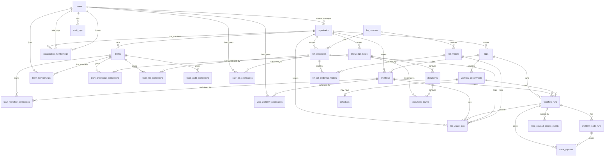

# 데이터 모델 개요 다이어그램

Status: Draft
Authority: Data Model Diagram
Source of Truth: No
Verified Against: dev @ 860ece0dee7cab3925d27f30ea650baf0cb18b4e (PR #138 docs target, 2026-07-01 KST)

이 문서는 [physical-data-model.md](../physical-data-model.md)의 현재 코드 table 참조관계를 시각화한 보조 문서다. 구현 기준은 Mermaid 다이어그램이 아니라 물리 데이터 모델 문서의 table, column, relationship 설명이다.

`organization_memberships`는 현재 organization scope와 manager 판정의 우선 기준이다. Team permission 계산에는 `team_memberships`를 계속 사용한다. Organization member/invitation BE API는 구현됐고, full membership 관리 UI는 후속 범위다. `user_knowledge_permissions`, `user_audit_permissions`는 MVP 2/3 planned additive table이므로 현재 코드 기준 다이어그램에서는 제외한다.

