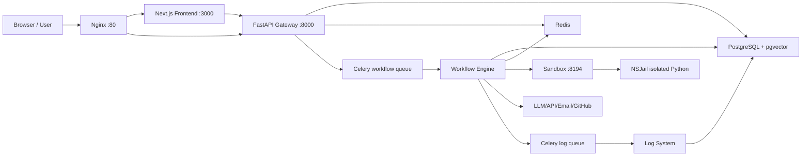

# 런타임 아키텍처

> Status: Reference-only historical document.
>
> 이 문서는 과거 `main` 브랜치 기준 역공학 산출물이다. 현재 구현 기준은 active `docs/` 문서와 코드를 따른다.

## 서비스 구성

## Gateway 시작 흐름

확정 근거: `apps/gateway/lifespan.py`

1. PostgreSQL `vector` extension 생성
2. `Base.metadata.create_all(bind=engine)` 호출
3. 개발용 placeholder user seed
4. 기본 LLM provider seed
5. 기본 LLM model seed 및 가격 동기화
6. `SchedulerService` 초기화
7. 종료 시 scheduler shutdown

주의:

- Alembic 마이그레이션도 존재하지만 Gateway 시작 시 `create_all`도 실행된다. 운영 DB에서는 마이그레이션/자동 생성 정책을 명확히 분리할 필요가 있다.

## 요청 처리 기본 흐름

1. Browser가 Next.js로 접근한다.
2. Next.js는 `/api/:path*` 요청을 `API_URL` 또는 기본 `http://localhost:8000` Gateway로 rewrite한다.
3. API 인증은 대부분 `auth_token` HttpOnly 쿠키를 사용한다.
4. Gateway는 DB, Redis, Celery, 외부 API를 조합해 처리한다.
5. 긴 워크플로우 실행은 Celery 태스크로 Workflow Engine에 위임된다.

## 워크플로우 테스트 실행 흐름

확정 근거:

- `apps/client/app/features/workflow/api/workflowApi.ts`
- `apps/client/app/stream-api/workflows/[workflowId]/route.ts`
- `apps/gateway/api/v1/endpoints/workflow.py`
- `apps/workflow_engine/tasks.py`
- `apps/shared/pubsub.py`

흐름:

1. Client가 `/stream-api/workflows/{workflowId}`로 요청한다.
2. Next API Route가 Gateway `/api/v1/workflows/{workflowId}/stream`으로 요청을 전달한다.
3. Gateway는 run id를 만들고 Celery `workflow.stream` 태스크를 보낸다.
4. Workflow Engine이 `WorkflowEngine.execute_stream()`을 실행한다.
5. 각 노드 시작/종료/에러/완료 이벤트를 Redis Pub/Sub `workflow:{run_id}` 채널로 발행한다.
6. Gateway가 Pub/Sub 이벤트를 SSE로 Client에 전달한다.

## 배포 실행 흐름

확정 근거:

- `apps/gateway/services/deployment_service.py`
- `apps/gateway/api/v1/endpoints/run.py`
- `apps/gateway/api/v1/endpoints/webhook.py`

REST API 실행:

1. 외부 클라이언트가 `/api/v1/run/{url_slug}` 호출
2. `Authorization: Bearer <secret>` 또는 `X-Auth-Secret`에서 secret 추출
3. App의 `auth_secret`과 요청 secret 비교
4. App의 `active_deployment_id`로 활성 배포 조회
5. 배포의 `graph_snapshot`을 Celery `workflow.execute`로 실행
6. 결과를 대기 후 반환

주의: `run.py`는 REST API 실행에 `trigger_mode="api"`를 넘기지만, 현재 `DeploymentService.run_deployment()` 내부 `execution_context`는 `trigger_mode`를 `"app"`으로 고정한다.

공개 WebApp/Widget 실행:

1. Client가 `/api/v1/run-public/{url_slug}` 호출
2. `require_auth=False`로 실행
3. App의 `active_deployment_id`로 활성 배포 조회
4. 배포의 `graph_snapshot`을 Celery `workflow.execute`로 실행
5. 결과를 대기 후 반환

Webhook 실행:

1. 외부 시스템이 `/api/v1/hooks/{url_slug}` 호출
2. `token` query, `Authorization: Bearer <secret>`, `X-Webhook-Secret` 중 하나로 인증 처리
3. payload를 Celery `workflow.execute_by_deployment`로 전달
4. Workflow Engine에서 `webhookTrigger` 시작 노드가 `variable_mappings`를 적용해 payload 값을 워크플로우 입력으로 변환

로그 주의: Webhook 실행 context에는 `trigger_mode=webhook`이 들어가지만, 현재 `apps/log_system/tasks.py`의 `log.create_run` 정규화는 `webhook`을 `RunTriggerMode.WEBHOOK`으로 매핑하지 않는다. 배포 실행이면 fallback으로 `api`로 기록될 수 있다.

## 스케줄 실행 흐름

확정 근거:

- `apps/gateway/services/deployment_service.py`
- `apps/gateway/services/scheduler_service.py`
- `apps/shared/db/models/schedule.py`

1. 배포 생성 시 graph snapshot에서 `scheduleTrigger` 노드 탐색
2. 발견되면 `schedules` 레코드 생성
3. APScheduler에 cron job 등록
4. 지정 시간에 `workflow.execute` 태스크를 Redis/Celery로 발행
5. 실행 context에는 `trigger_mode=schedule`, `deployment_id`, `schedule_id`, `triggered_at` 포함

로그 주의: `workflow_runs.trigger_mode` enum 값은 `scheduler`지만 SchedulerService가 전달하는 문자열은 `schedule`이다. 현재 `log.create_run` 정규화는 `schedule`/`scheduler`를 별도 매핑하지 않아 배포 실행 로그가 `api`로 fallback될 수 있다.

## 로그 기록 흐름

확정 근거:

- `apps/workflow_engine/workflow/core/workflow_logger.py`
- `apps/log_system/tasks.py`
- `apps/shared/celery_app.py`

1. Workflow Engine이 run log와 node log 작업을 생성한다.
2. `log.*` Celery queue로 Log System 태스크가 실행된다.
3. `workflow_runs`, `workflow_node_runs`에 상태/입력/출력/에러/시간이 반영된다.
4. 실행 완료 시 LLM 사용량 로그를 집계해 run의 total token/cost를 계산한다.

## Redis 사용

| 용도 | 설정/코드 |
| --- | --- |
| Celery broker | `apps/shared/celery_app.py`, Redis DB 0 기본 |
| Celery result backend | `apps/shared/celery_app.py`, Redis DB 1 기본 |
| Workflow event Pub/Sub | `apps/shared/pubsub.py` |
| Knowledge progress | `apps/gateway/services/ingestion/service.py`, key `knowledge_progress:{document_id}` |

## PostgreSQL 사용

- DB 접속 정보는 `DB_HOST`, `DB_PORT`, `DB_USER`, `DB_PASSWORD`, `DB_NAME` 기반으로 구성된다.
- `pgvector` extension을 Gateway lifespan에서 생성한다.
- DB 모델은 `apps/shared/db/models`에 있다.

## 외부 통신

| 외부 대상 | 사용처 |
| --- | --- |
| LLM provider API | LLM node, prompt/code/template wizard, model sync |
| LlamaParse/LlamaCloud | PDF 고급 파싱 |
| AWS S3 | CLOUD storage mode 파일 업로드 |
| GitHub API | GitHub node |
| IMAP 서버 | Mail node |
| 임의 HTTP API | HTTP request node, API ingestion |
| 외부 DB | Connector, DB ingestion |

## 주의/검증 필요

- Docker Compose 운영 구성은 Nginx를 단일 진입점으로 사용한다. 개발 스크립트는 Gateway와 Client를 로컬 프로세스로 띄우고 Postgres/Redis/Sandbox만 Compose로 띄운다.
- `dev/docker-compose.yml`의 Sandbox healthcheck는 `/health`를 보지만 실제 Sandbox API는 `/v1/sandbox/health`와 root `/health` 둘 다 존재한다.
- Squid proxy가 Compose에 포함되어 있으나 실제 요청별 proxy 적용 범위는 각 서비스 환경변수에 의존한다.
