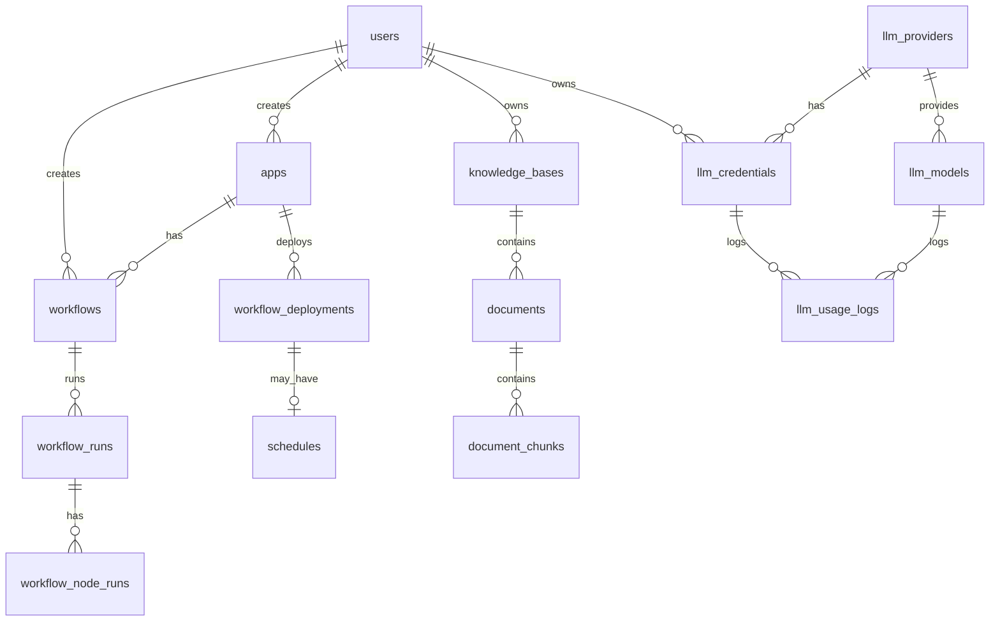

# 데이터 모델

> Status: Reference-only historical document.
>
> 이 문서는 과거 `main` 브랜치 기준 역공학 산출물이다. 현재 구현 기준은 active `docs/` 문서와 코드를 따른다.

기준 파일: `apps/shared/db/models/*.py`

## ERD 개요

## users

파일: `apps/shared/db/models/user.py`

| 필드 | 설명 |
| --- | --- |
| `id` | UUID PK |
| `email` | unique, indexed |
| `name` | 표시 이름 |
| `password` | 이메일 로그인용 hashed password, nullable |
| `social_provider` | `none`, `google` 등 |
| `social_id` | 소셜 provider ID, unique nullable |
| `avatar_url` | 소셜 avatar |
| `created_at`, `updated_at` | timezone datetime |

주의:

- 주석에 tenant_id TODO가 있다. 현재 모델에는 tenant_id가 없다.

## apps

파일: `apps/shared/db/models/app.py`

| 필드 | 설명 |
| --- | --- |
| `id` | UUID PK |
| `tenant_id` | nullable UUID. 서비스에서는 없으면 user_id 사용 |
| `name` | 앱 이름 |
| `description` | 설명 |
| `icon` | JSONB icon 정보 |
| `workflow_id` | 연결된 대표 workflow |
| `active_deployment_id` | 현재 활성 배포 |
| `url_slug` | public/API endpoint slug, unique |
| `auth_secret` | API/Webhook 인증 secret |
| `is_api_enabled` | API 활성화 여부 |
| `api_req_per_minute`, `api_req_per_hour` | rate limit 설정값 |
| `is_market` | 마켓 공개 여부 |
| `forked_from` | 복제 원본 app id |
| `created_by` | users FK |
| `created_at`, `updated_at` | timestamps |

관계/속성:

- `active_deployment` viewonly relationship
- `active_deployment_type` property

## workflows

파일: `apps/shared/db/models/workflow.py`

| 필드 | 설명 |
| --- | --- |
| `id` | UUID PK |
| `tenant_id` | nullable UUID |
| `app_id` | apps FK |
| `graph` | JSONB. nodes, edges, viewport |
| `features` | JSONB |
| `env_variables` | JSONB |
| `runtime_variables` | JSONB |
| `created_by`, `updated_by` | users FK |
| `created_at`, `updated_at` | timestamps |

## workflow_deployments

파일: `apps/shared/db/models/workflow_deployment.py`

| 필드 | 설명 |
| --- | --- |
| `id` | UUID PK |
| `app_id` | apps FK, cascade delete |
| `version` | app 기준 배포 버전 |
| `type` | `DeploymentType` |
| `graph_snapshot` | 배포 시점 workflow graph |
| `config` | 배포 설정 JSON |
| `input_schema` | Start/Webhook 입력 schema |
| `output_schema` | Answer 출력 schema |
| `description` | 배포 설명 |
| `created_by` | users FK |
| `created_at` | timestamp |
| `is_active` | 활성 여부 |

DeploymentType:

- `api`
- `webapp`
- `widget`
- `mcp`
- `workflow_node`
- `schedule`
- `webhook`

## schedules

파일: `apps/shared/db/models/schedule.py`

| 필드 | 설명 |
| --- | --- |
| `id` | UUID PK |
| `deployment_id` | workflow_deployments FK, unique, cascade delete |
| `node_id` | snapshot 내 ScheduleTrigger node id |
| `cron_expression` | 5-field cron |
| `timezone` | default UTC |
| `last_run_at`, `next_run_at` | 실행 이력/예정 |
| `created_at`, `updated_at` | timestamps |

## workflow_runs

파일: `apps/shared/db/models/workflow_run.py`

| 필드 | 설명 |
| --- | --- |
| `id` | UUID PK |
| `workflow_id` | workflows FK |
| `user_id` | users FK |
| `deployment_id` | workflow_deployments FK nullable |
| `workflow_version` | 배포 버전 snapshot |
| `status` | `RunStatus` |
| `trigger_mode` | `RunTriggerMode` |
| `inputs` | 실행 입력 JSON |
| `outputs` | 실행 출력 JSON |
| `error_message` | 실패 메시지 |
| `started_at`, `finished_at`, `duration` | 실행 시간 |
| `meta_info` | 확장 메타데이터 |
| `total_tokens`, `total_cost` | LLM 사용량 집계 |

RunStatus:

- `running`
- `success`
- `failed`
- `stopped`

RunTriggerMode:

- `manual`
- `api`
- `webhook`
- `scheduler`
- `app`

주의:

- enum에는 `webhook`, `scheduler`, `app`이 있지만 `apps/log_system/tasks.py`의 현재 `log.create_run` 정규화는 `manual`, `api`, `app`, `deployed`만 명시적으로 처리한다.
- `app`은 `RunTriggerMode.API`로 매핑된다.
- Webhook context의 `webhook`, SchedulerService context의 `schedule`은 현재 명시 매핑이 없어 배포 실행이면 `api`로 fallback될 수 있다.

## workflow_node_runs

| 필드 | 설명 |
| --- | --- |
| `id` | UUID PK |
| `workflow_run_id` | workflow_runs FK |
| `node_id` | 그래프 내 node id |
| `node_type` | startNode, llmNode 등 |
| `status` | `NodeRunStatus` |
| `inputs` | 노드 입력 |
| `process_data` | 노드 설정 snapshot |
| `outputs` | 노드 출력 |
| `error_message` | 실패 메시지 |
| `started_at`, `finished_at` | 실행 시간 |

NodeRunStatus:

- `running`
- `success`
- `failed`
- `skipped`

## knowledge_bases

파일: `apps/shared/db/models/knowledge.py`

| 필드 | 설명 |
| --- | --- |
| `id` | UUID PK |
| `name` | 이름 |
| `description` | 설명 |
| `embedding_model` | default `text-embedding-3-small` |
| `top_k` | 검색 기본 top k |
| `similarity_threshold` | 검색 threshold |
| `user_id` | users FK |
| `created_at`, `updated_at` | timestamps |

## documents

| 필드 | 설명 |
| --- | --- |
| `id` | UUID PK |
| `knowledge_base_id` | knowledge_bases FK |
| `filename` | 원본/표시 파일명 |
| `file_path` | 로컬/S3/URL 경로 |
| `source_type` | `FILE`, `API`, `DB` |
| `content_hash` | 변경 감지 hash |
| `status` | `pending`, `indexing`, `completed`, `failed`, `waiting_for_approval` 등 |
| `error_message` | 실패 메시지 |
| `chunk_size`, `chunk_overlap` | 청킹 설정 |
| `meta_info` | source별 설정 |
| `embedding_model` | 처리에 사용한 embedding model |
| `created_at`, `updated_at` | timestamps |

## document_chunks

| 필드 | 설명 |
| --- | --- |
| `id` | UUID PK |
| `document_id` | documents FK |
| `knowledge_base_id` | knowledge_bases FK |
| `content` | 검색 대상 텍스트 |
| `embedding` | pgvector |
| `chunk_index` | 문서 내 순서 |
| `token_count` | 토큰 수 |
| `metadata` | 페이지/좌표 등. SQLAlchemy 속성명은 `metadata_` |

## connections

파일: `apps/shared/db/models/connection.py`

| 필드 | 설명 |
| --- | --- |
| `id` | UUID PK |
| `user_id` | users FK |
| `name`, `description` | 연결 이름/설명 |
| `type` | postgres 등 |
| `host`, `port`, `database`, `username` | 접속 정보 |
| `encrypted_password` | 암호화된 DB password |
| `use_ssh` | SSH tunnel 여부 |
| `ssh_host`, `ssh_port`, `ssh_username`, `ssh_auth_type` | SSH 설정 |
| `encrypted_ssh_password`, `encrypted_ssh_private_key` | 암호화된 SSH 인증 정보 |

## llm_providers

파일: `apps/shared/db/models/llm.py`

| 필드 | 설명 |
| --- | --- |
| `id` | UUID PK |
| `name` | openai, anthropic, google, llamaparse 등 |
| `description` | 설명 |
| `type` | system/custom |
| `base_url` | API base URL |
| `auth_type` | api_key/oauth/aws_sigv4 등 |
| `doc_url` | 키 발급 문서 |
| `created_at`, `updated_at` | timestamps |

## llm_models

| 필드 | 설명 |
| --- | --- |
| `id` | UUID PK |
| `provider_id` | llm_providers FK |
| `model_id_for_api_call` | 실제 API 호출 모델 ID |
| `name` | 표시명 |
| `type` | chat/embedding |
| `context_window` | context window |
| `input_price_1k`, `output_price_1k` | 1K token 가격 |
| `is_active` | 활성 여부 |
| `metadata` | provider metadata. SQLAlchemy 속성명은 `model_metadata` |

## llm_credentials

| 필드 | 설명 |
| --- | --- |
| `id` | UUID PK |
| `provider_id` | llm_providers FK |
| `user_id` | users FK |
| `tenant_id` | nullable |
| `credential_name` | 사용자 지정 이름 |
| `encrypted_config` | 암호화 설정 또는 JSON |
| `config_preview` | masked preview |
| `is_valid` | 유효 여부 |
| `quota_type`, `quota_limit`, `quota_used` | quota |
| `last_used_at`, `created_at`, `updated_at` | timestamps |

## llm_rel_credential_models

Credential과 Model의 사용 가능 관계를 저장한다.

| 필드 | 설명 |
| --- | --- |
| `id` | UUID PK |
| `credential_id` | llm_credentials FK |
| `model_id` | llm_models FK |
| `is_verified` | 검증 여부 |
| `priority` | 우선순위 |
| `created_at` | timestamp |

## llm_usage_logs

| 필드 | 설명 |
| --- | --- |
| `id` | UUID PK |
| `user_id`, `tenant_id` | 사용자/테넌트 |
| `credential_id`, `model_id` | 사용 credential/model |
| `workflow_id`, `workflow_run_id`, `node_id` | 실행 연결 |
| `prompt_tokens`, `completion_tokens` | 토큰 사용량 |
| `total_cost` | 비용 |
| `atency_ms` | latency DB 컬럼. SQLAlchemy 속성명은 `latency_ms` |
| `status`, `error_message`, `created_at` | 상태/시간 |

주의:

- `latency_ms` 속성이 `mapped_column("atency_ms", ...)`로 선언되어 있어 DB 컬럼명은 `atency_ms`로 생성될 수 있다.
- `document_chunks.metadata`와 `llm_models.metadata`도 SQLAlchemy 예약어 충돌 회피를 위해 각각 `metadata_`, `model_metadata` 속성으로 매핑된다.

## Seed 데이터

파일: `apps/shared/db/seed.py`

- placeholder user
  - id: `<placeholder-user-id>`
  - email: `<placeholder-email>`
  - password: `<placeholder-password>`
- default providers
  - openai
  - anthropic
  - google
  - llamaparse
- default LLM models
  - `LLMService.KNOWN_MODEL_PRICES` 기반

## 마이그레이션

파일: `apps/shared/alembic/versions/*.py`

확인된 migration 주제:

- initial migration
- deployment type schedule 추가
- user_id/knowledge index 추가
- webhook deployment enum 추가
- legacy table 제거
- doc_url nullable 정책 변경

주의:

- `__pycache__`에는 현재 파일로 존재하지 않는 migration 이름도 남아 있다. 문서 기준은 `.py` 파일로 존재하는 migration이다.
